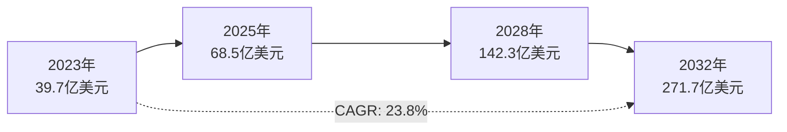

# AI编码工具演进与数据统计

## AI编码工具发展历程

### 第一阶段：基础代码补全（2020-2022）
- **代表工具**：GitHub Copilot、TabNine
- **核心功能**：基于上下文的代码自动补全
- **技术特点**：基于大规模代码训练的语言模型
- **应用场景**：单文件内的代码生成和补全

### 第二阶段：智能协作编程（2022-2024）
- **代表工具**：Claude Code、Cursor、Codebuddy
- **核心功能**：多文件理解、项目级代码生成
- **技术特点**：超长上下文窗口、多模态交互
- **应用场景**：完整项目开发、架构设计

### 第三阶段：团队协作AI（2024-至今）
- **代表工具**：SuperClaude、AI Agent协作平台
- **核心功能**：多智能体协同、团队流程优化
- **技术特点**：文档驱动、工作流集成
- **应用场景**：企业级团队协作、复杂项目管理

## 全球市场数据统计

### 用户规模增长

| 年份 | 全球用户数 | 增长率 | 企业采用率 |
|------|------------|--------|------------|
| 2022 | 500万 | - | 15% |
| 2023 | 850万 | 70% | 35% |
| 2024 | 1200万 | 41% | 55% |
| 2025预测 | 1800万 | 50% | 75% |

### 市场规模预测

### 效率提升数据

#### 编码速度提升
- **GitHub Copilot用户**：编码速度提升55%
- **Claude Code用户**：复杂任务完成时间减少60%
- **Cursor用户**：项目启动时间缩短70%

#### 代码质量改善
- **85%开发者**：对代码质量更有信心
- **代码审查时间**：平均减少40%
- **Bug修复效率**：提升35%

## 企业应用案例数据

### 字节跳动
- **AI编程使用率**：超80%
- **开发效率**：8个Prompt可开发完整应用
- **项目周期**：3天完成产品开发，效率提升近10倍

### 腾讯健康团队
- **人均交付需求个数**：提升18.18%
- **人均编码行数**：提升41.34%
- **人均缺陷数**：降低31.50%

### 制造业突破案例

#### 科德数控
- **AI辅助五轴加工**：程序可靠性提升90%
- **对刀效率**：5分钟完成传统30分钟手动对刀，效率提升6倍

#### 联宝电子
- **排产时间**：从6小时缩至1.5分钟
- **产量提升**：19%

### 多行业综合效益
- **汽车制造业**：质检效率提升3.8倍，年节约成本超2000万元
- **电商平台**：AI推荐转化率飙升400%，库存周转率提升60%
- **人力成本**：AI工具降低80%-90%人力成本

## 技术发展趋势

### 1. 上下文窗口扩展
- **2022年**：2K-4K tokens
- **2023年**：32K-100K tokens
- **2024年**：200K+ tokens
- **未来预测**：1M+ tokens，支持整个代码库分析

### 2. 多模态能力增强
- **文本理解**：自然语言需求转代码
- **图像理解**：UI设计图转前端代码
- **语音交互**：语音编程和调试
- **视频理解**：操作演示转自动化脚本

### 3. 智能体协作演进
- **单智能体**：独立完成编程任务
- **多智能体**：分工协作完成复杂项目
- **智能体编排**：动态任务分配和协调
- **人机混合团队**：无缝的人机协作模式

## 挑战与机遇

### 技术挑战
1. **幻觉问题**：AI生成代码的准确性和可靠性
2. **上下文理解**：复杂项目的全局理解能力
3. **安全性**：代码安全和隐私保护
4. **可解释性**：AI决策过程的透明度

### 发展机遇
1. **效率革命**：开发效率的数量级提升
2. **门槛降低**：编程技能要求的民主化
3. **创新加速**：从实现转向创意和设计
4. **协作升级**：人机协作的新模式

## 未来展望

### 短期目标（1-2年）
- AI编程工具成为开发者标配
- 企业级AI协作平台普及
- 代码质量和安全性显著提升

### 中期目标（3-5年）
- 多模态AI编程成为主流
- 智能体团队协作模式成熟
- 行业标准和规范建立

### 长期愿景（5-10年）
- AI成为开发团队的核心成员
- 编程范式的根本性变革
- 软件开发的全面智能化

---

*这些数据和趋势表明，AI编程不仅是技术工具的升级，更是开发模式的根本性变革。接下来我们将探讨如何通过DDAD方法论来应对这一变革。*