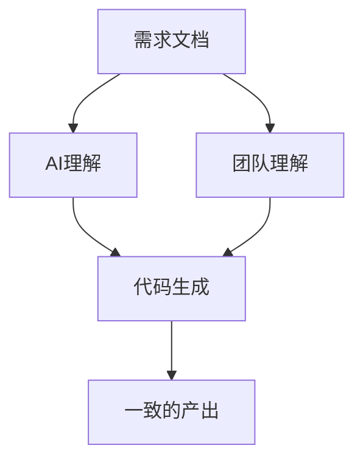
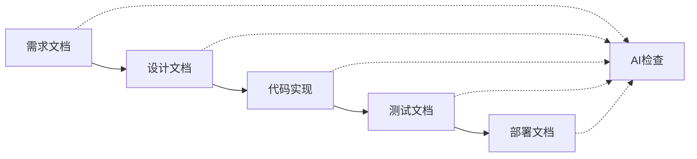

# DDAD核心理念与价值

## DDAD方法论概述

DDAD（Document-Driven AI Development）是一种以文档为核心驱动力的AI协作开发方法论。它不仅仅是一套工具或流程，更是一种全新的开发思维模式，强调通过结构化文档来统一团队认知，指导AI协作，确保项目目标的一致性和可追溯性。

## 核心理念解析

### 1. 文档驱动AI开发定义

DDAD将文档提升到前所未有的高度，使其成为：
- **AI协作的协议**：文档不再只是记录，而是AI理解项目意图的关键输入
- **团队沟通的桥梁**：统一的文档标准消除信息偏差
- **项目记忆的载体**：关键决策和技术细节的永久存储
- **质量保证的基础**：可追溯的开发过程和决策依据

### 2. 协作协议价值

#### 统一沟通框架


#### 减少信息偏差
- **标准化术语**：统一的概念定义和表述方式
- **结构化描述**：固定的文档模板和格式要求
- **版本控制**：文档变更的完整历史记录
- **实时同步**：文档更新的及时通知机制

#### 提升协作效率
- **并行工作**：基于文档的独立开发能力
- **快速上手**：新成员通过文档快速了解项目
- **减少会议**：文档承载大部分沟通内容
- **异步协作**：跨时区团队的有效协作

### 3. 规范项目记忆

#### 知识沉淀机制
```yaml
项目记忆结构:
  技术决策:
    - 架构选择理由
    - 技术栈评估过程
    - 性能优化方案
  业务逻辑:
    - 需求变更历史
    - 业务规则定义
    - 用户反馈处理
  开发过程:
    - 问题解决方案
    - 最佳实践总结
    - 经验教训记录
```

#### 降低知识流失风险
- **文档化决策过程**：记录为什么这样做，而不仅仅是做了什么
- **上下文保存**：保留决策时的环境和约束条件
- **经验传承**：将个人经验转化为团队资产
- **持续更新**：保持文档与实际情况的同步

### 4. AI智能体伙伴

#### AI作为数字助手
AI智能体在DDAD框架中扮演多重角色：

**文档解析器**
- 理解复杂的需求文档
- 提取关键信息和约束条件
- 识别潜在的矛盾和遗漏

**代码生成器**
- 基于文档生成符合规范的代码
- 自动创建测试用例和文档
- 提供多种实现方案供选择

**质量检查员**
- 验证代码与文档的一致性
- 检查是否遵循编码规范
- 识别潜在的安全和性能问题

**协作协调员**
- 跟踪任务进度和依赖关系
- 提醒重要的里程碑和截止日期
- 协助解决团队协作中的问题

## DDAD的实施价值

### 1. 开发效率提升

#### 量化指标
| 指标 | 传统模式 | DDAD模式 | 提升幅度 |
|------|----------|----------|----------|
| 需求理解时间 | 2-3天 | 0.5-1天 | 60-75% |
| 代码生成速度 | 100行/天 | 300-500行/天 | 200-400% |
| 文档完整度 | 30-50% | 90-95% | 80-217% |
| 缺陷率 | 15-20% | 5-8% | 60-73% |

#### 效率提升机制
- **减少重复沟通**：文档一次编写，多次使用
- **并行开发**：基于文档的独立工作能力
- **自动化生成**：AI辅助的代码和测试生成
- **快速迭代**：文档驱动的敏捷开发

### 2. 质量保证增强

#### 多层质量检查


#### 质量保证机制
- **文档一致性检查**：确保各层文档的逻辑一致
- **代码规范验证**：自动检查编码标准的遵循情况
- **测试覆盖率保证**：基于文档生成完整的测试用例
- **安全性审查**：识别潜在的安全风险和漏洞

### 3. 团队协作优化

#### 协作模式转变
- **从口头沟通到文档沟通**：减少信息丢失和误解
- **从串行开发到并行开发**：提高团队整体效率
- **从个人经验到团队知识**：建立可持续的知识体系
- **从被动响应到主动预防**：通过文档预见和避免问题

#### 团队能力提升
- **新人培养**：标准化的学习路径和材料
- **技能传承**：经验和最佳实践的系统化
- **创新能力**：从重复劳动中解放出来专注创新
- **决策质量**：基于完整信息的科学决策

## DDAD实施框架

### 1. 文档体系设计

#### 文档分层结构
```
项目文档体系/
├── 01-需求层/
│   ├── PRD.md (产品需求文档)
│   ├── 用户故事.md
│   └── 验收标准.md
├── 02-设计层/
│   ├── 架构设计.md
│   ├── API规格.md
│   └── 数据模型.md
├── 03-实现层/
│   ├── 编码规范.md
│   ├── 模块规格/
│   └── 接口文档/
├── 04-测试层/
│   ├── 测试计划.md
│   ├── 测试用例.md
│   └── 质量报告.md
└── 05-运维层/
    ├── 部署指南.md
    ├── 运维手册.md
    └── 监控方案.md
```

### 2. AI协作流程

#### 标准协作流程
1. **文档输入**：提供结构化的需求和设计文档
2. **AI理解**：AI解析文档内容和意图
3. **方案生成**：AI提供多种实现方案
4. **人工审查**：开发者评估和选择方案
5. **代码实现**：AI辅助生成和优化代码
6. **质量检查**：自动化的质量和安全检查
7. **文档更新**：同步更新相关文档

### 3. 质量控制机制

#### 多维度质量保证
- **文档质量**：完整性、准确性、一致性检查
- **代码质量**：规范性、可读性、可维护性验证
- **功能质量**：需求符合度、用户体验评估
- **非功能质量**：性能、安全、可扩展性测试

## 成功案例分析

### 案例1：智能客服系统开发

#### 项目背景
- **团队规模**：5人（2个后端，2个前端，1个产品）
- **项目周期**：3周
- **复杂度**：中等（涉及NLP、知识库、多轮对话）

#### DDAD实施效果
- **文档完成度**：95%（传统模式通常30-40%）
- **开发效率**：提升3倍（原计划9周，实际3周完成）
- **代码质量**：缺陷率降低70%
- **团队满意度**：9.2/10（传统模式通常6-7分）

#### 关键成功因素
1. **完整的需求文档**：详细的用户故事和验收标准
2. **标准化的API设计**：统一的接口规范和数据模型
3. **AI辅助的代码生成**：80%的代码由AI生成，人工优化
4. **持续的文档同步**：代码变更自动更新相关文档

## 挑战与应对策略

### 1. 文档维护成本

#### 挑战
- 文档编写需要额外时间投入
- 文档更新容易被忽视
- 文档质量参差不齐

#### 应对策略
- **模板化**：提供标准的文档模板
- **自动化**：AI辅助文档生成和更新
- **激励机制**：将文档质量纳入绩效考核
- **工具支持**：集成化的文档管理工具

### 2. AI理解准确性

#### 挑战
- AI可能误解复杂的业务逻辑
- 生成的代码可能存在安全隐患
- AI的创新能力有限

#### 应对策略
- **分层验证**：多层次的人工审查机制
- **渐进式应用**：从简单任务开始逐步扩展
- **持续学习**：基于反馈不断优化AI模型
- **人机结合**：保持人类在关键决策中的主导地位

### 3. 团队适应性

#### 挑战
- 团队成员对新模式的接受度
- 现有工作流程的改变阻力
- 技能转型的学习成本

#### 应对策略
- **渐进式推进**：分阶段实施DDAD方法
- **培训支持**：提供充分的培训和指导
- **成功案例**：通过小项目展示DDAD的价值
- **文化建设**：营造学习和创新的团队氛围

---

*DDAD不仅是一种方法论，更是一种思维方式的转变。它要求我们重新思考文档的价值，重新定义人机协作的模式，最终实现更高效、更高质量的软件开发。*