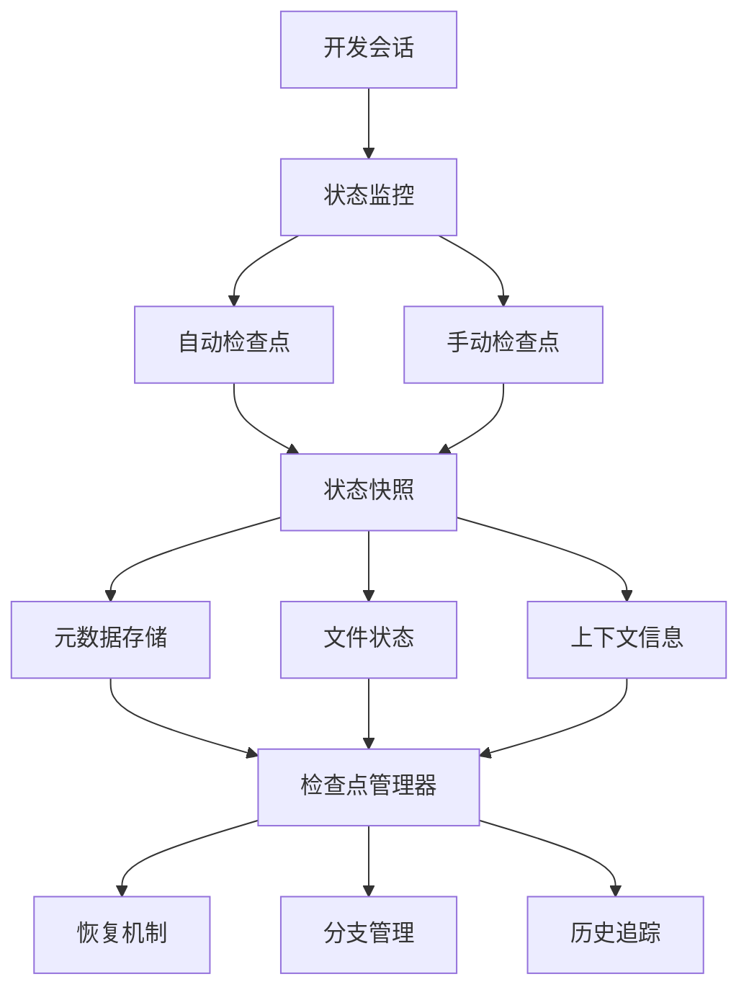
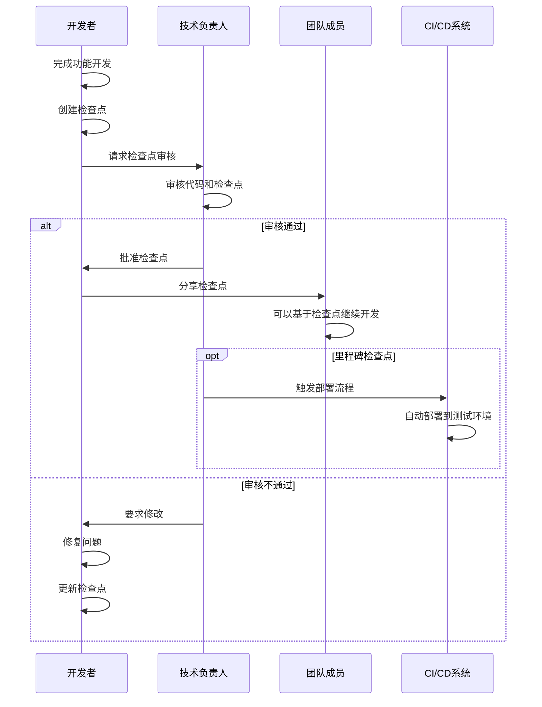

# Claude Code检查点系统详解

## 概述

Claude Code的检查点系统是一个强大的会话管理和状态保存机制，允许开发者在长期开发过程中保存和恢复工作状态。通过检查点系统，团队可以实现工作的连续性、状态的可追溯性，以及复杂任务的分阶段执行。

## 检查点系统架构

### 核心概念

检查点系统基于状态快照和增量保存机制：



### 检查点类型

1. **自动检查点**：系统在关键操作时自动创建
2. **手动检查点**：开发者主动创建的状态保存点
3. **里程碑检查点**：重要开发阶段的标记点
4. **分支检查点**：不同开发路径的分叉点

## 1. 检查点基础操作

### 创建检查点

#### 手动创建检查点
```bash
# 创建基础检查点
claude checkpoint create "完成用户认证模块"

# 创建带描述的检查点
claude checkpoint create "实现JWT认证" --description "添加了JWT token生成和验证逻辑"

# 创建里程碑检查点
claude checkpoint create "v1.0功能完成" --milestone --tag "v1.0-feature-complete"

# 创建分支检查点
claude checkpoint create "尝试新架构" --branch "experimental-arch"
```

#### 自动检查点配置
```json
{
  "checkpointing": {
    "auto": {
      "enabled": true,
      "triggers": [
        "before:major_refactor",
        "after:feature_complete",
        "before:deployment",
        "after:merge"
      ],
      "interval": "30m",
      "maxAutoCheckpoints": 10
    },
    "naming": {
      "pattern": "auto-{timestamp}-{trigger}",
      "includeCommitHash": true,
      "includeBranch": true
    }
  }
}
```

### 查看检查点

#### 列出检查点
```bash
# 查看所有检查点
claude checkpoint list

# 查看最近的检查点
claude checkpoint list --recent 5

# 查看特定分支的检查点
claude checkpoint list --branch "feature/auth"

# 查看里程碑检查点
claude checkpoint list --milestones

# 详细信息查看
claude checkpoint show checkpoint-id-123
```

#### 检查点信息输出示例
```
检查点列表:
┌─────────────────────┬──────────────────────┬─────────────┬──────────────┬─────────────┐
│ ID                  │ 名称                 │ 创建时间    │ 分支         │ 类型        │
├─────────────────────┼──────────────────────┼─────────────┼──────────────┼─────────────┤
│ cp-2024-01-15-001   │ 完成用户认证模块     │ 2小时前     │ feature/auth │ 手动        │
│ cp-2024-01-15-002   │ 添加密码加密         │ 1小时前     │ feature/auth │ 自动        │
│ cp-2024-01-15-003   │ v1.0功能完成         │ 30分钟前    │ main         │ 里程碑      │
└─────────────────────┴──────────────────────┴─────────────┴──────────────┴─────────────┘

检查点详情 (cp-2024-01-15-001):
  名称: 完成用户认证模块
  描述: 实现了用户注册、登录、JWT认证等核心功能
  创建时间: 2024-01-15 14:30:25
  分支: feature/auth
  提交: a1b2c3d4e5f6
  文件变更: 12个文件，+245行，-18行
  
  包含的文件:
  - src/auth/login.js
  - src/auth/register.js
  - src/auth/jwt.js
  - src/middleware/auth.js
  - tests/auth.test.js
  
  上下文信息:
  - 当前任务: 实现用户认证系统
  - 相关需求: REQ-001, REQ-002
  - 依赖模块: bcrypt, jsonwebtoken
```

### 恢复检查点

#### 基础恢复操作
```bash
# 恢复到指定检查点
claude checkpoint restore cp-2024-01-15-001

# 恢复并创建新分支
claude checkpoint restore cp-2024-01-15-001 --new-branch "fix/auth-issues"

# 部分恢复（仅恢复特定文件）
claude checkpoint restore cp-2024-01-15-001 --files "src/auth/*"

# 预览恢复操作（不实际执行）
claude checkpoint restore cp-2024-01-15-001 --dry-run
```

#### 智能恢复
```bash
# 恢复到最近的稳定状态
claude checkpoint restore --last-stable

# 恢复到特定功能完成时的状态
claude checkpoint restore --feature "用户认证"

# 恢复到最近的里程碑
claude checkpoint restore --last-milestone

# 交互式恢复选择
claude checkpoint restore --interactive
```

## 2. 高级检查点功能

### 检查点比较

#### 状态差异分析
```bash
# 比较两个检查点
claude checkpoint diff cp-2024-01-15-001 cp-2024-01-15-003

# 比较检查点与当前状态
claude checkpoint diff cp-2024-01-15-001 --current

# 生成详细的差异报告
claude checkpoint diff cp-2024-01-15-001 cp-2024-01-15-003 --detailed --output diff-report.md
```

#### 差异报告示例
```markdown
# 检查点差异报告

## 基本信息
- 源检查点: cp-2024-01-15-001 (完成用户认证模块)
- 目标检查点: cp-2024-01-15-003 (v1.0功能完成)
- 时间跨度: 2小时30分钟

## 文件变更统计
- 新增文件: 8个
- 修改文件: 15个
- 删除文件: 2个
- 总行数变化: +567行, -89行

## 主要变更
### 新增功能
- 用户权限管理系统
- 密码重置功能
- 邮件通知服务

### 代码优化
- 重构认证中间件
- 优化数据库查询
- 改进错误处理

### 测试覆盖
- 新增单元测试: 25个
- 集成测试: 8个
- 测试覆盖率: 85% → 92%
```

### 检查点分支管理

#### 分支操作
```bash
# 从检查点创建新分支
claude checkpoint branch cp-2024-01-15-001 "experiment/new-auth"

# 合并检查点分支
claude checkpoint merge cp-2024-01-15-001 --target main

# 查看分支历史
claude checkpoint history --branch "feature/auth"

# 分支可视化
claude checkpoint visualize --branch "feature/auth"
```

#### 分支可视化示例
```
检查点分支图:

main ──●──●──●──●──●── (cp-main-005: 生产就绪)
       │              │
       │              └── (cp-main-004: 集成测试通过)
       │
       └── feature/auth ──●──●──●── (cp-auth-003: 认证完成)
                          │     │
                          │     └── (cp-auth-002: JWT实现)
                          │
                          └── (cp-auth-001: 基础框架)

图例:
● 检查点
── 开发路径
└── 分支点
```

### 检查点标签和分类

#### 标签管理
```bash
# 为检查点添加标签
claude checkpoint tag cp-2024-01-15-001 "stable" "auth-module" "v1.0"

# 根据标签查找检查点
claude checkpoint list --tag "stable"

# 移除标签
claude checkpoint untag cp-2024-01-15-001 "v1.0"

# 查看所有标签
claude checkpoint tags
```

#### 分类系统
```json
{
  "checkpointCategories": {
    "功能开发": {
      "color": "blue",
      "icon": "🔧",
      "autoTag": ["feature", "development"]
    },
    "错误修复": {
      "color": "red",
      "icon": "🐛",
      "autoTag": ["bugfix", "hotfix"]
    },
    "性能优化": {
      "color": "green",
      "icon": "⚡",
      "autoTag": ["performance", "optimization"]
    },
    "重构": {
      "color": "yellow",
      "icon": "🔄",
      "autoTag": ["refactor", "cleanup"]
    },
    "里程碑": {
      "color": "purple",
      "icon": "🎯",
      "autoTag": ["milestone", "release"]
    }
  }
}
```

## 3. 检查点自动化

### 智能检查点策略

#### 基于代码变更的自动检查点
```javascript
// .claude/checkpoint-rules.js
module.exports = {
  rules: [
    {
      name: "major-refactor",
      trigger: {
        filesChanged: "> 10",
        linesChanged: "> 500",
        or: [
          { filePattern: "src/core/**" },
          { filePattern: "src/api/**" }
        ]
      },
      action: {
        createCheckpoint: true,
        name: "重大重构-{timestamp}",
        description: "检测到重大代码变更，自动创建检查点"
      }
    },
    
    {
      name: "feature-complete",
      trigger: {
        commitMessage: /feat:|feature:/,
        testCoverage: "> 80%",
        allTestsPassing: true
      },
      action: {
        createCheckpoint: true,
        name: "功能完成-{feature}",
        tags: ["feature-complete", "stable"]
      }
    },
    
    {
      name: "before-deployment",
      trigger: {
        branch: ["main", "release/*"],
        ciStatus: "passing"
      },
      action: {
        createCheckpoint: true,
        name: "部署前检查点-{version}",
        milestone: true
      }
    }
  ]
};
```

#### 基于时间的自动检查点
```json
{
  "autoCheckpoint": {
    "schedule": {
      "daily": {
        "enabled": true,
        "time": "18:00",
        "condition": "hasChanges",
        "name": "每日工作结束-{date}"
      },
      "hourly": {
        "enabled": true,
        "interval": 2,
        "condition": "significantChanges",
        "maxPerDay": 8
      }
    },
    
    "conditions": {
      "hasChanges": "git status --porcelain | wc -l > 0",
      "significantChanges": "git diff --stat | tail -1 | grep -E '[0-9]+ insertions|[0-9]+ deletions'"
    }
  }
}
```

### 检查点工作流集成

#### Git钩子集成
```bash
#!/bin/bash
# .git/hooks/pre-commit

echo "🔍 检查是否需要创建检查点..."

# 检查变更规模
CHANGED_FILES=$(git diff --cached --name-only | wc -l)
CHANGED_LINES=$(git diff --cached --numstat | awk '{sum+=$1+$2} END {print sum}')

if [ "$CHANGED_FILES" -gt 5 ] || [ "$CHANGED_LINES" -gt 200 ]; then
    echo "📸 检测到重大变更，创建检查点..."
    claude checkpoint create "提交前自动检查点-$(date +%Y%m%d-%H%M%S)" --auto
fi

echo "✅ 检查点检查完成"
```

#### CI/CD集成
```yaml
# .github/workflows/checkpoint.yml
name: 自动检查点管理

on:
  push:
    branches: [ main, develop ]
  pull_request:
    branches: [ main ]

jobs:
  checkpoint:
    runs-on: ubuntu-latest
    steps:
    - uses: actions/checkout@v3
    
    - name: 安装Claude Code
      run: npm install -g @anthropic/claude-code
      
    - name: 配置认证
      run: claude auth --token ${{ secrets.CLAUDE_TOKEN }}
      
    - name: 创建里程碑检查点
      if: github.ref == 'refs/heads/main'
      run: |
        claude checkpoint create "CI构建成功-${{ github.sha }}" \
          --milestone \
          --tag "ci-success" \
          --description "GitHub Actions构建 #${{ github.run_number }} 成功"
    
    - name: 创建PR检查点
      if: github.event_name == 'pull_request'
      run: |
        claude checkpoint create "PR检查点-${{ github.event.pull_request.number }}" \
          --tag "pr-ready" \
          --description "PR #${{ github.event.pull_request.number }}: ${{ github.event.pull_request.title }}"
```

## 4. 检查点数据管理

### 存储和同步

#### 本地存储结构
```
.claude/
├── checkpoints/
│   ├── metadata/
│   │   ├── cp-2024-01-15-001.json
│   │   ├── cp-2024-01-15-002.json
│   │   └── index.json
│   ├── snapshots/
│   │   ├── cp-2024-01-15-001/
│   │   │   ├── files.tar.gz
│   │   │   ├── context.json
│   │   │   └── diff.patch
│   │   └── cp-2024-01-15-002/
│   └── cache/
│       ├── file-hashes.json
│       └── incremental-diffs/
└── config/
    └── checkpoint-config.json
```

#### 云端同步配置
```json
{
  "sync": {
    "enabled": true,
    "provider": "claude-cloud",
    "settings": {
      "autoSync": true,
      "syncInterval": "5m",
      "compression": true,
      "encryption": true
    },
    
    "selective": {
      "syncMilestones": true,
      "syncManual": true,
      "syncAuto": false,
      "maxAge": "30d"
    },
    
    "conflict": {
      "resolution": "merge",
      "backupLocal": true
    }
  }
}
```

### 检查点清理和维护

#### 自动清理策略
```javascript
// .claude/cleanup-policy.js
module.exports = {
  retention: {
    // 保留策略
    milestones: "永久",
    manual: "90天",
    auto: "30天",
    
    // 数量限制
    maxCheckpoints: 100,
    maxAutoCheckpoints: 20,
    
    // 大小限制
    maxTotalSize: "1GB",
    maxSingleSize: "100MB"
  },
  
  cleanup: {
    // 清理触发条件
    triggers: [
      "达到数量限制",
      "达到大小限制",
      "定期清理（每周）"
    ],
    
    // 清理策略
    strategy: "LRU", // 最近最少使用
    
    // 保护规则
    protect: [
      "最近7天的检查点",
      "所有里程碑检查点",
      "带有特定标签的检查点"
    ]
  }
};
```

#### 手动清理操作
```bash
# 清理过期的自动检查点
claude checkpoint cleanup --auto --older-than 30d

# 清理大文件检查点
claude checkpoint cleanup --size-limit 50MB

# 交互式清理
claude checkpoint cleanup --interactive

# 预览清理操作
claude checkpoint cleanup --dry-run

# 压缩检查点数据
claude checkpoint compress --all
```

## 5. 团队协作中的检查点

### 共享检查点

#### 团队检查点配置
```json
{
  "team": {
    "sharing": {
      "enabled": true,
      "defaultVisibility": "team",
      "permissions": {
        "create": ["developer", "lead"],
        "restore": ["developer", "lead"],
        "delete": ["lead", "admin"]
      }
    },
    
    "naming": {
      "convention": "{author}-{feature}-{timestamp}",
      "requireDescription": true,
      "requireTags": ["feature", "bugfix", "refactor"]
    },
    
    "review": {
      "requireApproval": {
        "milestones": true,
        "production": true
      },
      "approvers": ["tech-lead", "senior-dev"]
    }
  }
}
```

#### 检查点协作工作流
```bash
# 创建团队共享检查点
claude checkpoint create "完成支付模块" --share --team

# 请求检查点审核
claude checkpoint review-request cp-2024-01-15-001 --reviewers "tech-lead,senior-dev"

# 审核检查点
claude checkpoint review cp-2024-01-15-001 --approve --comment "代码质量良好，可以合并"

# 查看团队检查点
claude checkpoint list --team --shared

# 订阅检查点通知
claude checkpoint subscribe --author "john-doe" --tags "critical"
```

### 检查点协作最佳实践

#### 命名和描述规范
```bash
# 好的检查点命名
claude checkpoint create "feat/auth-完成JWT认证实现" \
  --description "实现了JWT token生成、验证和刷新机制，包含完整的单元测试" \
  --tags "feature,auth,jwt,tested"

# 里程碑检查点
claude checkpoint create "milestone/v1.0-用户管理模块完成" \
  --milestone \
  --description "用户注册、登录、权限管理等核心功能全部完成并通过测试" \
  --tags "milestone,v1.0,user-management,production-ready"

# 实验性检查点
claude checkpoint create "experiment/redis-缓存优化尝试" \
  --branch "experiment" \
  --description "尝试使用Redis缓存优化数据库查询性能" \
  --tags "experiment,performance,redis"
```

#### 团队检查点工作流


## 6. 检查点监控和分析

### 检查点统计分析

#### 使用情况统计
```bash
# 查看检查点使用统计
claude checkpoint stats

# 查看团队检查点统计
claude checkpoint stats --team

# 生成检查点报告
claude checkpoint report --period "last-month" --format json
```

#### 统计报告示例
```json
{
  "period": "2024-01",
  "summary": {
    "totalCheckpoints": 156,
    "byType": {
      "manual": 89,
      "auto": 52,
      "milestone": 15
    },
    "byAuthor": {
      "john-doe": 45,
      "jane-smith": 38,
      "bob-wilson": 32,
      "alice-brown": 41
    },
    "averageSize": "12.5MB",
    "totalSize": "1.95GB"
  },
  
  "trends": {
    "checkpointsPerDay": 5.2,
    "restoreRate": "12%",
    "mostActiveHours": ["14:00-16:00", "20:00-22:00"],
    "popularTags": ["feature", "bugfix", "refactor", "milestone"]
  },
  
  "quality": {
    "averageDescription": "详细",
    "taggedRate": "94%",
    "milestoneRate": "9.6%",
    "sharedRate": "67%"
  }
}
```

### 检查点性能监控

#### 性能指标
```javascript
// .claude/monitoring.js
class CheckpointMonitor {
  constructor() {
    this.metrics = {
      creation: [],
      restoration: [],
      storage: []
    };
  }

  recordCreation(checkpointId, duration, size) {
    this.metrics.creation.push({
      id: checkpointId,
      duration: duration,
      size: size,
      timestamp: Date.now()
    });
    
    // 性能告警
    if (duration > 30000) {
      console.warn(`检查点创建耗时过长: ${checkpointId} - ${duration}ms`);
    }
    
    if (size > 100 * 1024 * 1024) {
      console.warn(`检查点文件过大: ${checkpointId} - ${size / 1024 / 1024}MB`);
    }
  }

  recordRestoration(checkpointId, duration, success) {
    this.metrics.restoration.push({
      id: checkpointId,
      duration: duration,
      success: success,
      timestamp: Date.now()
    });
  }

  getPerformanceReport() {
    const creationStats = this.calculateStats(this.metrics.creation, 'duration');
    const restorationStats = this.calculateStats(this.metrics.restoration, 'duration');
    
    return {
      creation: {
        average: creationStats.average,
        median: creationStats.median,
        p95: creationStats.p95
      },
      restoration: {
        average: restorationStats.average,
        median: restorationStats.median,
        successRate: this.calculateSuccessRate(this.metrics.restoration)
      },
      recommendations: this.generateRecommendations()
    };
  }
}
```

## 7. 检查点最佳实践

### 创建策略

#### 何时创建检查点
```markdown
## 推荐的检查点创建时机

### 必须创建
- 重大功能完成前后
- 重构开始前
- 部署到生产环境前
- 合并重要分支前

### 建议创建
- 每日工作结束时
- 尝试新方案前
- 修复重要bug后
- 代码审查通过后

### 可选创建
- 小功能完成后
- 代码优化后
- 文档更新后
- 配置修改后
```

#### 检查点质量标准
```javascript
// 检查点质量检查
function validateCheckpointQuality(checkpoint) {
  const issues = [];
  
  // 检查描述质量
  if (!checkpoint.description || checkpoint.description.length < 20) {
    issues.push('描述过于简单，应详细说明变更内容');
  }
  
  // 检查标签
  if (!checkpoint.tags || checkpoint.tags.length === 0) {
    issues.push('缺少标签，应添加相关标签便于分类');
  }
  
  // 检查文件变更
  if (checkpoint.filesChanged > 50) {
    issues.push('变更文件过多，建议拆分为多个检查点');
  }
  
  // 检查测试状态
  if (checkpoint.testStatus !== 'passing') {
    issues.push('测试未通过，不建议创建检查点');
  }
  
  return {
    valid: issues.length === 0,
    issues: issues,
    score: calculateQualityScore(checkpoint)
  };
}
```

### 恢复策略

#### 安全恢复流程
```bash
# 1. 检查当前状态
claude status --detailed

# 2. 备份当前工作
claude checkpoint create "恢复前备份-$(date +%Y%m%d-%H%M%S)" --temp

# 3. 预览恢复操作
claude checkpoint restore target-checkpoint --dry-run

# 4. 执行恢复
claude checkpoint restore target-checkpoint --safe

# 5. 验证恢复结果
claude status --verify
claude test --quick
```

#### 恢复冲突处理
```javascript
// 恢复冲突解决策略
const conflictResolution = {
  strategies: {
    // 保守策略：保留当前更改
    conservative: {
      fileConflicts: 'keep-current',
      dependencyConflicts: 'manual-review',
      configConflicts: 'merge-interactive'
    },
    
    // 激进策略：完全恢复
    aggressive: {
      fileConflicts: 'use-checkpoint',
      dependencyConflicts: 'use-checkpoint',
      configConflicts: 'use-checkpoint'
    },
    
    // 智能策略：基于内容分析
    smart: {
      fileConflicts: 'analyze-and-merge',
      dependencyConflicts: 'version-aware',
      configConflicts: 'semantic-merge'
    }
  }
};
```

## 总结

Claude Code的检查点系统为团队开发提供了强大的状态管理能力：

1. **全面的状态保存**：从文件变更到上下文信息的完整快照
2. **灵活的恢复机制**：支持完全恢复、部分恢复、分支恢复等多种方式
3. **智能的自动化**：基于规则的自动检查点创建和管理
4. **强大的协作功能**：团队共享、审核、权限控制等协作特性
5. **完善的监控分析**：性能监控、使用统计、质量分析等管理工具

通过合理使用检查点系统，团队可以实现：
- **风险控制**：在重要操作前保存状态，降低开发风险
- **工作连续性**：跨会话、跨设备的工作状态保持
- **协作效率**：团队成员间的状态共享和协同开发
- **质量保证**：通过检查点审核确保代码质量
- **历史追溯**：完整的开发历史记录和状态回溯能力

检查点系统是实现高效团队开发的重要基础设施，为Team Vibe Coding提供了坚实的技术保障。

---

*检查点不仅是技术工具，更是团队协作的信任机制。每个检查点都代表着一个可靠的状态，让团队成员可以放心地在此基础上继续开发。*