# Codebuddy：团队AI编程助手深度解析

## Codebuddy概述

Codebuddy是专为团队协作设计的新一代AI编程助手，它不仅仅是一个代码生成工具，更是一个智能的开发伙伴，能够理解团队的开发模式、编码规范和业务逻辑，为团队提供一致性的开发体验。

## 核心特性详解

### 1. 智能上下文理解

#### 项目级理解能力
Codebuddy具备强大的项目级理解能力，能够：

**代码库分析**
```bash
# 分析整个项目结构
codebuddy analyze project --deep-scan

# 输出示例
项目分析报告:
├── 架构模式: MVC + 微服务
├── 技术栈: Node.js + Express + MongoDB
├── 代码风格: Airbnb ESLint规范
├── 测试框架: Jest + Supertest
├── 文档覆盖率: 85%
└── 代码质量评分: A级 (92/100)
```

**业务逻辑理解**
- **领域模型识别**：自动识别业务实体和关系
- **业务规则提取**：从代码中提取业务逻辑规则
- **数据流分析**：理解数据在系统中的流转过程
- **API依赖关系**：分析服务间的调用关系

#### 团队协作上下文

**团队编码风格学习**
```javascript
// Codebuddy学习团队风格后的代码生成示例
// 团队偏好：使用async/await而非Promise.then
// 团队规范：错误处理使用统一的ErrorHandler

async function createUser(userData) {
  try {
    // 数据验证 - 团队统一使用Joi
    const { error, value } = userSchema.validate(userData);
    if (error) {
      throw new ValidationError(error.details[0].message);
    }

    // 业务逻辑 - 遵循团队的服务层模式
    const user = await UserService.create(value);
    
    // 日志记录 - 使用团队统一的Logger
    Logger.info('User created successfully', { userId: user.id });
    
    return {
      success: true,
      data: user,
      message: 'User created successfully'
    };
  } catch (error) {
    // 错误处理 - 团队统一的错误处理模式
    ErrorHandler.handle(error, 'createUser');
    throw error;
  }
}
```

### 2. 团队协作增强功能

#### 代码一致性保证

**统一代码风格**
```yaml
# .codebuddy/team-config.yaml
team_standards:
  naming_convention:
    variables: camelCase
    functions: camelCase
    classes: PascalCase
    constants: UPPER_SNAKE_CASE
    files: kebab-case
  
  code_patterns:
    error_handling: try-catch-with-logger
    async_operations: async-await
    api_response: standard-response-format
    validation: joi-schema
  
  documentation:
    functions: jsdoc-required
    classes: detailed-description
    apis: swagger-annotations
    
  testing:
    coverage_threshold: 80
    test_naming: describe-it-pattern
    mock_strategy: jest-mocks
```

**代码审查辅助**
```bash
# 自动代码审查
codebuddy review --comprehensive

# 审查报告示例
代码审查报告:
✅ 代码风格一致性: 100%
✅ 命名规范遵循: 98%
⚠️  测试覆盖率: 75% (低于团队标准80%)
⚠️  文档完整性: 70% (建议补充API文档)
❌ 安全问题: 发现1个潜在的SQL注入风险

建议修复:
1. 增加UserController.updateProfile的单元测试
2. 补充/api/users接口的Swagger文档
3. 修复user-service.js:45行的参数化查询问题
```

#### 知识共享机制

**最佳实践提取与应用**
```bash
# 从团队代码中提取最佳实践
codebuddy extract-patterns --scope team --timeframe 3months

# 提取结果示例
团队最佳实践库:
├── 错误处理模式
│   ├── 统一错误响应格式
│   ├── 错误日志记录规范
│   └── 用户友好错误消息
├── 数据库操作模式
│   ├── 连接池管理
│   ├── 事务处理规范
│   └── 查询优化技巧
├── API设计模式
│   ├── RESTful接口规范
│   ├── 分页查询标准
│   └── 版本控制策略
└── 测试编写模式
    ├── 单元测试结构
    ├── 集成测试策略
    └── Mock数据管理
```

**经验传承系统**
```bash
# 记录解决方案
codebuddy knowledge add \
  --category "性能优化" \
  --problem "数据库查询慢" \
  --solution "添加索引+查询优化" \
  --code-example "./examples/db-optimization.js"

# 查询相关经验
codebuddy knowledge search "数据库性能"

# 搜索结果
相关解决方案:
1. 数据库查询慢 (2023-10-15, 张三)
   - 问题: 用户列表查询响应时间超过2秒
   - 解决: 添加复合索引，优化查询条件
   - 效果: 响应时间降低到200ms
   
2. 数据库连接池耗尽 (2023-09-20, 李四)
   - 问题: 高并发时数据库连接不够用
   - 解决: 调整连接池配置，添加连接监控
   - 效果: 支持并发数提升3倍
```

### 3. 智能代码生成

#### 需求驱动的代码生成

**从自然语言到代码**
```markdown
# 需求描述
创建一个用户管理系统的API，需要包含：
1. 用户注册功能，支持邮箱和手机号注册
2. 用户登录功能，支持多种登录方式
3. 用户信息修改功能，包含权限验证
4. 用户列表查询功能，支持分页和筛选
5. 所有接口需要有完整的错误处理和日志记录
6. 需要包含完整的单元测试和API文档

# Codebuddy生成命令
codebuddy generate api-module \
  --name user-management \
  --spec requirements.md \
  --include-tests \
  --include-docs \
  --follow-team-standards
```

**生成的代码结构**
```
user-management/
├── controllers/
│   └── user.controller.js      # 控制器层
├── services/
│   └── user.service.js         # 业务逻辑层
├── models/
│   └── user.model.js           # 数据模型
├── routes/
│   └── user.routes.js          # 路由定义
├── middlewares/
│   ├── auth.middleware.js      # 认证中间件
│   └── validation.middleware.js # 验证中间件
├── tests/
│   ├── user.controller.test.js # 控制器测试
│   ├── user.service.test.js    # 服务测试
│   └── user.integration.test.js # 集成测试
├── docs/
│   └── user-api.yaml           # API文档
└── schemas/
    └── user.schema.js          # 验证模式
```

#### 增量开发支持

**基于现有代码的智能扩展**
```bash
# 分析现有用户模块
codebuddy analyze --module user --suggest-extensions

# 分析结果
模块分析报告:
当前功能:
✅ 用户注册
✅ 用户登录
✅ 用户信息查询

建议扩展:
🔄 密码重置功能 (优先级: 高)
🔄 用户头像上传 (优先级: 中)
🔄 用户偏好设置 (优先级: 中)
🔄 用户活动日志 (优先级: 低)

# 生成密码重置功能
codebuddy extend --module user --feature password-reset
```

### 4. 智能测试生成

#### 全面的测试覆盖

**单元测试自动生成**
```javascript
// 基于函数自动生成的测试用例
describe('UserService.createUser', () => {
  // Codebuddy分析函数逻辑后生成的测试用例
  
  describe('正常流程测试', () => {
    it('应该成功创建用户', async () => {
      // 准备测试数据
      const userData = {
        email: 'test@example.com',
        password: 'SecurePass123!',
        name: 'Test User'
      };
      
      // Mock依赖
      UserModel.findOne.mockResolvedValue(null); // 用户不存在
      UserModel.create.mockResolvedValue({ id: 1, ...userData });
      EmailService.sendWelcomeEmail.mockResolvedValue(true);
      
      // 执行测试
      const result = await UserService.createUser(userData);
      
      // 验证结果
      expect(result.success).toBe(true);
      expect(result.data.email).toBe(userData.email);
      expect(EmailService.sendWelcomeEmail).toHaveBeenCalledWith(userData.email);
    });
  });
  
  describe('异常情况测试', () => {
    it('应该拒绝重复邮箱注册', async () => {
      const userData = { email: 'existing@example.com' };
      UserModel.findOne.mockResolvedValue({ id: 1 }); // 用户已存在
      
      await expect(UserService.createUser(userData))
        .rejects.toThrow('Email already exists');
    });
    
    it('应该处理数据库错误', async () => {
      const userData = { email: 'test@example.com' };
      UserModel.findOne.mockRejectedValue(new Error('Database error'));
      
      await expect(UserService.createUser(userData))
        .rejects.toThrow('Database error');
    });
  });
  
  describe('边界条件测试', () => {
    it('应该验证邮箱格式', async () => {
      const userData = { email: 'invalid-email' };
      
      await expect(UserService.createUser(userData))
        .rejects.toThrow('Invalid email format');
    });
    
    it('应该验证密码强度', async () => {
      const userData = { 
        email: 'test@example.com',
        password: '123' // 弱密码
      };
      
      await expect(UserService.createUser(userData))
        .rejects.toThrow('Password too weak');
    });
  });
});
```

**集成测试生成**
```javascript
// API集成测试
describe('User API Integration Tests', () => {
  beforeEach(async () => {
    await setupTestDatabase();
  });
  
  afterEach(async () => {
    await cleanupTestDatabase();
  });
  
  describe('POST /api/users/register', () => {
    it('应该成功注册新用户', async () => {
      const userData = {
        email: 'newuser@example.com',
        password: 'SecurePass123!',
        name: 'New User'
      };
      
      const response = await request(app)
        .post('/api/users/register')
        .send(userData)
        .expect(201);
      
      expect(response.body.success).toBe(true);
      expect(response.body.data.email).toBe(userData.email);
      
      // 验证数据库中的数据
      const user = await UserModel.findOne({ email: userData.email });
      expect(user).toBeTruthy();
      expect(user.name).toBe(userData.name);
    });
  });
});
```

### 5. 文档驱动开发支持

#### 自动文档生成与同步

**API文档自动生成**
```yaml
# 自动生成的Swagger文档
paths:
  /api/users/register:
    post:
      summary: 用户注册
      description: 创建新用户账户
      tags:
        - Users
      requestBody:
        required: true
        content:
          application/json:
            schema:
              type: object
              required:
                - email
                - password
                - name
              properties:
                email:
                  type: string
                  format: email
                  description: 用户邮箱
                  example: user@example.com
                password:
                  type: string
                  minLength: 8
                  description: 用户密码
                  example: SecurePass123!
                name:
                  type: string
                  description: 用户姓名
                  example: 张三
      responses:
        '201':
          description: 注册成功
          content:
            application/json:
              schema:
                type: object
                properties:
                  success:
                    type: boolean
                    example: true
                  data:
                    $ref: '#/components/schemas/User'
                  message:
                    type: string
                    example: User created successfully
        '400':
          description: 请求参数错误
        '409':
          description: 邮箱已存在
```

**代码注释自动生成**
```javascript
/**
 * 创建新用户
 * 
 * 该函数处理用户注册流程，包括数据验证、密码加密、
 * 用户创建和欢迎邮件发送等步骤。
 * 
 * @async
 * @function createUser
 * @param {Object} userData - 用户注册数据
 * @param {string} userData.email - 用户邮箱地址
 * @param {string} userData.password - 用户密码（明文）
 * @param {string} userData.name - 用户姓名
 * @param {string} [userData.phone] - 用户手机号（可选）
 * 
 * @returns {Promise<Object>} 创建结果
 * @returns {boolean} returns.success - 操作是否成功
 * @returns {Object} returns.data - 创建的用户信息
 * @returns {string} returns.message - 操作结果消息
 * 
 * @throws {ValidationError} 当输入数据不符合要求时
 * @throws {ConflictError} 当邮箱已存在时
 * @throws {DatabaseError} 当数据库操作失败时
 * 
 * @example
 * const userData = {
 *   email: 'user@example.com',
 *   password: 'SecurePass123!',
 *   name: '张三'
 * };
 * 
 * try {
 *   const result = await createUser(userData);
 *   console.log('用户创建成功:', result.data);
 * } catch (error) {
 *   console.error('用户创建失败:', error.message);
 * }
 * 
 * @since 1.0.0
 * @author Codebuddy AI Assistant
 * @lastModified 2023-10-20
 */
async function createUser(userData) {
  // 函数实现...
}
```

## Codebuddy高级功能

### 1. 自定义AI训练

#### 团队特定模式学习
```bash
# 训练团队特定的代码模式
codebuddy train --source ./src --pattern-type team-specific

# 训练结果
训练完成报告:
✅ 代码模式识别: 发现23个团队特有模式
✅ 命名规范学习: 学习了团队的命名偏好
✅ 架构模式理解: 识别了微服务架构模式
✅ 业务逻辑理解: 理解了核心业务流程

新增能力:
- 生成符合团队风格的错误处理代码
- 自动应用团队的日志记录规范
- 遵循团队的API响应格式标准
- 使用团队偏好的第三方库和工具
```

### 2. 智能重构建议

#### 代码质量持续改进
```bash
# 代码质量分析
codebuddy analyze quality --comprehensive

# 分析报告
代码质量分析报告:

🔍 复杂度分析:
- 高复杂度函数: 3个 (建议重构)
- 平均圈复杂度: 4.2 (良好)
- 最大嵌套深度: 5层 (建议优化)

🔍 重复代码检测:
- 重复代码块: 12个
- 重复率: 8.5% (可接受范围)
- 建议提取公共函数: 4个

🔍 性能问题识别:
- 潜在内存泄漏: 2处
- 低效查询: 5个
- 未使用的导入: 15个

# 应用重构建议
codebuddy refactor apply --priority high --auto-confirm false
```

### 3. 团队协作分析

#### 开发效率分析
```bash
# 团队效率分析
codebuddy analytics team --period 30days

# 分析结果
团队协作效率报告 (最近30天):

👥 团队概况:
- 活跃开发者: 5人
- 总提交次数: 342次
- 代码行数变化: +15,420行
- 平均每日提交: 11.4次

📊 开发效率指标:
- 代码生成效率: ↑ 45% (相比上月)
- 代码审查时间: ↓ 30% (平均2.3小时)
- 缺陷修复时间: ↓ 25% (平均4.1小时)
- 功能交付速度: ↑ 35% (平均3.2天/功能)

🎯 质量指标:
- 代码覆盖率: 87% (↑ 5%)
- 代码重复率: 6.2% (↓ 2.1%)
- 静态分析评分: A级 (94/100)
- 用户反馈评分: 4.6/5.0

💡 改进建议:
1. 继续保持高测试覆盖率
2. 关注UserService模块的复杂度
3. 考虑引入更多自动化测试
4. 优化数据库查询性能
```

## 最佳实践指南

### 1. 团队配置最佳实践

#### 统一团队配置
```yaml
# .codebuddy/team-config.yaml - 团队配置文件
team:
  name: "前端开发团队"
  coding_standards:
    language: "JavaScript/TypeScript"
    framework: "React + Node.js"
    style_guide: "Airbnb"
    
  ai_preferences:
    code_style: "functional-programming-preferred"
    comment_style: "jsdoc-detailed"
    test_style: "jest-describe-it"
    error_handling: "try-catch-with-logging"
    
  quality_gates:
    min_test_coverage: 80
    max_complexity: 10
    max_function_length: 50
    max_file_length: 300
    
  integrations:
    version_control: "git"
    ci_cd: "github-actions"
    project_management: "jira"
    communication: "slack"
```

### 2. 代码生成最佳实践

#### 渐进式AI辅助开发
```bash
# 第一步：生成基础结构
codebuddy generate scaffold --name user-service --type microservice

# 第二步：生成核心业务逻辑
codebuddy generate business-logic --spec requirements.md --context ./user-service

# 第三步：生成测试用例
codebuddy generate tests --coverage 90% --context ./user-service

# 第四步：生成文档
codebuddy generate docs --api-spec --readme --context ./user-service

# 第五步：代码审查和优化
codebuddy review --comprehensive --suggest-improvements
```

### 3. 团队协作最佳实践

#### 建立协作工作流

```mermaid
graph TD
    A[需求分析] --> B[Codebuddy生成初始代码]
    B --> C[开发者审查和调整]
    C --> D[本地测试]
    D --> E[提交代码审查]
    E --> F[Codebuddy自动审查]
    F --> G[团队成员审查]
    G --> H[合并到主分支]
    H --> I[自动化测试]
    I --> J[部署到测试环境]
    
    F -.-> K[自动修复建议]
    K -.-> C
    
    G -.-> L[人工反馈]
    L -.-> C
```


## 故障排除与优化

### 常见问题解决

#### 1. 代码生成质量问题
**问题**：生成的代码不符合预期或质量较低

**解决方案**：
```bash
# 检查配置
codebuddy config check

# 更新团队配置
codebuddy config update --team-standards

# 重新训练模型
codebuddy train --incremental --source ./src

# 提供更详细的需求描述
codebuddy generate --verbose --context-rich
```

#### 2. 团队协作冲突
**问题**：团队成员使用不同的配置导致代码风格不一致

**解决方案**：
```bash
# 同步团队配置
codebuddy sync team-config --force

# 统一代码格式
codebuddy format --team-standard --all-files

# 建立配置检查机制
codebuddy pre-commit-hook install
```

#### 3. 性能问题
**问题**：Codebuddy响应速度慢或占用资源过多

**解决方案**：
```bash
# 清理缓存
codebuddy cache clear --all

# 优化配置
codebuddy optimize --performance

# 检查网络连接
codebuddy diagnose network

# 更新到最新版本
codebuddy update --stable
```

---

*Codebuddy作为Team Vibe Coding的核心工具，其强大的AI能力和团队协作特性将显著提升开发效率和代码质量。通过合理配置和使用，团队可以实现真正的智能化协作开发。*