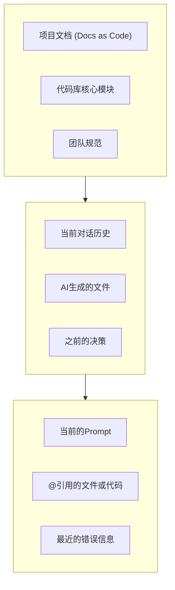

# 上下文控制与信息管理

在与AI协作时，**上下文（Context）** 是我们与AI沟通的唯一桥梁。你提供给AI的上下文质量，直接决定了它输出结果的质量。可以把AI看作一个能力极强但毫无背景知识的“新员工”，上下文就是你为它准备的“入职培训材料”和“项目任务书”。

有效的上下文管理，旨在用最精炼的信息，让AI对当前任务建立起与资深开发者同等水平的认知。

## 上下文的三个层次

一个完整的上下文通常由三个层次构成，我们需要有意识地构建和管理它们。

1.  **全局上下文 (Global Context)**：项目级别的、相对稳定的背景知识。
    - **来源**：我们之前建立的树状文档结构 (`docs/`)、代码库中的核心文件、团队的编码规范等。
    - **管理方式**：通过Claude Code的项目索引功能或MCP服务器，让AI在需要时能随时访问。

2.  **会话上下文 (Session Context)**：在一次连续的开发会话中逐步积累的信息。
    - **来源**：你与AI的对话历史、AI在该会话中生成或修改过的代码、你在会话中做出的决策（如“方案A比方案B好”）。
    - **管理方式**：这是AI的“短期记忆”。我们需要保持会话的连贯性，避免在一个长会话中处理多个不相关的主题。

3.  **即时上下文 (Immediate Context)**：在当前这一次交互（Prompt）中提供给AI的指令和信息。
    - **来源**：你当前输入的指令、通过`@`符号精确引用的文件或代码片段、终端中刚刚出现的错误日志。
    - **管理方式**：这是最直接、优先级最高的上下文。指令要清晰、明确，引用的信息要精准、相关。

## 上下文管理的最佳实践

### 1. “喂食”原则：先提供背景，再下达指令

在开始一个新任务时，不要直接说“写一个登录功能”。而应该先“喂”给AI必要的背景信息。

**❌ 错误示范：**
> 写一个登录页。

**✅ 正确示范：**
> 我们要为一个基于React和TypeScript的项目开发新功能。
>
> **1. 全局上下文加载：**
> 请阅读并理解我们的编码规范：`@docs/03-processes-and-conventions/coding-style-guide.md`
> 这是我们的UI组件库：`@src/components/ui/`
>
> **2. 任务描述：**
> 现在，请为我创建一个用户登录页面。具体需求如下：
> - ... (详细需求)
>
> **3. 输出要求：**
> 请在 `src/features/auth/` 目录下创建 `LoginPage.tsx` 文件。

### 2. “聚焦”原则：保持会话主题单一

一个开发会话（Session）最好只专注于一个相对独立的功能或模块。如果需要切换到完全不同的任务，最佳实践是开启一个新的会话。

- **好处**：避免不相关的对话历史干扰AI对当前任务的理解，防止“上下文污染”。
- **技巧**：可以为不同的会话命名，如“Feat-Login-Page”或“Bugfix-Payment-API”，便于后续查找和回顾。

### 3. “引用”原则：用`@`符号进行精确制导

当需要AI关注特定文件或代码时，使用`@`符号进行引用，而不是大段地复制粘贴。

**❌ 错误示范：**
> (粘贴`Button.tsx`的全部代码...)
>
> (粘贴`Input.tsx`的全部代码...)
>
> 现在用这两个组件帮我创建一个表单。

**✅ 正确示范：**
> 请使用 `@src/components/ui/Button.tsx` 和 `@src/components/ui/Input.tsx` 这两个组件，为我创建一个登录表单。

### 4. “清理”原则：定期清理和重置上下文

当一个会话变得过长，或者你发现AI的回答开始变得迟钝、不着边际时，这通常是上下文过载的信号。

- **清理会话**：如果当前任务已完成，可以明确地告诉AI：“这个任务结束了，我们来开始下一个。”
- **重置会话**：如果会话已经变得混乱，最简单有效的方法就是开启一个新会话，并重新“喂食”必要的初始上下文。

### 5. “优先级”原则：在Prompt中明确信息的重要级

在你的指令中，可以通过加粗、编号、使用标题等方式，向AI暗示不同信息的重要性。

**✅ 正确示范：**
> **首要目标：** 实现用户登录的核心逻辑。
>
> **次要目标：** 添加“记住我”的功能。
>
> **必须遵守的约束：**
> 1.  密码传输必须加密。
> 2.  所有代码必须通过ESLint检查。
>
> **可选的优化：**
> - 如果有时间，可以添加社交媒体登录的按钮。

---

**本节小结：** 上下文管理是与AI协作的“内功心法”。通过理解上下文的三个层次，并遵循“喂食”、“聚焦”、“引用”、“清理”和“优先级”五大原则，我们可以将AI的强大能力引导到正确的方向上，使其从一个模糊的“聊天机器人”转变为一个精准的“开发伙伴”。

**下一节：** [文档驱动的AI交互流程](doc-driven-flow.md)