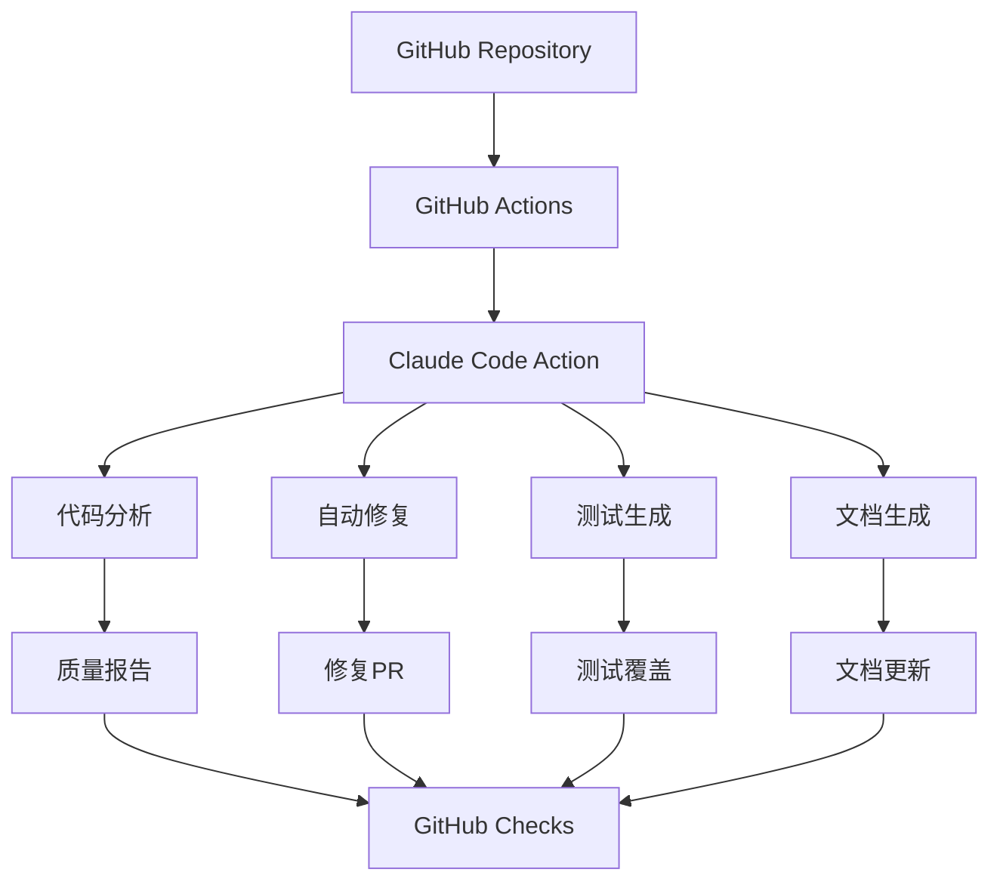

# Claude Code与GitHub Actions集成详解

## 概述

Claude Code与GitHub Actions的深度集成为团队提供了强大的CI/CD自动化能力。通过这种集成，团队可以在代码提交、拉取请求、发布等关键节点自动触发Claude Code的智能分析、代码生成、测试和部署流程，实现真正的智能化DevOps。

## 集成架构

### 核心组件



### 集成优势

1. **自动化代码审查**：AI驱动的代码质量检查
2. **智能测试生成**：自动生成和维护测试用例
3. **持续文档更新**：代码变更时自动更新文档
4. **智能部署决策**：基于代码分析的部署建议
5. **团队协作增强**：自动化的代码建议和修复

## 1. 基础集成配置

### Claude Code Action安装

#### 基础工作流配置
```yaml
# .github/workflows/claude-code.yml
name: Claude Code Integration

on:
  push:
    branches: [ main, develop ]
  pull_request:
    branches: [ main ]
  workflow_dispatch:

jobs:
  claude-analysis:
    runs-on: ubuntu-latest
    
    steps:
    - name: Checkout代码
      uses: actions/checkout@v4
      with:
        fetch-depth: 0  # 获取完整历史用于分析
    
    - name: 设置Node.js
      uses: actions/setup-node@v4
      with:
        node-version: '18'
        cache: 'npm'
    
    - name: 安装依赖
      run: npm ci
    
    - name: Claude Code分析
      uses: anthropic/claude-code-action@v1
      with:
        api-key: ${{ secrets.CLAUDE_API_KEY }}
        analysis-type: 'comprehensive'
        output-format: 'github-checks'
      env:
        GITHUB_TOKEN: ${{ secrets.GITHUB_TOKEN }}
```

#### 环境变量配置
```yaml
# 在GitHub仓库设置中配置以下Secrets:
# CLAUDE_API_KEY: Claude API密钥
# CLAUDE_PROJECT_ID: 项目ID（可选）
# CLAUDE_TEAM_CONFIG: 团队配置（可选）

env:
  CLAUDE_API_KEY: ${{ secrets.CLAUDE_API_KEY }}
  CLAUDE_PROJECT_ID: ${{ secrets.CLAUDE_PROJECT_ID }}
  CLAUDE_TEAM_CONFIG: ${{ secrets.CLAUDE_TEAM_CONFIG }}
  
  # 分析配置
  CLAUDE_ANALYSIS_DEPTH: 'deep'
  CLAUDE_LANGUAGE_FOCUS: 'javascript,typescript,python'
  CLAUDE_EXCLUDE_PATHS: 'node_modules,dist,build'
```

### 权限配置

#### GitHub Token权限
```yaml
permissions:
  contents: read          # 读取代码
  pull-requests: write    # 创建和更新PR评论
  checks: write          # 创建检查状态
  issues: write          # 创建和更新Issue
  actions: read          # 读取Actions状态
  security-events: write # 安全扫描结果
```

#### 团队访问控制
```json
{
  "teamAccess": {
    "developers": {
      "canTrigger": ["analysis", "test-generation"],
      "canApprove": false,
      "notifications": ["pr-comments", "check-failures"]
    },
    "leads": {
      "canTrigger": ["all"],
      "canApprove": true,
      "notifications": ["all"]
    },
    "admins": {
      "canTrigger": ["all"],
      "canApprove": true,
      "canConfigure": true,
      "notifications": ["critical"]
    }
  }
}
```

## 2. 代码分析工作流

### 智能代码审查

#### PR代码审查工作流
```yaml
name: PR代码审查

on:
  pull_request:
    types: [opened, synchronize, reopened]

jobs:
  claude-review:
    runs-on: ubuntu-latest
    
    steps:
    - uses: actions/checkout@v4
      with:
        fetch-depth: 0
    
    - name: 获取变更文件
      id: changed-files
      uses: tj-actions/changed-files@v40
      with:
        files: |
          **/*.js
          **/*.ts
          **/*.jsx
          **/*.tsx
          **/*.py
          **/*.java
          **/*.go
    
    - name: Claude代码审查
      if: steps.changed-files.outputs.any_changed == 'true'
      uses: anthropic/claude-code-action@v1
      with:
        action: 'review'
        files: ${{ steps.changed-files.outputs.all_changed_files }}
        review-focus: |
          - 代码质量和最佳实践
          - 安全漏洞检测
          - 性能优化建议
          - 架构一致性检查
          - 测试覆盖率分析
        
        comment-style: 'constructive'
        severity-threshold: 'medium'
        
      env:
        CLAUDE_API_KEY: ${{ secrets.CLAUDE_API_KEY }}
        GITHUB_TOKEN: ${{ secrets.GITHUB_TOKEN }}
    
    - name: 生成审查报告
      uses: anthropic/claude-code-action@v1
      with:
        action: 'generate-report'
        template: 'pr-review'
        output-path: 'review-report.md'
    
    - name: 上传审查报告
      uses: actions/upload-artifact@v3
      with:
        name: claude-review-report
        path: review-report.md
```

#### 代码质量检查
```yaml
name: 代码质量检查

on:
  push:
    branches: [ main, develop ]

jobs:
  quality-check:
    runs-on: ubuntu-latest
    
    steps:
    - uses: actions/checkout@v4
    
    - name: Claude质量分析
      uses: anthropic/claude-code-action@v1
      with:
        action: 'quality-check'
        metrics: |
          - complexity
          - maintainability
          - reliability
          - security
          - performance
        
        thresholds:
          complexity: 10
          maintainability: 'B'
          security: 'high'
          test-coverage: 80
        
        fail-on-threshold: true
      
      env:
        CLAUDE_API_KEY: ${{ secrets.CLAUDE_API_KEY }}
    
    - name: 创建质量徽章
      if: github.ref == 'refs/heads/main'
      run: |
        # 生成代码质量徽章
        claude generate badge \
          --type quality \
          --score ${{ steps.quality-check.outputs.score }} \
          --output .github/badges/quality.svg
    
    - name: 提交徽章更新
      if: github.ref == 'refs/heads/main'
      uses: stefanzweifel/git-auto-commit-action@v4
      with:
        commit_message: "🏆 更新代码质量徽章"
        file_pattern: .github/badges/*.svg
```

### 安全扫描集成

#### 安全漏洞检测
```yaml
name: 安全扫描

on:
  push:
    branches: [ main ]
  pull_request:
    branches: [ main ]
  schedule:
    - cron: '0 2 * * 1'  # 每周一凌晨2点

jobs:
  security-scan:
    runs-on: ubuntu-latest
    
    steps:
    - uses: actions/checkout@v4
    
    - name: Claude安全分析
      uses: anthropic/claude-code-action@v1
      with:
        action: 'security-scan'
        scan-types: |
          - vulnerability-detection
          - dependency-check
          - secret-scanning
          - code-injection
          - xss-detection
        
        severity-levels: ['critical', 'high', 'medium']
        exclude-paths: ['tests/', 'docs/']
        
      env:
        CLAUDE_API_KEY: ${{ secrets.CLAUDE_API_KEY }}
    
    - name: 上传安全报告到GitHub Security
      uses: github/codeql-action/upload-sarif@v2
      if: always()
      with:
        sarif_file: claude-security-report.sarif
    
    - name: 创建安全Issue
      if: steps.security-scan.outputs.critical-issues > 0
      uses: actions/github-script@v6
      with:
        script: |
          const { data: issue } = await github.rest.issues.create({
            owner: context.repo.owner,
            repo: context.repo.repo,
            title: '🚨 发现严重安全漏洞',
            body: `
              Claude Code安全扫描发现了 ${{ steps.security-scan.outputs.critical-issues }} 个严重安全问题。
              
              请立即查看安全报告并修复这些问题。
              
              [查看详细报告](https://github.com/${{ github.repository }}/security/code-scanning)
            `,
            labels: ['security', 'critical', 'claude-generated']
          });
```

## 3. 自动化测试工作流

### 智能测试生成

#### 测试用例自动生成
```yaml
name: 智能测试生成

on:
  push:
    paths:
      - 'src/**/*.js'
      - 'src/**/*.ts'
      - 'lib/**/*.js'
      - 'lib/**/*.ts'

jobs:
  generate-tests:
    runs-on: ubuntu-latest
    
    steps:
    - uses: actions/checkout@v4
      with:
        token: ${{ secrets.GITHUB_TOKEN }}
    
    - name: 检测新增或修改的文件
      id: changed-files
      uses: tj-actions/changed-files@v40
      with:
        files: |
          src/**/*.{js,ts}
          lib/**/*.{js,ts}
        files_ignore: |
          **/*.test.{js,ts}
          **/*.spec.{js,ts}
    
    - name: 生成测试用例
      if: steps.changed-files.outputs.any_changed == 'true'
      uses: anthropic/claude-code-action@v1
      with:
        action: 'generate-tests'
        source-files: ${{ steps.changed-files.outputs.all_changed_files }}
        test-framework: 'jest'
        test-types: |
          - unit
          - integration
          - edge-cases
        
        coverage-target: 90
        mock-external: true
        
      env:
        CLAUDE_API_KEY: ${{ secrets.CLAUDE_API_KEY }}
    
    - name: 运行生成的测试
      run: |
        npm test -- --coverage --testPathPattern=".*\.claude-generated\.test\.(js|ts)$"
    
    - name: 创建测试PR
      if: steps.generate-tests.outputs.tests-generated == 'true'
      uses: peter-evans/create-pull-request@v5
      with:
        token: ${{ secrets.GITHUB_TOKEN }}
        commit-message: "🧪 Claude自动生成测试用例"
        title: "自动生成的测试用例"
        body: |
          ## 🤖 Claude自动生成的测试用例
          
          为以下文件生成了测试用例：
          ${{ steps.changed-files.outputs.all_changed_files }}
          
          ### 生成的测试类型
          - ✅ 单元测试
          - ✅ 集成测试  
          - ✅ 边界条件测试
          
          ### 测试覆盖率
          目标覆盖率: 90%
          实际覆盖率: ${{ steps.generate-tests.outputs.coverage }}%
          
          请审查这些测试用例并根据需要进行调整。
        
        branch: claude/auto-tests-${{ github.run_number }}
        labels: |
          automated
          tests
          claude-generated
```

#### 测试维护和优化
```yaml
name: 测试维护

on:
  schedule:
    - cron: '0 3 * * 0'  # 每周日凌晨3点
  workflow_dispatch:

jobs:
  maintain-tests:
    runs-on: ubuntu-latest
    
    steps:
    - uses: actions/checkout@v4
    
    - name: 分析测试质量
      uses: anthropic/claude-code-action@v1
      with:
        action: 'analyze-tests'
        test-directories: ['tests/', 'src/**/*.test.js', 'src/**/*.spec.js']
        analysis-focus: |
          - 测试覆盖率缺口
          - 重复测试检测
          - 过时测试识别
          - 性能测试建议
        
      env:
        CLAUDE_API_KEY: ${{ secrets.CLAUDE_API_KEY }}
    
    - name: 优化测试套件
      uses: anthropic/claude-code-action@v1
      with:
        action: 'optimize-tests'
        optimization-types: |
          - remove-duplicates
          - improve-assertions
          - add-missing-tests
          - update-mocks
    
    - name: 生成测试报告
      run: |
        claude generate report \
          --type test-maintenance \
          --output test-maintenance-report.md \
          --include-recommendations
    
    - name: 创建维护Issue
      if: steps.analyze-tests.outputs.issues-found > 0
      uses: actions/github-script@v6
      with:
        script: |
          const fs = require('fs');
          const report = fs.readFileSync('test-maintenance-report.md', 'utf8');
          
          await github.rest.issues.create({
            owner: context.repo.owner,
            repo: context.repo.repo,
            title: '🔧 测试套件维护建议',
            body: report,
            labels: ['maintenance', 'tests', 'claude-generated']
          });
```

## 4. 文档自动化工作流

### API文档生成

#### 自动API文档更新
```yaml
name: API文档自动更新

on:
  push:
    branches: [ main ]
    paths:
      - 'src/api/**'
      - 'src/routes/**'
      - 'src/controllers/**'

jobs:
  update-api-docs:
    runs-on: ubuntu-latest
    
    steps:
    - uses: actions/checkout@v4
      with:
        token: ${{ secrets.GITHUB_TOKEN }}
    
    - name: 生成API文档
      uses: anthropic/claude-code-action@v1
      with:
        action: 'generate-docs'
        doc-type: 'api'
        source-paths: |
          - src/api
          - src/routes
          - src/controllers
        
        output-format: 'openapi'
        include-examples: true
        include-schemas: true
        
      env:
        CLAUDE_API_KEY: ${{ secrets.CLAUDE_API_KEY }}
    
    - name: 验证OpenAPI规范
      run: |
        npx swagger-parser validate docs/api/openapi.yaml
    
    - name: 生成API文档网站
      run: |
        npx redoc-cli build docs/api/openapi.yaml \
          --output docs/api/index.html \
          --title "API Documentation"
    
    - name: 部署到GitHub Pages
      uses: peaceiris/actions-gh-pages@v3
      with:
        github_token: ${{ secrets.GITHUB_TOKEN }}
        publish_dir: ./docs/api
        destination_dir: api
    
    - name: 通知团队
      uses: actions/github-script@v6
      with:
        script: |
          await github.rest.issues.createComment({
            owner: context.repo.owner,
            repo: context.repo.repo,
            issue_number: context.payload.pull_request?.number,
            body: `
              ## 📚 API文档已更新
              
              API文档已自动更新并部署到 [GitHub Pages](https://${{ github.repository_owner }}.github.io/${{ github.event.repository.name }}/api/)
              
              ### 更新内容
              - 🔄 同步最新API变更
              - ✅ 验证OpenAPI规范
              - 📖 生成交互式文档
            `
          });
```

### 代码文档生成

#### 自动代码注释和文档
```yaml
name: 代码文档生成

on:
  pull_request:
    types: [opened, synchronize]

jobs:
  generate-code-docs:
    runs-on: ubuntu-latest
    
    steps:
    - uses: actions/checkout@v4
      with:
        fetch-depth: 0
    
    - name: 检测缺少文档的代码
      id: undocumented
      uses: anthropic/claude-code-action@v1
      with:
        action: 'detect-undocumented'
        file-patterns: |
          - '**/*.js'
          - '**/*.ts'
          - '**/*.py'
        
        check-types: |
          - functions
          - classes
          - methods
          - complex-logic
        
        min-complexity: 5
      
      env:
        CLAUDE_API_KEY: ${{ secrets.CLAUDE_API_KEY }}
    
    - name: 生成代码注释
      if: steps.undocumented.outputs.undocumented-count > 0
      uses: anthropic/claude-code-action@v1
      with:
        action: 'generate-comments'
        files: ${{ steps.undocumented.outputs.undocumented-files }}
        comment-style: 'jsdoc'
        include-examples: true
        include-types: true
    
    - name: 生成README更新
      uses: anthropic/claude-code-action@v1
      with:
        action: 'update-readme'
        sections: |
          - installation
          - usage
          - api-reference
          - examples
        
        auto-generate-toc: true
        include-badges: true
    
    - name: 创建文档改进PR
      if: steps.undocumented.outputs.undocumented-count > 0
      uses: peter-evans/create-pull-request@v5
      with:
        token: ${{ secrets.GITHUB_TOKEN }}
        commit-message: "📝 Claude自动生成代码文档"
        title: "改进代码文档"
        body: |
          ## 📝 自动生成的代码文档改进
          
          Claude检测到 ${{ steps.undocumented.outputs.undocumented-count }} 个缺少文档的代码块，并自动生成了相应的文档。
          
          ### 改进内容
          - 🔍 添加函数和类的JSDoc注释
          - 📖 更新README文档
          - 🏷️ 添加类型注解
          - 💡 包含使用示例
          
          请审查这些文档改进并根据需要进行调整。
        
        branch: claude/docs-improvement-${{ github.run_number }}
        labels: |
          documentation
          automated
          claude-generated
```

## 5. 部署自动化工作流

### 智能部署决策

#### 部署前分析
```yaml
name: 智能部署分析

on:
  push:
    branches: [ main ]
    tags: [ 'v*' ]

jobs:
  deployment-analysis:
    runs-on: ubuntu-latest
    
    outputs:
      deploy-recommendation: ${{ steps.analysis.outputs.recommendation }}
      risk-level: ${{ steps.analysis.outputs.risk-level }}
      
    steps:
    - uses: actions/checkout@v4
      with:
        fetch-depth: 0
    
    - name: Claude部署分析
      id: analysis
      uses: anthropic/claude-code-action@v1
      with:
        action: 'deployment-analysis'
        analysis-scope: |
          - code-changes
          - test-coverage
          - performance-impact
          - security-implications
          - dependency-changes
        
        deployment-target: ${{ github.ref_name == 'main' && 'production' || 'staging' }}
        
        risk-factors: |
          - database-migrations
          - api-breaking-changes
          - security-updates
          - performance-regressions
        
      env:
        CLAUDE_API_KEY: ${{ secrets.CLAUDE_API_KEY }}
    
    - name: 生成部署报告
      run: |
        claude generate report \
          --type deployment \
          --output deployment-analysis.md \
          --include-recommendations \
          --include-rollback-plan
    
    - name: 上传部署分析
      uses: actions/upload-artifact@v3
      with:
        name: deployment-analysis
        path: deployment-analysis.md

  deploy:
    needs: deployment-analysis
    runs-on: ubuntu-latest
    if: needs.deployment-analysis.outputs.deploy-recommendation == 'approved'
    
    steps:
    - uses: actions/checkout@v4
    
    - name: 部署到环境
      run: |
        echo "部署风险级别: ${{ needs.deployment-analysis.outputs.risk-level }}"
        
        if [ "${{ needs.deployment-analysis.outputs.risk-level }}" = "high" ]; then
          echo "高风险部署，需要额外确认"
          # 发送通知给团队负责人
        fi
        
        # 执行部署逻辑
        ./deploy.sh ${{ github.ref_name == 'main' && 'production' || 'staging' }}
    
    - name: 部署后验证
      uses: anthropic/claude-code-action@v1
      with:
        action: 'post-deployment-check'
        checks: |
          - health-endpoints
          - performance-metrics
          - error-rates
          - user-experience
        
        rollback-threshold: 'medium'
      
      env:
        CLAUDE_API_KEY: ${{ secrets.CLAUDE_API_KEY }}
```

### 自动回滚机制

#### 智能回滚决策
```yaml
name: 智能回滚监控

on:
  deployment_status:
  workflow_run:
    workflows: ["智能部署分析"]
    types: [completed]

jobs:
  monitor-deployment:
    runs-on: ubuntu-latest
    if: github.event.deployment_status.state == 'success'
    
    steps:
    - uses: actions/checkout@v4
    
    - name: 部署后监控
      uses: anthropic/claude-code-action@v1
      with:
        action: 'monitor-deployment'
        monitoring-duration: '15m'
        metrics: |
          - response-time
          - error-rate
          - cpu-usage
          - memory-usage
          - user-satisfaction
        
        thresholds:
          error-rate: '< 1%'
          response-time: '< 500ms'
          cpu-usage: '< 80%'
          memory-usage: '< 85%'
        
      env:
        CLAUDE_API_KEY: ${{ secrets.CLAUDE_API_KEY }}
    
    - name: 执行自动回滚
      if: steps.monitor.outputs.rollback-recommended == 'true'
      run: |
        echo "检测到部署问题，执行自动回滚"
        
        # 记录回滚原因
        echo "回滚原因: ${{ steps.monitor.outputs.rollback-reason }}" >> rollback.log
        
        # 执行回滚
        ./rollback.sh ${{ github.event.deployment.environment }}
        
        # 通知团队
        curl -X POST ${{ secrets.SLACK_WEBHOOK }} \
          -H 'Content-type: application/json' \
          --data '{
            "text": "🚨 自动回滚执行",
            "attachments": [{
              "color": "danger",
              "fields": [{
                "title": "环境",
                "value": "${{ github.event.deployment.environment }}",
                "short": true
              }, {
                "title": "原因", 
                "value": "${{ steps.monitor.outputs.rollback-reason }}",
                "short": true
              }]
            }]
          }'
```

## 6. 团队协作工作流

### 代码审查增强

#### AI辅助代码审查
```yaml
name: AI辅助代码审查

on:
  pull_request_review:
    types: [submitted]

jobs:
  enhance-review:
    runs-on: ubuntu-latest
    if: github.event.review.state == 'changes_requested'
    
    steps:
    - uses: actions/checkout@v4
    
    - name: 分析审查意见
      uses: anthropic/claude-code-action@v1
      with:
        action: 'analyze-review'
        review-content: ${{ github.event.review.body }}
        pr-diff: true
        
        enhancement-types: |
          - suggest-fixes
          - provide-examples
          - explain-best-practices
          - generate-alternatives
        
      env:
        CLAUDE_API_KEY: ${{ secrets.CLAUDE_API_KEY }}
    
    - name: 生成修复建议
      uses: anthropic/claude-code-action@v1
      with:
        action: 'generate-fixes'
        review-comments: ${{ steps.analyze.outputs.comments }}
        fix-types: |
          - code-corrections
          - performance-improvements
          - security-enhancements
          - style-adjustments
    
    - name: 创建修复PR
      uses: peter-evans/create-pull-request@v5
      with:
        token: ${{ secrets.GITHUB_TOKEN }}
        commit-message: "🔧 Claude自动修复审查意见"
        title: "修复PR #${{ github.event.pull_request.number }}的审查意见"
        body: |
          ## 🤖 Claude自动生成的修复
          
          基于 @${{ github.event.review.user.login }} 的审查意见，Claude自动生成了以下修复：
          
          ### 修复内容
          ${{ steps.generate-fixes.outputs.fix-summary }}
          
          ### 原始审查意见
          > ${{ github.event.review.body }}
          
          请审查这些修复并根据需要进行调整。
        
        branch: claude/fix-review-${{ github.event.pull_request.number }}
        base: ${{ github.event.pull_request.head.ref }}
```

### 知识分享自动化

#### 自动知识提取和分享
```yaml
name: 知识分享自动化

on:
  push:
    branches: [ main ]
  pull_request:
    types: [closed]
    branches: [ main ]

jobs:
  extract-knowledge:
    runs-on: ubuntu-latest
    if: github.event.pull_request.merged == true || github.event_name == 'push'
    
    steps:
    - uses: actions/checkout@v4
      with:
        fetch-depth: 0
    
    - name: 提取技术知识
      uses: anthropic/claude-code-action@v1
      with:
        action: 'extract-knowledge'
        source-type: ${{ github.event_name == 'push' && 'commit' || 'pull_request' }}
        
        knowledge-types: |
          - design-patterns
          - best-practices
          - troubleshooting
          - performance-tips
          - security-insights
        
        extraction-scope: |
          - code-changes
          - commit-messages
          - pr-descriptions
          - review-comments
        
      env:
        CLAUDE_API_KEY: ${{ secrets.CLAUDE_API_KEY }}
    
    - name: 更新团队知识库
      if: steps.extract.outputs.knowledge-found == 'true'
      run: |
        # 更新知识库文件
        claude update knowledge-base \
          --add-entry "${{ steps.extract.outputs.knowledge-entry }}" \
          --category "${{ steps.extract.outputs.category }}" \
          --tags "${{ steps.extract.outputs.tags }}"
    
    - name: 生成学习建议
      uses: anthropic/claude-code-action@v1
      with:
        action: 'generate-learning-suggestions'
        team-members: ${{ secrets.TEAM_MEMBERS }}
        knowledge-gaps: true
        skill-recommendations: true
    
    - name: 发送知识分享通知
      uses: actions/github-script@v6
      with:
        script: |
          const knowledge = ${{ steps.extract.outputs.knowledge-summary }};
          
          if (knowledge && knowledge.length > 0) {
            await github.rest.issues.create({
              owner: context.repo.owner,
              repo: context.repo.repo,
              title: '💡 新的技术知识分享',
              body: `
                ## 🧠 从最近的代码变更中提取的知识
                
                ${knowledge}
                
                ### 学习建议
                ${{ steps.generate-suggestions.outputs.suggestions }}
                
                ---
                *此知识由Claude自动提取和整理*
              `,
              labels: ['knowledge-sharing', 'claude-generated', 'team-learning']
            });
          }
```

## 7. 监控和优化

### 工作流性能监控

#### Claude Action性能分析
```yaml
name: Claude Action性能监控

on:
  schedule:
    - cron: '0 6 * * 1'  # 每周一早上6点
  workflow_dispatch:

jobs:
  performance-analysis:
    runs-on: ubuntu-latest
    
    steps:
    - name: 获取工作流历史
      uses: actions/github-script@v6
      with:
        script: |
          const { data: workflows } = await github.rest.actions.listWorkflowRuns({
            owner: context.repo.owner,
            repo: context.repo.repo,
            workflow_id: 'claude-code.yml',
            per_page: 100
          });
          
          const fs = require('fs');
          fs.writeFileSync('workflow-history.json', JSON.stringify(workflows, null, 2));
    
    - name: 分析性能趋势
      uses: anthropic/claude-code-action@v1
      with:
        action: 'analyze-performance'
        data-source: 'workflow-history.json'
        
        metrics: |
          - execution-time
          - success-rate
          - resource-usage
          - cost-efficiency
        
        analysis-period: '30d'
        
      env:
        CLAUDE_API_KEY: ${{ secrets.CLAUDE_API_KEY }}
    
    - name: 生成优化建议
      uses: anthropic/claude-code-action@v1
      with:
        action: 'generate-optimizations'
        optimization-areas: |
          - workflow-efficiency
          - resource-allocation
          - parallel-execution
          - caching-strategies
    
    - name: 创建性能报告Issue
      uses: actions/github-script@v6
      with:
        script: |
          const fs = require('fs');
          const report = fs.readFileSync('performance-report.md', 'utf8');
          
          await github.rest.issues.create({
            owner: context.repo.owner,
            repo: context.repo.repo,
            title: '📊 Claude Actions性能分析报告',
            body: report,
            labels: ['performance', 'monitoring', 'claude-actions']
          });
```

### 成本优化

#### 使用量监控和优化
```yaml
name: Claude使用量监控

on:
  schedule:
    - cron: '0 0 * * *'  # 每日午夜

jobs:
  usage-monitoring:
    runs-on: ubuntu-latest
    
    steps:
    - name: 获取使用统计
      uses: anthropic/claude-code-action@v1
      with:
        action: 'get-usage-stats'
        period: 'daily'
        
        metrics: |
          - api-calls
          - token-usage
          - cost-breakdown
          - feature-usage
        
      env:
        CLAUDE_API_KEY: ${{ secrets.CLAUDE_API_KEY }}
    
    - name: 分析使用模式
      uses: anthropic/claude-code-action@v1
      with:
        action: 'analyze-usage-patterns'
        optimization-focus: |
          - reduce-redundant-calls
          - optimize-prompt-efficiency
          - improve-caching
          - batch-operations
    
    - name: 生成成本优化建议
      run: |
        claude generate cost-optimization \
          --usage-data usage-stats.json \
          --output cost-optimization.md \
          --include-projections
    
    - name: 发送使用量报告
      if: steps.usage.outputs.daily-cost > 10
      uses: actions/github-script@v6
      with:
        script: |
          const cost = '${{ steps.usage.outputs.daily-cost }}';
          const usage = '${{ steps.usage.outputs.token-usage }}';
          
          await github.rest.issues.create({
            owner: context.repo.owner,
            repo: context.repo.repo,
            title: '💰 Claude使用量提醒',
            body: `
              ## 📊 今日Claude使用统计
              
              - **成本**: $${cost}
              - **Token使用量**: ${usage}
              - **API调用次数**: ${{ steps.usage.outputs.api-calls }}
              
              ### 优化建议
              ${{ steps.analyze.outputs.optimization-suggestions }}
              
              [查看详细报告](cost-optimization.md)
            `,
            labels: ['cost-monitoring', 'claude-usage']
          });
```

## 总结

Claude Code与GitHub Actions的集成为团队提供了全面的智能化DevOps能力：

1. **智能代码审查**：AI驱动的代码质量检查和安全扫描
2. **自动化测试**：智能测试生成和维护
3. **文档自动化**：API文档和代码注释的自动生成
4. **智能部署**：基于分析的部署决策和自动回滚
5. **团队协作增强**：知识分享和审查辅助
6. **性能监控**：工作流优化和成本控制

通过这些集成，团队可以实现：
- **提升代码质量**：持续的AI代码审查和建议
- **加速开发流程**：自动化的测试和文档生成
- **降低部署风险**：智能的部署分析和监控
- **增强团队协作**：自动化的知识提取和分享
- **优化开发成本**：智能的资源使用和成本控制

这种深度集成使Claude Code成为团队开发流程中不可或缺的智能助手，真正实现了AI驱动的现代软件开发。

---

*GitHub Actions与Claude Code的结合，不仅仅是工具的集成，更是开发理念的革新。它让AI成为团队的第一个代码审查者、测试工程师和部署专家。*