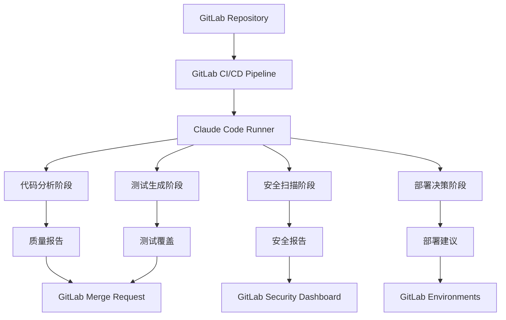

# Claude Code与GitLab CI/CD集成详解

## 概述

Claude Code与GitLab CI/CD的深度集成为团队提供了企业级的智能化DevOps解决方案。通过GitLab的强大CI/CD平台和Claude Code的AI能力相结合，团队可以实现从代码提交到生产部署的全流程智能化自动化，包括代码分析、安全扫描、测试生成、部署决策等关键环节。

## 集成架构

### 核心组件



### 集成优势

1. **企业级安全**：集成GitLab的安全扫描和合规检查
2. **完整的DevOps流程**：从开发到部署的全链路智能化
3. **多环境支持**：开发、测试、预生产、生产环境的智能管理
4. **团队协作增强**：基于GitLab的代码审查和项目管理
5. **可视化监控**：丰富的仪表板和报告功能

## 1. 基础集成配置

### GitLab CI/CD配置

#### 基础Pipeline配置
```yaml
# .gitlab-ci.yml
stages:
  - analyze
  - test
  - security
  - build
  - deploy

variables:
  CLAUDE_API_KEY: $CLAUDE_API_KEY
  CLAUDE_PROJECT_ID: $CLAUDE_PROJECT_ID
  DOCKER_DRIVER: overlay2
  DOCKER_TLS_CERTDIR: "/certs"

# Claude Code分析作业
claude-analysis:
  stage: analyze
  image: node:18-alpine
  
  before_script:
    - npm install -g @anthropic/claude-code
    - claude auth --token $CLAUDE_API_KEY
  
  script:
    - echo "🔍 开始Claude代码分析..."
    - claude analyze --comprehensive --output-format gitlab
    - claude generate report --type analysis --output analysis-report.json
  
  artifacts:
    reports:
      junit: claude-analysis-report.xml
      codequality: claude-code-quality.json
    paths:
      - analysis-report.json
      - claude-suggestions.md
    expire_in: 1 week
  
  rules:
    - if: $CI_PIPELINE_SOURCE == "merge_request_event"
    - if: $CI_COMMIT_BRANCH == $CI_DEFAULT_BRANCH

# 智能测试生成
claude-test-generation:
  stage: test
  image: node:18-alpine
  
  dependencies:
    - claude-analysis
  
  script:
    - echo "🧪 生成智能测试用例..."
    - claude generate tests --framework jest --coverage-target 85
    - npm test -- --coverage --reporters=default --reporters=jest-junit
  
  artifacts:
    reports:
      junit: junit.xml
      coverage_report:
        coverage_format: cobertura
        path: coverage/cobertura-coverage.xml
    paths:
      - coverage/
      - tests/generated/
  
  coverage: '/Lines\s*:\s*(\d+\.\d+)%/'
  
  rules:
    - if: $CI_PIPELINE_SOURCE == "merge_request_event"
      changes:
        - "src/**/*.js"
        - "src/**/*.ts"
        - "lib/**/*.js"
        - "lib/**/*.ts"

# 安全扫描
claude-security-scan:
  stage: security
  image: node:18-alpine
  
  script:
    - echo "🔒 执行Claude安全扫描..."
    - claude security scan --comprehensive --output-format sast
    - claude security analyze --include-dependencies
  
  artifacts:
    reports:
      sast: claude-sast-report.json
      dependency_scanning: claude-dependency-report.json
    paths:
      - security-report.md
  
  rules:
    - if: $CI_PIPELINE_SOURCE == "merge_request_event"
    - if: $CI_COMMIT_BRANCH == $CI_DEFAULT_BRANCH
```

#### 环境变量配置
```yaml
# GitLab项目设置 -> CI/CD -> Variables
variables:
  # Claude API配置
  CLAUDE_API_KEY:
    value: "your-claude-api-key"
    protected: true
    masked: true
  
  CLAUDE_PROJECT_ID:
    value: "your-project-id"
    protected: false
    masked: false
  
  CLAUDE_TEAM_CONFIG:
    value: |
      {
        "team": "development-team",
        "standards": "enterprise",
        "security_level": "high"
      }
    protected: true
    masked: false
  
  # 环境特定配置
  CLAUDE_ANALYSIS_DEPTH:
    value: "deep"
    environment_scope: "production"
  
  CLAUDE_TEST_COVERAGE_TARGET:
    value: "90"
    environment_scope: "production"
  
  CLAUDE_SECURITY_LEVEL:
    value: "strict"
    environment_scope: "production"
```

### Docker集成

#### Claude Code Docker镜像
```dockerfile
# Dockerfile.claude
FROM node:18-alpine

# 安装Claude Code CLI
RUN npm install -g @anthropic/claude-code

# 安装常用工具
RUN apk add --no-cache \
    git \
    curl \
    jq \
    python3 \
    py3-pip

# 安装Python依赖（用于某些分析功能）
RUN pip3 install --no-cache-dir \
    bandit \
    safety \
    pylint

# 创建工作目录
WORKDIR /workspace

# 复制配置文件
COPY .claude-config.json ./
COPY scripts/ ./scripts/

# 设置入口点
ENTRYPOINT ["claude"]
```

#### 自定义Runner镜像
```yaml
# .gitlab-ci.yml中使用自定义镜像
claude-comprehensive-analysis:
  stage: analyze
  image: $CI_REGISTRY_IMAGE/claude-runner:latest
  
  before_script:
    - claude auth --token $CLAUDE_API_KEY
    - claude config set project-id $CLAUDE_PROJECT_ID
  
  script:
    - ./scripts/comprehensive-analysis.sh
  
  artifacts:
    reports:
      junit: reports/analysis-junit.xml
      codequality: reports/code-quality.json
      performance: reports/performance.json
    paths:
      - reports/
      - recommendations/
```

## 2. 高级Pipeline配置

### 多阶段智能分析

#### 渐进式代码分析
```yaml
# 快速分析（MR触发）
claude-quick-analysis:
  stage: analyze
  image: $CLAUDE_RUNNER_IMAGE
  
  script:
    - echo "⚡ 快速代码分析..."
    - claude analyze --mode quick --focus changes
    - claude check --rules critical
  
  artifacts:
    reports:
      codequality: quick-analysis.json
  
  rules:
    - if: $CI_PIPELINE_SOURCE == "merge_request_event"
  
  timeout: 5 minutes

# 深度分析（主分支）
claude-deep-analysis:
  stage: analyze
  image: $CLAUDE_RUNNER_IMAGE
  
  script:
    - echo "🔬 深度代码分析..."
    - claude analyze --mode comprehensive --include-architecture
    - claude generate insights --type technical-debt
    - claude recommend optimizations
  
  artifacts:
    reports:
      codequality: deep-analysis.json
    paths:
      - technical-debt-report.md
      - optimization-recommendations.md
  
  rules:
    - if: $CI_COMMIT_BRANCH == $CI_DEFAULT_BRANCH
  
  timeout: 15 minutes

# 架构分析（定期执行）
claude-architecture-analysis:
  stage: analyze
  image: $CLAUDE_RUNNER_IMAGE
  
  script:
    - echo "🏗️ 架构分析..."
    - claude analyze architecture --comprehensive
    - claude generate architecture-report
    - claude suggest improvements --focus scalability
  
  artifacts:
    paths:
      - architecture-report.md
      - scalability-recommendations.md
  
  rules:
    - if: $CI_PIPELINE_SOURCE == "schedule"
  
  timeout: 30 minutes
```

### 智能测试策略

#### 动态测试生成和执行
```yaml
# 测试影响分析
test-impact-analysis:
  stage: test
  image: $CLAUDE_RUNNER_IMAGE
  
  script:
    - echo "📊 分析测试影响范围..."
    - claude analyze test-impact --base-branch $CI_MERGE_REQUEST_TARGET_BRANCH_NAME
    - claude generate test-plan --focus changed-components
  
  artifacts:
    paths:
      - test-impact-analysis.json
      - test-plan.md
  
  rules:
    - if: $CI_PIPELINE_SOURCE == "merge_request_event"

# 智能测试生成
claude-smart-test-generation:
  stage: test
  image: $CLAUDE_RUNNER_IMAGE
  
  dependencies:
    - test-impact-analysis
  
  script:
    - echo "🤖 生成智能测试用例..."
    - claude generate tests --strategy smart --input test-impact-analysis.json
    - claude optimize test-suite --remove-redundant
    - npm test -- --testPathPattern="generated" --coverage
  
  artifacts:
    reports:
      junit: junit-generated.xml
      coverage_report:
        coverage_format: cobertura
        path: coverage/generated-cobertura.xml
    paths:
      - tests/generated/
      - test-optimization-report.md
  
  coverage: '/Generated Tests Coverage: (\d+\.\d+)%/'

# 性能测试生成
claude-performance-tests:
  stage: test
  image: $CLAUDE_RUNNER_IMAGE
  
  script:
    - echo "⚡ 生成性能测试..."
    - claude generate performance-tests --framework k6
    - claude analyze performance-bottlenecks
    - k6 run performance-tests/generated/*.js
  
  artifacts:
    reports:
      performance: performance-report.json
    paths:
      - performance-tests/generated/
      - performance-analysis.md
  
  rules:
    - if: $CI_COMMIT_BRANCH == $CI_DEFAULT_BRANCH
    - if: $CI_PIPELINE_SOURCE == "merge_request_event"
      changes:
        - "src/api/**/*"
        - "src/services/**/*"
```

### 安全集成

#### 多层安全扫描
```yaml
# SAST扫描
claude-sast-scan:
  stage: security
  image: $CLAUDE_RUNNER_IMAGE
  
  script:
    - echo "🔍 静态安全分析..."
    - claude security sast --comprehensive
    - claude security analyze-patterns --focus owasp-top10
  
  artifacts:
    reports:
      sast: claude-sast.json
    paths:
      - security-analysis.md
  
  rules:
    - if: $CI_PIPELINE_SOURCE == "merge_request_event"
    - if: $CI_COMMIT_BRANCH == $CI_DEFAULT_BRANCH

# 依赖安全扫描
claude-dependency-scan:
  stage: security
  image: $CLAUDE_RUNNER_IMAGE
  
  script:
    - echo "📦 依赖安全扫描..."
    - claude security scan-dependencies --include-transitive
    - claude security analyze-licenses --policy strict
  
  artifacts:
    reports:
      dependency_scanning: claude-dependency-scan.json
    paths:
      - dependency-security-report.md
      - license-compliance-report.md

# 容器安全扫描
claude-container-scan:
  stage: security
  image: $CLAUDE_RUNNER_IMAGE
  
  services:
    - docker:dind
  
  script:
    - echo "🐳 容器安全扫描..."
    - docker build -t $CI_REGISTRY_IMAGE:$CI_COMMIT_SHA .
    - claude security scan-container --image $CI_REGISTRY_IMAGE:$CI_COMMIT_SHA
  
  artifacts:
    reports:
      container_scanning: claude-container-scan.json
  
  rules:
    - if: $CI_COMMIT_BRANCH == $CI_DEFAULT_BRANCH
      exists:
        - Dockerfile
```

## 3. 智能部署流程

### 部署决策引擎

#### 智能部署分析
```yaml
# 部署前分析
deployment-readiness-check:
  stage: deploy
  image: $CLAUDE_RUNNER_IMAGE
  
  script:
    - echo "🚀 部署就绪性检查..."
    - claude deployment analyze-readiness --environment $DEPLOY_ENVIRONMENT
    - claude deployment risk-assessment --comprehensive
    - claude deployment generate-plan --strategy blue-green
  
  artifacts:
    paths:
      - deployment-readiness.json
      - deployment-plan.md
      - risk-assessment.md
  
  environment:
    name: $DEPLOY_ENVIRONMENT
    action: prepare
  
  rules:
    - if: $CI_COMMIT_BRANCH == $CI_DEFAULT_BRANCH
    - if: $CI_COMMIT_TAG

# 智能部署执行
claude-smart-deploy:
  stage: deploy
  image: $CLAUDE_RUNNER_IMAGE
  
  dependencies:
    - deployment-readiness-check
  
  script:
    - echo "🎯 执行智能部署..."
    - |
      # 读取部署建议
      DEPLOYMENT_STRATEGY=$(jq -r '.recommended_strategy' deployment-readiness.json)
      RISK_LEVEL=$(jq -r '.risk_level' deployment-readiness.json)
      
      echo "部署策略: $DEPLOYMENT_STRATEGY"
      echo "风险级别: $RISK_LEVEL"
      
      # 根据风险级别调整部署参数
      if [ "$RISK_LEVEL" = "high" ]; then
        echo "高风险部署，启用额外安全措施..."
        DEPLOYMENT_FLAGS="--safe-mode --rollback-threshold 1%"
      else
        DEPLOYMENT_FLAGS="--standard"
      fi
      
      # 执行部署
      ./deploy.sh $DEPLOY_ENVIRONMENT $DEPLOYMENT_STRATEGY $DEPLOYMENT_FLAGS
    
    - claude deployment monitor --duration 10m --auto-rollback
  
  environment:
    name: $DEPLOY_ENVIRONMENT
    url: $DEPLOY_URL
    deployment_tier: $DEPLOY_TIER
  
  rules:
    - if: $CI_COMMIT_BRANCH == $CI_DEFAULT_BRANCH
      when: manual
      allow_failure: false
    - if: $CI_COMMIT_TAG
      when: on_success

# 部署后验证
post-deployment-validation:
  stage: deploy
  image: $CLAUDE_RUNNER_IMAGE
  
  dependencies:
    - claude-smart-deploy
  
  script:
    - echo "✅ 部署后验证..."
    - claude deployment validate --environment $DEPLOY_ENVIRONMENT
    - claude deployment health-check --comprehensive
    - claude deployment performance-check --baseline previous
  
  artifacts:
    reports:
      junit: deployment-validation.xml
    paths:
      - deployment-validation-report.md
  
  environment:
    name: $DEPLOY_ENVIRONMENT
    action: verify
  
  rules:
    - if: $CI_COMMIT_BRANCH == $CI_DEFAULT_BRANCH
    - if: $CI_COMMIT_TAG
```

### 多环境部署策略

#### 环境特定配置
```yaml
# 开发环境部署
deploy-development:
  extends: .deploy-template
  
  variables:
    DEPLOY_ENVIRONMENT: "development"
    DEPLOY_URL: "https://dev.example.com"
    DEPLOY_TIER: "development"
    CLAUDE_DEPLOYMENT_MODE: "fast"
  
  script:
    - claude deployment quick-deploy --environment development
  
  environment:
    name: development
    url: https://dev.example.com
    auto_stop_in: 1 day
  
  rules:
    - if: $CI_COMMIT_BRANCH == "develop"

# 测试环境部署
deploy-testing:
  extends: .deploy-template
  
  variables:
    DEPLOY_ENVIRONMENT: "testing"
    DEPLOY_URL: "https://test.example.com"
    DEPLOY_TIER: "testing"
    CLAUDE_DEPLOYMENT_MODE: "comprehensive"
  
  script:
    - claude deployment test-deploy --with-validation
    - claude deployment run-smoke-tests
  
  environment:
    name: testing
    url: https://test.example.com
  
  rules:
    - if: $CI_COMMIT_BRANCH == $CI_DEFAULT_BRANCH

# 生产环境部署
deploy-production:
  extends: .deploy-template
  
  variables:
    DEPLOY_ENVIRONMENT: "production"
    DEPLOY_URL: "https://example.com"
    DEPLOY_TIER: "production"
    CLAUDE_DEPLOYMENT_MODE: "safe"
  
  before_script:
    - claude deployment pre-production-check
    - claude deployment backup-current-state
  
  script:
    - claude deployment production-deploy --strategy blue-green
    - claude deployment monitor --duration 30m
  
  after_script:
    - claude deployment post-production-report
  
  environment:
    name: production
    url: https://example.com
  
  rules:
    - if: $CI_COMMIT_TAG
      when: manual
      allow_failure: false
  
  timeout: 1h
```

## 4. 团队协作增强

### 智能代码审查

#### MR增强功能
```yaml
# MR代码审查增强
mr-claude-review:
  stage: analyze
  image: $CLAUDE_RUNNER_IMAGE
  
  script:
    - echo "👀 Claude智能代码审查..."
    - |
      # 获取MR信息
      MR_IID=$CI_MERGE_REQUEST_IID
      TARGET_BRANCH=$CI_MERGE_REQUEST_TARGET_BRANCH_NAME
      SOURCE_BRANCH=$CI_MERGE_REQUEST_SOURCE_BRANCH_NAME
      
      # 执行智能审查
      claude review merge-request \
        --mr-id $MR_IID \
        --target-branch $TARGET_BRANCH \
        --source-branch $SOURCE_BRANCH \
        --comprehensive
      
      # 生成审查建议
      claude review generate-suggestions \
        --focus "security,performance,maintainability" \
        --output-format gitlab-comment
  
  artifacts:
    paths:
      - mr-review-report.md
      - review-suggestions.json
  
  rules:
    - if: $CI_PIPELINE_SOURCE == "merge_request_event"

# 自动代码改进建议
claude-code-improvements:
  stage: analyze
  image: $CLAUDE_RUNNER_IMAGE
  
  dependencies:
    - mr-claude-review
  
  script:
    - echo "💡 生成代码改进建议..."
    - claude improve code --based-on-review review-suggestions.json
    - claude generate refactoring-plan --safe-only
  
  artifacts:
    paths:
      - code-improvements.md
      - refactoring-plan.md
  
  rules:
    - if: $CI_PIPELINE_SOURCE == "merge_request_event"
```

### 知识管理

#### 自动文档生成
```yaml
# API文档自动更新
update-api-docs:
  stage: deploy
  image: $CLAUDE_RUNNER_IMAGE
  
  script:
    - echo "📚 更新API文档..."
    - claude docs generate-api --format openapi
    - claude docs update-changelog --auto-detect-changes
    - claude docs generate-examples --interactive
  
  artifacts:
    paths:
      - docs/api/
      - CHANGELOG.md
      - docs/examples/
  
  rules:
    - if: $CI_COMMIT_BRANCH == $CI_DEFAULT_BRANCH
      changes:
        - "src/api/**/*"
        - "src/routes/**/*"

# 团队知识库更新
update-knowledge-base:
  stage: deploy
  image: $CLAUDE_RUNNER_IMAGE
  
  script:
    - echo "🧠 更新团队知识库..."
    - claude knowledge extract --from-commits --since "1 week ago"
    - claude knowledge categorize --auto-tag
    - claude knowledge generate-insights
  
  artifacts:
    paths:
      - knowledge-base/
      - team-insights.md
  
  rules:
    - if: $CI_PIPELINE_SOURCE == "schedule"
    - if: $CI_COMMIT_BRANCH == $CI_DEFAULT_BRANCH
      when: manual
```

## 5. 监控和报告

### 智能监控

#### 性能监控集成
```yaml
# 性能监控
claude-performance-monitoring:
  stage: deploy
  image: $CLAUDE_RUNNER_IMAGE
  
  script:
    - echo "📊 性能监控分析..."
    - claude monitor performance --environment $DEPLOY_ENVIRONMENT
    - claude analyze performance-trends --period 7d
    - claude generate performance-report
  
  artifacts:
    reports:
      performance: performance-metrics.json
    paths:
      - performance-report.md
      - performance-trends.json
  
  environment:
    name: $DEPLOY_ENVIRONMENT
    action: access
  
  rules:
    - if: $CI_PIPELINE_SOURCE == "schedule"
    - if: $CI_COMMIT_BRANCH == $CI_DEFAULT_BRANCH

# 质量趋势分析
quality-trend-analysis:
  stage: analyze
  image: $CLAUDE_RUNNER_IMAGE
  
  script:
    - echo "📈 代码质量趋势分析..."
    - claude analyze quality-trends --period 30d
    - claude generate quality-dashboard
    - claude predict quality-issues --horizon 2w
  
  artifacts:
    paths:
      - quality-trends.json
      - quality-dashboard.html
      - quality-predictions.md
  
  rules:
    - if: $CI_PIPELINE_SOURCE == "schedule"
```

### 报告生成

#### 综合项目报告
```yaml
# 项目健康报告
project-health-report:
  stage: deploy
  image: $CLAUDE_RUNNER_IMAGE
  
  dependencies:
    - claude-analysis
    - claude-security-scan
    - claude-performance-monitoring
  
  script:
    - echo "🏥 生成项目健康报告..."
    - |
      claude report generate comprehensive \
        --include-analysis analysis-report.json \
        --include-security security-report.md \
        --include-performance performance-metrics.json \
        --output-format html
      
      # 生成执行摘要
      claude report executive-summary \
        --audience management \
        --focus "quality,security,performance,risks"
  
  artifacts:
    paths:
      - reports/project-health.html
      - reports/executive-summary.md
      - reports/detailed-metrics.json
  
  rules:
    - if: $CI_PIPELINE_SOURCE == "schedule"
    - if: $CI_COMMIT_TAG

# 团队效率报告
team-efficiency-report:
  stage: deploy
  image: $CLAUDE_RUNNER_IMAGE
  
  script:
    - echo "⚡ 团队效率分析..."
    - claude analyze team-efficiency --period 1m
    - claude generate productivity-insights
    - claude recommend process-improvements
  
  artifacts:
    paths:
      - team-efficiency-report.md
      - productivity-insights.json
      - process-recommendations.md
  
  rules:
    - if: $CI_PIPELINE_SOURCE == "schedule"
      variables:
        - $SCHEDULE_TYPE == "monthly"
```

## 6. 高级配置和优化

### 缓存策略

#### 智能缓存配置
```yaml
# 全局缓存配置
cache:
  key: 
    files:
      - package-lock.json
      - .claude-config.json
  paths:
    - node_modules/
    - .claude-cache/
  policy: pull-push

# Claude分析缓存
claude-analysis:
  cache:
    key: "claude-analysis-$CI_COMMIT_REF_SLUG"
    paths:
      - .claude-cache/analysis/
    policy: pull-push
  
  script:
    - |
      # 检查缓存
      if [ -f ".claude-cache/analysis/cache.json" ]; then
        echo "使用缓存的分析结果..."
        claude analyze --use-cache .claude-cache/analysis/
      else
        echo "执行新的分析..."
        claude analyze --comprehensive --cache-output .claude-cache/analysis/
      fi

# 依赖缓存优化
.cache-dependencies: &cache-dependencies
  cache:
    key: 
      files:
        - package-lock.json
    paths:
      - node_modules/
      - .npm/
    policy: pull-push
  
  before_script:
    - npm ci --cache .npm --prefer-offline
```

### 并行执行优化

#### 并行Pipeline配置
```yaml
# 并行分析作业
claude-parallel-analysis:
  stage: analyze
  parallel:
    matrix:
      - ANALYSIS_TYPE: [security, performance, quality, architecture]
  
  script:
    - echo "🔄 并行执行 $ANALYSIS_TYPE 分析..."
    - claude analyze --type $ANALYSIS_TYPE --output analysis-$ANALYSIS_TYPE.json
  
  artifacts:
    paths:
      - analysis-$ANALYSIS_TYPE.json
    expire_in: 1 hour

# 合并分析结果
merge-analysis-results:
  stage: analyze
  
  dependencies:
    - claude-parallel-analysis
  
  script:
    - echo "🔗 合并分析结果..."
    - claude merge-reports --input "analysis-*.json" --output comprehensive-analysis.json
    - claude generate summary --input comprehensive-analysis.json
  
  artifacts:
    reports:
      codequality: comprehensive-analysis.json
    paths:
      - analysis-summary.md
```

### 资源优化

#### 资源使用优化
```yaml
# 资源限制配置
.resource-limits: &resource-limits
  tags:
    - docker
  variables:
    DOCKER_MEMORY: "2g"
    DOCKER_CPUS: "2"
  
  before_script:
    - echo "设置资源限制: CPU=$DOCKER_CPUS, Memory=$DOCKER_MEMORY"

# 轻量级分析
claude-light-analysis:
  <<: *resource-limits
  
  variables:
    DOCKER_MEMORY: "1g"
    DOCKER_CPUS: "1"
  
  script:
    - claude analyze --mode light --quick-scan
  
  rules:
    - if: $CI_PIPELINE_SOURCE == "merge_request_event"
      changes:
        - "**/*.md"
        - "docs/**/*"

# 重量级分析
claude-heavy-analysis:
  <<: *resource-limits
  
  variables:
    DOCKER_MEMORY: "4g"
    DOCKER_CPUS: "4"
  
  script:
    - claude analyze --mode comprehensive --deep-scan
  
  rules:
    - if: $CI_COMMIT_BRANCH == $CI_DEFAULT_BRANCH
    - if: $CI_PIPELINE_SOURCE == "schedule"
```

## 7. 故障排除和调试

### 调试配置

#### 详细日志和调试
```yaml
# 调试模式
claude-debug:
  stage: analyze
  image: $CLAUDE_RUNNER_IMAGE
  
  variables:
    CLAUDE_DEBUG: "true"
    CLAUDE_LOG_LEVEL: "debug"
    CLAUDE_TRACE: "true"
  
  script:
    - echo "🐛 调试模式分析..."
    - claude analyze --debug --verbose --trace-execution
  
  artifacts:
    paths:
      - debug-logs/
      - trace-output.json
    when: always
    expire_in: 3 days
  
  rules:
    - if: $CI_PIPELINE_SOURCE == "web"
      when: manual
    - if: $CLAUDE_DEBUG_ENABLED == "true"

# 错误恢复
claude-error-recovery:
  stage: analyze
  image: $CLAUDE_RUNNER_IMAGE
  
  script:
    - |
      set +e  # 允许命令失败
      
      echo "🔄 尝试分析..."
      claude analyze --comprehensive
      
      if [ $? -ne 0 ]; then
        echo "⚠️ 分析失败，尝试恢复..."
        
        # 清理缓存
        rm -rf .claude-cache/
        
        # 降级到基础分析
        claude analyze --mode basic --no-cache
        
        if [ $? -ne 0 ]; then
          echo "❌ 恢复失败，生成错误报告..."
          claude diagnose --output error-diagnosis.md
          exit 1
        fi
      fi
  
  artifacts:
    paths:
      - error-diagnosis.md
    when: on_failure
```

### 性能监控

#### Pipeline性能分析
```yaml
# Pipeline性能监控
pipeline-performance:
  stage: deploy
  image: alpine:latest
  
  before_script:
    - apk add --no-cache curl jq
  
  script:
    - |
      echo "📊 分析Pipeline性能..."
      
      # 获取Pipeline信息
      PIPELINE_INFO=$(curl -s --header "PRIVATE-TOKEN: $CI_JOB_TOKEN" \
        "$CI_API_V4_URL/projects/$CI_PROJECT_ID/pipelines/$CI_PIPELINE_ID")
      
      # 计算总执行时间
      CREATED_AT=$(echo $PIPELINE_INFO | jq -r '.created_at')
      UPDATED_AT=$(echo $PIPELINE_INFO | jq -r '.updated_at')
      
      echo "Pipeline创建时间: $CREATED_AT"
      echo "Pipeline完成时间: $UPDATED_AT"
      
      # 分析各阶段耗时
      curl -s --header "PRIVATE-TOKEN: $CI_JOB_TOKEN" \
        "$CI_API_V4_URL/projects/$CI_PROJECT_ID/pipelines/$CI_PIPELINE_ID/jobs" | \
        jq -r '.[] | "\(.stage): \(.duration)s"'
  
  rules:
    - if: $CI_PIPELINE_SOURCE == "schedule"
    - when: manual
      allow_failure: true
```

## 总结

Claude Code与GitLab CI/CD的集成为企业级团队提供了完整的智能化DevOps解决方案：

1. **全流程智能化**：从代码分析到部署监控的完整自动化
2. **企业级安全**：多层安全扫描和合规检查
3. **智能决策支持**：基于AI分析的部署和优化建议
4. **团队协作增强**：智能代码审查和知识管理
5. **可视化监控**：丰富的报告和仪表板功能

通过这种深度集成，团队可以实现：
- **提升开发效率**：自动化的分析、测试和部署流程
- **保障代码质量**：持续的质量监控和改进建议
- **增强安全性**：全面的安全扫描和风险评估
- **优化团队协作**：智能的代码审查和知识分享
- **降低运维成本**：智能的资源管理和性能优化

GitLab CI/CD与Claude Code的结合，为团队提供了一个真正智能化的DevOps平台，让AI成为开发流程中不可或缺的智能助手。

---

*GitLab CI/CD与Claude Code的集成不仅仅是工具的组合，更是开发文化的革新。它让每一次代码提交都经过AI的智能分析，每一次部署都基于数据驱动的决策。*