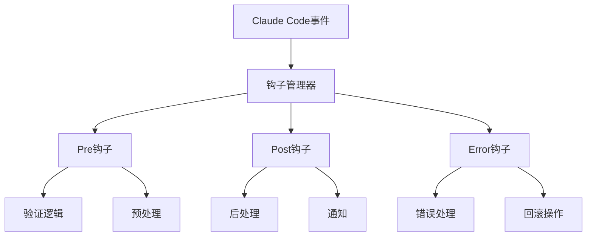

# Claude Code钩子系统详解

## 概述

Claude Code的钩子系统是一个强大的事件驱动机制，允许开发者在特定的生命周期事件中插入自定义逻辑。通过钩子系统，团队可以自动化工作流程、实施质量控制、集成外部工具，并确保开发过程的一致性和可靠性。

## 钩子系统架构

### 核心概念

钩子系统基于事件驱动架构，在Claude Code的各个关键节点提供扩展点：



### 钩子类型

1. **Pre钩子**：在操作执行前触发，用于验证和预处理
2. **Post钩子**：在操作执行后触发，用于后处理和通知
3. **Error钩子**：在操作失败时触发，用于错误处理和恢复
4. **Watch钩子**：持续监控特定条件，用于实时响应

## 1. 内置钩子事件

### 项目生命周期钩子

#### 项目初始化钩子
```bash
# 项目初始化前
before:project:init
# 触发时机：执行 claude init 命令前
# 用途：环境检查、权限验证、依赖检查

# 项目初始化后
after:project:init
# 触发时机：项目初始化完成后
# 用途：默认配置设置、工具安装、团队规范应用
```

#### 项目配置钩子
```bash
# 配置更新前
before:config:update
# 触发时机：修改.claude-config.json前
# 用途：配置验证、备份当前配置

# 配置更新后
after:config:update
# 触发时机：配置文件更新后
# 用途：重新加载配置、通知团队成员
```

### 代码操作钩子

#### 代码生成钩子
```bash
# 代码生成前
before:code:generate
# 触发时机：AI开始生成代码前
# 用途：需求验证、模板选择、上下文准备

# 代码生成后
after:code:generate
# 触发时机：代码生成完成后
# 用途：代码格式化、质量检查、自动测试
```

#### 代码修改钩子
```bash
# 文件修改前
before:file:modify
# 触发时机：修改文件前
# 用途：备份文件、权限检查、冲突检测

# 文件修改后
after:file:modify
# 触发时机：文件修改完成后
# 用途：语法检查、自动格式化、版本控制
```

### Git操作钩子

#### 提交钩子
```bash
# 提交前
before:git:commit
# 触发时机：执行git commit前
# 用途：代码检查、测试运行、格式化

# 提交后
after:git:commit
# 触发时机：提交完成后
# 用途：通知、部署触发、统计更新
```

#### 推送钩子
```bash
# 推送前
before:git:push
# 触发时机：执行git push前
# 用途：最终检查、权限验证、冲突检测

# 推送后
after:git:push
# 触发时机：推送完成后
# 用途：CI/CD触发、团队通知、部署启动
```

## 2. 钩子配置和管理

### 钩子配置文件

#### 基础配置
```json
{
  "hooks": {
    "enabled": true,
    "timeout": 30000,
    "parallel": false,
    
    "before:code:generate": [
      {
        "name": "validate-requirements",
        "script": "./hooks/validate-requirements.js",
        "enabled": true,
        "timeout": 5000
      },
      {
        "name": "check-permissions",
        "script": "./hooks/check-permissions.js",
        "enabled": true,
        "async": false
      }
    ],
    
    "after:code:generate": [
      {
        "name": "format-code",
        "script": "./hooks/format-code.js",
        "enabled": true,
        "priority": 1
      },
      {
        "name": "run-tests",
        "script": "./hooks/run-tests.js",
        "enabled": true,
        "priority": 2,
        "conditions": {
          "file_types": ["*.js", "*.ts"],
          "directories": ["src/", "lib/"]
        }
      }
    ],
    
    "error:any": [
      {
        "name": "error-notification",
        "script": "./hooks/notify-error.js",
        "enabled": true
      }
    ]
  }
}
```

### 钩子脚本开发

#### 基础钩子脚本
```javascript
// hooks/validate-requirements.js
module.exports = async function validateRequirements(context) {
  const { event, data, config } = context;
  
  console.log(`🔍 验证需求 - 事件: ${event}`);
  
  try {
    // 获取生成请求
    const request = data.request;
    
    // 验证需求完整性
    if (!request.description || request.description.length < 10) {
      throw new Error('需求描述过于简单，请提供更详细的描述');
    }
    
    // 验证技术栈兼容性
    if (request.technology) {
      await validateTechnologyStack(request.technology);
    }
    
    // 验证团队规范
    await validateTeamStandards(request);
    
    console.log('✅ 需求验证通过');
    
    return {
      success: true,
      message: '需求验证通过',
      data: {
        validated: true,
        timestamp: new Date().toISOString()
      }
    };
    
  } catch (error) {
    console.error('❌ 需求验证失败:', error.message);
    
    return {
      success: false,
      error: error.message,
      suggestions: [
        '请提供更详细的需求描述',
        '确认技术栈选择是否合适',
        '检查是否符合团队开发规范'
      ]
    };
  }
};

async function validateTechnologyStack(technology) {
  const supportedTech = ['javascript', 'typescript', 'python', 'java', 'go'];
  
  if (!supportedTech.includes(technology.toLowerCase())) {
    throw new Error(`不支持的技术栈: ${technology}`);
  }
}

async function validateTeamStandards(request) {
  // 检查命名规范
  if (request.naming && !isValidNaming(request.naming)) {
    throw new Error('命名不符合团队规范');
  }
  
  // 检查架构模式
  if (request.pattern && !isSupportedPattern(request.pattern)) {
    throw new Error('不支持的架构模式');
  }
}
```

#### 高级钩子脚本
```javascript
// hooks/quality-gate.js
const { execSync } = require('child_process');
const fs = require('fs');
const path = require('path');

class QualityGateHook {
  constructor() {
    this.qualityConfig = this.loadQualityConfig();
  }

  async execute(context) {
    const { event, data } = context;
    
    console.log('🚦 执行质量门禁检查...');
    
    try {
      const results = await this.runQualityChecks(data);
      
      if (!results.passed) {
        return this.handleQualityFailure(results);
      }
      
      return this.handleQualitySuccess(results);
      
    } catch (error) {
      return this.handleError(error);
    }
  }

  async runQualityChecks(data) {
    const checks = [];
    
    // 代码质量检查
    if (this.qualityConfig.codeQuality.enabled) {
      checks.push(this.checkCodeQuality(data));
    }
    
    // 安全检查
    if (this.qualityConfig.security.enabled) {
      checks.push(this.checkSecurity(data));
    }
    
    // 性能检查
    if (this.qualityConfig.performance.enabled) {
      checks.push(this.checkPerformance(data));
    }
    
    // 测试覆盖率检查
    if (this.qualityConfig.coverage.enabled) {
      checks.push(this.checkTestCoverage(data));
    }
    
    const results = await Promise.all(checks);
    
    return {
      passed: results.every(r => r.passed),
      results: results,
      score: this.calculateQualityScore(results)
    };
  }

  async checkCodeQuality(data) {
    try {
      // 运行ESLint
      const lintResult = execSync('npx eslint src/ --format json', { 
        encoding: 'utf8',
        cwd: process.cwd()
      });
      
      const lintData = JSON.parse(lintResult);
      const errorCount = lintData.reduce((sum, file) => sum + file.errorCount, 0);
      const warningCount = lintData.reduce((sum, file) => sum + file.warningCount, 0);
      
      return {
        name: 'code-quality',
        passed: errorCount === 0 && warningCount <= this.qualityConfig.codeQuality.maxWarnings,
        details: {
          errors: errorCount,
          warnings: warningCount,
          files: lintData.length
        }
      };
      
    } catch (error) {
      return {
        name: 'code-quality',
        passed: false,
        error: error.message
      };
    }
  }

  async checkSecurity(data) {
    try {
      // 运行安全扫描
      const auditResult = execSync('npm audit --json', { 
        encoding: 'utf8',
        cwd: process.cwd()
      });
      
      const auditData = JSON.parse(auditResult);
      const highVulns = auditData.metadata.vulnerabilities.high || 0;
      const criticalVulns = auditData.metadata.vulnerabilities.critical || 0;
      
      return {
        name: 'security',
        passed: highVulns === 0 && criticalVulns === 0,
        details: {
          high: highVulns,
          critical: criticalVulns,
          total: auditData.metadata.vulnerabilities.total
        }
      };
      
    } catch (error) {
      return {
        name: 'security',
        passed: true, // 如果扫描失败，不阻止流程
        warning: '安全扫描失败，请手动检查'
      };
    }
  }

  async checkTestCoverage(data) {
    try {
      // 运行测试覆盖率检查
      const coverageResult = execSync('npm test -- --coverage --coverageReporters=json', {
        encoding: 'utf8',
        cwd: process.cwd()
      });
      
      const coveragePath = path.join(process.cwd(), 'coverage/coverage-final.json');
      
      if (fs.existsSync(coveragePath)) {
        const coverageData = JSON.parse(fs.readFileSync(coveragePath, 'utf8'));
        const totalCoverage = this.calculateTotalCoverage(coverageData);
        
        return {
          name: 'test-coverage',
          passed: totalCoverage >= this.qualityConfig.coverage.minimum,
          details: {
            coverage: totalCoverage,
            minimum: this.qualityConfig.coverage.minimum
          }
        };
      }
      
      return {
        name: 'test-coverage',
        passed: false,
        error: '无法获取覆盖率数据'
      };
      
    } catch (error) {
      return {
        name: 'test-coverage',
        passed: false,
        error: error.message
      };
    }
  }

  handleQualityFailure(results) {
    const failedChecks = results.results.filter(r => !r.passed);
    
    return {
      success: false,
      message: '质量门禁检查失败',
      details: {
        score: results.score,
        failedChecks: failedChecks,
        suggestions: this.generateSuggestions(failedChecks)
      },
      block: true // 阻止后续操作
    };
  }

  handleQualitySuccess(results) {
    return {
      success: true,
      message: '质量门禁检查通过',
      details: {
        score: results.score,
        checks: results.results.length
      }
    };
  }

  loadQualityConfig() {
    const configPath = path.join(process.cwd(), '.quality-config.json');
    
    if (fs.existsSync(configPath)) {
      return JSON.parse(fs.readFileSync(configPath, 'utf8'));
    }
    
    // 默认配置
    return {
      codeQuality: {
        enabled: true,
        maxWarnings: 5
      },
      security: {
        enabled: true,
        allowHigh: false,
        allowCritical: false
      },
      performance: {
        enabled: false
      },
      coverage: {
        enabled: true,
        minimum: 80
      }
    };
  }
}

module.exports = async function qualityGateHook(context) {
  const hook = new QualityGateHook();
  return await hook.execute(context);
};
```

## 3. 常用钩子实现

### Git工作流钩子

#### Pre-commit钩子
```javascript
// hooks/pre-commit.js
module.exports = async function preCommitHook(context) {
  console.log('🔍 执行提交前检查...');
  
  const checks = [
    checkStagedFiles,
    runLinter,
    runTests,
    checkCommitMessage,
    checkBranchNaming
  ];
  
  for (const check of checks) {
    const result = await check(context);
    if (!result.success) {
      return result;
    }
  }
  
  return {
    success: true,
    message: '提交前检查通过'
  };
};

async function checkStagedFiles(context) {
  const { execSync } = require('child_process');
  
  try {
    const stagedFiles = execSync('git diff --cached --name-only', { encoding: 'utf8' });
    
    if (!stagedFiles.trim()) {
      return {
        success: false,
        message: '没有暂存的文件'
      };
    }
    
    // 检查文件类型
    const files = stagedFiles.trim().split('\n');
    const invalidFiles = files.filter(file => 
      file.includes('node_modules/') || 
      file.includes('.env') ||
      file.endsWith('.log')
    );
    
    if (invalidFiles.length > 0) {
      return {
        success: false,
        message: `包含不应提交的文件: ${invalidFiles.join(', ')}`
      };
    }
    
    return { success: true };
    
  } catch (error) {
    return {
      success: false,
      message: `检查暂存文件失败: ${error.message}`
    };
  }
}

async function runLinter(context) {
  const { execSync } = require('child_process');
  
  try {
    console.log('  📝 运行代码检查...');
    execSync('npm run lint', { stdio: 'pipe' });
    
    return { success: true };
    
  } catch (error) {
    return {
      success: false,
      message: '代码检查失败，请修复后重新提交',
      details: error.stdout?.toString() || error.message
    };
  }
}

async function runTests(context) {
  const { execSync } = require('child_process');
  
  try {
    console.log('  🧪 运行测试...');
    execSync('npm test', { stdio: 'pipe' });
    
    return { success: true };
    
  } catch (error) {
    return {
      success: false,
      message: '测试失败，请修复后重新提交',
      details: error.stdout?.toString() || error.message
    };
  }
}
```

#### Post-merge钩子
```javascript
// hooks/post-merge.js
module.exports = async function postMergeHook(context) {
  console.log('🔄 执行合并后处理...');
  
  const tasks = [
    updateDependencies,
    runMigrations,
    updateDocumentation,
    notifyTeam
  ];
  
  const results = [];
  
  for (const task of tasks) {
    try {
      const result = await task(context);
      results.push(result);
    } catch (error) {
      console.error(`任务执行失败: ${error.message}`);
      results.push({
        success: false,
        task: task.name,
        error: error.message
      });
    }
  }
  
  return {
    success: true,
    message: '合并后处理完成',
    results: results
  };
};

async function updateDependencies(context) {
  const { execSync } = require('child_process');
  const fs = require('fs');
  
  // 检查package.json是否有变化
  try {
    const diff = execSync('git diff HEAD~1 HEAD --name-only', { encoding: 'utf8' });
    
    if (diff.includes('package.json') || diff.includes('package-lock.json')) {
      console.log('  📦 更新依赖...');
      execSync('npm install', { stdio: 'inherit' });
      
      return {
        success: true,
        task: 'update-dependencies',
        message: '依赖更新完成'
      };
    }
    
    return {
      success: true,
      task: 'update-dependencies',
      message: '无需更新依赖'
    };
    
  } catch (error) {
    throw new Error(`依赖更新失败: ${error.message}`);
  }
}

async function runMigrations(context) {
  const fs = require('fs');
  const path = require('path');
  
  // 检查是否有新的迁移文件
  const migrationsDir = path.join(process.cwd(), 'migrations');
  
  if (fs.existsSync(migrationsDir)) {
    console.log('  🗄️ 运行数据库迁移...');
    
    try {
      const { execSync } = require('child_process');
      execSync('npm run migrate', { stdio: 'inherit' });
      
      return {
        success: true,
        task: 'run-migrations',
        message: '数据库迁移完成'
      };
      
    } catch (error) {
      throw new Error(`数据库迁移失败: ${error.message}`);
    }
  }
  
  return {
    success: true,
    task: 'run-migrations',
    message: '无需运行迁移'
  };
}
```

### 部署钩子

#### Pre-deploy钩子
```javascript
// hooks/pre-deploy.js
module.exports = async function preDeployHook(context) {
  console.log('🚀 执行部署前检查...');
  
  const { environment, version } = context.data;
  
  const checks = [
    () => checkEnvironment(environment),
    () => checkVersion(version),
    () => runHealthChecks(),
    () => checkDependencies(),
    () => validateConfiguration(environment)
  ];
  
  for (const check of checks) {
    const result = await check();
    if (!result.success) {
      return result;
    }
  }
  
  return {
    success: true,
    message: '部署前检查通过',
    readyToDeploy: true
  };
};

async function checkEnvironment(environment) {
  const validEnvironments = ['development', 'staging', 'production'];
  
  if (!validEnvironments.includes(environment)) {
    return {
      success: false,
      message: `无效的部署环境: ${environment}`
    };
  }
  
  // 生产环境额外检查
  if (environment === 'production') {
    const approvalRequired = await checkProductionApproval();
    if (!approvalRequired.success) {
      return approvalRequired;
    }
  }
  
  return { success: true };
}

async function checkVersion(version) {
  if (!version || !version.match(/^\d+\.\d+\.\d+$/)) {
    return {
      success: false,
      message: '版本号格式无效，应为 x.y.z 格式'
    };
  }
  
  // 检查版本是否已存在
  const { execSync } = require('child_process');
  
  try {
    const tags = execSync('git tag', { encoding: 'utf8' });
    if (tags.includes(version)) {
      return {
        success: false,
        message: `版本 ${version} 已存在`
      };
    }
  } catch (error) {
    console.warn('无法检查Git标签');
  }
  
  return { success: true };
}

async function runHealthChecks() {
  console.log('  🏥 运行健康检查...');
  
  const checks = [
    checkDatabaseConnection,
    checkExternalServices,
    checkResourceAvailability
  ];
  
  for (const check of checks) {
    const result = await check();
    if (!result.success) {
      return result;
    }
  }
  
  return { success: true };
}
```

## 4. 钩子调试和监控

### 钩子调试

#### 调试配置
```json
{
  "hooks": {
    "debug": {
      "enabled": true,
      "logLevel": "debug",
      "logFile": "./logs/hooks.log",
      "traceExecution": true
    }
  }
}
```

#### 调试工具
```javascript
// hooks/debug-utils.js
class HookDebugger {
  constructor(hookName) {
    this.hookName = hookName;
    this.startTime = Date.now();
    this.logs = [];
  }

  log(level, message, data = null) {
    const logEntry = {
      timestamp: new Date().toISOString(),
      level: level,
      hook: this.hookName,
      message: message,
      data: data,
      duration: Date.now() - this.startTime
    };
    
    this.logs.push(logEntry);
    
    if (process.env.HOOK_DEBUG === 'true') {
      console.log(`[${level.toUpperCase()}] ${this.hookName}: ${message}`);
      if (data) {
        console.log('  Data:', JSON.stringify(data, null, 2));
      }
    }
  }

  error(message, error) {
    this.log('error', message, {
      error: error.message,
      stack: error.stack
    });
  }

  info(message, data) {
    this.log('info', message, data);
  }

  debug(message, data) {
    this.log('debug', message, data);
  }

  getReport() {
    return {
      hook: this.hookName,
      duration: Date.now() - this.startTime,
      logs: this.logs,
      success: !this.logs.some(log => log.level === 'error')
    };
  }
}

module.exports = HookDebugger;
```

### 钩子监控

#### 性能监控
```javascript
// hooks/performance-monitor.js
class HookPerformanceMonitor {
  constructor() {
    this.metrics = new Map();
  }

  startHook(hookName, event) {
    const key = `${hookName}:${event}`;
    this.metrics.set(key, {
      startTime: Date.now(),
      memoryStart: process.memoryUsage(),
      event: event
    });
  }

  endHook(hookName, event, success = true) {
    const key = `${hookName}:${event}`;
    const metric = this.metrics.get(key);
    
    if (metric) {
      const endTime = Date.now();
      const memoryEnd = process.memoryUsage();
      
      const performance = {
        hook: hookName,
        event: event,
        duration: endTime - metric.startTime,
        memoryUsage: {
          heapUsed: memoryEnd.heapUsed - metric.memoryStart.heapUsed,
          heapTotal: memoryEnd.heapTotal - metric.memoryStart.heapTotal
        },
        success: success,
        timestamp: new Date().toISOString()
      };
      
      this.recordPerformance(performance);
      this.metrics.delete(key);
    }
  }

  recordPerformance(performance) {
    // 记录到文件或数据库
    console.log(`钩子性能: ${performance.hook} - ${performance.duration}ms`);
    
    // 性能告警
    if (performance.duration > 10000) {
      console.warn(`钩子 ${performance.hook} 执行时间过长: ${performance.duration}ms`);
    }
    
    if (performance.memoryUsage.heapUsed > 50 * 1024 * 1024) {
      console.warn(`钩子 ${performance.hook} 内存使用过多: ${performance.memoryUsage.heapUsed / 1024 / 1024}MB`);
    }
  }
}
```

## 5. 钩子最佳实践

### 设计原则

#### 1. 单一职责
```javascript
// 好的做法：专注单一任务
module.exports = async function formatCodeHook(context) {
  // 只负责代码格式化
  return await formatCode(context.data.files);
};

// 避免：在一个钩子中处理多个不相关的任务
module.exports = async function badHook(context) {
  await formatCode(context.data.files);
  await runTests();
  await sendNotification();
  await updateDatabase();
};
```

#### 2. 错误处理
```javascript
module.exports = async function robustHook(context) {
  try {
    const result = await performTask(context);
    
    return {
      success: true,
      data: result
    };
    
  } catch (error) {
    // 记录错误
    console.error(`钩子执行失败: ${error.message}`);
    
    // 决定是否阻止流程
    const shouldBlock = error.severity === 'critical';
    
    return {
      success: !shouldBlock,
      error: error.message,
      block: shouldBlock
    };
  }
};
```

#### 3. 性能优化
```javascript
module.exports = async function optimizedHook(context) {
  // 早期退出
  if (!shouldExecute(context)) {
    return { success: true, skipped: true };
  }
  
  // 并行处理
  const tasks = getTasks(context);
  const results = await Promise.all(
    tasks.map(task => processTask(task))
  );
  
  // 缓存结果
  await cacheResults(results);
  
  return {
    success: true,
    results: results
  };
};
```

### 团队协作

#### 钩子文档
```markdown
# 团队钩子规范

## 钩子命名规范
- 使用kebab-case命名
- 包含动作和对象：`validate-code-quality`
- 避免缩写：`check-test-coverage` 而不是 `chk-test-cov`

## 钩子开发规范
1. 每个钩子必须有详细的文档说明
2. 必须包含错误处理逻辑
3. 执行时间不应超过30秒
4. 必须支持dry-run模式

## 钩子测试规范
1. 每个钩子必须有对应的测试用例
2. 测试覆盖率不低于80%
3. 必须测试错误场景
```

#### 钩子共享
```javascript
// shared-hooks/team-standards.js
const teamHooks = {
  // 代码质量检查
  codeQuality: require('./code-quality-check'),
  
  // 安全检查
  security: require('./security-scan'),
  
  // 性能检查
  performance: require('./performance-check'),
  
  // 通知系统
  notification: require('./team-notification')
};

module.exports = teamHooks;
```

## 6. 高级钩子功能

### 条件钩子

#### 基于条件的钩子执行
```javascript
// hooks/conditional-hook.js
module.exports = {
  conditions: {
    // 文件类型条件
    fileTypes: ['*.js', '*.ts', '*.jsx', '*.tsx'],
    
    // 目录条件
    directories: ['src/', 'lib/', 'components/'],
    
    // 分支条件
    branches: ['main', 'develop', 'release/*'],
    
    // 环境条件
    environments: ['production', 'staging'],
    
    // 自定义条件函数
    custom: async (context) => {
      return context.data.files.length > 5;
    }
  },
  
  async execute(context) {
    // 钩子执行逻辑
    return { success: true };
  }
};
```

### 钩子链

#### 钩子组合和链式执行
```javascript
// hooks/hook-chain.js
class HookChain {
  constructor() {
    this.hooks = [];
  }

  add(hook, options = {}) {
    this.hooks.push({
      hook: hook,
      options: options
    });
    return this;
  }

  async execute(context) {
    const results = [];
    
    for (const { hook, options } of this.hooks) {
      try {
        const result = await hook(context);
        results.push(result);
        
        // 如果钩子失败且设置为阻断，停止执行
        if (!result.success && options.stopOnFailure) {
          break;
        }
        
        // 将结果传递给下一个钩子
        if (options.passResult) {
          context.previousResult = result;
        }
        
      } catch (error) {
        results.push({
          success: false,
          error: error.message
        });
        
        if (options.stopOnError) {
          break;
        }
      }
    }
    
    return {
      success: results.every(r => r.success),
      results: results
    };
  }
}

// 使用示例
const chain = new HookChain()
  .add(validateCodeHook, { stopOnFailure: true })
  .add(formatCodeHook, { passResult: true })
  .add(runTestsHook, { stopOnFailure: true })
  .add(notifyTeamHook);

module.exports = chain;
```

## 总结

Claude Code的钩子系统为团队提供了强大的自动化和定制能力：

1. **全面的生命周期覆盖**：从项目初始化到部署的各个环节
2. **灵活的配置机制**：支持条件执行、优先级控制、并行处理
3. **强大的扩展能力**：可以集成任何外部工具和服务
4. **完善的监控调试**：提供性能监控和调试工具
5. **团队协作支持**：标准化的开发和共享机制

通过合理使用钩子系统，团队可以实现工作流程的自动化、质量控制的标准化、以及开发过程的一致性，显著提升开发效率和代码质量。

---

*钩子系统是实现Team Vibe Coding的重要工具。通过在关键节点插入自定义逻辑，团队可以确保每个开发步骤都符合标准，每个交付都达到质量要求。*