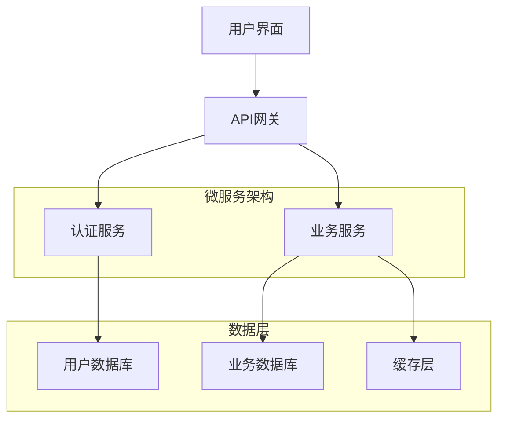
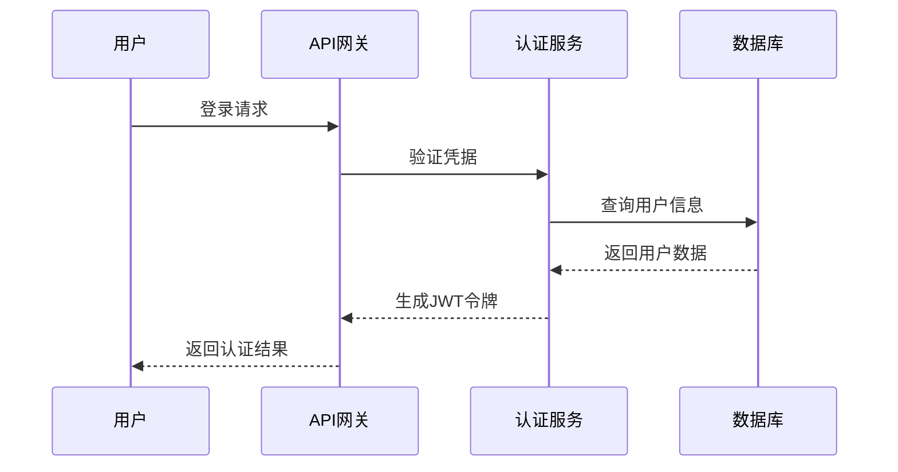
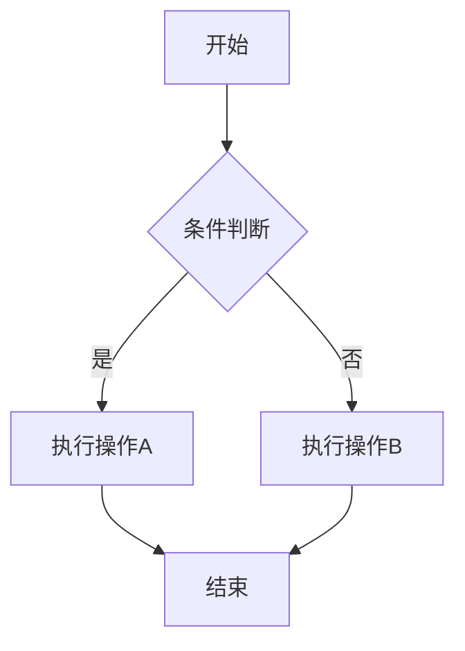

# Claude Code 输出样式详解

## 概述

Claude Code 提供了丰富的输出样式选项，让开发者能够根据不同的使用场景和个人偏好，定制AI助手的响应格式。通过合理配置输出样式，可以显著提升开发效率和用户体验。

## 1. 基础输出样式

### 代码输出格式

#### 标准代码块
```typescript
// 默认输出格式
function calculateSum(a: number, b: number): number {
  return a + b;
}
```

#### 带行号的代码块
```typescript {1,3-5}
1  function calculateSum(a: number, b: number): number {
2    // 计算两个数的和
3    return a + b;
4  }
5  
```

#### 差异对比格式
```diff
- function calculateSum(a, b) {
+ function calculateSum(a: number, b: number): number {
-   return a + b;
+   return a + b;
  }
```

### 文档输出格式

#### Markdown 标准格式
```markdown
# API 文档

## 函数说明
- **函数名**: `calculateSum`
- **参数**: `a: number`, `b: number`
- **返回值**: `number`
```

#### JSDoc 格式
```javascript
/**
 * 计算两个数字的和
 * @param {number} a - 第一个数字
 * @param {number} b - 第二个数字
 * @returns {number} 两个数字的和
 * @example
 * const result = calculateSum(5, 3); // 返回 8
 */
function calculateSum(a, b) {
  return a + b;
}
```

## 2. 交互式输出样式

### 步骤式输出

#### 任务分解格式
```
🎯 任务: 实现用户认证功能

📋 步骤分解:
┌─ 1. 设计数据库模型
├─ 2. 实现用户注册接口
├─ 3. 实现登录验证逻辑
├─ 4. 添加JWT令牌管理
└─ 5. 编写单元测试

⏱️  预估时间: 4-6小时
🔧 所需技能: Node.js, JWT, 数据库设计
```

#### 进度追踪格式
```
📊 开发进度

✅ 数据库模型设计      [████████████████████] 100%
🔄 用户注册接口        [████████████░░░░░░░░] 60%
⏳ 登录验证逻辑        [░░░░░░░░░░░░░░░░░░░░] 0%
⏳ JWT令牌管理         [░░░░░░░░░░░░░░░░░░░░] 0%
⏳ 单元测试           [░░░░░░░░░░░░░░░░░░░░] 0%

🎯 总体进度: 32% 完成
```

### 决策树输出

#### 技术选择指导
```
🤔 技术选择决策树

数据库选择:
├─ 关系型数据库需求?
│  ├─ 是 → PostgreSQL (推荐) / MySQL
│  └─ 否 → MongoDB / Redis
│
├─ 高并发需求?
│  ├─ 是 → 考虑分库分表 + 缓存层
│  └─ 否 → 单实例部署即可
│
└─ 数据一致性要求?
   ├─ 强一致性 → ACID事务支持
   └─ 最终一致性 → NoSQL + 异步处理
```

## 3. 专业输出样式

### 架构图输出

#### 系统架构图


#### 数据流图


### 代码审查输出

#### 问题分类格式
```
🔍 代码审查报告

🚨 严重问题 (2个)
├─ 安全漏洞: SQL注入风险 (line 45)
└─ 性能问题: N+1查询问题 (line 78)

⚠️  一般问题 (3个)
├─ 代码规范: 变量命名不规范 (line 12)
├─ 可维护性: 函数过长 (line 34-89)
└─ 测试覆盖: 缺少边界条件测试

💡 建议改进 (5个)
├─ 重构建议: 提取公共方法
├─ 性能优化: 添加缓存机制
├─ 文档完善: 补充API文档
├─ 错误处理: 增加异常捕获
└─ 日志记录: 添加关键操作日志
```

### 测试报告输出

#### 测试结果格式
```
🧪 测试执行报告

📊 测试统计
┌─────────────────┬─────────┬─────────┬─────────┐
│ 测试套件        │ 总数    │ 通过    │ 失败    │
├─────────────────┼─────────┼─────────┼─────────┤
│ 单元测试        │ 156     │ 154     │ 2       │
│ 集成测试        │ 43      │ 41      │ 2       │
│ 端到端测试      │ 28      │ 26      │ 2       │
└─────────────────┴─────────┴─────────┴─────────┘

🎯 覆盖率统计
├─ 语句覆盖率: 87.5%
├─ 分支覆盖率: 82.3%
├─ 函数覆盖率: 91.2%
└─ 行覆盖率: 85.7%

❌ 失败测试详情
1. UserService.test.ts:45 - 用户注册验证失败
2. AuthController.test.ts:78 - JWT令牌过期处理
```

## 4. 自定义输出样式

### 样式配置

#### 全局样式配置
```json
{
  "outputStyles": {
    "codeBlocks": {
      "showLineNumbers": true,
      "highlightChanges": true,
      "theme": "github-dark"
    },
    "documentation": {
      "format": "markdown",
      "includeExamples": true,
      "generateTOC": true
    },
    "reports": {
      "useEmojis": true,
      "colorOutput": true,
      "verboseMode": false
    },
    "interactive": {
      "showProgress": true,
      "useAnimations": false,
      "confirmActions": true
    }
  }
}
```

#### 项目级样式配置
```json
{
  "claude-code": {
    "outputPreferences": {
      "defaultLanguage": "typescript",
      "codeStyle": "detailed",
      "documentationLevel": "comprehensive",
      "reportFormat": "structured"
    },
    "teamSettings": {
      "useCompanyTemplates": true,
      "enforceStyleGuide": true,
      "customPrompts": "./prompts/"
    }
  }
}
```

### 模板系统

#### 代码生成模板
```typescript
// 模板: component-template.ts
export interface {{ComponentName}}Props {
  {{#each props}}
  {{name}}: {{type}};
  {{/each}}
}

export const {{ComponentName}}: React.FC<{{ComponentName}}Props> = ({
  {{#each props}}{{name}}{{#unless @last}}, {{/unless}}{{/each}}
}) => {
  return (
    <div className="{{kebabCase componentName}}">
      {/* TODO: 实现组件逻辑 */}
    </div>
  );
};
```

#### 文档生成模板
```markdown
# {{title}}

## 概述
{{description}}

## API 参考

{{#each methods}}
### {{name}}

**描述**: {{description}}

**参数**:
{{#each parameters}}
- `{{name}}` ({{type}}): {{description}}
{{/each}}

**返回值**: {{returnType}}

**示例**:
```{{language}}
{{example}}
```
{{/each}}
```

## 5. 输出优化策略

### 性能优化

#### 流式输出
```typescript
// 启用流式输出，提升响应速度
const config = {
  streaming: {
    enabled: true,
    chunkSize: 1024,
    bufferTimeout: 100
  }
};

// 使用示例
claude.generateCode({
  prompt: "创建React组件",
  streaming: true,
  onChunk: (chunk) => {
    console.log(chunk); // 实时显示生成内容
  }
});
```

#### 缓存机制
```typescript
// 输出缓存配置
const cacheConfig = {
  enabled: true,
  ttl: 3600, // 1小时
  maxSize: 100, // 最多缓存100个结果
  keyStrategy: "content-hash" // 基于内容哈希的缓存键
};
```

### 可读性优化

#### 语法高亮配置
```json
{
  "syntaxHighlighting": {
    "theme": "monokai",
    "languages": ["typescript", "javascript", "python", "go"],
    "customColors": {
      "keyword": "#ff6b6b",
      "string": "#4ecdc4",
      "comment": "#95a5a6"
    }
  }
}
```

#### 格式化选项
```json
{
  "formatting": {
    "indentSize": 2,
    "maxLineLength": 100,
    "insertFinalNewline": true,
    "trimTrailingWhitespace": true,
    "bracketSpacing": true,
    "semicolons": true
  }
}
```

## 6. 输出样式最佳实践

### 场景选择指南

#### 开发阶段样式选择
```
📋 开发阶段 → 推荐样式

🚀 项目初始化
├─ 架构图输出: 系统设计可视化
├─ 任务分解: 步骤式输出
└─ 技术选型: 决策树格式

💻 编码开发
├─ 代码生成: 标准代码块 + 注释
├─ 重构建议: 差异对比格式
└─ 调试信息: 结构化日志输出

🔍 代码审查
├─ 问题报告: 分类格式
├─ 改进建议: 优先级排序
└─ 质量指标: 图表化展示

🧪 测试阶段
├─ 测试报告: 表格化统计
├─ 覆盖率分析: 进度条显示
└─ 性能分析: 图表化输出

🚀 部署发布
├─ 部署清单: 检查列表格式
├─ 监控报告: 实时数据展示
└─ 回滚计划: 步骤式指南
```

### 团队协作优化

#### 统一样式标准
```json
{
  "teamStandards": {
    "codeReview": {
      "format": "structured-report",
      "includeMetrics": true,
      "severityLevels": ["critical", "major", "minor", "suggestion"]
    },
    "documentation": {
      "template": "company-standard",
      "language": "zh-CN",
      "includeExamples": true
    },
    "reports": {
      "useEmojis": false, // 正式环境禁用表情符号
      "colorScheme": "professional",
      "exportFormats": ["markdown", "pdf"]
    }
  }
}
```

### 可访问性考虑

#### 无障碍输出选项
```json
{
  "accessibility": {
    "screenReader": {
      "enabled": true,
      "verboseDescriptions": true,
      "skipDecorations": true
    },
    "visualImpairment": {
      "highContrast": true,
      "largeText": true,
      "colorBlindFriendly": true
    },
    "cognitiveLoad": {
      "simplifiedLanguage": true,
      "stepByStep": true,
      "clearStructure": true
    }
  }
}
```

## 7. 高级输出功能

### 交互式输出

#### 可折叠内容
```markdown
<details>
<summary>🔍 详细实现代码</summary>

```typescript
// 完整的实现代码
class UserService {
  // ... 详细实现
}
```

</details>
```

#### 选项卡式输出
```markdown
## 实现方案

### 方案A: 微服务架构
```typescript
// 微服务实现
```

### 方案B: 单体架构
```typescript
// 单体实现
```

### 方案C: 混合架构
```typescript
// 混合实现
```
```

### 多媒体输出

#### 图表生成
```typescript
// 生成性能分析图表
const chartConfig = {
  type: 'line',
  data: performanceData,
  options: {
    title: 'API响应时间趋势',
    xAxis: '时间',
    yAxis: '响应时间(ms)'
  }
};
```

#### 流程图生成


## 总结

Claude Code的输出样式系统提供了强大的定制能力，通过合理配置和使用：

1. **提升可读性**：清晰的格式化和语法高亮
2. **增强交互性**：进度追踪和步骤式指导
3. **优化协作**：统一的团队标准和模板
4. **支持多场景**：从开发到部署的全流程支持
5. **保证可访问性**：考虑不同用户的特殊需求

选择合适的输出样式不仅能提升开发效率，还能改善团队协作体验，是Claude Code使用中的重要环节。