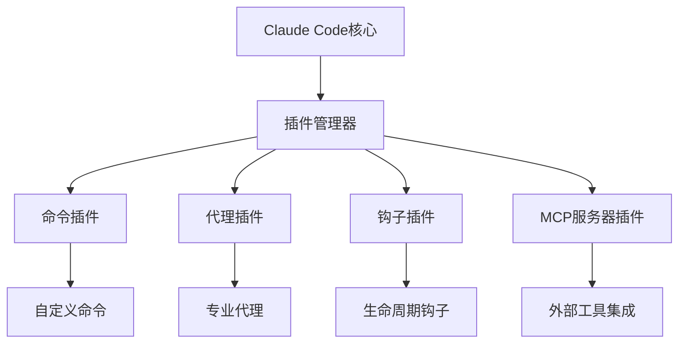

# Claude Code插件系统详解

## 概述

Claude Code的插件系统是其可扩展性的核心，允许开发者和团队通过自定义插件来扩展功能、集成外部工具和优化工作流程。插件系统提供了灵活的架构，支持多种类型的扩展，从简单的命令到复杂的AI代理。

## 插件系统架构

### 核心组件



### 插件类型

1. **命令插件**：扩展Claude Code的命令集
2. **代理插件**：添加专业化的AI代理
3. **钩子插件**：在特定事件时执行自定义逻辑
4. **MCP服务器插件**：集成外部工具和服务

## 1. 命令插件开发

### 基础命令插件

#### 插件结构
```javascript
// plugins/my-command/index.js
module.exports = {
  name: 'my-custom-command',
  version: '1.0.0',
  description: '自定义命令插件示例',
  
  // 命令定义
  commands: {
    'deploy-staging': {
      description: '部署到测试环境',
      usage: 'claude deploy-staging [options]',
      options: {
        '--force': '强制部署',
        '--dry-run': '模拟部署'
      },
      handler: async (args, options) => {
        // 命令实现逻辑
        return await deployToStaging(args, options);
      }
    }
  },
  
  // 插件初始化
  async initialize(context) {
    console.log('自定义命令插件已加载');
  }
};
```

#### 命令实现示例
```javascript
// plugins/deployment/commands.js
const { execSync } = require('child_process');
const fs = require('fs');

class DeploymentCommands {
  constructor(context) {
    this.context = context;
  }

  async deployStaging(args, options) {
    try {
      // 1. 预检查
      await this.preDeploymentCheck();
      
      // 2. 构建应用
      if (!options['--skip-build']) {
        console.log('🔨 构建应用...');
        execSync('npm run build', { stdio: 'inherit' });
      }
      
      // 3. 运行测试
      if (!options['--skip-tests']) {
        console.log('🧪 运行测试...');
        execSync('npm test', { stdio: 'inherit' });
      }
      
      // 4. 部署到测试环境
      console.log('🚀 部署到测试环境...');
      if (options['--dry-run']) {
        console.log('模拟部署完成');
        return { success: true, dryRun: true };
      }
      
      await this.executeDeploy('staging');
      
      // 5. 健康检查
      await this.healthCheck('staging');
      
      return { 
        success: true, 
        environment: 'staging',
        deploymentId: this.generateDeploymentId()
      };
      
    } catch (error) {
      console.error('部署失败:', error.message);
      throw error;
    }
  }

  async preDeploymentCheck() {
    // 检查环境变量
    const requiredEnvs = ['STAGING_API_URL', 'STAGING_DB_URL'];
    for (const env of requiredEnvs) {
      if (!process.env[env]) {
        throw new Error(`缺少环境变量: ${env}`);
      }
    }
    
    // 检查Git状态
    const gitStatus = execSync('git status --porcelain', { encoding: 'utf8' });
    if (gitStatus.trim() && !process.env.ALLOW_DIRTY_DEPLOY) {
      throw new Error('Git工作目录不干净，请提交或暂存更改');
    }
  }

  async executeDeploy(environment) {
    // 实际部署逻辑
    const deployScript = `./scripts/deploy-${environment}.sh`;
    if (fs.existsSync(deployScript)) {
      execSync(deployScript, { stdio: 'inherit' });
    } else {
      // 使用默认部署方法
      await this.defaultDeploy(environment);
    }
  }

  async healthCheck(environment) {
    const healthUrl = process.env[`${environment.toUpperCase()}_HEALTH_URL`];
    if (!healthUrl) return;
    
    console.log('🏥 执行健康检查...');
    // 健康检查逻辑
    const response = await fetch(healthUrl);
    if (!response.ok) {
      throw new Error(`健康检查失败: ${response.status}`);
    }
    console.log('✅ 健康检查通过');
  }

  generateDeploymentId() {
    return `deploy-${Date.now()}-${Math.random().toString(36).substr(2, 9)}`;
  }
}

module.exports = DeploymentCommands;
```

### 高级命令插件

#### 交互式命令
```javascript
// plugins/interactive/setup-wizard.js
const inquirer = require('inquirer');

class SetupWizard {
  async run() {
    console.log('🧙‍♂️ Claude Code项目设置向导');
    
    const answers = await inquirer.prompt([
      {
        type: 'list',
        name: 'projectType',
        message: '选择项目类型:',
        choices: [
          'React应用',
          'Node.js API',
          'Python Web应用',
          'Go微服务',
          '其他'
        ]
      },
      {
        type: 'checkbox',
        name: 'features',
        message: '选择需要的功能:',
        choices: [
          'TypeScript支持',
          'ESLint配置',
          'Prettier格式化',
          'Jest测试框架',
          'Docker配置',
          'CI/CD流水线'
        ]
      },
      {
        type: 'input',
        name: 'teamSize',
        message: '团队规模 (人数):',
        validate: (input) => {
          const num = parseInt(input);
          return num > 0 ? true : '请输入有效的团队规模';
        }
      }
    ]);
    
    // 根据选择生成配置
    await this.generateProjectConfig(answers);
    
    console.log('✅ 项目设置完成!');
  }

  async generateProjectConfig(answers) {
    const config = {
      projectType: answers.projectType,
      features: answers.features,
      teamSize: parseInt(answers.teamSize),
      createdAt: new Date().toISOString()
    };
    
    // 生成.claude-config.json
    fs.writeFileSync(
      '.claude-config.json',
      JSON.stringify(config, null, 2)
    );
    
    // 根据选择生成相应的配置文件
    if (answers.features.includes('TypeScript支持')) {
      await this.generateTSConfig();
    }
    
    if (answers.features.includes('ESLint配置')) {
      await this.generateESLintConfig();
    }
    
    // ... 其他配置生成
  }
}
```

## 2. 代理插件开发

### 自定义AI代理

#### 代理插件结构
```javascript
// plugins/custom-agent/index.js
module.exports = {
  name: 'database-agent',
  type: 'agent',
  version: '1.0.0',
  description: '数据库专家代理',
  
  agent: {
    name: '@database',
    description: '专门处理数据库相关任务的AI代理',
    capabilities: [
      'SQL查询优化',
      '数据库设计',
      '性能调优',
      '迁移脚本生成'
    ],
    
    // 代理处理函数
    async handle(task, context) {
      return await this.processTask(task, context);
    },
    
    // 任务处理逻辑
    async processTask(task, context) {
      const taskType = this.identifyTaskType(task);
      
      switch (taskType) {
        case 'query-optimization':
          return await this.optimizeQuery(task, context);
        case 'schema-design':
          return await this.designSchema(task, context);
        case 'performance-tuning':
          return await this.tunePerformance(task, context);
        default:
          return await this.handleGenericTask(task, context);
      }
    }
  }
};
```

#### 代理实现示例
```javascript
// plugins/database-agent/database-expert.js
class DatabaseExpert {
  constructor(context) {
    this.context = context;
    this.knowledgeBase = this.loadKnowledgeBase();
  }

  async optimizeQuery(task, context) {
    const { query, schema, performance_issues } = task.data;
    
    // 分析查询
    const analysis = await this.analyzeQuery(query, schema);
    
    // 生成优化建议
    const optimizations = await this.generateOptimizations(analysis);
    
    // 生成优化后的查询
    const optimizedQuery = await this.generateOptimizedQuery(query, optimizations);
    
    return {
      original_query: query,
      analysis: analysis,
      optimizations: optimizations,
      optimized_query: optimizedQuery,
      expected_improvement: this.calculateImprovement(analysis, optimizations)
    };
  }

  async designSchema(task, context) {
    const { requirements, entities, relationships } = task.data;
    
    // 分析需求
    const analysis = await this.analyzeRequirements(requirements);
    
    // 设计表结构
    const tables = await this.designTables(entities, relationships);
    
    // 生成索引建议
    const indexes = await this.suggestIndexes(tables, analysis.query_patterns);
    
    // 生成DDL脚本
    const ddl = await this.generateDDL(tables, indexes);
    
    return {
      schema_design: {
        tables: tables,
        indexes: indexes,
        constraints: this.generateConstraints(tables, relationships)
      },
      ddl_scripts: ddl,
      migration_plan: this.generateMigrationPlan(tables),
      best_practices: this.getSchemaDesignBestPractices()
    };
  }

  async tunePerformance(task, context) {
    const { database_type, performance_metrics, slow_queries } = task.data;
    
    // 分析性能指标
    const bottlenecks = await this.identifyBottlenecks(performance_metrics);
    
    // 分析慢查询
    const queryAnalysis = await this.analyzeSlowQueries(slow_queries);
    
    // 生成调优建议
    const tuningRecommendations = await this.generateTuningRecommendations(
      bottlenecks, 
      queryAnalysis, 
      database_type
    );
    
    return {
      performance_analysis: {
        bottlenecks: bottlenecks,
        slow_queries_analysis: queryAnalysis
      },
      tuning_recommendations: tuningRecommendations,
      implementation_scripts: this.generateTuningScripts(tuningRecommendations),
      monitoring_suggestions: this.getMonitoringSuggestions()
    };
  }

  // 辅助方法
  async analyzeQuery(query, schema) {
    // 查询分析逻辑
    return {
      complexity: this.calculateQueryComplexity(query),
      table_scans: this.identifyTableScans(query, schema),
      join_analysis: this.analyzeJoins(query),
      index_usage: this.analyzeIndexUsage(query, schema)
    };
  }

  loadKnowledgeBase() {
    // 加载数据库知识库
    return {
      optimization_patterns: require('./knowledge/optimization-patterns.json'),
      best_practices: require('./knowledge/best-practices.json'),
      common_issues: require('./knowledge/common-issues.json')
    };
  }
}
```

### 代理协作机制

#### 代理间通信
```javascript
// plugins/agent-collaboration/coordinator.js
class AgentCoordinator {
  constructor() {
    this.agents = new Map();
    this.taskQueue = [];
  }

  registerAgent(agent) {
    this.agents.set(agent.name, agent);
  }

  async coordinateTask(task) {
    // 分析任务需要哪些代理
    const requiredAgents = this.analyzeTaskRequirements(task);
    
    // 创建协作计划
    const collaborationPlan = this.createCollaborationPlan(task, requiredAgents);
    
    // 执行协作任务
    const results = await this.executeCollaboration(collaborationPlan);
    
    // 合并结果
    return this.mergeResults(results);
  }

  async executeCollaboration(plan) {
    const results = {};
    
    for (const step of plan.steps) {
      if (step.type === 'parallel') {
        // 并行执行
        const parallelResults = await Promise.all(
          step.tasks.map(task => this.executeAgentTask(task))
        );
        Object.assign(results, ...parallelResults);
      } else {
        // 串行执行
        const result = await this.executeAgentTask(step.task);
        Object.assign(results, result);
      }
    }
    
    return results;
  }
}
```

## 3. 钩子插件开发

### 生命周期钩子

#### 钩子插件结构
```javascript
// plugins/lifecycle-hooks/index.js
module.exports = {
  name: 'project-lifecycle-hooks',
  type: 'hooks',
  version: '1.0.0',
  
  hooks: {
    // 项目初始化前
    'before:project:init': async (context) => {
      console.log('🚀 项目初始化开始...');
      await this.validateEnvironment(context);
    },
    
    // 项目初始化后
    'after:project:init': async (context) => {
      console.log('✅ 项目初始化完成');
      await this.setupProjectDefaults(context);
    },
    
    // 代码生成前
    'before:code:generate': async (context) => {
      await this.validateCodeGeneration(context);
    },
    
    // 代码生成后
    'after:code:generate': async (context) => {
      await this.postProcessGeneration(context);
    },
    
    // 部署前
    'before:deploy': async (context) => {
      await this.preDeploymentChecks(context);
    },
    
    // 部署后
    'after:deploy': async (context) => {
      await this.postDeploymentTasks(context);
    }
  },
  
  async validateEnvironment(context) {
    // 环境验证逻辑
  },
  
  async setupProjectDefaults(context) {
    // 项目默认设置
  }
};
```

#### 高级钩子示例
```javascript
// plugins/quality-gates/hooks.js
class QualityGateHooks {
  constructor() {
    this.qualityStandards = this.loadQualityStandards();
  }

  async beforeCodeGenerate(context) {
    // 检查代码生成请求是否符合标准
    const request = context.request;
    
    if (!this.validateRequest(request)) {
      throw new Error('代码生成请求不符合质量标准');
    }
    
    // 设置质量约束
    context.qualityConstraints = this.getQualityConstraints(request);
  }

  async afterCodeGenerate(context) {
    const generatedCode = context.result.code;
    
    // 质量检查
    const qualityReport = await this.performQualityCheck(generatedCode);
    
    if (!qualityReport.passed) {
      // 自动修复
      const fixedCode = await this.autoFix(generatedCode, qualityReport.issues);
      context.result.code = fixedCode;
      context.result.qualityReport = qualityReport;
    }
    
    // 记录质量指标
    await this.recordQualityMetrics(qualityReport);
  }

  async performQualityCheck(code) {
    const checks = [
      this.checkComplexity(code),
      this.checkSecurity(code),
      this.checkPerformance(code),
      this.checkMaintainability(code)
    ];
    
    const results = await Promise.all(checks);
    
    return {
      passed: results.every(r => r.passed),
      issues: results.flatMap(r => r.issues),
      score: this.calculateQualityScore(results)
    };
  }
}
```

## 4. MCP服务器插件

### 外部工具集成

#### MCP服务器插件结构
```javascript
// plugins/mcp-servers/jira-integration/index.js
module.exports = {
  name: 'jira-mcp-server',
  type: 'mcp-server',
  version: '1.0.0',
  
  server: {
    name: 'jira',
    version: '1.0.0',
    
    // 工具定义
    tools: [
      {
        name: 'create_issue',
        description: '创建Jira问题',
        inputSchema: {
          type: 'object',
          properties: {
            project: { type: 'string' },
            summary: { type: 'string' },
            description: { type: 'string' },
            issueType: { type: 'string' }
          },
          required: ['project', 'summary', 'issueType']
        }
      },
      {
        name: 'search_issues',
        description: '搜索Jira问题',
        inputSchema: {
          type: 'object',
          properties: {
            jql: { type: 'string' },
            maxResults: { type: 'number' }
          },
          required: ['jql']
        }
      }
    ],
    
    // 资源定义
    resources: [
      {
        uri: 'jira://projects',
        name: 'Jira项目列表',
        description: '获取所有可访问的Jira项目'
      }
    ]
  },
  
  // 工具处理器
  async handleTool(name, args) {
    switch (name) {
      case 'create_issue':
        return await this.createIssue(args);
      case 'search_issues':
        return await this.searchIssues(args);
      default:
        throw new Error(`未知工具: ${name}`);
    }
  }
};
```

#### 完整MCP服务器实现
```javascript
// plugins/mcp-servers/database-tools/server.js
const { MCPServer } = require('@anthropic/mcp-sdk');

class DatabaseMCPServer extends MCPServer {
  constructor(config) {
    super();
    this.config = config;
    this.connections = new Map();
  }

  async initialize() {
    // 注册工具
    this.registerTool('execute_query', {
      description: '执行SQL查询',
      inputSchema: {
        type: 'object',
        properties: {
          connection: { type: 'string' },
          query: { type: 'string' },
          parameters: { type: 'array' }
        },
        required: ['connection', 'query']
      }
    });

    this.registerTool('analyze_schema', {
      description: '分析数据库模式',
      inputSchema: {
        type: 'object',
        properties: {
          connection: { type: 'string' },
          tables: { type: 'array' }
        },
        required: ['connection']
      }
    });

    // 注册资源
    this.registerResource('database://connections', {
      name: '数据库连接',
      description: '可用的数据库连接列表'
    });
  }

  async handleToolCall(name, args) {
    switch (name) {
      case 'execute_query':
        return await this.executeQuery(args);
      case 'analyze_schema':
        return await this.analyzeSchema(args);
      default:
        throw new Error(`未知工具: ${name}`);
    }
  }

  async executeQuery(args) {
    const { connection, query, parameters = [] } = args;
    
    try {
      const db = await this.getConnection(connection);
      const result = await db.query(query, parameters);
      
      return {
        success: true,
        data: result.rows,
        rowCount: result.rowCount,
        executionTime: result.executionTime
      };
    } catch (error) {
      return {
        success: false,
        error: error.message,
        sqlState: error.code
      };
    }
  }

  async analyzeSchema(args) {
    const { connection, tables } = args;
    
    const db = await this.getConnection(connection);
    const analysis = {};
    
    const tablesToAnalyze = tables || await this.getAllTables(db);
    
    for (const table of tablesToAnalyze) {
      analysis[table] = {
        columns: await this.getTableColumns(db, table),
        indexes: await this.getTableIndexes(db, table),
        constraints: await this.getTableConstraints(db, table),
        statistics: await this.getTableStatistics(db, table)
      };
    }
    
    return {
      schema_analysis: analysis,
      recommendations: await this.generateRecommendations(analysis)
    };
  }
}
```

## 5. 插件管理和分发

### 插件配置

#### 插件配置文件
```json
{
  "plugins": {
    "enabled": [
      "@claude/deployment-tools",
      "@team/custom-workflows",
      "./plugins/local-plugin"
    ],
    "disabled": [
      "@claude/experimental-features"
    ],
    "config": {
      "@claude/deployment-tools": {
        "environments": ["dev", "staging", "prod"],
        "defaultEnvironment": "dev",
        "requireApproval": ["prod"]
      },
      "@team/custom-workflows": {
        "teamSize": 5,
        "codeReviewRequired": true,
        "qualityGates": {
          "coverage": 80,
          "complexity": 10
        }
      }
    }
  },
  "repositories": [
    "https://plugins.claude.com/official",
    "https://github.com/your-org/claude-plugins"
  ]
}
```

### 插件开发工具

#### 插件脚手架
```bash
# 创建新插件
claude plugin create --name "my-plugin" --type "command" --template "basic"

# 插件开发模式
claude plugin dev --watch --hot-reload

# 插件测试
claude plugin test --coverage --integration

# 插件打包
claude plugin build --minify --bundle

# 插件发布
claude plugin publish --registry "https://plugins.claude.com"
```

#### 插件开发模板
```javascript
// templates/command-plugin/index.js
const { PluginBase } = require('@claude/plugin-sdk');

class MyPlugin extends PluginBase {
  constructor() {
    super({
      name: '{{pluginName}}',
      version: '1.0.0',
      description: '{{pluginDescription}}'
    });
  }

  async initialize(context) {
    // 插件初始化逻辑
    this.registerCommand('my-command', this.handleMyCommand.bind(this));
  }

  async handleMyCommand(args, options) {
    // 命令处理逻辑
    return {
      success: true,
      message: 'Command executed successfully'
    };
  }

  async cleanup() {
    // 插件清理逻辑
  }
}

module.exports = MyPlugin;
```

## 6. 插件最佳实践

### 开发规范

#### 代码质量
```javascript
// 插件质量检查配置
module.exports = {
  extends: ['@claude/plugin-eslint-config'],
  rules: {
    'plugin/no-sync-operations': 'error',
    'plugin/require-error-handling': 'error',
    'plugin/validate-inputs': 'error',
    'plugin/secure-defaults': 'warn'
  },
  
  // 插件特定规则
  pluginRules: {
    'require-description': true,
    'require-version': true,
    'require-cleanup': true,
    'limit-dependencies': 10
  }
};
```

#### 安全考虑
```javascript
// 插件安全检查
class PluginSecurity {
  static validatePlugin(plugin) {
    // 检查权限声明
    this.validatePermissions(plugin.permissions);
    
    // 检查外部依赖
    this.validateDependencies(plugin.dependencies);
    
    // 检查代码安全性
    this.scanForVulnerabilities(plugin.code);
    
    // 检查数据访问
    this.validateDataAccess(plugin.dataAccess);
  }

  static validatePermissions(permissions) {
    const allowedPermissions = [
      'file:read',
      'file:write',
      'network:http',
      'process:spawn'
    ];
    
    for (const permission of permissions) {
      if (!allowedPermissions.includes(permission)) {
        throw new Error(`未授权的权限: ${permission}`);
      }
    }
  }
}
```

### 性能优化

#### 插件性能监控
```javascript
// 插件性能监控
class PluginPerformanceMonitor {
  constructor() {
    this.metrics = new Map();
  }

  startTimer(pluginName, operation) {
    const key = `${pluginName}:${operation}`;
    this.metrics.set(key, {
      startTime: Date.now(),
      operation: operation
    });
  }

  endTimer(pluginName, operation) {
    const key = `${pluginName}:${operation}`;
    const metric = this.metrics.get(key);
    
    if (metric) {
      const duration = Date.now() - metric.startTime;
      this.recordMetric(pluginName, operation, duration);
    }
  }

  recordMetric(pluginName, operation, duration) {
    // 记录性能指标
    console.log(`插件 ${pluginName} 操作 ${operation} 耗时: ${duration}ms`);
    
    // 性能告警
    if (duration > 5000) {
      console.warn(`插件 ${pluginName} 性能警告: 操作耗时过长`);
    }
  }
}
```

## 7. 插件生态系统

### 官方插件

#### 核心插件集合
```bash
# 安装官方插件包
claude plugin install @claude/essential-pack

# 包含的插件：
# - @claude/git-integration
# - @claude/test-runner
# - @claude/code-formatter
# - @claude/security-scanner
# - @claude/performance-analyzer
```

### 社区插件

#### 插件市场
```bash
# 搜索插件
claude plugin search --keyword "database" --category "tools"

# 查看插件详情
claude plugin info @community/database-tools

# 安装社区插件
claude plugin install @community/database-tools --verify-signature

# 评价插件
claude plugin rate @community/database-tools --rating 5 --comment "非常有用"
```

### 企业插件

#### 私有插件仓库
```bash
# 配置企业插件仓库
claude config set plugin.registry "https://plugins.company.com"

# 安装企业插件
claude plugin install @company/internal-tools --private

# 企业插件管理
claude plugin enterprise --list --audit --compliance-check
```

## 总结

Claude Code的插件系统为开发者和团队提供了强大的扩展能力：

1. **多样化插件类型**：支持命令、代理、钩子、MCP服务器等多种插件类型
2. **灵活的架构**：模块化设计，易于开发和维护
3. **丰富的生态**：官方、社区和企业插件的完整生态系统
4. **安全可靠**：完善的安全检查和权限管理机制
5. **性能优化**：内置性能监控和优化机制
6. **开发友好**：完整的开发工具链和最佳实践指导

通过插件系统，团队可以根据自己的需求定制Claude Code，集成现有工具链，优化工作流程，真正实现个性化的AI辅助开发体验。

---

*插件系统是Claude Code生态系统的核心。通过开发和使用插件，团队不仅能够扩展功能，还能够与社区分享最佳实践，共同推动AI辅助开发的发展。*