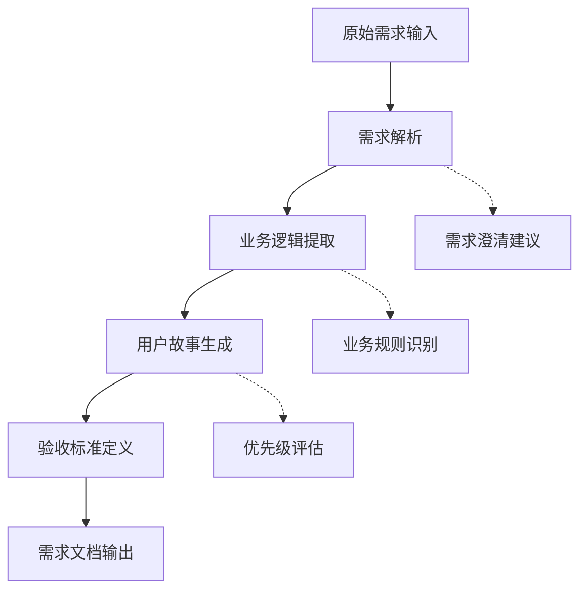
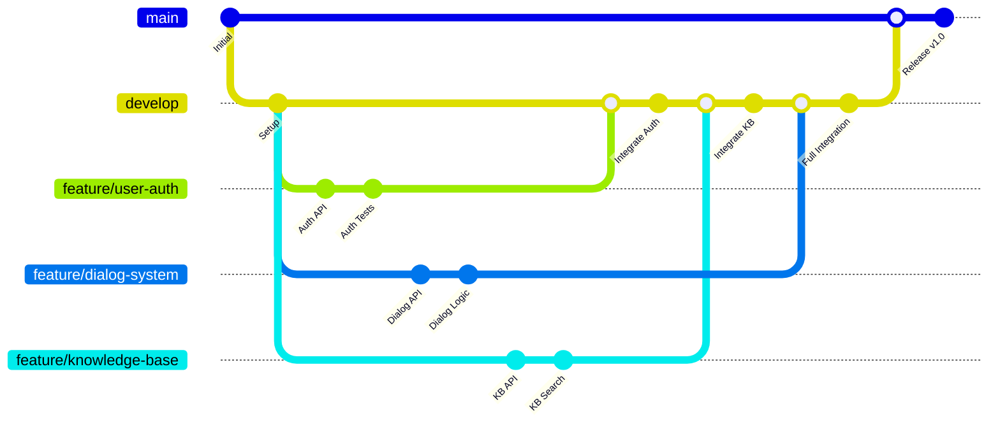

# 第4章：团队协作核心流程

## 📋 本章目录

- [📖 章节概述](#章节概述)
- [🤖 多智能体协作模式](#多智能体协作模式)

## 📄 章节文件导航

- [文档标准化规范](./doc-standards.md) - 团队协作中的文档标准化规范和最佳实践
- [心理安全环境建设](./psychological-safety.md) - 团队心理安全环境的建设方法和策略
- [需求分析方法论](./requirement-analysis.md) - 系统化的需求分析方法论和实践指南

## 🔗 章节导航

← [上一章：Team Vibe Coding方法论](../chapter3/README.md) | [返回主目录](../README.md) | [下一章：实战案例](../chapter5/README.md) →

---

## 章节概述

本章将深入探讨Team Vibe Coding的核心协作流程，包括多智能体协作模式、并行开发管理、代码评审增强和结构化测试系统。这些流程的设计旨在最大化团队效率，同时保证代码质量和项目可维护性。

## 多智能体协作模式

### 智能体角色定义

在Team Vibe Coding框架中，我们定义了多个专业化的AI智能体，每个智能体都有明确的职责和专业领域：

#### 1. 需求分析智能体 (Requirements Analyst Agent)

**核心职责**
- 需求文档解析和理解
- 用户故事拆解和优先级排序
- 需求变更影响分析
- 业务逻辑一致性检查

**工作流程**


**实际应用示例**
```yaml
# 需求分析智能体输出示例
需求分析结果:
  项目: 智能客服系统
  核心功能:
    - 多轮对话管理
    - 知识库检索
    - 意图识别
    - 情感分析
  
  用户故事:
    - 作为客户，我希望能够通过自然语言与客服系统对话
    - 作为客服，我希望系统能够自动回答常见问题
    - 作为管理员，我希望能够管理知识库内容
  
  技术约束:
    - 响应时间 < 2秒
    - 支持并发用户 > 1000
    - 准确率 > 85%
  
  风险评估:
    - 高风险: NLP模型准确性
    - 中风险: 系统性能优化
    - 低风险: 用户界面设计
```

#### 2. 架构设计智能体 (Architecture Designer Agent)

**核心职责**
- 系统架构设计和优化
- 技术栈选择和评估
- 性能和扩展性规划
- 安全架构设计

**设计原则**
- **模块化设计**：高内聚、低耦合的模块结构
- **可扩展性**：支持水平和垂直扩展
- **容错性**：优雅的错误处理和恢复机制
- **安全性**：多层次的安全防护体系

**架构输出示例**
```yaml
# 智能客服系统架构设计
系统架构:
  架构模式: 微服务架构
  
  核心服务:
    - 对话管理服务 (Dialog Management Service)
    - 意图识别服务 (Intent Recognition Service)
    - 知识库服务 (Knowledge Base Service)
    - 用户管理服务 (User Management Service)
  
  技术栈:
    后端: Node.js + Express + MongoDB
    前端: React + TypeScript + Ant Design
    AI模型: Python + FastAPI + Transformers
    消息队列: Redis + Bull
    监控: Prometheus + Grafana
  
  数据流设计:
    用户输入 → API网关 → 对话管理 → 意图识别 → 知识检索 → 响应生成
  
  非功能需求:
    性能: 响应时间 < 2s，QPS > 1000
    可用性: 99.9%
    扩展性: 支持水平扩展
    安全性: OAuth2 + JWT + HTTPS
```

#### 3. 代码生成智能体 (Code Generator Agent)

**核心职责**
- 基于设计文档生成代码
- 遵循团队编码规范
- 自动生成测试用例
- 代码优化和重构建议

**代码生成策略**
```javascript
// 代码生成智能体的工作示例
// 基于API设计文档生成控制器代码

/**
 * 对话控制器
 * 处理用户对话请求和响应
 */
class DialogController {
  constructor(dialogService, intentService, knowledgeService) {
    this.dialogService = dialogService;
    this.intentService = intentService;
    this.knowledgeService = knowledgeService;
  }

  /**
   * 处理用户消息
   * @param {Object} req - 请求对象
   * @param {Object} res - 响应对象
   */
  async handleMessage(req, res) {
    try {
      const { sessionId, message, userId } = req.body;
      
      // 参数验证
      if (!sessionId || !message) {
        return res.status(400).json({
          success: false,
          error: 'Missing required parameters'
        });
      }

      // 获取对话上下文
      const context = await this.dialogService.getContext(sessionId);
      
      // 意图识别
      const intent = await this.intentService.recognize(message, context);
      
      // 知识检索
      const knowledge = await this.knowledgeService.search(intent);
      
      // 生成响应
      const response = await this.dialogService.generateResponse({
        message,
        intent,
        knowledge,
        context
      });
      
      // 更新对话上下文
      await this.dialogService.updateContext(sessionId, {
        userMessage: message,
        botResponse: response,
        intent
      });
      
      // 记录日志
      logger.info('Dialog processed successfully', {
        sessionId,
        userId,
        intent: intent.name,
        confidence: intent.confidence
      });
      
      return res.json({
        success: true,
        data: {
          response: response.text,
          suggestions: response.suggestions,
          sessionId
        }
      });
      
    } catch (error) {
      logger.error('Dialog processing failed', {
        error: error.message,
        stack: error.stack,
        sessionId: req.body.sessionId
      });
      
      return res.status(500).json({
        success: false,
        error: 'Internal server error'
      });
    }
  }
}

module.exports = DialogController;
```

#### 4. 测试工程智能体 (Test Engineer Agent)

**核心职责**
- 自动生成测试用例
- 测试策略制定
- 测试数据准备
- 测试结果分析

**测试生成示例**
```javascript
// 自动生成的测试用例
describe('DialogController', () => {
  let controller;
  let mockDialogService;
  let mockIntentService;
  let mockKnowledgeService;

  beforeEach(() => {
    mockDialogService = {
      getContext: jest.fn(),
      generateResponse: jest.fn(),
      updateContext: jest.fn()
    };
    
    mockIntentService = {
      recognize: jest.fn()
    };
    
    mockKnowledgeService = {
      search: jest.fn()
    };
    
    controller = new DialogController(
      mockDialogService,
      mockIntentService,
      mockKnowledgeService
    );
  });

  describe('handleMessage', () => {
    it('应该成功处理正常的对话请求', async () => {
      // 准备测试数据
      const req = {
        body: {
          sessionId: 'session-123',
          message: '你好',
          userId: 'user-456'
        }
      };
      
      const res = {
        json: jest.fn(),
        status: jest.fn().mockReturnThis()
      };

      // 设置Mock返回值
      mockDialogService.getContext.mockResolvedValue({ history: [] });
      mockIntentService.recognize.mockResolvedValue({
        name: 'greeting',
        confidence: 0.95
      });
      mockKnowledgeService.search.mockResolvedValue([
        { content: '你好！有什么可以帮助您的吗？' }
      ]);
      mockDialogService.generateResponse.mockResolvedValue({
        text: '你好！有什么可以帮助您的吗？',
        suggestions: ['查询订单', '联系客服']
      });

      // 执行测试
      await controller.handleMessage(req, res);

      // 验证结果
      expect(res.json).toHaveBeenCalledWith({
        success: true,
        data: {
          response: '你好！有什么可以帮助您的吗？',
          suggestions: ['查询订单', '联系客服'],
          sessionId: 'session-123'
        }
      });
    });

    it('应该处理缺少必需参数的情况', async () => {
      const req = { body: {} };
      const res = {
        json: jest.fn(),
        status: jest.fn().mockReturnThis()
      };

      await controller.handleMessage(req, res);

      expect(res.status).toHaveBeenCalledWith(400);
      expect(res.json).toHaveBeenCalledWith({
        success: false,
        error: 'Missing required parameters'
      });
    });
  });
});
```

### 智能体协作机制

#### 1. 任务分配优化

**智能任务分配算法**
```python
# 任务分配优化算法示例
class TaskAllocationOptimizer:
    def __init__(self):
        self.agents = {
            'requirements': RequirementsAnalystAgent(),
            'architecture': ArchitectureDesignerAgent(),
            'code_generator': CodeGeneratorAgent(),
            'test_engineer': TestEngineerAgent()
        }
    
    def optimize_allocation(self, project_requirements):
        """
        基于项目需求优化任务分配
        """
        # 分析项目复杂度
        complexity = self.analyze_complexity(project_requirements)
        
        # 评估智能体能力
        agent_capabilities = self.evaluate_agent_capabilities()
        
        # 计算最优分配方案
        allocation_plan = self.calculate_optimal_allocation(
            complexity, 
            agent_capabilities
        )
        
        return allocation_plan
    
    def analyze_complexity(self, requirements):
        """分析项目复杂度"""
        factors = {
            'business_logic_complexity': 0,
            'technical_complexity': 0,
            'integration_complexity': 0,
            'performance_requirements': 0
        }
        
        # 基于需求文档分析各维度复杂度
        # ... 复杂度分析逻辑
        
        return factors
    
    def calculate_optimal_allocation(self, complexity, capabilities):
        """计算最优分配方案"""
        allocation = {}
        
        # 基于复杂度和能力匹配度计算分配权重
        for task_type, complexity_score in complexity.items():
            best_agent = self.find_best_agent(task_type, capabilities)
            allocation[task_type] = {
                'agent': best_agent,
                'priority': complexity_score,
                'estimated_time': self.estimate_time(task_type, complexity_score)
            }
        
        return allocation
```

#### 2. 风险评估与预警

**多维度风险评估框架**
```yaml
风险评估框架:
  技术风险:
    - 技术栈成熟度评估
    - 第三方依赖风险分析
    - 性能瓶颈预测
    - 安全漏洞识别
  
  业务风险:
    - 需求变更频率预测
    - 用户接受度评估
    - 市场竞争分析
    - 合规性检查
  
  项目风险:
    - 时间进度风险
    - 资源配置风险
    - 团队协作风险
    - 质量保证风险
  
  风险等级:
    高风险 (8-10分): 需要立即关注和处理
    中风险 (5-7分): 需要制定应对计划
    低风险 (1-4分): 持续监控即可
```

**风险预警系统**
```javascript
// 风险预警系统实现
class RiskAssessmentSystem {
  constructor() {
    this.riskFactors = new Map();
    this.thresholds = {
      high: 8,
      medium: 5,
      low: 1
    };
  }

  async assessProjectRisk(projectData) {
    const risks = {
      technical: await this.assessTechnicalRisk(projectData),
      business: await this.assessBusinessRisk(projectData),
      project: await this.assessProjectRisk(projectData)
    };

    const overallRisk = this.calculateOverallRisk(risks);
    const recommendations = this.generateRecommendations(risks);

    return {
      risks,
      overallRisk,
      recommendations,
      alertLevel: this.determineAlertLevel(overallRisk)
    };
  }

  async assessTechnicalRisk(projectData) {
    const factors = {
      technologyMaturity: this.evaluateTechMaturity(projectData.techStack),
      dependencyRisk: this.evaluateDependencies(projectData.dependencies),
      performanceRisk: this.evaluatePerformanceRequirements(projectData.performance),
      securityRisk: this.evaluateSecurityRequirements(projectData.security)
    };

    return this.calculateWeightedScore(factors, {
      technologyMaturity: 0.3,
      dependencyRisk: 0.25,
      performanceRisk: 0.25,
      securityRisk: 0.2
    });
  }

  generateRecommendations(risks) {
    const recommendations = [];

    if (risks.technical.score > this.thresholds.high) {
      recommendations.push({
        type: 'technical',
        priority: 'high',
        message: '技术风险较高，建议进行技术方案评审',
        actions: [
          '组织技术专家评审',
          '制定技术风险应对计划',
          '考虑技术方案调整'
        ]
      });
    }

    if (risks.business.score > this.thresholds.medium) {
      recommendations.push({
        type: 'business',
        priority: 'medium',
        message: '业务风险需要关注，建议加强需求管理',
        actions: [
          '与业务方确认需求优先级',
          '建立需求变更控制流程',
          '增加用户反馈收集机制'
        ]
      });
    }

    return recommendations;
  }
}
```

## 并行开发管理

### Git Worktrees并行开发

#### 1. Worktrees配置与管理

**Worktrees基础配置**
```bash
# 创建主工作树
git clone https://github.com/team/project.git main-workspace
cd main-workspace

# 为不同功能创建独立工作树
git worktree add ../feature-user-auth feature/user-auth
git worktree add ../feature-chat-system feature/chat-system
git worktree add ../feature-knowledge-base feature/knowledge-base

# 查看工作树状态
git worktree list
```

**智能工作树管理**
```bash
# 使用Codebuddy管理工作树
codebuddy worktree create --feature "用户认证" --base develop
codebuddy worktree create --feature "聊天系统" --base develop
codebuddy worktree create --feature "知识库" --base develop

# 自动检测依赖关系
codebuddy worktree analyze-dependencies

# 输出示例
工作树依赖分析:
├── feature/user-auth (独立开发)
├── feature/chat-system (依赖: user-auth)
└── feature/knowledge-base (依赖: user-auth)

建议开发顺序:
1. user-auth (优先级: 高)
2. knowledge-base (优先级: 中)
3. chat-system (优先级: 中)
```

#### 2. 功能并行化策略

**功能模块分解**
```yaml
# 功能并行化配置
并行开发计划:
  智能客服系统:
    核心模块:
      - 用户认证模块
        开发者: 张三
        工作树: feature/user-auth
        预计时间: 3天
        依赖: 无
      
      - 对话管理模块
        开发者: 李四
        工作树: feature/dialog-management
        预计时间: 5天
        依赖: 用户认证模块
      
      - 知识库模块
        开发者: 王五
        工作树: feature/knowledge-base
        预计时间: 4天
        依赖: 用户认证模块
      
      - 意图识别模块
        开发者: 赵六
        工作树: feature/intent-recognition
        预计时间: 6天
        依赖: 无
    
    集成计划:
      第一阶段: 用户认证 + 基础框架
      第二阶段: 知识库 + 意图识别
      第三阶段: 对话管理 + 完整集成
```

**并行开发协调机制**
```javascript
// 并行开发协调系统
class ParallelDevelopmentCoordinator {
  constructor() {
    this.modules = new Map();
    this.dependencies = new Map();
    this.developers = new Map();
  }

  async planParallelDevelopment(projectSpec) {
    // 分析模块依赖关系
    const dependencies = await this.analyzeDependencies(projectSpec);
    
    // 计算最优并行方案
    const parallelPlan = this.calculateOptimalParallelization(dependencies);
    
    // 分配开发资源
    const resourceAllocation = this.allocateResources(parallelPlan);
    
    return {
      plan: parallelPlan,
      allocation: resourceAllocation,
      timeline: this.generateTimeline(parallelPlan),
      riskAssessment: this.assessParallelRisks(parallelPlan)
    };
  }

  calculateOptimalParallelization(dependencies) {
    // 使用拓扑排序确定开发顺序
    const sortedModules = this.topologicalSort(dependencies);
    
    // 识别可并行开发的模块组
    const parallelGroups = this.identifyParallelGroups(sortedModules);
    
    return {
      groups: parallelGroups,
      criticalPath: this.findCriticalPath(dependencies),
      estimatedTime: this.calculateTotalTime(parallelGroups)
    };
  }

  async monitorParallelProgress() {
    const progress = {};
    
    for (const [moduleId, module] of this.modules) {
      progress[moduleId] = {
        completion: await this.getModuleCompletion(moduleId),
        blockers: await this.identifyBlockers(moduleId),
        dependencies: this.checkDependencyStatus(moduleId)
      };
    }
    
    return {
      overall: this.calculateOverallProgress(progress),
      modules: progress,
      alerts: this.generateProgressAlerts(progress)
    };
  }
}
```

### 环境隔离策略

#### 1. 开发环境隔离

**Docker容器化开发环境**
```dockerfile
# Dockerfile.dev - 开发环境容器
FROM node:18-alpine

WORKDIR /app

# 安装开发依赖
COPY package*.json ./
RUN npm install

# 安装开发工具
RUN npm install -g nodemon jest eslint

# 配置开发环境
ENV NODE_ENV=development
ENV DEBUG=app:*

# 暴露端口
EXPOSE 3000 9229

# 启动开发服务器
CMD ["npm", "run", "dev"]
```

**Docker Compose多服务编排**
```yaml
# docker-compose.dev.yml
version: '3.8'

services:
  # 用户认证服务
  auth-service:
    build:
      context: ./auth-service
      dockerfile: Dockerfile.dev
    ports:
      - "3001:3000"
      - "9230:9229"
    volumes:
      - ./auth-service:/app
      - /app/node_modules
    environment:
      - SERVICE_NAME=auth-service
      - DATABASE_URL=mongodb://mongo:27017/auth
    depends_on:
      - mongo
      - redis

  # 对话管理服务
  dialog-service:
    build:
      context: ./dialog-service
      dockerfile: Dockerfile.dev
    ports:
      - "3002:3000"
      - "9231:9229"
    volumes:
      - ./dialog-service:/app
      - /app/node_modules
    environment:
      - SERVICE_NAME=dialog-service
      - DATABASE_URL=mongodb://mongo:27017/dialog
      - AUTH_SERVICE_URL=http://auth-service:3000
    depends_on:
      - mongo
      - redis
      - auth-service

  # 知识库服务
  knowledge-service:
    build:
      context: ./knowledge-service
      dockerfile: Dockerfile.dev
    ports:
      - "3003:3000"
      - "9232:9229"
    volumes:
      - ./knowledge-service:/app
      - /app/node_modules
    environment:
      - SERVICE_NAME=knowledge-service
      - DATABASE_URL=mongodb://mongo:27017/knowledge
    depends_on:
      - mongo
      - elasticsearch

  # 数据库服务
  mongo:
    image: mongo:5.0
    ports:
      - "27017:27017"
    volumes:
      - mongo_data:/data/db

  redis:
    image: redis:7-alpine
    ports:
      - "6379:6379"

  elasticsearch:
    image: elasticsearch:8.5.0
    ports:
      - "9200:9200"
    environment:
      - discovery.type=single-node
      - xpack.security.enabled=false

volumes:
  mongo_data:
```

#### 2. 版本管理策略

**分支策略设计**


**自动化版本管理**
```bash
# 版本管理自动化脚本
#!/bin/bash

# 创建功能分支
create_feature_branch() {
    local feature_name=$1
    local base_branch=${2:-develop}
    
    git checkout $base_branch
    git pull origin $base_branch
    git checkout -b feature/$feature_name
    git push -u origin feature/$feature_name
    
    echo "Created feature branch: feature/$feature_name"
}

# 合并功能分支
merge_feature_branch() {
    local feature_name=$1
    local target_branch=${2:-develop}
    
    # 运行测试
    npm test
    if [ $? -ne 0 ]; then
        echo "Tests failed, aborting merge"
        exit 1
    fi
    
    # 代码质量检查
    npm run lint
    if [ $? -ne 0 ]; then
        echo "Linting failed, aborting merge"
        exit 1
    fi
    
    # 执行合并
    git checkout $target_branch
    git pull origin $target_branch
    git merge --no-ff feature/$feature_name
    git push origin $target_branch
    
    # 删除功能分支
    git branch -d feature/$feature_name
    git push origin --delete feature/$feature_name
    
    echo "Merged and cleaned up feature/$feature_name"
}

# 使用示例
# ./version-management.sh create user-auth
# ./version-management.sh merge user-auth
```

## 增强代码评审

### 静态代码分析

#### 1. 多维度代码质量检查

**ESLint配置增强**
```javascript
// .eslintrc.js - 团队统一的ESLint配置
module.exports = {
  extends: [
    'eslint:recommended',
    '@typescript-eslint/recommended',
    'plugin:react/recommended',
    'plugin:react-hooks/recommended',
    'plugin:security/recommended',
    'plugin:sonarjs/recommended'
  ],
  
  plugins: [
    '@typescript-eslint',
    'react',
    'react-hooks',
    'security',
    'sonarjs',
    'import',
    'jsx-a11y'
  ],
  
  rules: {
    // 代码质量规则
    'complexity': ['error', { max: 10 }],
    'max-depth': ['error', 4],
    'max-lines-per-function': ['error', { max: 50 }],
    'max-params': ['error', 4],
    
    // 安全规则
    'security/detect-object-injection': 'error',
    'security/detect-sql-injection': 'error',
    'security/detect-xss': 'error',
    
    // 性能规则
    'sonarjs/cognitive-complexity': ['error', 15],
    'sonarjs/no-duplicate-string': 'error',
    'sonarjs/prefer-immediate-return': 'error',
    
    // 可维护性规则
    'import/order': ['error', {
      'groups': ['builtin', 'external', 'internal', 'parent', 'sibling', 'index'],
      'newlines-between': 'always'
    }],
    
    // 团队约定规则
    'prefer-const': 'error',
    'no-var': 'error',
    'object-shorthand': 'error',
    'prefer-template': 'error'
  },
  
  overrides: [
    {
      files: ['**/*.test.js', '**/*.spec.js'],
      env: {
        jest: true
      },
      rules: {
        'max-lines-per-function': 'off' // 测试文件允许更长的函数
      }
    }
  ]
};
```

**SonarQube质量门禁**
```yaml
# sonar-project.properties
sonar.projectKey=intelligent-customer-service
sonar.projectName=Intelligent Customer Service
sonar.projectVersion=1.0

# 源码路径
sonar.sources=src
sonar.tests=tests
sonar.test.inclusions=**/*.test.js,**/*.spec.js

# 覆盖率报告
sonar.javascript.lcov.reportPaths=coverage/lcov.info

# 质量门禁配置
sonar.qualitygate.wait=true

# 代码质量阈值
sonar.coverage.minimum=80
sonar.duplicated_lines_density.maximum=3
sonar.maintainability_rating.maximum=A
sonar.reliability_rating.maximum=A
sonar.security_rating.maximum=A
```

#### 2. 架构一致性检查

**架构规则定义**
```javascript
// architecture-rules.js - 架构一致性检查规则
const architectureRules = {
  // 分层架构规则
  layerRules: {
    'controllers': {
      canImport: ['services', 'middlewares', 'utils'],
      cannotImport: ['models', 'database'],
      description: '控制器层只能调用服务层和中间件'
    },
    'services': {
      canImport: ['models', 'utils', 'external-apis'],
      cannotImport: ['controllers', 'middlewares'],
      description: '服务层只能调用模型层和外部API'
    },
    'models': {
      canImport: ['utils'],
      cannotImport: ['controllers', 'services', 'middlewares'],
      description: '模型层只能调用工具类'
    }
  },
  
  // 命名规范
  namingRules: {
    controllers: /^[A-Z][a-zA-Z]*Controller$/,
    services: /^[A-Z][a-zA-Z]*Service$/,
    models: /^[A-Z][a-zA-Z]*Model$/,
    middlewares: /^[a-z][a-zA-Z]*Middleware$/
  },
  
  // 文件组织规则
  fileOrganization: {
    'src/controllers': '*.controller.js',
    'src/services': '*.service.js',
    'src/models': '*.model.js',
    'src/middlewares': '*.middleware.js',
    'src/utils': '*.util.js'
  }
};

// 架构检查器实现
class ArchitectureChecker {
  constructor(rules) {
    this.rules = rules;
  }

  checkLayerViolations(filePath, imports) {
    const layer = this.identifyLayer(filePath);
    const violations = [];

    if (this.rules.layerRules[layer]) {
      const rule = this.rules.layerRules[layer];
      
      imports.forEach(importPath => {
        const importLayer = this.identifyLayer(importPath);
        
        if (rule.cannotImport.includes(importLayer)) {
          violations.push({
            type: 'layer-violation',
            message: `${layer} cannot import from ${importLayer}`,
            file: filePath,
            import: importPath,
            rule: rule.description
          });
        }
      });
    }

    return violations;
  }

  checkNamingConventions(filePath) {
    const layer = this.identifyLayer(filePath);
    const fileName = path.basename(filePath, '.js');
    const violations = [];

    if (this.rules.namingRules[layer]) {
      const pattern = this.rules.namingRules[layer];
      
      if (!pattern.test(fileName)) {
        violations.push({
          type: 'naming-violation',
          message: `File name "${fileName}" doesn't match pattern for ${layer}`,
          file: filePath,
          expectedPattern: pattern.toString()
        });
      }
    }

    return violations;
  }
}
```

### 性能优化建议

#### 1. 自动性能分析

**性能分析工具集成**
```javascript
// performance-analyzer.js
class PerformanceAnalyzer {
  constructor() {
    this.metrics = new Map();
    this.thresholds = {
      responseTime: 2000, // 2秒
      memoryUsage: 512 * 1024 * 1024, // 512MB
      cpuUsage: 80, // 80%
      databaseQueryTime: 100 // 100ms
    };
  }

  async analyzeCodePerformance(codeBase) {
    const analysis = {
      hotspots: await this.identifyPerformanceHotspots(codeBase),
      memoryLeaks: await this.detectMemoryLeaks(codeBase),
      inefficientQueries: await this.analyzeQueries(codeBase),
      recommendations: []
    };

    analysis.recommendations = this.generateRecommendations(analysis);
    return analysis;
  }

  async identifyPerformanceHotspots(codeBase) {
    const hotspots = [];
    
    // 分析循环复杂度
    const complexLoops = this.analyzeLoopComplexity(codeBase);
    hotspots.push(...complexLoops);
    
    // 分析同步操作
    const syncOperations = this.identifySyncOperations(codeBase);
    hotspots.push(...syncOperations);
    
    // 分析大对象操作
    const largeObjectOps = this.analyzeLargeObjectOperations(codeBase);
    hotspots.push(...largeObjectOps);
    
    return hotspots;
  }

  generateRecommendations(analysis) {
    const recommendations = [];

    // 基于热点生成建议
    analysis.hotspots.forEach(hotspot => {
      switch (hotspot.type) {
        case 'complex-loop':
          recommendations.push({
            type: 'optimization',
            priority: 'high',
            message: '考虑优化循环逻辑或使用更高效的算法',
            location: hotspot.location,
            suggestion: '使用Map或Set数据结构，或考虑分页处理'
          });
          break;
          
        case 'sync-operation':
          recommendations.push({
            type: 'async-conversion',
            priority: 'high',
            message: '将同步操作转换为异步操作',
            location: hotspot.location,
            suggestion: '使用async/await或Promise处理异步操作'
          });
          break;
      }
    });

    return recommendations;
  }
}

// 使用示例
const analyzer = new PerformanceAnalyzer();
const performanceReport = await analyzer.analyzeCodePerformance('./src');

console.log('性能分析报告:', performanceReport);
```

#### 2. 安全漏洞检测

**安全扫描集成**
```yaml
# security-scan.yml - 安全扫描配置
security_checks:
  static_analysis:
    tools:
      - eslint-plugin-security
      - semgrep
      - sonarqube-security
    
    rules:
      - sql-injection-detection
      - xss-vulnerability-check
      - authentication-bypass
      - sensitive-data-exposure
      - insecure-dependencies
  
  dependency_scan:
    tools:
      - npm-audit
      - snyk
      - retire.js
    
    severity_threshold: medium
    auto_fix: true
  
  secrets_detection:
    tools:
      - truffleHog
      - git-secrets
    
    patterns:
      - api-keys
      - database-passwords
      - jwt-secrets
      - oauth-tokens

# 安全扫描脚本
security_scan_script: |
  #!/bin/bash
  
  echo "开始安全扫描..."
  
  # 依赖漏洞扫描
  npm audit --audit-level moderate
  
  # 代码安全扫描
  eslint --ext .js,.ts src/ --config .eslintrc.security.js
  
  # 敏感信息检测
  truffleHog --regex --entropy=False .
  
  # 生成安全报告
  echo "安全扫描完成，生成报告..."
```

## 结构化测试系统

### 单元测试自动化

#### 1. 智能测试用例生成

**基于代码分析的测试生成**
```javascript
// test-generator.js - 智能测试生成器
class IntelligentTestGenerator {
  constructor() {
    this.testTemplates = new Map();
    this.mockStrategies = new Map();
  }

  async generateTestSuite(sourceFile) {
    // 分析源代码结构
    const codeAnalysis = await this.analyzeSourceCode(sourceFile);
    
    // 生成测试用例
    const testCases = await this.generateTestCases(codeAnalysis);
    
    // 生成Mock对象
    const mocks = await this.generateMocks(codeAnalysis.dependencies);
    
    // 组装测试套件
    const testSuite = this.assembleTestSuite(testCases, mocks);
    
    return testSuite;
  }

  async analyzeSourceCode(sourceFile) {
    const analysis = {
      functions: [],
      classes: [],
      dependencies: [],
      complexity: 0,
      branches: []
    };

    // 使用AST分析代码结构
    const ast = this.parseAST(sourceFile);
    
    // 提取函数信息
    analysis.functions = this.extractFunctions(ast);
    
    // 提取类信息
    analysis.classes = this.extractClasses(ast);
    
    // 分析依赖关系
    analysis.dependencies = this.extractDependencies(ast);
    
    // 计算复杂度
    analysis.complexity = this.calculateComplexity(ast);
    
    // 识别分支路径
    analysis.branches = this.identifyBranches(ast);
    
    return analysis;
  }

  generateTestCases(analysis) {
    const testCases = [];

    // 为每个函数生成测试用例
    analysis.functions.forEach(func => {
      // 正常路径测试
      testCases.push(this.generateHappyPathTest(func));
      
      // 异常路径测试
      testCases.push(...this.generateErrorPathTests(func));
      
      // 边界条件测试
      testCases.push(...this.generateBoundaryTests(func));
      
      // 分支覆盖测试
      testCases.push(...this.generateBranchCoverageTests(func));
    });

    return testCases;
  }

  generateHappyPathTest(func) {
    return {
      name: `should ${func.name} successfully with valid input`,
      type: 'happy-path',
      setup: this.generateTestSetup(func),
      execution: this.generateTestExecution(func),
      assertions: this.generateSuccessAssertions(func),
      cleanup: this.generateTestCleanup(func)
    };
  }

  generateErrorPathTests(func) {
    const errorTests = [];
    
    // 参数验证错误
    if (func.parameters.length > 0) {
      errorTests.push({
        name: `should throw error when ${func.name} called with invalid parameters`,
        type: 'error-path',
        setup: this.generateErrorTestSetup(func, 'invalid-params'),
        execution: this.generateErrorTestExecution(func),
        assertions: this.generateErrorAssertions(func, 'ValidationError')
      });
    }
    
    // 依赖服务错误
    func.dependencies.forEach(dep => {
      errorTests.push({
        name: `should handle ${dep.name} service error in ${func.name}`,
        type: 'error-path',
        setup: this.generateErrorTestSetup(func, 'service-error', dep),
        execution: this.generateTestExecution(func),
        assertions: this.generateErrorAssertions(func, 'ServiceError')
      });
    });
    
    return errorTests;
  }
}

// 生成的测试用例示例
const generatedTest = `
describe('UserService.createUser', () => {
  let userService;
  let mockUserModel;
  let mockEmailService;
  let mockLogger;

  beforeEach(() => {
    mockUserModel = {
      findOne: jest.fn(),
      create: jest.fn()
    };
    
    mockEmailService = {
      sendWelcomeEmail: jest.fn()
    };
    
    mockLogger = {
      info: jest.fn(),
      error: jest.fn()
    };
    
    userService = new UserService(mockUserModel, mockEmailService, mockLogger);
  });

  describe('Happy Path Tests', () => {
    it('should createUser successfully with valid input', async () => {
      // Setup
      const userData = {
        email: 'test@example.com',
        password: 'SecurePass123!',
        name: 'Test User'
      };
      
      mockUserModel.findOne.mockResolvedValue(null);
      mockUserModel.create.mockResolvedValue({
        id: 'user-123',
        ...userData,
        createdAt: new Date()
      });
      mockEmailService.sendWelcomeEmail.mockResolvedValue(true);

      // Execution
      const result = await userService.createUser(userData);

      // Assertions
      expect(result.success).toBe(true);
      expect(result.data.id).toBe('user-123');
      expect(mockUserModel.findOne).toHaveBeenCalledWith({ email: userData.email });
      expect(mockUserModel.create).toHaveBeenCalledWith(userData);
      expect(mockEmailService.sendWelcomeEmail).toHaveBeenCalledWith(userData.email);
      expect(mockLogger.info).toHaveBeenCalledWith(
        'User created successfully',
        expect.objectContaining({ userId: 'user-123' })
      );
    });
  });

  describe('Error Path Tests', () => {
    it('should throw error when createUser called with invalid parameters', async () => {
      // Setup
      const invalidUserData = {
        email: 'invalid-email',
        password: '123'
      };

      // Execution & Assertions
      await expect(userService.createUser(invalidUserData))
        .rejects.toThrow('ValidationError');
      
      expect(mockUserModel.findOne).not.toHaveBeenCalled();
      expect(mockUserModel.create).not.toHaveBeenCalled();
    });

    it('should handle UserModel service error in createUser', async () => {
      // Setup
      const userData = {
        email: 'test@example.com',
        password: 'SecurePass123!',
        name: 'Test User'
      };
      
      mockUserModel.findOne.mockRejectedValue(new Error('Database connection failed'));

      // Execution & Assertions
      await expect(userService.createUser(userData))
        .rejects.toThrow('Database connection failed');
      
      expect(mockLogger.error).toHaveBeenCalledWith(
        'User creation failed',
        expect.objectContaining({ error: 'Database connection failed' })
      );
    });
  });

  describe('Boundary Tests', () => {
    it('should handle maximum length email in createUser', async () => {
      // Setup
      const userData = {
        email: 'a'.repeat(250) + '@example.com', // 最大长度邮箱
        password: 'SecurePass123!',
        name: 'Test User'
      };
      
      mockUserModel.findOne.mockResolvedValue(null);
      mockUserModel.create.mockResolvedValue({ id: 'user-123', ...userData });

      // Execution
      const result = await userService.createUser(userData);

      // Assertions
      expect(result.success).toBe(true);
    });
  });
});
`;
```

### 场景化集成测试

#### 1. 端到端测试场景

**用户旅程测试**
```javascript
// e2e-scenarios.test.js - 端到端场景测试
describe('智能客服系统 - 用户完整旅程', () => {
  let testContext;

  beforeAll(async () => {
    // 初始化测试环境
    testContext = await setupE2EEnvironment();
  });

  afterAll(async () => {
    // 清理测试环境
    await cleanupE2EEnvironment(testContext);
  });

  describe('新用户注册到首次对话完整流程', () => {
    it('应该完成从注册到对话的完整用户旅程', async () => {
      // 第一步：用户注册
      const registrationData = {
        email: 'newuser@example.com',
        password: 'SecurePass123!',
        name: '测试用户'
      };

      const registrationResponse = await request(testContext.app)
        .post('/api/auth/register')
        .send(registrationData)
        .expect(201);

      expect(registrationResponse.body.success).toBe(true);
      const userId = registrationResponse.body.data.id;

      // 第二步：用户登录
      const loginResponse = await request(testContext.app)
        .post('/api/auth/login')
        .send({
          email: registrationData.email,
          password: registrationData.password
        })
        .expect(200);

      expect(loginResponse.body.success).toBe(true);
      const authToken = loginResponse.body.data.token;

      // 第三步：创建对话会话
      const sessionResponse = await request(testContext.app)
        .post('/api/dialog/sessions')
        .set('Authorization', `Bearer ${authToken}`)
        .send({
          userId: userId,
          type: 'customer-service'
        })
        .expect(201);

      expect(sessionResponse.body.success).toBe(true);
      const sessionId = sessionResponse.body.data.sessionId;

      // 第四步：发送第一条消息
      const messageResponse = await request(testContext.app)
        .post('/api/dialog/message')
        .set('Authorization', `Bearer ${authToken}`)
        .send({
          sessionId: sessionId,
          message: '你好，我想查询我的订单状态',
          userId: userId
        })
        .expect(200);

      expect(messageResponse.body.success).toBe(true);
      expect(messageResponse.body.data.response).toContain('订单');
      expect(messageResponse.body.data.suggestions).toBeInstanceOf(Array);

      // 第五步：继续对话
      const followUpResponse = await request(testContext.app)
        .post('/api/dialog/message')
        .set('Authorization', `Bearer ${authToken}`)
        .send({
          sessionId: sessionId,
          message: '我的订单号是12345',
          userId: userId
        })
        .expect(200);

      expect(followUpResponse.body.success).toBe(true);
      expect(followUpResponse.body.data.response).toContain('12345');

      // 第六步：验证对话历史
      const historyResponse = await request(testContext.app)
        .get(`/api/dialog/sessions/${sessionId}/history`)
        .set('Authorization', `Bearer ${authToken}`)
        .expect(200);

      expect(historyResponse.body.data.messages).toHaveLength(4); // 2条用户消息 + 2条机器人回复

      // 第七步：结束会话
      const endSessionResponse = await request(testContext.app)
        .post(`/api/dialog/sessions/${sessionId}/end`)
        .set('Authorization', `Bearer ${authToken}`)
        .expect(200);

      expect(endSessionResponse.body.success).toBe(true);
    });
  });

  describe('客服管理员工作流程', () => {
    it('应该支持管理员管理知识库的完整流程', async () => {
      // 管理员登录
      const adminLoginResponse = await request(testContext.app)
        .post('/api/auth/login')
        .send({
          email: 'admin@example.com',
          password: 'AdminPass123!'
        })
        .expect(200);

      const adminToken = adminLoginResponse.body.data.token;

      // 添加知识库条目
      const knowledgeItem = {
        title: '如何查询订单状态',
        content: '您可以通过订单号在我的订单页面查询订单状态',
        category: '订单管理',
        keywords: ['订单', '查询', '状态'],
        priority: 'high'
      };

      const addKnowledgeResponse = await request(testContext.app)
        .post('/api/knowledge/articles')
        .set('Authorization', `Bearer ${adminToken}`)
        .send(knowledgeItem)
        .expect(201);

      const articleId = addKnowledgeResponse.body.data.id;

      // 更新知识库条目
      const updatedKnowledge = {
        ...knowledgeItem,
        content: '您可以通过订单号在我的订单页面查询订单状态，或联系客服获取帮助'
      };

      await request(testContext.app)
        .put(`/api/knowledge/articles/${articleId}`)
        .set('Authorization', `Bearer ${adminToken}`)
        .send(updatedKnowledge)
        .expect(200);

      // 测试知识库搜索
      const searchResponse = await request(testContext.app)
        .get('/api/knowledge/search')
        .query({ q: '订单状态' })
        .set('Authorization', `Bearer ${adminToken}`)
        .expect(200);

      expect(searchResponse.body.data.results).toHaveLength(1);
      expect(searchResponse.body.data.results[0].id).toBe(articleId);

      // 删除知识库条目
      await request(testContext.app)
        .delete(`/api/knowledge/articles/${articleId}`)
        .set('Authorization', `Bearer ${adminToken}`)
        .expect(200);
    });
  });
});
```

### 持续性能测试

#### 1. 性能基准测试

**负载测试配置**
```javascript
// performance-tests.js - 性能测试套件
const autocannon = require('autocannon');
const { performance } = require('perf_hooks');

class PerformanceTestSuite {
  constructor(baseUrl) {
    this.baseUrl = baseUrl;
    this.benchmarks = new Map();
  }

  async runLoadTests() {
    const testScenarios = [
      {
        name: '用户注册API负载测试',
        url: `${this.baseUrl}/api/auth/register`,
        method: 'POST',
        body: JSON.stringify({
          email: 'loadtest@example.com',
          password: 'LoadTest123!',
          name: 'Load Test User'
        }),
        headers: {
          'Content-Type': 'application/json'
        },
        connections: 100,
        duration: 30
      },
      {
        name: '对话API负载测试',
        url: `${this.baseUrl}/api/dialog/message`,
        method: 'POST',
        body: JSON.stringify({
          sessionId: 'test-session-123',
          message: '你好，我需要帮助',
          userId: 'test-user-456'
        }),
        headers: {
          'Content-Type': 'application/json',
          'Authorization': 'Bearer test-token'
        },
        connections: 200,
        duration: 60
      },
      {
        name: '知识库搜索API负载测试',
        url: `${this.baseUrl}/api/knowledge/search?q=订单`,
        method: 'GET',
        headers: {
          'Authorization': 'Bearer test-token'
        },
        connections: 150,
        duration: 45
      }
    ];

    const results = [];
    
    for (const scenario of testScenarios) {
      console.log(`开始执行: ${scenario.name}`);
      
      const result = await this.executeLoadTest(scenario);
      results.push({
        scenario: scenario.name,
        ...result
      });
      
      // 等待系统恢复
      await this.wait(5000);
    }

    return this.analyzeResults(results);
  }

  async executeLoadTest(scenario) {
    const startTime = performance.now();
    
    const result = await autocannon({
      url: scenario.url,
      method: scenario.method,
      body: scenario.body,
      headers: scenario.headers,
      connections: scenario.connections,
      duration: scenario.duration
    });

    const endTime = performance.now();
    
    return {
      duration: endTime - startTime,
      requests: result.requests,
      throughput: result.throughput,
      latency: result.latency,
      errors: result.errors,
      timeouts: result.timeouts
    };
  }

  analyzeResults(results) {
    const analysis = {
      summary: {},
      recommendations: [],
      alerts: []
    };

    results.forEach(result => {
      // 性能指标分析
      const avgLatency = result.latency.average;
      const p99Latency = result.latency.p99;
      const errorRate = (result.errors / result.requests.total) * 100;
      const throughput = result.throughput.average;

      analysis.summary[result.scenario] = {
        avgLatency,
        p99Latency,
        errorRate,
        throughput,
        status: this.evaluatePerformance(avgLatency, errorRate, throughput)
      };

      // 生成建议
      if (avgLatency > 2000) {
        analysis.recommendations.push({
          scenario: result.scenario,
          type: 'latency',
          message: '平均响应时间超过2秒，建议优化',
          suggestions: [
            '检查数据库查询性能',
            '考虑添加缓存层',
            '优化业务逻辑复杂度'
          ]
        });
      }

      if (errorRate > 1) {
        analysis.alerts.push({
          scenario: result.scenario,
          type: 'error-rate',
          severity: 'high',
          message: `错误率${errorRate.toFixed(2)}%超过阈值`,
          action: '需要立即检查错误原因'
        });
      }
    });

    return analysis;
  }

  evaluatePerformance(latency, errorRate, throughput) {
    if (errorRate > 5) return 'critical';
    if (latency > 5000 || errorRate > 1) return 'poor';
    if (latency > 2000 || throughput < 100) return 'fair';
    return 'good';
  }

  async wait(ms) {
    return new Promise(resolve => setTimeout(resolve, ms));
  }
}

// 使用示例
const performanceTests = new PerformanceTestSuite('http://localhost:3000');

describe('性能测试套件', () => {
  it('应该通过所有负载测试', async () => {
    const results = await performanceTests.runLoadTests();
    
    // 验证性能指标
    Object.values(results.summary).forEach(metrics => {
      expect(metrics.status).not.toBe('critical');
      expect(metrics.errorRate).toBeLessThan(5);
      expect(metrics.avgLatency).toBeLessThan(5000);
    });
    
    // 输出性能报告
    console.log('性能测试报告:', JSON.stringify(results, null, 2));
  }, 300000); // 5分钟超时
});
```

### 工具集成

#### 1. CI/CD集成

**GitHub Actions工作流**
```yaml
# .github/workflows/team-vibe-coding.yml
name: Team Vibe Coding CI/CD

on:
  push:
    branches: [ main, develop ]
  pull_request:
    branches: [ main, develop ]

jobs:
  code-quality:
    runs-on: ubuntu-latest
    
    steps:
    - uses: actions/checkout@v3
    
    - name: Setup Node.js
      uses: actions/setup-node@v3
      with:
        node-version: '18'
        cache: 'npm'
    
    - name: Install dependencies
      run: npm ci
    
    - name: Lint code
      run: npm run lint
    
    - name: Check code formatting
      run: npm run format:check
    
    - name: Run security audit
      run: npm audit --audit-level moderate
    
    - name: Architecture compliance check
      run: npm run arch:check

  unit-tests:
    runs-on: ubuntu-latest
    needs: code-quality
    
    steps:
    - uses: actions/checkout@v3
    
    - name: Setup Node.js
      uses: actions/setup-node@v3
      with:
        node-version: '18'
        cache: 'npm'
    
    - name: Install dependencies
      run: npm ci
    
    - name: Run unit tests
      run: npm run test:unit -- --coverage
    
    - name: Upload coverage to Codecov
      uses: codecov/codecov-action@v3
      with:
        file: ./coverage/lcov.info

  integration-tests:
    runs-on: ubuntu-latest
    needs: unit-tests
    
    services:
      mongodb:
        image: mongo:5.0
        ports:
          - 27017:27017
      redis:
        image: redis:7-alpine
        ports:
          - 6379:6379
    
    steps:
    - uses: actions/checkout@v3
    
    - name: Setup Node.js
      uses: actions/setup-node@v3
      with:
        node-version: '18'
        cache: 'npm'
    
    - name: Install dependencies
      run: npm ci
    
    - name: Run integration tests
      run: npm run test:integration
      env:
        MONGODB_URL: mongodb://localhost:27017/test
        REDIS_URL: redis://localhost:6379

  e2e-tests:
    runs-on: ubuntu-latest
    needs: integration-tests
    
    steps:
    - uses: actions/checkout@v3
    
    - name: Setup Node.js
      uses: actions/setup-node@v3
      with:
        node-version: '18'
        cache: 'npm'
    
    - name: Install dependencies
      run: npm ci
    
    - name: Start application
      run: |
        npm run build
        npm start &
        sleep 30
    
    - name: Run E2E tests
      run: npm run test:e2e

  performance-tests:
    runs-on: ubuntu-latest
    needs: e2e-tests
    if: github.ref == 'refs/heads/main'
    
    steps:
    - uses: actions/checkout@v3
    
    - name: Setup Node.js
      uses: actions/setup-node@v3
      with:
        node-version: '18'
        cache: 'npm'
    
    - name: Install dependencies
      run: npm ci
    
    - name: Run performance tests
      run: npm run test:performance
    
    - name: Upload performance report
      uses: actions/upload-artifact@v3
      with:
        name: performance-report
        path: performance-report.json

  deploy:
    runs-on: ubuntu-latest
    needs: [unit-tests, integration-tests, e2e-tests]
    if: github.ref == 'refs/heads/main'
    
    steps:
    - uses: actions/checkout@v3
    
    - name: Deploy to staging
      run: |
        echo "Deploying to staging environment..."
        # 部署脚本
    
    - name: Run smoke tests
      run: npm run test:smoke
    
    - name: Deploy to production
      if: success()
      run: |
        echo "Deploying to production environment..."
        # 生产部署脚本
```

## 章节导航

### 4.1 多智能体协作模式
- [智能体角色定义](./agent-roles.md)
- [协作机制设计](./collaboration-mechanism.md)
- [任务分配优化](./task-allocation.md)

### 4.2 并行开发管理
- [Git Worktrees配置](./git-worktrees.md)
- [环境隔离策略](./environment-isolation.md)
- [版本管理流程](./version-management.md)

### 4.3 增强代码评审
- [静态代码分析](./static-analysis.md)
- [架构一致性检查](./architecture-check.md)
- [性能优化建议](./performance-optimization.md)

### 4.4 结构化测试系统
- [智能测试生成](./intelligent-testing.md)
- [场景化集成测试](./integration-testing.md)
- [持续性能测试](./performance-testing.md)

---

**下一章节**: [第5章：实战案例 - 智能客服系统开发](../chapter5/README.md)

**上一章节**: [第3章：工具准备与基础操作](../chapter3/README.md)