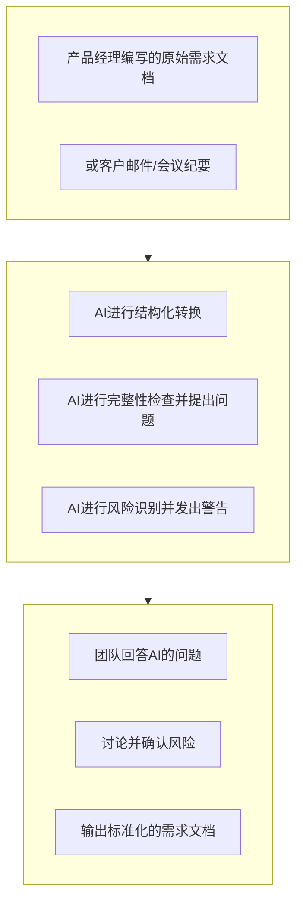

# AI协作的需求分析方法

需求分析是软件开发的起点，也是最容易出现偏差的环节。“垃圾进，垃圾出”的原则在这里体现得淋漓尽致。传统的需求分析高度依赖产品经理和架构师的个人经验，耗时且容易遗漏。

在“团队Vibe Coding”模式中，我们引入AI作为“需求分析师”的得力助手，旨在将这个过程变得更高效、更严谨、更具前瞻性。

## AI在需求分析中的四大核心能力

AI主要通过以下四种能力，为需求分析赋能：

1.  **结构化转换 (Structuring)**：将非结构化的自然语言（如会议纪要、客户邮件）转换为结构化的需求条目。
2.  **完整性检查 (Gap Analysis)**：对照预设的模板或知识库，检查需求描述中是否存在遗漏或模糊不清之处。
3.  **风险识别 (Risk Identification)**：基于历史数据和内置模型，识别需求中可能存在的性能、安全或实现上的风险。
4.  **模式匹配 (Pattern Matching)**：从海量项目中学习，识别当前需求与已知解决方案模式的相似性，并给出建议。

## AI协作需求分析工作流

这是一个典型的AI协作需求分析工作流，分为三个步骤：

### 步骤一：输入原始需求

首先，我们将一份初步的、可能还很粗糙的需求文档或描述“喂”给AI。

**输入示例 (一段会议纪要)：**
> “...会议决定，我们需要做一个新的文章发布功能。作者可以写文章，然后发布。发布后，读者可以看到。哦对了，需要支持Markdown，而且后台的管理员应该能审核文章，不合规的要能驳回...”

### 步骤二：AI智能分析与提问

我们将上述文本交给AI，并使用一个精心设计的Prompt来引导它进行分析。

**Prompt模板：**
> 你是一位资深的需求分析专家。请仔细阅读以下原始需求描述，并完成三项任务：
>
> 1.  **结构化转换**：将需求转换为包含“用户故事”、“功能点”和“角色”的结构化列表。
> 2.  **完整性检查**：对照一个标准的文章发布系统，提出至少5个这份需求中没有提到、但可能很重要的澄清性问题。
> 3.  **风险识别**：指出这个需求中可能存在的至少2个技术或产品风险。
>
> **原始需求**：
> (粘贴上面的会议纪要)

**AI可能的输出：**

> **1. 需求结构化转换**
>
> - **角色**:
>   - 作者 (Author)
>   - 读者 (Reader)
>   - 管理员 (Admin)
> - **用户故事**:
>   - 作为**作者**，我希望**编写和发布文章**，以便**分享我的内容**。
>   - 作为**读者**，我希望**查看已发布的文章**，以便**获取信息**。
>   - 作为**管理员**，我希望**审核和驳回文章**，以便**控制内容质量**。
> - **核心功能点**:
>   - 文章编辑器（支持Markdown）
>   - 文章发布流程
>   - 文章列表/详情页展示
>   - 文章审核后台
>
> **2. 完整性检查（澄清性问题）**
>
> 1.  **文章状态管理**：文章除了“已发布”和“被驳回”，是否应该有“草稿”状态？作者在保存但未发布时，文章应该是什么状态？
> 2.  **权限问题**：作者是否可以编辑自己已发布的文章？管理员的权限范围是什么？是否有多级管理员？
> 3.  **读者交互**：读者除了“看”，是否可以进行评论、点赞或分享？
> 4.  **非功能需求**：文章的图片或附件如何存储和处理？对文章加载速度有无性能要求？
> 5.  **通知机制**：文章被驳回或发布成功后，是否需要通过邮件或站内信通知作者？
>
> **3. 风险识别**
>
> 1.  **安全风险**：Markdown编辑器需要做严格的XSS（跨站脚本攻击）过滤，否则用户可能提交恶意脚本，攻击其他读者。
> 2.  **性能风险**：如果文章列表页不进行分页处理，当文章数量巨大时，会导致页面加载缓慢，服务器压力过大。

### 步骤三：人类确认与深化

AI的输出为团队提供了一个极佳的讨论起点。现在，产品经理、开发者和测试人员可以一起：
- **回答AI提出的问题**：逐一讨论并明确那些模糊不清的需求点。
- **评估AI识别的风险**：确认风险的严重性，并制定规避策略。
- **完善需求文档**：将讨论的结果补充到标准的需求文档模板中，形成一份高质量、信息全面的最终版需求文档。

这个过程将原本需要数小时甚至数天才能完成的需求评审会，极大地压缩和前置了。

---

**本节小结：** AI协作的需求分析并非要取代人类思考，而是作为人类思维的“放大器”和“校准器”。通过利用AI的结构化、检查、识别和匹配能力，我们可以快速地将模糊的初始想法，打磨成一份清晰、完整、风险可控的、可供开发团队直接使用的标准化需求文档，从而为整个项目的成功奠定坚实的基础。

**下一节：** [需求阶段的心理安全建设](psychological-safety.md)