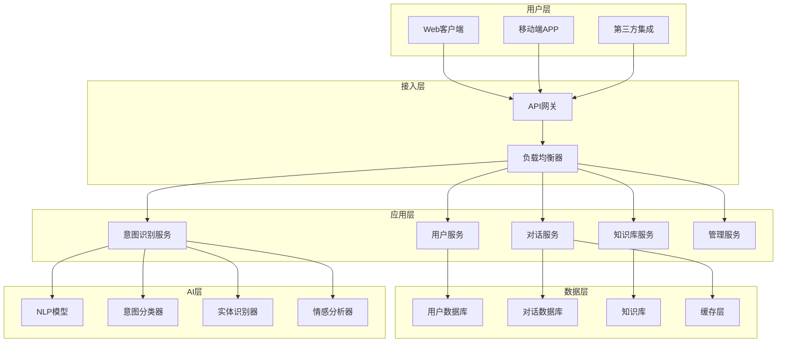

# 第5章：实战案例 - 智能客服系统开发

## 📋 本章目录

- [📖 章节概述](#章节概述)
- [🎯 项目背景与需求分析](#项目背景与需求分析)

## 📄 章节文件导航

- [完整案例实施指南](./case-study-implementation.md) - 智能客服系统开发的完整实施指南，包含项目背景、需求分析、技术架构、开发流程和最佳实践

## 🔗 章节导航

← [上一章：多智能体协作模式](../chapter4/README.md) | [返回主目录](../README.md) | [下一章：最佳实践与未来展望](../chapter6/README.md) →

---

## 章节概述

本章将通过一个完整的智能客服系统开发案例，展示Team Vibe Coding在实际项目中的应用。我们将从项目启动到部署上线，完整演示多智能体协作、并行开发、代码评审和测试的全流程实践。

## 项目背景与需求分析

### 业务背景

某电商平台面临客服压力日益增长的挑战：
- 日均客服咨询量超过10万次
- 人工客服成本持续上升
- 客户等待时间过长，满意度下降
- 重复性问题占比超过70%

### 项目目标

**核心目标**
- 构建智能客服系统，自动处理常见问题
- 提升客户服务效率，减少等待时间
- 降低人工客服成本，优化资源配置
- 提供7×24小时不间断服务

**技术目标**
- 系统响应时间 < 2秒
- 意图识别准确率 > 85%
- 支持并发用户 > 1000
- 系统可用性 > 99.9%

### 需求分析

#### 1. 功能需求

**用户端功能**
```yaml
用户功能需求:
  对话交互:
    - 自然语言对话
    - 多轮对话支持
    - 上下文理解
    - 情感识别
  
  问题解决:
    - 订单查询
    - 退换货处理
    - 产品咨询
    - 账户问题
  
  用户体验:
    - 快速响应
    - 准确理解
    - 友好交互
    - 无缝转人工
```

**管理端功能**
```yaml
管理功能需求:
  知识库管理:
    - 知识条目增删改查
    - 分类管理
    - 搜索优化
    - 版本控制
  
  对话监控:
    - 实时对话监控
    - 质量评估
    - 异常告警
    - 数据统计
  
  系统配置:
    - 意图模型训练
    - 回复模板管理
    - 转人工规则
    - 系统参数配置
```

#### 2. 非功能需求

**性能需求**
- 响应时间：平均 < 2秒，P99 < 5秒
- 吞吐量：支持1000+ QPS
- 并发用户：支持10000+在线用户
- 可用性：99.9%系统可用性

**安全需求**
- 用户数据加密存储
- API接口安全认证
- 敏感信息脱敏
- 访问权限控制

**扩展性需求**
- 水平扩展支持
- 微服务架构
- 容器化部署
- 云原生支持

## 系统架构设计

### 整体架构



### 技术栈选择

**后端技术栈**
```yaml
技术栈选择:
  运行时: Node.js 18 LTS
  框架: Express.js + TypeScript
  数据库: 
    - MongoDB (用户数据、对话记录)
    - Elasticsearch (知识库搜索)
    - Redis (缓存、会话)
  
  AI/ML:
    - Python + FastAPI (AI服务)
    - Transformers (预训练模型)
    - scikit-learn (传统ML)
  
  消息队列: Redis + Bull
  监控: Prometheus + Grafana
  日志: Winston + ELK Stack
```

**前端技术栈**
```yaml
前端技术栈:
  框架: React 18 + TypeScript
  状态管理: Redux Toolkit
  UI组件: Ant Design
  构建工具: Vite
  测试: Jest + React Testing Library
```

### 数据模型设计

#### 1. 用户数据模型

```typescript
// 用户数据模型
interface User {
  id: string;
  email: string;
  name: string;
  avatar?: string;
  role: 'customer' | 'agent' | 'admin';
  preferences: {
    language: string;
    timezone: string;
    notifications: boolean;
  };
  createdAt: Date;
  updatedAt: Date;
  lastLoginAt?: Date;
}

// 用户会话模型
interface UserSession {
  id: string;
  userId: string;
  sessionToken: string;
  expiresAt: Date;
  deviceInfo: {
    userAgent: string;
    ip: string;
    platform: string;
  };
  createdAt: Date;
}
```

#### 2. 对话数据模型

```typescript
// 对话会话模型
interface DialogSession {
  id: string;
  userId: string;
  type: 'customer-service' | 'sales' | 'technical';
  status: 'active' | 'ended' | 'transferred';
  context: {
    userInfo: Partial<User>;
    previousSessions: string[];
    currentTopic?: string;
  };
  metadata: {
    channel: 'web' | 'mobile' | 'api';
    startTime: Date;
    endTime?: Date;
    duration?: number;
    satisfaction?: number;
  };
  createdAt: Date;
  updatedAt: Date;
}

// 消息模型
interface Message {
  id: string;
  sessionId: string;
  sender: 'user' | 'bot' | 'agent';
  content: {
    text: string;
    type: 'text' | 'image' | 'file' | 'quick-reply';
    metadata?: Record<string, any>;
  };
  intent?: {
    name: string;
    confidence: number;
    entities: Entity[];
  };
  response?: {
    text: string;
    suggestions?: string[];
    actions?: Action[];
  };
  timestamp: Date;
}

// 实体模型
interface Entity {
  type: string;
  value: string;
  confidence: number;
  start: number;
  end: number;
}

// 动作模型
interface Action {
  type: 'redirect' | 'form' | 'transfer' | 'escalate';
  data: Record<string, any>;
}
```

#### 3. 知识库数据模型

```typescript
// 知识库文章模型
interface KnowledgeArticle {
  id: string;
  title: string;
  content: string;
  summary: string;
  category: string;
  tags: string[];
  keywords: string[];
  priority: 'low' | 'medium' | 'high';
  status: 'draft' | 'published' | 'archived';
  author: {
    id: string;
    name: string;
  };
  metadata: {
    views: number;
    likes: number;
    effectiveness: number;
    lastUsed?: Date;
  };
  createdAt: Date;
  updatedAt: Date;
  publishedAt?: Date;
}

// 知识库分类模型
interface KnowledgeCategory {
  id: string;
  name: string;
  description: string;
  parentId?: string;
  children: string[];
  articleCount: number;
  order: number;
  createdAt: Date;
  updatedAt: Date;
}
```

## Team Vibe Coding实施

### 智能体角色分配

#### 1. 需求分析智能体

**职责定义**
```yaml
需求分析智能体配置:
  名称: RequirementsAnalyst
  专业领域: 
    - 业务需求分析
    - 用户故事编写
    - 验收标准定义
    - 需求优先级评估
  
  工作流程:
    输入: 原始业务需求文档
    处理: 
      - 需求解析和结构化
      - 业务规则提取
      - 用户故事生成
      - 验收标准定义
    输出: 结构化需求文档
  
  质量标准:
    - 需求覆盖度 > 95%
    - 用户故事完整性检查
    - 验收标准可测试性验证
```

**实际工作示例**
```markdown
# 智能客服系统需求分析报告

## 核心用户故事

### 用户故事 1: 基础对话功能
**作为** 电商平台的客户
**我希望** 能够通过自然语言与客服系统对话
**以便于** 快速获得问题解答

**验收标准:**
- [ ] 用户可以输入自然语言问题
- [ ] 系统能够理解用户意图（准确率 > 85%）
- [ ] 系统在2秒内给出回复
- [ ] 支持多轮对话上下文理解

### 用户故事 2: 订单查询功能
**作为** 已购买商品的客户
**我希望** 能够查询我的订单状态
**以便于** 了解商品配送进度

**验收标准:**
- [ ] 用户可以通过订单号查询状态
- [ ] 系统显示详细的物流信息
- [ ] 支持模糊查询（商品名称、时间范围）
- [ ] 查询结果准确率 > 99%

### 用户故事 3: 知识库管理
**作为** 客服管理员
**我希望** 能够管理知识库内容
**以便于** 提升客服系统的回答质量

**验收标准:**
- [ ] 支持知识条目的增删改查
- [ ] 提供分类管理功能
- [ ] 支持批量导入导出
- [ ] 提供搜索和筛选功能
```

#### 2. 架构设计智能体

**架构设计输出**
```yaml
# 智能客服系统架构设计

系统架构模式: 微服务架构 + 事件驱动

核心服务设计:
  用户服务 (User Service):
    职责: 用户认证、授权、个人信息管理
    技术栈: Node.js + Express + MongoDB
    接口: RESTful API
    
  对话服务 (Dialog Service):
    职责: 对话会话管理、消息路由、上下文维护
    技术栈: Node.js + Express + Redis
    接口: RESTful API + WebSocket
    
  意图识别服务 (Intent Service):
    职责: 自然语言理解、意图分类、实体提取
    技术栈: Python + FastAPI + Transformers
    接口: gRPC
    
  知识库服务 (Knowledge Service):
    职责: 知识检索、内容管理、搜索优化
    技术栈: Node.js + Express + Elasticsearch
    接口: RESTful API

数据流设计:
  用户输入 → API网关 → 对话服务 → 意图识别 → 知识检索 → 响应生成 → 用户输出

性能设计:
  缓存策略: Redis多层缓存
  负载均衡: Nginx + 轮询算法
  数据库优化: 读写分离 + 索引优化
  异步处理: 消息队列 + 事件驱动

安全设计:
  认证: JWT + OAuth2
  授权: RBAC权限模型
  数据加密: AES-256 + HTTPS
  API安全: 限流 + 防护
```

#### 3. 代码生成智能体

**代码生成策略**
```javascript
// 代码生成智能体配置
const codeGeneratorConfig = {
  // 代码模板库
  templates: {
    controller: 'express-controller-template',
    service: 'business-service-template',
    model: 'mongoose-model-template',
    middleware: 'express-middleware-template',
    test: 'jest-test-template'
  },
  
  // 代码规范
  conventions: {
    naming: 'camelCase',
    fileNaming: 'kebab-case',
    indentation: 2,
    quotes: 'single',
    semicolons: true
  },
  
  // 自动生成规则
  autoGeneration: {
    imports: true,
    exports: true,
    documentation: true,
    tests: true,
    validation: true
  }
};

// 自动生成的控制器示例
class DialogController {
  constructor(dialogService, intentService, knowledgeService, logger) {
    this.dialogService = dialogService;
    this.intentService = intentService;
    this.knowledgeService = knowledgeService;
    this.logger = logger;
  }

  /**
   * 创建新的对话会话
   * @param {Object} req - Express请求对象
   * @param {Object} res - Express响应对象
   */
  async createSession(req, res) {
    try {
      const { userId, type = 'customer-service' } = req.body;
      
      // 参数验证
      if (!userId) {
        return res.status(400).json({
          success: false,
          error: 'User ID is required'
        });
      }

      // 创建会话
      const session = await this.dialogService.createSession({
        userId,
        type,
        context: {
          userInfo: req.user,
          channel: req.headers['x-channel'] || 'web'
        }
      });

      this.logger.info('Dialog session created', {
        sessionId: session.id,
        userId,
        type
      });

      return res.status(201).json({
        success: true,
        data: session
      });

    } catch (error) {
      this.logger.error('Failed to create dialog session', {
        error: error.message,
        userId: req.body.userId
      });

      return res.status(500).json({
        success: false,
        error: 'Internal server error'
      });
    }
  }

  /**
   * 处理用户消息
   * @param {Object} req - Express请求对象
   * @param {Object} res - Express响应对象
   */
  async handleMessage(req, res) {
    try {
      const { sessionId, message } = req.body;
      
      // 参数验证
      if (!sessionId || !message) {
        return res.status(400).json({
          success: false,
          error: 'Session ID and message are required'
        });
      }

      // 获取会话上下文
      const session = await this.dialogService.getSession(sessionId);
      if (!session) {
        return res.status(404).json({
          success: false,
          error: 'Session not found'
        });
      }

      // 意图识别
      const intent = await this.intentService.analyze({
        text: message,
        context: session.context,
        history: session.history
      });

      // 知识检索
      const knowledge = await this.knowledgeService.search({
        intent: intent.name,
        entities: intent.entities,
        context: session.context
      });

      // 生成响应
      const response = await this.dialogService.generateResponse({
        message,
        intent,
        knowledge,
        session
      });

      // 更新会话
      await this.dialogService.updateSession(sessionId, {
        lastMessage: message,
        lastResponse: response.text,
        lastIntent: intent
      });

      this.logger.info('Message processed successfully', {
        sessionId,
        intent: intent.name,
        confidence: intent.confidence
      });

      return res.json({
        success: true,
        data: {
          response: response.text,
          suggestions: response.suggestions,
          actions: response.actions,
          sessionId
        }
      });

    } catch (error) {
      this.logger.error('Failed to process message', {
        error: error.message,
        sessionId: req.body.sessionId
      });

      return res.status(500).json({
        success: false,
        error: 'Internal server error'
      });
    }
  }
}

module.exports = DialogController;
```

#### 4. 测试工程智能体

**测试策略设计**
```javascript
// 测试工程智能体配置
const testEngineerConfig = {
  // 测试策略
  strategy: {
    unitTests: {
      coverage: 90,
      frameworks: ['jest', 'mocha'],
      mocking: 'comprehensive'
    },
    integrationTests: {
      coverage: 80,
      scenarios: 'business-critical',
      environment: 'isolated'
    },
    e2eTests: {
      coverage: 'user-journeys',
      tools: ['cypress', 'playwright'],
      environments: ['staging', 'production']
    }
  },
  
  // 自动生成规则
  autoGeneration: {
    unitTests: true,
    mocks: true,
    fixtures: true,
    assertions: true
  }
};

// 自动生成的测试用例
describe('DialogController', () => {
  let controller;
  let mockDialogService;
  let mockIntentService;
  let mockKnowledgeService;
  let mockLogger;

  beforeEach(() => {
    // 创建Mock对象
    mockDialogService = {
      createSession: jest.fn(),
      getSession: jest.fn(),
      updateSession: jest.fn(),
      generateResponse: jest.fn()
    };

    mockIntentService = {
      analyze: jest.fn()
    };

    mockKnowledgeService = {
      search: jest.fn()
    };

    mockLogger = {
      info: jest.fn(),
      error: jest.fn()
    };

    controller = new DialogController(
      mockDialogService,
      mockIntentService,
      mockKnowledgeService,
      mockLogger
    );
  });

  describe('createSession', () => {
    it('应该成功创建对话会话', async () => {
      // 准备测试数据
      const req = {
        body: { userId: 'user-123', type: 'customer-service' },
        user: { id: 'user-123', name: 'Test User' },
        headers: { 'x-channel': 'web' }
      };
      const res = {
        status: jest.fn().mockReturnThis(),
        json: jest.fn()
      };

      const mockSession = {
        id: 'session-456',
        userId: 'user-123',
        type: 'customer-service',
        createdAt: new Date()
      };

      mockDialogService.createSession.mockResolvedValue(mockSession);

      // 执行测试
      await controller.createSession(req, res);

      // 验证结果
      expect(mockDialogService.createSession).toHaveBeenCalledWith({
        userId: 'user-123',
        type: 'customer-service',
        context: {
          userInfo: req.user,
          channel: 'web'
        }
      });

      expect(res.status).toHaveBeenCalledWith(201);
      expect(res.json).toHaveBeenCalledWith({
        success: true,
        data: mockSession
      });

      expect(mockLogger.info).toHaveBeenCalledWith(
        'Dialog session created',
        expect.objectContaining({
          sessionId: 'session-456',
          userId: 'user-123',
          type: 'customer-service'
        })
      );
    });

    it('应该处理缺少userId的情况', async () => {
      const req = { body: {}, headers: {} };
      const res = {
        status: jest.fn().mockReturnThis(),
        json: jest.fn()
      };

      await controller.createSession(req, res);

      expect(res.status).toHaveBeenCalledWith(400);
      expect(res.json).toHaveBeenCalledWith({
        success: false,
        error: 'User ID is required'
      });
    });
  });

  describe('handleMessage', () => {
    it('应该成功处理用户消息', async () => {
      // 准备测试数据
      const req = {
        body: {
          sessionId: 'session-456',
          message: '我想查询订单状态'
        }
      };
      const res = {
        status: jest.fn().mockReturnThis(),
        json: jest.fn()
      };

      const mockSession = {
        id: 'session-456',
        context: { userId: 'user-123' },
        history: []
      };

      const mockIntent = {
        name: 'order_inquiry',
        confidence: 0.95,
        entities: [{ type: 'order_id', value: '12345' }]
      };

      const mockKnowledge = [
        { content: '您可以通过订单号查询订单状态' }
      ];

      const mockResponse = {
        text: '请提供您的订单号，我来帮您查询订单状态',
        suggestions: ['输入订单号', '联系人工客服'],
        actions: []
      };

      // 设置Mock返回值
      mockDialogService.getSession.mockResolvedValue(mockSession);
      mockIntentService.analyze.mockResolvedValue(mockIntent);
      mockKnowledgeService.search.mockResolvedValue(mockKnowledge);
      mockDialogService.generateResponse.mockResolvedValue(mockResponse);
      mockDialogService.updateSession.mockResolvedValue(true);

      // 执行测试
      await controller.handleMessage(req, res);

      // 验证结果
      expect(mockDialogService.getSession).toHaveBeenCalledWith('session-456');
      expect(mockIntentService.analyze).toHaveBeenCalledWith({
        text: '我想查询订单状态',
        context: mockSession.context,
        history: mockSession.history
      });

      expect(res.json).toHaveBeenCalledWith({
        success: true,
        data: {
          response: mockResponse.text,
          suggestions: mockResponse.suggestions,
          actions: mockResponse.actions,
          sessionId: 'session-456'
        }
      });
    });
  });
});
```

### 并行开发实施

#### 1. 功能模块分解

**模块并行化策略**
```yaml
并行开发计划:
  智能客服系统:
    阶段一 (基础设施):
      - 用户认证模块
        负责人: 张三
        工作树: feature/user-auth
        预计时间: 3天
        依赖: 无
        
      - API网关配置
        负责人: 李四
        工作树: feature/api-gateway
        预计时间: 2天
        依赖: 无
        
      - 数据库设计
        负责人: 王五
        工作树: feature/database-schema
        预计时间: 2天
        依赖: 无
    
    阶段二 (核心服务):
      - 对话服务
        负责人: 张三
        工作树: feature/dialog-service
        预计时间: 5天
        依赖: 用户认证模块
        
      - 意图识别服务
        负责人: 赵六
        工作树: feature/intent-service
        预计时间: 6天
        依赖: 无
        
      - 知识库服务
        负责人: 王五
        工作树: feature/knowledge-service
        预计时间: 4天
        依赖: 数据库设计
    
    阶段三 (集成优化):
      - 服务集成
        负责人: 全员
        工作树: feature/integration
        预计时间: 3天
        依赖: 所有核心服务
        
      - 性能优化
        负责人: 李四
        工作树: feature/performance
        预计时间: 2天
        依赖: 服务集成
```

#### 2. Git Worktrees配置

**Worktrees管理脚本**
```bash
#!/bin/bash
# setup-worktrees.sh - 智能客服系统工作树配置

# 项目根目录
PROJECT_ROOT="/workspace/intelligent-customer-service"
cd $PROJECT_ROOT

# 创建功能分支工作树
echo "创建功能开发工作树..."

# 用户认证模块
git worktree add ../auth-service feature/user-auth
echo "✓ 用户认证服务工作树已创建: ../auth-service"

# API网关
git worktree add ../api-gateway feature/api-gateway
echo "✓ API网关工作树已创建: ../api-gateway"

# 对话服务
git worktree add ../dialog-service feature/dialog-service
echo "✓ 对话服务工作树已创建: ../dialog-service"

# 意图识别服务
git worktree add ../intent-service feature/intent-service
echo "✓ 意图识别服务工作树已创建: ../intent-service"

# 知识库服务
git worktree add ../knowledge-service feature/knowledge-service
echo "✓ 知识库服务工作树已创建: ../knowledge-service"

# 前端应用
git worktree add ../frontend-app feature/frontend-app
echo "✓ 前端应用工作树已创建: ../frontend-app"

# 显示工作树状态
echo -e "\n当前工作树状态:"
git worktree list

# 创建开发环境配置
echo -e "\n创建开发环境配置..."
cat > docker-compose.dev.yml << 'EOF'
version: '3.8'

services:
  # 用户认证服务
  auth-service:
    build:
      context: ../auth-service
      dockerfile: Dockerfile.dev
    ports:
      - "3001:3000"
    volumes:
      - ../auth-service:/app
      - /app/node_modules
    environment:
      - NODE_ENV=development
      - DATABASE_URL=mongodb://mongo:27017/auth
    depends_on:
      - mongo
      - redis

  # 对话服务
  dialog-service:
    build:
      context: ../dialog-service
      dockerfile: Dockerfile.dev
    ports:
      - "3002:3000"
    volumes:
      - ../dialog-service:/app
      - /app/node_modules
    environment:
      - NODE_ENV=development
      - DATABASE_URL=mongodb://mongo:27017/dialog
      - REDIS_URL=redis://redis:6379
    depends_on:
      - mongo
      - redis

  # 意图识别服务
  intent-service:
    build:
      context: ../intent-service
      dockerfile: Dockerfile.dev
    ports:
      - "8001:8000"
    volumes:
      - ../intent-service:/app
    environment:
      - ENVIRONMENT=development
    depends_on:
      - redis

  # 知识库服务
  knowledge-service:
    build:
      context: ../knowledge-service
      dockerfile: Dockerfile.dev
    ports:
      - "3003:3000"
    volumes:
      - ../knowledge-service:/app
      - /app/node_modules
    environment:
      - NODE_ENV=development
      - ELASTICSEARCH_URL=http://elasticsearch:9200
    depends_on:
      - elasticsearch

  # 前端应用
  frontend-app:
    build:
      context: ../frontend-app
      dockerfile: Dockerfile.dev
    ports:
      - "3000:3000"
    volumes:
      - ../frontend-app:/app
      - /app/node_modules
    environment:
      - REACT_APP_API_URL=http://localhost:4000

  # API网关
  api-gateway:
    build:
      context: ../api-gateway
      dockerfile: Dockerfile.dev
    ports:
      - "4000:4000"
    volumes:
      - ../api-gateway:/app
      - /app/node_modules
    environment:
      - NODE_ENV=development
      - AUTH_SERVICE_URL=http://auth-service:3000
      - DIALOG_SERVICE_URL=http://dialog-service:3000
      - INTENT_SERVICE_URL=http://intent-service:8000
      - KNOWLEDGE_SERVICE_URL=http://knowledge-service:3000
    depends_on:
      - auth-service
      - dialog-service
      - intent-service
      - knowledge-service

  # 数据库服务
  mongo:
    image: mongo:5.0
    ports:
      - "27017:27017"
    volumes:
      - mongo_data:/data/db

  redis:
    image: redis:7-alpine
    ports:
      - "6379:6379"

  elasticsearch:
    image: elasticsearch:8.5.0
    ports:
      - "9200:9200"
    environment:
      - discovery.type=single-node
      - xpack.security.enabled=false
    volumes:
      - es_data:/usr/share/elasticsearch/data

volumes:
  mongo_data:
  es_data:
EOF

echo "✓ Docker Compose开发环境配置已创建"

# 创建开发启动脚本
cat > start-dev.sh << 'EOF'
#!/bin/bash
echo "启动智能客服系统开发环境..."

# 启动所有服务
docker-compose -f docker-compose.dev.yml up -d

# 等待服务启动
echo "等待服务启动..."
sleep 30

# 检查服务状态
echo "检查服务状态:"
curl -s http://localhost:3001/health && echo "✓ 用户认证服务正常"
curl -s http://localhost:3002/health && echo "✓ 对话服务正常"
curl -s http://localhost:8001/health && echo "✓ 意图识别服务正常"
curl -s http://localhost:3003/health && echo "✓ 知识库服务正常"
curl -s http://localhost:4000/health && echo "✓ API网关正常"
curl -s http://localhost:3000 && echo "✓ 前端应用正常"

echo "开发环境启动完成！"
echo "前端应用: http://localhost:3000"
echo "API网关: http://localhost:4000"
EOF

chmod +x start-dev.sh
echo "✓ 开发启动脚本已创建"

echo -e "\n智能客服系统并行开发环境配置完成！"
echo "使用 ./start-dev.sh 启动开发环境"
```

## 章节导航

### 5.1 项目背景与需求分析
- [业务需求分析](./business-requirements.md)
- [技术需求规划](./technical-requirements.md)
- [用户故事编写](./user-stories.md)

### 5.2 系统架构设计
- [整体架构设计](./system-architecture.md)
- [技术栈选择](./tech-stack.md)
- [数据模型设计](./data-models.md)

### 5.3 Team Vibe Coding实施
- [智能体角色分配](./agent-roles.md)
- [并行开发实施](./parallel-development.md)
- [代码评审流程](./code-review.md)

### 5.4 核心功能开发
- [用户认证服务](./auth-service.md)
- [对话管理服务](./dialog-service.md)
- [意图识别服务](./intent-service.md)
- [知识库服务](./knowledge-service.md)

### 5.5 集成测试与部署
- [集成测试策略](./integration-testing.md)
- [性能测试实施](./performance-testing.md)
- [部署与监控](./deployment.md)

---

**下一章节**: [第6章：最佳实践与未来展望](../chapter6/README.md)

**上一章节**: [第4章：团队协作核心流程](../chapter4/README.md)