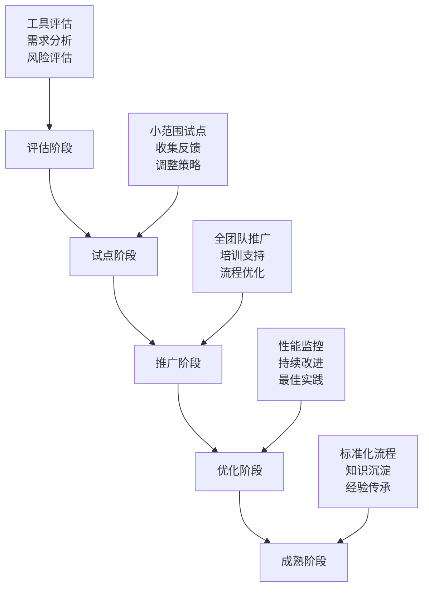

# 第6章：最佳实践与未来展望

## 📋 本章目录

- [📖 章节概述](#章节概述)
- [🏆 最佳实践总结](#最佳实践总结)

## 📄 章节文件导航

### 核心内容
- [最佳实践总结](./best-practices-summary.md) - Team Vibe Coding的最佳实践经验总结和实施指南

### 传统章节内容
- [传统章节内容](./chapter8.md) - 传统开发模式的相关内容
- [项目实施指南](./chapter9.md) - 项目实施的详细指南
- [交付与部署](./chapter10.md) - 项目交付和部署的相关内容

### 详细实施流程
- [项目实施详细流程](./chapter9/) - 项目实施的详细流程和操作指南
  - [CI/CD流程设计](./chapter9/cicd.md) - 持续集成和持续部署的流程设计
  - [文档实践指南](./chapter9/doc-practice.md) - 文档编写和维护的实践指南

### 交付部署指南
- [交付部署详细指南](./chapter10/) - 项目交付和部署的详细指南
  - [项目交付流程](./chapter10/delivery.md) - 完整的项目交付流程
  - [代码重构策略](./chapter10/refactoring.md) - 代码重构的策略和最佳实践
  - [逆向文档生成](./chapter10/reverse-doc.md) - 从代码生成文档的方法
  - [系统切换方案](./chapter10/switch-over.md) - 系统切换和迁移方案

## 🔗 章节导航

← [上一章：实战案例](../chapter5/README.md) | [返回主目录](../README.md) | [下一章：工具模板与资源库](../chapter7/README.md) →

---

## 章节概述

本章将总结Team Vibe Coding的最佳实践经验，分析当前面临的挑战，并展望AI驱动团队协作的未来发展趋势。通过深入分析成功案例和失败教训，为团队提供可操作的实践指南。

## 最佳实践总结

### 团队协作最佳实践

#### 1. 心理安全建设

**核心原则**
- **开放沟通**：鼓励团队成员表达不同观点和疑虑
- **错误容忍**：将错误视为学习机会，而非惩罚对象
- **持续改进**：定期回顾和优化协作流程
- **相互支持**：建立互助文化，共同解决问题

**实施策略**
```yaml
心理安全建设策略:
  日常实践:
    - 每日站会鼓励分享困难和挑战
    - 定期举办技术分享会
    - 建立匿名反馈机制
    - 庆祝团队成就和个人成长
  
  制度保障:
    - 制定"无责任事故"政策
    - 建立学习时间制度
    - 提供技能培训机会
    - 设立创新实验项目
  
  文化建设:
    - 领导者以身作则
    - 鼓励实验和创新
    - 重视过程而非仅仅结果
    - 建立学习型组织文化
```

**实际案例**
```markdown
# 某互联网公司心理安全建设案例

## 背景
团队在引入AI编程助手后，部分开发者担心被替代，导致抗拒使用新工具。

## 解决方案
1. **透明沟通**: 管理层明确表态AI是辅助工具，不会替代开发者
2. **技能提升**: 组织AI工具使用培训，提升团队整体能力
3. **成功分享**: 鼓励早期采用者分享使用经验和收益
4. **渐进推进**: 从简单任务开始，逐步扩大AI应用范围

## 效果
- 团队AI工具采用率从20%提升到95%
- 代码质量提升30%，开发效率提升40%
- 团队满意度和创新能力显著提升
```

#### 2. AI工具集成策略

**分阶段集成方法**


**工具选择标准**
```yaml
AI工具评估标准:
  功能性评估:
    - 代码生成质量 (权重: 30%)
    - 理解上下文能力 (权重: 25%)
    - 多语言支持 (权重: 15%)
    - 集成便利性 (权重: 15%)
    - 学习曲线 (权重: 15%)
  
  非功能性评估:
    - 性能表现 (权重: 20%)
    - 安全性 (权重: 25%)
    - 稳定性 (权重: 20%)
    - 成本效益 (权重: 20%)
    - 技术支持 (权重: 15%)
  
  团队适配性:
    - 现有工作流兼容性
    - 团队技能匹配度
    - 变更管理复杂度
    - 预期投资回报率
```

#### 3. 代码质量保障

**多层次质量控制**
```javascript
// 代码质量保障体系
class CodeQualityAssurance {
  constructor() {
    this.qualityGates = [
      'static-analysis',
      'unit-tests',
      'integration-tests',
      'code-review',
      'security-scan',
      'performance-test'
    ];
    
    this.qualityMetrics = {
      coverage: { minimum: 80, target: 90 },
      complexity: { maximum: 10, target: 5 },
      duplication: { maximum: 3, target: 1 },
      maintainability: { minimum: 'B', target: 'A' },
      security: { maximum: 0, target: 0 },
      performance: { responseTime: 2000, target: 1000 }
    };
  }

  async evaluateCodeQuality(codebase) {
    const results = {};
    
    // 静态代码分析
    results.staticAnalysis = await this.runStaticAnalysis(codebase);
    
    // 测试覆盖率检查
    results.testCoverage = await this.checkTestCoverage(codebase);
    
    // 代码复杂度分析
    results.complexity = await this.analyzeComplexity(codebase);
    
    // 安全漏洞扫描
    results.security = await this.scanSecurity(codebase);
    
    // 性能基准测试
    results.performance = await this.benchmarkPerformance(codebase);
    
    return this.generateQualityReport(results);
  }

  generateQualityReport(results) {
    const report = {
      overallScore: 0,
      passedGates: [],
      failedGates: [],
      recommendations: []
    };

    // 计算总体质量分数
    let totalScore = 0;
    let gateCount = 0;

    Object.entries(results).forEach(([gate, result]) => {
      if (this.isGatePassed(gate, result)) {
        report.passedGates.push(gate);
        totalScore += result.score;
      } else {
        report.failedGates.push({
          gate,
          reason: result.failureReason,
          recommendations: result.recommendations
        });
      }
      gateCount++;
    });

    report.overallScore = totalScore / gateCount;
    
    // 生成改进建议
    report.recommendations = this.generateRecommendations(results);
    
    return report;
  }

  generateRecommendations(results) {
    const recommendations = [];

    // 基于测试覆盖率生成建议
    if (results.testCoverage.percentage < this.qualityMetrics.coverage.minimum) {
      recommendations.push({
        type: 'test-coverage',
        priority: 'high',
        message: `测试覆盖率${results.testCoverage.percentage}%低于最低要求${this.qualityMetrics.coverage.minimum}%`,
        actions: [
          '为核心业务逻辑添加单元测试',
          '增加边界条件和异常情况测试',
          '考虑使用测试驱动开发(TDD)方法'
        ]
      });
    }

    // 基于代码复杂度生成建议
    if (results.complexity.average > this.qualityMetrics.complexity.maximum) {
      recommendations.push({
        type: 'complexity',
        priority: 'medium',
        message: `平均代码复杂度${results.complexity.average}超过最大值${this.qualityMetrics.complexity.maximum}`,
        actions: [
          '重构复杂函数，拆分为更小的函数',
          '使用设计模式简化代码结构',
          '考虑使用函数式编程减少复杂度'
        ]
      });
    }

    return recommendations;
  }
}

// 使用示例
const qualityAssurance = new CodeQualityAssurance();
const qualityReport = await qualityAssurance.evaluateCodeQuality('./src');

console.log('代码质量报告:', qualityReport);
```

### 项目管理最佳实践

#### 1. 敏捷开发与AI协作

**Scrum + AI增强模式**
```yaml
AI增强Scrum流程:
  Sprint规划:
    传统活动:
      - 产品待办事项梳理
      - 故事点估算
      - Sprint目标设定
    
    AI增强:
      - 自动化需求分析和拆解
      - 基于历史数据的工作量预测
      - 风险识别和缓解建议
      - 最优任务分配推荐
  
  每日站会:
    传统活动:
      - 昨日完成工作汇报
      - 今日计划分享
      - 阻碍问题讨论
    
    AI增强:
      - 自动生成进度报告
      - 识别潜在风险和阻碍
      - 提供解决方案建议
      - 团队协作效率分析
  
  Sprint评审:
    传统活动:
      - 完成功能演示
      - 利益相关者反馈
      - 产品待办事项调整
    
    AI增强:
      - 自动化测试报告生成
      - 代码质量分析报告
      - 性能指标对比分析
      - 用户体验改进建议
  
  Sprint回顾:
    传统活动:
      - 团队协作回顾
      - 流程改进讨论
      - 行动计划制定
    
    AI增强:
      - 团队效率数据分析
      - 协作模式优化建议
      - 技能提升推荐
      - 最佳实践识别
```

#### 2. 风险管理策略

**AI项目风险识别框架**
```javascript
// AI项目风险管理系统
class AIProjectRiskManager {
  constructor() {
    this.riskCategories = {
      technical: {
        weight: 0.4,
        factors: [
          'ai-model-accuracy',
          'integration-complexity',
          'performance-requirements',
          'security-vulnerabilities'
        ]
      },
      business: {
        weight: 0.3,
        factors: [
          'requirement-changes',
          'stakeholder-alignment',
          'market-competition',
          'regulatory-compliance'
        ]
      },
      organizational: {
        weight: 0.3,
        factors: [
          'team-skills',
          'change-resistance',
          'resource-availability',
          'timeline-pressure'
        ]
      }
    };
  }

  async assessProjectRisk(projectData) {
    const riskAssessment = {};
    
    for (const [category, config] of Object.entries(this.riskCategories)) {
      riskAssessment[category] = await this.assessCategoryRisk(
        category, 
        config, 
        projectData
      );
    }
    
    const overallRisk = this.calculateOverallRisk(riskAssessment);
    const mitigationPlan = this.generateMitigationPlan(riskAssessment);
    
    return {
      assessment: riskAssessment,
      overallRisk,
      mitigationPlan,
      recommendations: this.generateRecommendations(riskAssessment)
    };
  }

  async assessCategoryRisk(category, config, projectData) {
    const factorScores = {};
    let totalScore = 0;
    
    for (const factor of config.factors) {
      const score = await this.evaluateRiskFactor(factor, projectData);
      factorScores[factor] = score;
      totalScore += score;
    }
    
    const averageScore = totalScore / config.factors.length;
    
    return {
      score: averageScore,
      level: this.getRiskLevel(averageScore),
      factors: factorScores,
      weight: config.weight
    };
  }

  async evaluateRiskFactor(factor, projectData) {
    // 基于项目数据评估具体风险因子
    switch (factor) {
      case 'ai-model-accuracy':
        return this.evaluateModelAccuracy(projectData.aiModels);
      
      case 'integration-complexity':
        return this.evaluateIntegrationComplexity(projectData.architecture);
      
      case 'team-skills':
        return this.evaluateTeamSkills(projectData.team);
      
      case 'requirement-changes':
        return this.evaluateRequirementStability(projectData.requirements);
      
      default:
        return 5; // 默认中等风险
    }
  }

  generateMitigationPlan(riskAssessment) {
    const mitigationPlan = {};
    
    Object.entries(riskAssessment).forEach(([category, assessment]) => {
      if (assessment.level === 'high') {
        mitigationPlan[category] = this.getHighRiskMitigation(category);
      } else if (assessment.level === 'medium') {
        mitigationPlan[category] = this.getMediumRiskMitigation(category);
      }
    });
    
    return mitigationPlan;
  }

  getHighRiskMitigation(category) {
    const mitigationStrategies = {
      technical: [
        '增加技术专家评审',
        '建立技术原型验证',
        '制定技术风险应急预案',
        '增加测试覆盖率'
      ],
      business: [
        '加强需求管理流程',
        '建立变更控制委员会',
        '增加利益相关者沟通频率',
        '制定业务连续性计划'
      ],
      organizational: [
        '提供技能培训计划',
        '增加团队沟通和协作',
        '调整项目时间线',
        '增加资源投入'
      ]
    };
    
    return mitigationStrategies[category] || [];
  }
}

// 使用示例
const riskManager = new AIProjectRiskManager();
const projectData = {
  aiModels: { accuracy: 0.85, complexity: 'high' },
  architecture: { services: 8, integrations: 12 },
  team: { aiExperience: 'medium', size: 6 },
  requirements: { stability: 'low', complexity: 'high' }
};

const riskReport = await riskManager.assessProjectRisk(projectData);
console.log('项目风险评估报告:', riskReport);
```

### 技术实施最佳实践

#### 1. AI模型集成策略

**模型版本管理**
```yaml
AI模型版本管理策略:
  版本控制:
    - 使用语义化版本号 (major.minor.patch)
    - 维护模型变更日志
    - 建立模型回滚机制
    - 实施A/B测试验证
  
  部署策略:
    蓝绿部署:
      - 维护两套完整环境
      - 零停机时间切换
      - 快速回滚能力
      - 降低部署风险
    
    金丝雀发布:
      - 逐步流量切换
      - 实时监控指标
      - 自动异常检测
      - 渐进式验证
  
  监控指标:
    性能指标:
      - 响应时间
      - 吞吐量
      - 错误率
      - 资源使用率
    
    业务指标:
      - 准确率
      - 召回率
      - F1分数
      - 用户满意度
```

**模型监控系统**
```python
# AI模型监控系统
import logging
import time
from typing import Dict, List, Any
from dataclasses import dataclass
from datetime import datetime, timedelta

@dataclass
class ModelMetrics:
    accuracy: float
    precision: float
    recall: float
    f1_score: float
    response_time: float
    throughput: float
    error_rate: float
    timestamp: datetime

class ModelMonitor:
    def __init__(self, model_name: str, thresholds: Dict[str, float]):
        self.model_name = model_name
        self.thresholds = thresholds
        self.metrics_history: List[ModelMetrics] = []
        self.alerts: List[Dict[str, Any]] = []
        
        # 配置日志
        logging.basicConfig(level=logging.INFO)
        self.logger = logging.getLogger(f"ModelMonitor-{model_name}")
    
    def record_prediction(self, prediction_data: Dict[str, Any]) -> None:
        """记录单次预测的指标"""
        start_time = time.time()
        
        # 模拟预测过程
        prediction = self.make_prediction(prediction_data)
        
        end_time = time.time()
        response_time = (end_time - start_time) * 1000  # 转换为毫秒
        
        # 计算准确性指标（需要真实标签）
        if 'true_label' in prediction_data:
            accuracy = self.calculate_accuracy(prediction, prediction_data['true_label'])
            self.update_metrics(accuracy, response_time)
    
    def update_metrics(self, accuracy: float, response_time: float) -> None:
        """更新模型指标"""
        current_metrics = ModelMetrics(
            accuracy=accuracy,
            precision=0.0,  # 需要基于批量数据计算
            recall=0.0,     # 需要基于批量数据计算
            f1_score=0.0,   # 需要基于批量数据计算
            response_time=response_time,
            throughput=self.calculate_throughput(),
            error_rate=self.calculate_error_rate(),
            timestamp=datetime.now()
        )
        
        self.metrics_history.append(current_metrics)
        
        # 检查是否触发告警
        self.check_thresholds(current_metrics)
        
        # 保持历史记录在合理范围内
        if len(self.metrics_history) > 10000:
            self.metrics_history = self.metrics_history[-5000:]
    
    def check_thresholds(self, metrics: ModelMetrics) -> None:
        """检查指标是否超过阈值"""
        alerts = []
        
        if metrics.accuracy < self.thresholds.get('min_accuracy', 0.8):
            alerts.append({
                'type': 'accuracy_degradation',
                'severity': 'high',
                'message': f'模型准确率{metrics.accuracy:.3f}低于阈值{self.thresholds["min_accuracy"]}',
                'timestamp': metrics.timestamp,
                'value': metrics.accuracy
            })
        
        if metrics.response_time > self.thresholds.get('max_response_time', 2000):
            alerts.append({
                'type': 'high_latency',
                'severity': 'medium',
                'message': f'响应时间{metrics.response_time:.1f}ms超过阈值{self.thresholds["max_response_time"]}ms',
                'timestamp': metrics.timestamp,
                'value': metrics.response_time
            })
        
        if metrics.error_rate > self.thresholds.get('max_error_rate', 0.05):
            alerts.append({
                'type': 'high_error_rate',
                'severity': 'high',
                'message': f'错误率{metrics.error_rate:.3f}超过阈值{self.thresholds["max_error_rate"]}',
                'timestamp': metrics.timestamp,
                'value': metrics.error_rate
            })
        
        # 记录告警
        for alert in alerts:
            self.alerts.append(alert)
            self.logger.warning(f"模型告警: {alert['message']}")
            
            # 发送告警通知
            self.send_alert_notification(alert)
    
    def generate_health_report(self) -> Dict[str, Any]:
        """生成模型健康报告"""
        if not self.metrics_history:
            return {'status': 'no_data', 'message': '暂无监控数据'}
        
        recent_metrics = self.metrics_history[-100:]  # 最近100条记录
        
        avg_accuracy = sum(m.accuracy for m in recent_metrics) / len(recent_metrics)
        avg_response_time = sum(m.response_time for m in recent_metrics) / len(recent_metrics)
        avg_error_rate = sum(m.error_rate for m in recent_metrics) / len(recent_metrics)
        
        # 计算趋势
        accuracy_trend = self.calculate_trend([m.accuracy for m in recent_metrics])
        latency_trend = self.calculate_trend([m.response_time for m in recent_metrics])
        
        # 确定整体健康状态
        health_status = 'healthy'
        if avg_accuracy < self.thresholds.get('min_accuracy', 0.8):
            health_status = 'degraded'
        if avg_error_rate > self.thresholds.get('max_error_rate', 0.05):
            health_status = 'critical'
        
        return {
            'model_name': self.model_name,
            'status': health_status,
            'metrics': {
                'accuracy': {
                    'current': avg_accuracy,
                    'trend': accuracy_trend,
                    'threshold': self.thresholds.get('min_accuracy', 0.8)
                },
                'response_time': {
                    'current': avg_response_time,
                    'trend': latency_trend,
                    'threshold': self.thresholds.get('max_response_time', 2000)
                },
                'error_rate': {
                    'current': avg_error_rate,
                    'threshold': self.thresholds.get('max_error_rate', 0.05)
                }
            },
            'recent_alerts': self.alerts[-10:],  # 最近10条告警
            'recommendations': self.generate_recommendations(health_status, recent_metrics)
        }
    
    def generate_recommendations(self, health_status: str, recent_metrics: List[ModelMetrics]) -> List[str]:
        """基于健康状态生成改进建议"""
        recommendations = []
        
        if health_status == 'degraded':
            recommendations.extend([
                '考虑重新训练模型以提升准确率',
                '检查输入数据质量是否发生变化',
                '评估是否需要增加训练数据'
            ])
        
        if health_status == 'critical':
            recommendations.extend([
                '立即检查模型服务状态',
                '考虑回滚到上一个稳定版本',
                '增加监控频率和告警敏感度'
            ])
        
        # 基于性能趋势生成建议
        avg_response_time = sum(m.response_time for m in recent_metrics) / len(recent_metrics)
        if avg_response_time > 1500:
            recommendations.append('优化模型推理性能，考虑模型压缩或硬件升级')
        
        return recommendations
    
    def calculate_trend(self, values: List[float]) -> str:
        """计算指标趋势"""
        if len(values) < 2:
            return 'stable'
        
        # 简单的线性趋势计算
        first_half = values[:len(values)//2]
        second_half = values[len(values)//2:]
        
        first_avg = sum(first_half) / len(first_half)
        second_avg = sum(second_half) / len(second_half)
        
        change_rate = (second_avg - first_avg) / first_avg
        
        if change_rate > 0.05:
            return 'increasing'
        elif change_rate < -0.05:
            return 'decreasing'
        else:
            return 'stable'

# 使用示例
monitor = ModelMonitor(
    model_name='intent-classifier-v2.1',
    thresholds={
        'min_accuracy': 0.85,
        'max_response_time': 2000,
        'max_error_rate': 0.03
    }
)

# 模拟监控数据
for i in range(100):
    prediction_data = {
        'input_text': f'测试输入 {i}',
        'true_label': 'test_intent'
    }
    monitor.record_prediction(prediction_data)

# 生成健康报告
health_report = monitor.generate_health_report()
print("模型健康报告:", health_report)
```

#### 2. 性能优化策略

**系统性能优化框架**
```javascript
// 性能优化管理系统
class PerformanceOptimizer {
  constructor() {
    this.optimizationStrategies = {
      database: [
        'query-optimization',
        'index-optimization',
        'connection-pooling',
        'read-write-separation',
        'caching-strategy'
      ],
      application: [
        'code-optimization',
        'memory-management',
        'async-processing',
        'load-balancing',
        'microservice-optimization'
      ],
      infrastructure: [
        'server-scaling',
        'cdn-optimization',
        'network-optimization',
        'container-optimization',
        'monitoring-enhancement'
      ]
    };
    
    this.performanceMetrics = {
      responseTime: { target: 1000, threshold: 2000 },
      throughput: { target: 1000, threshold: 500 },
      errorRate: { target: 0.01, threshold: 0.05 },
      cpuUsage: { target: 60, threshold: 80 },
      memoryUsage: { target: 70, threshold: 85 }
    };
  }

  async analyzePerformance(systemMetrics) {
    const analysis = {
      bottlenecks: await this.identifyBottlenecks(systemMetrics),
      recommendations: [],
      prioritizedActions: [],
      estimatedImpact: {}
    };

    // 识别性能瓶颈
    analysis.bottlenecks.forEach(bottleneck => {
      const recommendations = this.getOptimizationRecommendations(bottleneck);
      analysis.recommendations.push(...recommendations);
    });

    // 优先级排序
    analysis.prioritizedActions = this.prioritizeOptimizations(analysis.recommendations);
    
    // 估算优化影响
    analysis.estimatedImpact = this.estimateOptimizationImpact(analysis.prioritizedActions);

    return analysis;
  }

  async identifyBottlenecks(metrics) {
    const bottlenecks = [];

    // 响应时间瓶颈
    if (metrics.responseTime > this.performanceMetrics.responseTime.threshold) {
      bottlenecks.push({
        type: 'response-time',
        severity: 'high',
        current: metrics.responseTime,
        target: this.performanceMetrics.responseTime.target,
        impact: 'user-experience'
      });
    }

    // 吞吐量瓶颈
    if (metrics.throughput < this.performanceMetrics.throughput.threshold) {
      bottlenecks.push({
        type: 'throughput',
        severity: 'medium',
        current: metrics.throughput,
        target: this.performanceMetrics.throughput.target,
        impact: 'scalability'
      });
    }

    // 资源使用瓶颈
    if (metrics.cpuUsage > this.performanceMetrics.cpuUsage.threshold) {
      bottlenecks.push({
        type: 'cpu-usage',
        severity: 'high',
        current: metrics.cpuUsage,
        target: this.performanceMetrics.cpuUsage.target,
        impact: 'system-stability'
      });
    }

    return bottlenecks;
  }

  getOptimizationRecommendations(bottleneck) {
    const recommendationMap = {
      'response-time': [
        {
          strategy: 'database-optimization',
          actions: [
            '优化慢查询SQL语句',
            '添加合适的数据库索引',
            '实施查询结果缓存',
            '考虑数据库分片'
          ],
          difficulty: 'medium',
          estimatedImpact: 'high'
        },
        {
          strategy: 'application-optimization',
          actions: [
            '优化业务逻辑代码',
            '实施异步处理',
            '减少不必要的计算',
            '优化算法复杂度'
          ],
          difficulty: 'high',
          estimatedImpact: 'medium'
        }
      ],
      'throughput': [
        {
          strategy: 'scaling-optimization',
          actions: [
            '实施水平扩展',
            '优化负载均衡策略',
            '增加服务器实例',
            '实施微服务架构'
          ],
          difficulty: 'high',
          estimatedImpact: 'high'
        }
      ],
      'cpu-usage': [
        {
          strategy: 'resource-optimization',
          actions: [
            '优化CPU密集型操作',
            '实施任务队列',
            '优化并发处理',
            '升级硬件配置'
          ],
          difficulty: 'medium',
          estimatedImpact: 'high'
        }
      ]
    };

    return recommendationMap[bottleneck.type] || [];
  }

  prioritizeOptimizations(recommendations) {
    // 基于影响和难度进行优先级排序
    const priorityScore = (rec) => {
      const impactScore = rec.estimatedImpact === 'high' ? 3 : 
                         rec.estimatedImpact === 'medium' ? 2 : 1;
      const difficultyScore = rec.difficulty === 'low' ? 3 : 
                             rec.difficulty === 'medium' ? 2 : 1;
      return impactScore * difficultyScore;
    };

    return recommendations
      .sort((a, b) => priorityScore(b) - priorityScore(a))
      .map((rec, index) => ({
        ...rec,
        priority: index + 1,
        score: priorityScore(rec)
      }));
  }

  async implementOptimization(optimization) {
    const implementation = {
      strategy: optimization.strategy,
      startTime: new Date(),
      status: 'in-progress',
      steps: [],
      metrics: {
        before: {},
        after: {},
        improvement: {}
      }
    };

    try {
      // 记录优化前的指标
      implementation.metrics.before = await this.captureMetrics();

      // 执行优化步骤
      for (const action of optimization.actions) {
        const step = await this.executeOptimizationStep(action);
        implementation.steps.push(step);
      }

      // 等待系统稳定
      await this.waitForStabilization();

      // 记录优化后的指标
      implementation.metrics.after = await this.captureMetrics();

      // 计算改进效果
      implementation.metrics.improvement = this.calculateImprovement(
        implementation.metrics.before,
        implementation.metrics.after
      );

      implementation.status = 'completed';
      implementation.endTime = new Date();

    } catch (error) {
      implementation.status = 'failed';
      implementation.error = error.message;
    }

    return implementation;
  }

  calculateImprovement(before, after) {
    const improvement = {};
    
    Object.keys(before).forEach(metric => {
      const beforeValue = before[metric];
      const afterValue = after[metric];
      
      if (metric === 'responseTime' || metric === 'errorRate') {
        // 越小越好的指标
        improvement[metric] = {
          absolute: beforeValue - afterValue,
          percentage: ((beforeValue - afterValue) / beforeValue) * 100
        };
      } else {
        // 越大越好的指标
        improvement[metric] = {
          absolute: afterValue - beforeValue,
          percentage: ((afterValue - beforeValue) / beforeValue) * 100
        };
      }
    });
    
    return improvement;
  }
}

// 使用示例
const optimizer = new PerformanceOptimizer();

const systemMetrics = {
  responseTime: 3500,  // 毫秒
  throughput: 300,     // QPS
  errorRate: 0.08,     // 8%
  cpuUsage: 85,        // 85%
  memoryUsage: 78      // 78%
};

const analysis = await optimizer.analyzePerformance(systemMetrics);
console.log('性能分析报告:', analysis);

// 实施优先级最高的优化
if (analysis.prioritizedActions.length > 0) {
  const topOptimization = analysis.prioritizedActions[0];
  const result = await optimizer.implementOptimization(topOptimization);
  console.log('优化实施结果:', result);
}
```

## 章节导航

### 6.1 最佳实践总结
- [团队协作最佳实践](./team-collaboration.md)
- [项目管理最佳实践](./project-management.md)
- [技术实施最佳实践](./technical-implementation.md)

### 6.2 挑战与解决方案
- [常见挑战分析](./common-challenges.md)
- [解决方案库](./solution-library.md)
- [案例研究](./case-studies.md)

### 6.3 未来发展趋势
- [AI技术发展趋势](./ai-trends.md)
- [团队协作演进](./collaboration-evolution.md)
- [工具生态展望](./tool-ecosystem.md)

### 6.4 行动指南
- [实施路线图](./implementation-roadmap.md)
- [成熟度评估](./maturity-assessment.md)
- [持续改进框架](./continuous-improvement.md)

---

**下一章节**: [第7章：工具模板与资源库](../chapter7/README.md)

**上一章节**: [第5章：实战案例 - 智能客服系统开发](../chapter5/README.md)