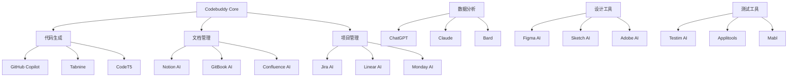

# Team Vibe Coding 最佳实践总结

## 团队协作最佳实践

### 心理安全建设

#### 建立信任文化

**核心原则**:
- **开放沟通**: 鼓励团队成员表达不同观点和疑虑
- **错误容忍**: 将错误视为学习机会而非惩罚对象
- **相互支持**: 建立互助互学的团队氛围
- **透明决策**: 重要决策过程公开透明

**实施策略**:
```yaml
心理安全建设行动计划:
  日常实践:
    - 每日站会分享学习心得和遇到的挑战
    - 定期举办技术分享会和经验交流
    - 建立匿名反馈机制收集团队意见
    - 设立"失败庆祝"环节，分享从错误中的学习
    
  制度保障:
    - 制定"无责任追究"的学习政策
    - 建立导师制度，新人与资深成员配对
    - 设立创新时间，允许探索新技术和想法
    - 定期进行团队建设活动增进感情
    
  评估指标:
    - 团队成员发言积极性
    - 主动提出问题和建议的频率
    - 跨部门协作的顺畅程度
    - 员工满意度和留存率
```

#### 有效沟通机制

**沟通原则**:
```typescript
// 团队沟通协议
interface CommunicationProtocol {
  // 同步沟通
  synchronous: {
    dailyStandup: {
      duration: "15分钟";
      format: "昨天完成 + 今天计划 + 遇到障碍";
      participants: "核心开发团队";
      aiAssistant: "Codebuddy记录和总结";
    };
    
    weeklyReview: {
      duration: "60分钟";
      format: "进展回顾 + 问题讨论 + 下周规划";
      participants: "全体团队成员";
      output: "会议纪要和行动计划";
    };
    
    technicalDiscussion: {
      trigger: "技术难点或架构决策";
      participants: "相关技术专家";
      format: "问题陈述 + 方案讨论 + 决策记录";
      aiSupport: "技术方案生成和评估";
    };
  };
  
  // 异步沟通
  asynchronous: {
    codeReview: {
      platform: "GitHub/GitLab";
      timeline: "24小时内响应";
      criteria: "功能性 + 可读性 + 性能 + 安全性";
      aiAssistance: "自动化代码质量检查";
    };
    
    documentation: {
      format: "Markdown + 图表";
      location: "项目Wiki或文档库";
      maintenance: "实时更新";
      aiGeneration: "自动生成API文档和注释";
    };
    
    knowledgeSharing: {
      platform: "内部博客或知识库";
      frequency: "每周至少一篇技术分享";
      topics: "最佳实践 + 踩坑经验 + 新技术探索";
      aiCuration: "智能推荐相关内容";
    };
  };
}
```

### AI工具集成策略

#### Codebuddy深度应用

**应用场景矩阵**:
```yaml
Codebuddy应用场景:
  代码开发:
    需求分析:
      - 用户故事转换为技术需求
      - 业务规则提取和整理
      - 接口设计和数据模型生成
      
    代码生成:
      - 基于需求自动生成代码框架
      - API接口和数据访问层生成
      - 测试用例和Mock数据生成
      
    代码优化:
      - 性能瓶颈识别和优化建议
      - 代码重构和结构优化
      - 安全漏洞检测和修复建议
      
  文档管理:
    自动生成:
      - API文档自动生成和更新
      - 代码注释智能补全
      - 架构图和流程图生成
      
    内容优化:
      - 文档可读性改进
      - 多语言文档翻译
      - 版本变更自动记录
      
  项目管理:
    进度跟踪:
      - 任务完成度自动评估
      - 风险识别和预警
      - 资源分配优化建议
      
    质量保障:
      - 代码质量评分
      - 测试覆盖率分析
      - 部署风险评估
```

**集成最佳实践**:
```javascript
// Codebuddy集成配置示例
const codebuddyConfig = {
  // 开发环境集成
  development: {
    ide: {
      vscode: {
        extensions: [
          "codebuddy-assistant",
          "codebuddy-code-generator", 
          "codebuddy-documentation"
        ],
        settings: {
          "codebuddy.autoComplete": true,
          "codebuddy.codeReview": true,
          "codebuddy.documentation": "auto-generate"
        }
      }
    },
    
    // Git集成
    git: {
      hooks: {
        "pre-commit": "codebuddy lint --fix",
        "commit-msg": "codebuddy validate-commit-message",
        "pre-push": "codebuddy security-scan"
      },
      workflows: {
        "pull-request": {
          "auto-review": true,
          "suggestion-generation": true,
          "test-generation": true
        }
      }
    },
    
    // CI/CD集成
    cicd: {
      pipeline: {
        stages: [
          {
            name: "code-analysis",
            tool: "codebuddy analyze",
            outputs: ["quality-report", "security-report"]
          },
          {
            name: "test-generation", 
            tool: "codebuddy generate-tests",
            coverage: "minimum-80%"
          },
          {
            name: "documentation",
            tool: "codebuddy update-docs",
            auto_deploy: true
          }
        ]
      }
    }
  },
  
  // 团队协作配置
  collaboration: {
    codeReview: {
      autoAssignment: true,
      aiSuggestions: true,
      knowledgeSharing: true
    },
    
    knowledgeBase: {
      autoExtraction: true,
      smartSearch: true,
      contentRecommendation: true
    },
    
    projectManagement: {
      taskTracking: true,
      riskAssessment: true,
      progressReporting: true
    }
  }
};
```

#### 多AI工具协同

**工具生态系统**:


### 代码质量保障

#### 多层次质量检查

**质量保障体系**:
```yaml
代码质量保障体系:
  静态分析:
    工具集成:
      - ESLint: JavaScript/TypeScript代码规范
      - SonarQube: 代码质量和安全漏洞检测
      - CodeClimate: 代码复杂度和可维护性分析
      - Snyk: 依赖安全漏洞扫描
      
    检查维度:
      - 代码规范: 命名、格式、结构
      - 复杂度: 圈复杂度、认知复杂度
      - 重复度: 代码重复率检测
      - 安全性: 常见安全漏洞识别
      
  动态测试:
    测试层次:
      - 单元测试: 函数和模块级别测试
      - 集成测试: 服务间接口测试
      - 端到端测试: 完整业务流程测试
      - 性能测试: 负载和压力测试
      
    覆盖率要求:
      - 单元测试覆盖率: ≥ 80%
      - 分支覆盖率: ≥ 70%
      - 功能覆盖率: ≥ 90%
      - API测试覆盖率: 100%
      
  人工审查:
    审查流程:
      - 功能性审查: 需求实现正确性
      - 架构审查: 设计模式和架构一致性
      - 性能审查: 性能优化和资源使用
      - 安全审查: 安全最佳实践遵循
      
    审查标准:
      - 可读性: 代码清晰易懂
      - 可维护性: 易于修改和扩展
      - 可测试性: 便于编写和执行测试
      - 可复用性: 组件和函数可复用
```

**自动化质量门禁**:
```javascript
// 质量门禁配置
const qualityGates = {
  // 提交前检查
  preCommit: {
    linting: {
      tool: "eslint",
      config: ".eslintrc.js",
      autoFix: true,
      failOnError: true
    },
    
    formatting: {
      tool: "prettier",
      config: ".prettierrc",
      autoFix: true
    },
    
    typeChecking: {
      tool: "typescript",
      strict: true,
      noImplicitAny: true
    }
  },
  
  // 合并前检查
  preMerge: {
    testing: {
      unitTests: {
        coverage: {
          statements: 80,
          branches: 70,
          functions: 80,
          lines: 80
        }
      },
      
      integrationTests: {
        required: true,
        timeout: "5m"
      }
    },
    
    codeQuality: {
      sonarQube: {
        qualityGate: "passed",
        newCodeCoverage: 80,
        duplicatedLines: "<3%",
        maintainabilityRating: "A"
      }
    },
    
    security: {
      snyk: {
        highVulnerabilities: 0,
        mediumVulnerabilities: "<5"
      },
      
      codeql: {
        enabled: true,
        languages: ["javascript", "typescript", "python"]
      }
    }
  },
  
  // 部署前检查
  preDeployment: {
    performanceTesting: {
      loadTesting: {
        tool: "k6",
        scenarios: ["normal_load", "stress_test"],
        thresholds: {
          "http_req_duration": ["p(95)<2000"],
          "http_req_failed": ["rate<0.1"]
        }
      }
    },
    
    securityTesting: {
      owasp: {
        tool: "zap",
        baseline: true,
        fullScan: false
      }
    },
    
    compatibilityTesting: {
      browsers: ["chrome", "firefox", "safari", "edge"],
      devices: ["desktop", "tablet", "mobile"]
    }
  }
};
```

## 项目管理最佳实践

### 敏捷开发与AI结合

#### AI增强的Scrum流程

**Sprint规划优化**:
```yaml
AI增强Sprint规划:
  需求分析:
    AI辅助:
      - 用户故事自动生成和优化
      - 验收标准智能推荐
      - 工作量估算辅助
      - 依赖关系识别
      
    工具集成:
      - Jira + AI插件进行需求管理
      - Confluence + AI生成需求文档
      - Miro + AI协助用户故事地图
      
  任务分解:
    智能分解:
      - 基于历史数据的任务拆分建议
      - 技能匹配的任务分配推荐
      - 风险评估和缓解策略生成
      - 时间估算的智能校准
      
    协作优化:
      - 并行任务识别和优化
      - 资源冲突检测和解决
      - 关键路径分析和优化
      - 团队负载均衡建议
      
  进度跟踪:
    实时监控:
      - 燃尽图自动生成和分析
      - 进度偏差预警和建议
      - 质量指标实时跟踪
      - 团队效能分析报告
      
    预测分析:
      - 完成时间预测
      - 风险概率评估
      - 资源需求预测
      - 质量趋势分析
```

**Daily Standup增强**:
```typescript
// AI增强的Daily Standup系统
interface AIEnhancedStandup {
  preparation: {
    // AI自动收集信息
    dataCollection: {
      gitCommits: "昨日代码提交分析";
      jiraUpdates: "任务状态变更总结";
      codeReviews: "代码审查进展";
      testResults: "测试执行结果";
    };
    
    // 智能生成报告
    reportGeneration: {
      accomplishments: "基于Git和Jira数据生成完成项";
      blockers: "基于任务状态识别阻塞项";
      todayPlan: "基于Sprint目标生成今日计划";
      riskAlerts: "识别潜在风险和建议";
    };
  };
  
  execution: {
    // 会议辅助
    meetingAssistance: {
      timeKeeping: "15分钟时间控制";
      focusGuide: "保持讨论聚焦";
      actionItems: "自动提取行动项";
      followUp: "跟进事项记录";
    };
    
    // 实时分析
    realTimeAnalysis: {
      sentimentAnalysis: "团队情绪分析";
      engagementTracking: "参与度监控";
      issueDetection: "问题早期识别";
      suggestionGeneration: "解决方案建议";
    };
  };
  
  followUp: {
    // 自动化跟进
    automation: {
      actionItemTracking: "行动项自动跟踪";
      reminderSystem: "智能提醒系统";
      progressUpdates: "进度自动更新";
      reportDistribution: "会议纪要分发";
    };
    
    // 持续改进
    continuousImprovement: {
      patternAnalysis: "会议模式分析";
      efficiencyMetrics: "效率指标跟踪";
      improvementSuggestions: "改进建议生成";
      bestPracticeExtraction: "最佳实践提取";
    };
  };
}
```

#### 风险管理策略

**风险识别与评估**:
```yaml
AI驱动风险管理:
  风险识别:
    技术风险:
      - 技术债务累积监控
      - 依赖库安全漏洞扫描
      - 性能瓶颈预测分析
      - 架构复杂度评估
      
    项目风险:
      - 进度延期概率预测
      - 资源不足风险评估
      - 需求变更影响分析
      - 团队协作风险识别
      
    业务风险:
      - 市场变化影响评估
      - 竞争对手分析
      - 用户需求变化趋势
      - 合规性风险检查
      
  风险评估:
    评估维度:
      - 发生概率: 基于历史数据和当前状态
      - 影响程度: 对项目目标的影响评估
      - 检测难度: 风险发现的难易程度
      - 应对成本: 风险缓解的资源需求
      
    评估方法:
      - 定量分析: 数据驱动的概率计算
      - 定性分析: 专家经验和判断
      - 场景分析: 多种情况下的影响模拟
      - 敏感性分析: 关键因素变化的影响
      
  风险应对:
    应对策略:
      - 风险规避: 改变计划避免风险
      - 风险缓解: 降低风险发生概率或影响
      - 风险转移: 将风险转移给第三方
      - 风险接受: 接受风险并制定应急计划
      
    监控机制:
      - 实时监控: 关键指标持续跟踪
      - 定期评估: 风险状态定期重新评估
      - 预警系统: 风险阈值触发告警
      - 应急响应: 风险发生时的快速响应
```

**风险管理工具链**:
```javascript
// 风险管理系统配置
const riskManagementSystem = {
  // 风险识别工具
  identification: {
    technicalRisks: {
      codeAnalysis: {
        tool: "SonarQube",
        metrics: ["technical_debt", "code_smells", "vulnerabilities"],
        thresholds: {
          technical_debt: "< 30 days",
          code_smells: "< 100",
          vulnerabilities: "0 high, < 5 medium"
        }
      },
      
      dependencyScanning: {
        tool: "Snyk",
        frequency: "daily",
        autoFix: true,
        notifications: ["slack", "email"]
      },
      
      performanceMonitoring: {
        tool: "New Relic",
        metrics: ["response_time", "throughput", "error_rate"],
        alerts: {
          response_time: "> 2s",
          error_rate: "> 1%"
        }
      }
    },
    
    projectRisks: {
      progressTracking: {
        tool: "Jira + AI Analytics",
        metrics: ["velocity", "burndown", "cycle_time"],
        predictions: {
          completion_date: "monte_carlo_simulation",
          resource_needs: "trend_analysis"
        }
      },
      
      teamHealth: {
        tool: "Team Mood Tracker",
        metrics: ["satisfaction", "engagement", "stress_level"],
        frequency: "weekly",
        anonymous: true
      }
    }
  },
  
  // 风险评估引擎
  assessment: {
    riskMatrix: {
      probability: ["very_low", "low", "medium", "high", "very_high"],
      impact: ["negligible", "minor", "moderate", "major", "catastrophic"],
      riskLevel: "probability * impact"
    },
    
    aiModel: {
      algorithm: "random_forest",
      features: [
        "historical_data",
        "project_complexity", 
        "team_experience",
        "technology_maturity"
      ],
      training_data: "past_projects_database"
    }
  },
  
  // 风险应对计划
  response: {
    automatedActions: {
      high_risk: [
        "notify_stakeholders",
        "escalate_to_management", 
        "activate_contingency_plan"
      ],
      medium_risk: [
        "increase_monitoring",
        "schedule_review_meeting",
        "update_mitigation_plan"
      ]
    },
    
    contingencyPlans: {
      technical_failure: {
        backup_systems: "cloud_failover",
        recovery_time: "< 4 hours",
        communication_plan: "stakeholder_notification"
      },
      
      resource_shortage: {
        external_contractors: "pre_approved_vendors",
        skill_gaps: "training_programs",
        timeline_adjustment: "scope_negotiation"
      }
    }
  }
};
```

## 技术实施最佳实践

### AI模型集成策略

#### 模型选择与优化

**模型评估框架**:
```yaml
AI模型评估体系:
  功能性评估:
    准确性指标:
      - 分类准确率: 整体预测正确率
      - 精确率: 正例预测的准确性
      - 召回率: 正例识别的完整性
      - F1分数: 精确率和召回率的调和平均
      
    性能指标:
      - 响应时间: 单次推理耗时
      - 吞吐量: 单位时间处理请求数
      - 并发能力: 同时处理的最大请求数
      - 资源消耗: CPU、内存、GPU使用率
      
    鲁棒性指标:
      - 异常输入处理: 对异常数据的容错能力
      - 边界情况处理: 极端情况下的表现
      - 数据漂移适应: 数据分布变化的适应性
      - 对抗攻击抵抗: 恶意输入的防护能力
      
  非功能性评估:
    可维护性:
      - 模型可解释性: 决策过程的透明度
      - 更新便利性: 模型升级的复杂度
      - 监控友好性: 运行状态的可观测性
      - 调试支持: 问题诊断的便利性
      
    可扩展性:
      - 水平扩展: 增加实例的能力
      - 垂直扩展: 提升单实例性能的能力
      - 弹性伸缩: 根据负载自动调整
      - 多区域部署: 跨地域部署的支持
      
    安全性:
      - 数据隐私: 训练和推理数据的保护
      - 模型安全: 模型参数和结构的保护
      - 访问控制: 模型服务的权限管理
      - 审计日志: 使用记录的完整性
```

**模型集成架构**:
```python
# AI模型集成架构示例
from typing import Dict, List, Optional, Union
import asyncio
from abc import ABC, abstractmethod

class ModelInterface(ABC):
    """AI模型统一接口"""
    
    @abstractmethod
    async def predict(self, input_data: Dict) -> Dict:
        """模型推理接口"""
        pass
    
    @abstractmethod
    async def health_check(self) -> bool:
        """健康检查接口"""
        pass
    
    @abstractmethod
    def get_metrics(self) -> Dict:
        """获取模型指标"""
        pass

class NLPModel(ModelInterface):
    """自然语言处理模型"""
    
    def __init__(self, model_path: str, config: Dict):
        self.model_path = model_path
        self.config = config
        self.model = self._load_model()
        
    async def predict(self, input_data: Dict) -> Dict:
        """
        NLP模型推理
        
        Args:
            input_data: {
                "text": "用户输入文本",
                "context": "对话上下文",
                "user_id": "用户ID"
            }
            
        Returns:
            {
                "intent": "用户意图",
                "entities": "实体识别结果", 
                "confidence": "置信度",
                "response": "回复内容"
            }
        """
        try:
            # 预处理
            processed_input = self._preprocess(input_data)
            
            # 模型推理
            prediction = await self._inference(processed_input)
            
            # 后处理
            result = self._postprocess(prediction)
            
            # 记录指标
            self._update_metrics(result)
            
            return result
            
        except Exception as e:
            self._handle_error(e)
            return self._get_fallback_response()
    
    async def health_check(self) -> bool:
        """模型健康检查"""
        try:
            test_input = {"text": "健康检查测试"}
            result = await self.predict(test_input)
            return result is not None
        except:
            return False
    
    def get_metrics(self) -> Dict:
        """获取模型性能指标"""
        return {
            "total_requests": self.total_requests,
            "avg_response_time": self.avg_response_time,
            "error_rate": self.error_rate,
            "accuracy": self.accuracy
        }

class ModelOrchestrator:
    """模型编排器"""
    
    def __init__(self):
        self.models: Dict[str, ModelInterface] = {}
        self.load_balancer = LoadBalancer()
        self.circuit_breaker = CircuitBreaker()
        
    def register_model(self, name: str, model: ModelInterface):
        """注册模型"""
        self.models[name] = model
        
    async def predict(self, model_name: str, input_data: Dict) -> Dict:
        """统一推理接口"""
        # 负载均衡
        model_instance = self.load_balancer.get_instance(model_name)
        
        # 熔断保护
        if self.circuit_breaker.is_open(model_name):
            return self._get_cached_response(input_data)
        
        try:
            # 执行推理
            result = await model_instance.predict(input_data)
            
            # 更新熔断器状态
            self.circuit_breaker.record_success(model_name)
            
            return result
            
        except Exception as e:
            # 记录失败
            self.circuit_breaker.record_failure(model_name)
            
            # 返回降级响应
            return self._get_fallback_response(model_name, input_data)
    
    async def batch_predict(self, requests: List[Dict]) -> List[Dict]:
        """批量推理"""
        tasks = []
        for request in requests:
            task = self.predict(
                request["model_name"], 
                request["input_data"]
            )
            tasks.append(task)
        
        results = await asyncio.gather(*tasks, return_exceptions=True)
        return results

class ModelMonitor:
    """模型监控系统"""
    
    def __init__(self, orchestrator: ModelOrchestrator):
        self.orchestrator = orchestrator
        self.metrics_collector = MetricsCollector()
        
    async def monitor_models(self):
        """监控所有模型"""
        while True:
            for model_name, model in self.orchestrator.models.items():
                # 健康检查
                is_healthy = await model.health_check()
                
                # 收集指标
                metrics = model.get_metrics()
                
                # 记录监控数据
                self.metrics_collector.record(model_name, {
                    "health": is_healthy,
                    "metrics": metrics,
                    "timestamp": datetime.now()
                })
                
                # 异常告警
                if not is_healthy or self._is_anomaly(metrics):
                    await self._send_alert(model_name, metrics)
            
            # 等待下次检查
            await asyncio.sleep(60)  # 每分钟检查一次
    
    def _is_anomaly(self, metrics: Dict) -> bool:
        """异常检测"""
        # 基于历史数据的异常检测逻辑
        return (
            metrics.get("error_rate", 0) > 0.05 or  # 错误率超过5%
            metrics.get("avg_response_time", 0) > 2000 or  # 响应时间超过2秒
            metrics.get("accuracy", 1) < 0.8  # 准确率低于80%
        )
    
    async def _send_alert(self, model_name: str, metrics: Dict):
        """发送告警"""
        alert_message = f"模型 {model_name} 出现异常: {metrics}"
        # 发送到Slack、邮件等告警渠道
        await self.alert_sender.send(alert_message)

# 使用示例
async def main():
    # 创建模型编排器
    orchestrator = ModelOrchestrator()
    
    # 注册NLP模型
    nlp_model = NLPModel(
        model_path="/models/nlp_model.pkl",
        config={"max_length": 512, "batch_size": 32}
    )
    orchestrator.register_model("nlp", nlp_model)
    
    # 启动监控
    monitor = ModelMonitor(orchestrator)
    asyncio.create_task(monitor.monitor_models())
    
    # 处理推理请求
    input_data = {
        "text": "我想查询订单状态",
        "context": "用户刚刚登录系统",
        "user_id": "user123"
    }
    
    result = await orchestrator.predict("nlp", input_data)
    print(f"推理结果: {result}")

if __name__ == "__main__":
    asyncio.run(main())
```

### 性能优化策略

#### 系统性能优化

**性能优化层次**:
```yaml
性能优化策略:
  前端优化:
    资源优化:
      - 代码分割: 按路由和功能拆分代码包
      - 懒加载: 非关键资源延迟加载
      - 资源压缩: Gzip/Brotli压缩
      - 图片优化: WebP格式、响应式图片
      
    渲染优化:
      - 虚拟滚动: 大列表性能优化
      - 防抖节流: 高频事件优化
      - 缓存策略: 组件和数据缓存
      - 预渲染: SSR/SSG提升首屏速度
      
    网络优化:
      - HTTP/2: 多路复用和服务器推送
      - CDN: 静态资源分发加速
      - 预连接: DNS预解析和连接预热
      - 缓存策略: 浏览器和代理缓存
      
  后端优化:
    数据库优化:
      - 索引优化: 查询性能提升
      - 查询优化: SQL语句和ORM优化
      - 连接池: 数据库连接管理
      - 读写分离: 负载分散和性能提升
      
    缓存策略:
      - 多级缓存: 内存、Redis、CDN
      - 缓存预热: 热点数据预加载
      - 缓存更新: 一致性和失效策略
      - 缓存监控: 命中率和性能指标
      
    并发处理:
      - 异步处理: 非阻塞I/O和事件循环
      - 消息队列: 任务异步处理
      - 负载均衡: 请求分发和故障转移
      - 限流熔断: 系统保护和稳定性
      
  AI模型优化:
    模型压缩:
      - 量化: 降低模型精度减少计算量
      - 剪枝: 移除不重要的神经元连接
      - 蒸馏: 用小模型学习大模型知识
      - 优化器: 更高效的推理引擎
      
    推理优化:
      - 批处理: 批量推理提升吞吐量
      - 模型并行: 多GPU并行计算
      - 缓存预测: 常见查询结果缓存
      - 边缘计算: 就近推理减少延迟
```

**性能监控体系**:
```javascript
// 性能监控配置
const performanceMonitoring = {
  // 前端性能监控
  frontend: {
    webVitals: {
      metrics: [
        "First Contentful Paint (FCP)",
        "Largest Contentful Paint (LCP)", 
        "First Input Delay (FID)",
        "Cumulative Layout Shift (CLS)"
      ],
      thresholds: {
        FCP: "< 1.8s",
        LCP: "< 2.5s", 
        FID: "< 100ms",
        CLS: "< 0.1"
      },
      tools: ["Lighthouse", "Web Vitals", "Real User Monitoring"]
    },
    
    customMetrics: {
      apiResponseTime: "API请求响应时间",
      componentRenderTime: "组件渲染时间",
      bundleSize: "代码包大小",
      errorRate: "JavaScript错误率"
    }
  },
  
  // 后端性能监控
  backend: {
    applicationMetrics: {
      responseTime: {
        p50: "< 200ms",
        p95: "< 500ms", 
        p99: "< 1000ms"
      },
      throughput: "requests per second",
      errorRate: "< 0.1%",
      availability: "> 99.9%"
    },
    
    systemMetrics: {
      cpu: "< 70%",
      memory: "< 80%",
      disk: "< 85%",
      network: "bandwidth utilization"
    },
    
    databaseMetrics: {
      queryTime: "< 100ms average",
      connectionPool: "utilization < 80%",
      lockWaits: "minimal lock contention",
      replication: "lag < 1s"
    }
  },
  
  // AI模型性能监控
  aiModels: {
    inferenceMetrics: {
      latency: "< 500ms per request",
      throughput: "requests per second",
      accuracy: "> 85%",
      resourceUtilization: "GPU/CPU usage"
    },
    
    modelHealth: {
      predictionDrift: "output distribution changes",
      dataDrift: "input distribution changes", 
      modelDegradation: "accuracy decline over time",
      anomalyDetection: "unusual prediction patterns"
    }
  },
  
  // 告警配置
  alerting: {
    channels: ["slack", "email", "pagerduty"],
    escalation: {
      warning: "team notification",
      critical: "on-call engineer",
      emergency: "management escalation"
    },
    
    rules: [
      {
        condition: "response_time > 2s for 5 minutes",
        severity: "warning",
        action: "auto_scale_up"
      },
      {
        condition: "error_rate > 5% for 2 minutes", 
        severity: "critical",
        action: "circuit_breaker_open"
      },
      {
        condition: "availability < 99% for 1 minute",
        severity: "emergency", 
        action: "incident_response"
      }
    ]
  }
};
```

#### 可扩展性设计

**微服务架构实践**:
```yaml
微服务设计原则:
  服务拆分:
    业务边界:
      - 单一职责: 每个服务专注一个业务领域
      - 高内聚: 相关功能聚合在同一服务
      - 低耦合: 服务间依赖最小化
      - 自治性: 服务独立开发、部署、扩展
      
    技术边界:
      - 数据独立: 每个服务拥有独立数据存储
      - 技术栈自由: 服务可选择最适合的技术
      - 部署独立: 服务可独立部署和版本管理
      - 故障隔离: 单个服务故障不影响整体
      
  服务通信:
    同步通信:
      - REST API: 标准HTTP接口
      - GraphQL: 灵活的查询接口
      - gRPC: 高性能RPC通信
      - 服务网格: 统一通信管理
      
    异步通信:
      - 消息队列: 解耦和异步处理
      - 事件驱动: 基于事件的松耦合架构
      - 发布订阅: 一对多的消息分发
      - 流处理: 实时数据流处理
      
  数据管理:
    数据一致性:
      - 最终一致性: 分布式系统的现实选择
      - 事务补偿: Saga模式处理分布式事务
      - 事件溯源: 基于事件的状态重建
      - CQRS: 读写分离优化性能
      
    数据同步:
      - 变更数据捕获: 实时数据同步
      - 双写一致性: 确保数据写入一致
      - 数据复制: 跨服务数据共享
      - 缓存同步: 分布式缓存一致性
```

**容器化和编排**:
```yaml
# Kubernetes部署配置
apiVersion: apps/v1
kind: Deployment
metadata:
  name: chatbot-api
  labels:
    app: chatbot-api
    version: v1.0.0
spec:
  replicas: 3
  selector:
    matchLabels:
      app: chatbot-api
  template:
    metadata:
      labels:
        app: chatbot-api
    spec:
      containers:
      - name: api-server
        image: chatbot/api:v1.0.0
        ports:
        - containerPort: 8000
        env:
        - name: DATABASE_URL
          valueFrom:
            secretKeyRef:
              name: db-secret
              key: url
        - name: REDIS_URL
          valueFrom:
            configMapKeyRef:
              name: cache-config
              key: redis-url
        resources:
          requests:
            memory: "256Mi"
            cpu: "250m"
          limits:
            memory: "512Mi" 
            cpu: "500m"
        livenessProbe:
          httpGet:
            path: /health
            port: 8000
          initialDelaySeconds: 30
          periodSeconds: 10
        readinessProbe:
          httpGet:
            path: /ready
            port: 8000
          initialDelaySeconds: 5
          periodSeconds: 5
        
---
apiVersion: v1
kind: Service
metadata:
  name: chatbot-api-service
spec:
  selector:
    app: chatbot-api
  ports:
  - protocol: TCP
    port: 80
    targetPort: 8000
  type: LoadBalancer

---
apiVersion: autoscaling/v2
kind: HorizontalPodAutoscaler
metadata:
  name: chatbot-api-hpa
spec:
  scaleTargetRef:
    apiVersion: apps/v1
    kind: Deployment
    name: chatbot-api
  minReplicas: 3
  maxReplicas: 10
  metrics:
  - type: Resource
    resource:
      name: cpu
      target:
        type: Utilization
        averageUtilization: 70
  - type: Resource
    resource:
      name: memory
      target:
        type: Utilization
        averageUtilization: 80
```

## 持续改进机制

### 团队学习与成长

#### 知识管理体系

**知识沉淀流程**:
```yaml
知识管理流程:
  知识创建:
    来源识别:
      - 项目实践: 开发过程中的经验总结
      - 问题解决: 技术难题的解决方案
      - 最佳实践: 团队认可的优秀做法
      - 外部学习: 培训、会议、文档学习
      
    内容标准:
      - 结构化: 统一的文档模板和格式
      - 可搜索: 关键词和标签体系
      - 可验证: 包含示例和验证步骤
      - 可更新: 版本管理和更新机制
      
  知识整理:
    分类体系:
      - 技术知识: 编程语言、框架、工具
      - 业务知识: 领域专业知识和流程
      - 项目知识: 项目特定的经验和教训
      - 团队知识: 协作方式和文化传承
      
    质量控制:
      - 同行评审: 专家审核确保准确性
      - 实践验证: 实际应用验证有效性
      - 定期更新: 保持内容的时效性
      - 反馈收集: 使用者反馈改进内容
      
  知识分享:
    分享渠道:
      - 技术分享会: 定期的团队技术交流
      - 内部博客: 个人和团队的知识分享
      - 代码审查: 代码中的知识传递
      - 导师制度: 一对一的知识传承
      
    激励机制:
      - 贡献认可: 知识分享的公开表彰
      - 成长机会: 分享者的能力提升机会
      - 团队文化: 营造学习分享的氛围
      - 工具支持: 便利的分享工具和平台
      
  知识应用:
    应用场景:
      - 新人培训: 快速上手项目和技术
      - 问题解决: 查找已有的解决方案
      - 决策支持: 基于历史经验做决策
      - 创新启发: 从已有知识中获得灵感
      
    效果评估:
      - 使用频率: 知识内容的访问统计
      - 问题解决: 通过知识库解决的问题数
      - 时间节约: 减少的重复学习时间
      - 质量提升: 基于知识应用的质量改进
```

#### 技能发展规划

**个人成长路径**:
```typescript
// 技能发展框架
interface SkillDevelopmentFramework {
  // 技能评估
  skillAssessment: {
    technicalSkills: {
      programming: {
        languages: ["JavaScript", "TypeScript", "Python", "Go"];
        frameworks: ["React", "Node.js", "FastAPI", "Gin"];
        tools: ["Git", "Docker", "Kubernetes", "AWS"];
        level: "beginner" | "intermediate" | "advanced" | "expert";
      };
      
      aiSkills: {
        machineLearning: ["supervised", "unsupervised", "reinforcement"];
        deepLearning: ["CNN", "RNN", "Transformer", "GAN"];
        nlp: ["tokenization", "embedding", "classification", "generation"];
        tools: ["TensorFlow", "PyTorch", "Hugging Face", "MLflow"];
      };
      
      softwareEngineering: {
        design: ["OOP", "design_patterns", "architecture", "microservices"];
        testing: ["unit_testing", "integration_testing", "e2e_testing"];
        devops: ["ci_cd", "monitoring", "logging", "security"];
        collaboration: ["code_review", "documentation", "mentoring"];
      };
    };
    
    softSkills: {
      communication: ["presentation", "writing", "listening", "negotiation"];
      leadership: ["team_building", "decision_making", "conflict_resolution"];
      problemSolving: ["analytical_thinking", "creativity", "debugging"];
      learning: ["self_directed", "knowledge_sharing", "adaptability"];
    };
  };
  
  // 发展计划
  developmentPlan: {
    shortTerm: {
      duration: "3-6 months";
      goals: [
        "掌握新的AI工具和框架",
        "提升代码质量和性能优化能力", 
        "加强团队协作和沟通技能"
      ];
      activities: [
        "参与在线课程和认证",
        "承担具有挑战性的项目任务",
        "参加技术会议和社区活动"
      ];
    };
    
    mediumTerm: {
      duration: "6-12 months";
      goals: [
        "成为某个技术领域的专家",
        "具备跨领域协作能力",
        "能够指导和培养新团队成员"
      ];
      activities: [
        "深入研究特定技术领域",
        "参与开源项目贡献",
        "担任技术分享和培训的讲师"
      ];
    };
    
    longTerm: {
      duration: "1-2 years";
      goals: [
        "成为技术领导者或架构师",
        "具备产品和业务理解能力",
        "能够推动技术创新和团队发展"
      ];
      activities: [
        "承担技术决策和架构设计责任",
        "参与产品规划和业务决策",
        "建立和优化团队技术文化"
      ];
    };
  };
  
  // 学习资源
  learningResources: {
    internal: {
      mentorship: "内部导师制度";
      knowledgeBase: "团队知识库";
      techTalks: "技术分享会";
      codeReview: "代码审查学习";
    };
    
    external: {
      onlineCourses: ["Coursera", "Udemy", "Pluralsight"];
      certifications: ["AWS", "Google Cloud", "Microsoft Azure"];
      conferences: ["技术大会", "开发者峰会"];
      communities: ["GitHub", "Stack Overflow", "技术论坛"];
    };
    
    aiAssisted: {
      codebuddy: "AI编程助手指导";
      personalizedLearning: "个性化学习路径推荐";
      skillGapAnalysis: "技能差距分析";
      progressTracking: "学习进度跟踪";
    };
  };
}
```

### 流程优化与创新

#### 持续改进文化

**改进机制设计**:
```yaml
持续改进体系:
  问题识别:
    数据驱动:
      - 性能指标监控: 系统和团队效能指标
      - 用户反馈收集: 内外部用户的意见建议
      - 团队回顾: 定期的项目和流程回顾
      - 行业对标: 与行业最佳实践的对比
      
    主动发现:
      - 流程审计: 定期检查流程的有效性
      - 创新实验: 尝试新的工具和方法
      - 跨团队交流: 学习其他团队的优秀实践
      - 外部学习: 参加会议和培训获得新思路
      
  改进实施:
    实验方法:
      - 小规模试点: 在小范围内测试新方法
      - A/B测试: 对比不同方案的效果
      - 渐进式改进: 逐步推广成功的改进
      - 快速迭代: 短周期的改进循环
      
    变更管理:
      - 影响评估: 分析改进对团队和项目的影响
      - 培训支持: 为团队提供必要的培训
      - 沟通协调: 确保所有相关方理解变更
      - 监控反馈: 跟踪改进效果并及时调整
      
  效果评估:
    量化指标:
      - 效率提升: 开发速度和质量的改善
      - 成本节约: 时间和资源的节省
      - 质量改进: 缺陷率和用户满意度
      - 团队满意度: 工作体验和成长感受
      
    定性评估:
      - 团队反馈: 成员对改进的主观感受
      - 文化变化: 团队协作和学习氛围
      - 创新能力: 团队的创新意识和能力
      - 适应性: 面对变化的应对能力
      
  知识固化:
    最佳实践:
      - 成功经验总结: 将有效的改进固化为标准
      - 失败教训记录: 避免重复同样的错误
      - 流程文档化: 更新流程文档和指南
      - 培训材料: 制作培训和参考材料
      
    文化传承:
      - 价值观强化: 将改进精神融入团队文化
      - 激励机制: 鼓励持续改进的行为
      - 榜样树立: 表彰改进贡献者
      - 新人培养: 向新成员传递改进文化
```

**创新实践案例**:
```javascript
// 创新实践跟踪系统
const innovationTracker = {
  // 创新项目管理
  projects: [
    {
      id: "innovation-001",
      title: "AI辅助代码审查优化",
      description: "使用AI分析代码质量并提供改进建议",
      status: "in_progress",
      team: ["张三", "李四", "王五"],
      timeline: {
        start: "2023-10-01",
        end: "2023-12-31",
        milestones: [
          { date: "2023-10-15", task: "需求分析完成" },
          { date: "2023-11-15", task: "原型开发完成" },
          { date: "2023-12-15", task: "试点测试完成" }
        ]
      },
      metrics: {
        baseline: {
          review_time: "2 hours per PR",
          defect_rate: "5%",
          developer_satisfaction: "3.5/5"
        },
        target: {
          review_time: "1 hour per PR", 
          defect_rate: "2%",
          developer_satisfaction: "4.5/5"
        }
      }
    },
    
    {
      id: "innovation-002", 
      title: "智能测试用例生成",
      description: "基于代码变更自动生成相关测试用例",
      status: "planning",
      team: ["赵六", "钱七"],
      expectedBenefits: [
        "提升测试覆盖率",
        "减少手动编写测试用例时间",
        "提高测试质量和一致性"
      ]
    }
  ],
  
  // 创新评估框架
  evaluationFramework: {
    criteria: {
      feasibility: {
        technical: "技术可行性评估",
        resource: "资源需求评估", 
        timeline: "时间可行性评估"
      },
      
      impact: {
        efficiency: "效率提升潜力",
        quality: "质量改进潜力",
        satisfaction: "团队满意度影响"
      },
      
      risk: {
        technical_risk: "技术实现风险",
        adoption_risk: "团队接受风险",
        maintenance_risk: "长期维护风险"
      }
    },
    
    scoring: {
      scale: "1-5分",
      weights: {
        feasibility: 0.3,
        impact: 0.5, 
        risk: 0.2
      },
      threshold: 3.5  // 最低通过分数
    }
  },
  
  // 成功案例库
  successStories: [
    {
      title: "并行开发流程优化",
      description: "引入Git Worktrees实现真正的并行开发",
      results: {
        development_speed: "+40%",
        merge_conflicts: "-60%",
        team_satisfaction: "+25%"
      },
      lessons: [
        "充分的培训是成功的关键",
        "工具配置需要标准化",
        "需要建立新的协作规范"
      ]
    },
    
    {
      title: "AI辅助文档生成",
      description: "使用Codebuddy自动生成和维护项目文档",
      results: {
        documentation_coverage: "+80%",
        maintenance_time: "-50%",
        documentation_quality: "+60%"
      },
      lessons: [
        "AI生成的内容需要人工审核",
        "模板和规范很重要",
        "持续优化提示词效果更好"
      ]
    }
  ]
};
```

这个最佳实践总结为Team Vibe Coding的实施提供了全面的指导，涵盖了团队协作、项目管理和技术实施的各个方面，帮助团队建立高效的AI增强开发文化。