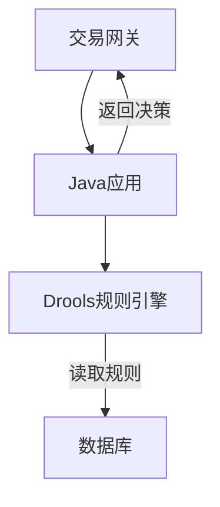

# 第10章 AI交易风险引擎重构案例（高风险）

> "在金融科技领域，风险控制系统是皇冠上的明珠。重构它，如同在悬崖上走钢丝，每一步都必须精确到微米，因为脚下是万丈深渊。"

## 项目概述

欢迎来到本书实战部分的终极挑战。本章将深入一个真实的高风险项目：重构一个在线交易系统的核心——实时风险引擎。这个系统需要在几十毫秒内，对每一笔交易进行风险评估，以防止欺诈。与前两个案例不同，这个项目的任何失误，无论是性能下降还是决策错误，都将直接导致公司资金的损失。

## 项目基本信息

| 项目属性 | 详细信息 |
| :--- | :--- |
| **项目名称** | “鹰眼”——下一代AI交易风险引擎 |
| **风险等级** | **高风险**（核心交易链路，直接影响公司营收和资产安全） |
| **团队规模** | 6人（资深后端2人、AI科学家2人、SRE 1人、风控产品经理1人） |
| **开发周期** | 12周 |
| **技术栈** | **旧:** Java, Drools规则引擎<br>**新:** Go, Python (for model serving), Kafka, Redis, ScyllaDB |

## 核心挑战：为什么是“高风险”？

1.  **极端性能要求 (Low Latency)**：风险评估必须在50毫秒内完成。任何额外的延迟都可能导致交易超时，影响用户体验和交易成功率。
2.  **绝对可靠性 (High Availability)**：系统必须达到99.99%的可用性。一分钟的宕机都可能造成巨大的经济损失和品牌声誉损害。
3.  **决策的准确性与可解释性**：旧的规则引擎虽然僵化，但每一条决策都有明确的规则可循。新的AI模型在提升识别率的同时，必须提供决策依据，以应对审计和争议。
4.  **零感知切换**：切换过程必须对用户和交易系统完全透明，不能有任何中断或数据不一致。

## 项目架构图：从“规则驱动”到“模型驱动”

**旧系统架构 (Before):**


**新系统架构 (After):**
```mermaid
graph TD
    subgraph "实时数据流"
        A[交易网关] --> K[Kafka: 交易事件流];
    end
    subgraph "特征工程"
        K --> FE[Go: 实时特征计算服务];
        FE --> R[Redis: 用户短期特征];
        FE --> S[ScyllaDB: 用户长期特征];
    end
    subgraph "AI决策核心"
        FE -- 拼接特征 --> M[Python: AI模型服务 (TensorFlow Serving)];
        M -- 返回风险评分 --> FE;
    end
    subgraph "决策与执行"
        FE -- 包含评分的决策 --> A;
    end
```

## 团队协作亮点

- **AI协作生成高并发测试用例**：利用AI模拟各种极端交易场景和攻击模式，对新系统进行压力测试。
- **AI协作进行形式化验证**：在关键的算法和并发逻辑上，尝试使用AI协作工具来形式化地证明其正确性，而不仅仅是测试。
- **AI协作生成可解释性报告**：当AI模型做出“高风险”决策时，由另一个AI服务（Explainable AI, XAI）自动生成一份人类可读的报告，解释是哪些特征导致了这个决策。
- **AI驱动的A/B测试与模型冠军赛**：在新旧系统并行期间，利用AI设计和分析A/B测试，科学地量化新模型相对于旧规则引擎的提升，并支持多个候选模型进行在线“冠军赛”。

## 本章内容导航

本章将以前所未有的深度，探讨在极限要求下的工程实践：
1.  **AI协作的性能建模与瓶颈预测**
2.  **并发安全与形式化验证**
3.  **AI模型的可解释性与公平性保障**
4.  **“影子”与“回放”：零风险的线上验证**
5.  **基于AI分析的智能A/B测试与模型迭代**

---

**本章小结：** 高风险项目是检验一个工程团队综合能力的最终试金石。它要求团队不仅要有顶尖的技术能力，更要有如履薄冰的敬畏心和严谨到极致的流程保障。“团队Vibe Coding”模式在此将接受最严苛的考验，我们将看到AI如何从一个“效率工具”，转变为保障系统正确性、可靠性和安全性的“守护者”。

**下一部分预告：** [第五部分：未来展望与最佳实践](part5/chapter11.md)

**详细内容：**
- [AI协作的性能建模与瓶颈预测](chapter10/performance-modeling.md)
- [并发安全与形式化验证](chapter10/concurrent-safety.md)
- [AI模型的可解释性与公平性保障](chapter10/explainable-ai.md)
- [“影子”与“回放”：零风险的线上验证](chapter10/shadow-replay.md)
- [基于AI分析的智能A/B测试与模型迭代](chapter10/intelligent-ab-testing.md)