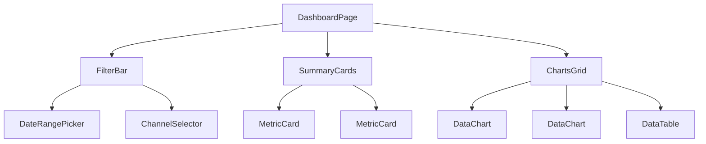

# 现代前端的组件化重写

如果说后端重构是为项目更换了“引擎”，那么前端重构就是重新设计了“驾驶舱”和“仪表盘”。旧系统的前端由混杂在PHP文件中的jQuery代码和HTML构成，逻辑与视图紧密耦合，牵一发而动全身，我们称之为“意大利面条式代码”。这种代码不仅维护成本极高，也无法实现现代数据应用所要求的复杂交互和动态可视化。

## 核心理念：从“页面”到“组件”的思维转变

我们的重构理念是彻底抛弃以“页面”为单位的开发模式，转向以“组件”为核心的现代前端架构。

- **原子化拆分**：将复杂的仪表盘界面，拆分为一个个独立的、可复用的“积木块”（组件），如日期选择器、指标卡、趋势图、数据表格等。
- **响应式数据流**：每个组件只负责自己的数据显示和交互，数据在组件间通过清晰的单向数据流（Props down, Events up）或全局状态管理（Pinia）进行传递。

### 第一步：AI协作的UI解构

面对旧系统混乱的界面，两位前端工程师（李雪和新成员孙悦）的首要任务不是写代码，而是“画蓝图”。她们利用AI来辅助解构旧UI，并规划新的组件树。

**李雪的Prompt:**
> 你是一位资深的前端架构师，精通组件化设计。
>
> 这是我们旧数据仪表盘的截图：
> (上传旧界面的截图)
>
> 请为我们设计一个基于Vue.js的组件化方案。你需要：
> 1.  **识别可复用组件**：从截图中识别出可以被抽象为独立组件的UI元素。
> 2.  **绘制组件树**：以Mermaid图的形式，展示出这些组件之间的层级和嵌套关系。
> 3.  **定义Props和Events**：为核心的几个组件（如`DateRangePicker`和`DataChart`）定义清晰的props（输入）和events（输出）。

AI的输出提供了一个清晰的组件树，例如：

这份由AI生成的“组件蓝图”成为了前端团队后续开发工作的“总纲”。

### 第二步：AI驱动的组件生成

有了蓝图，孙悦开始开发其中一个核心组件`DataChart`。她利用AI来快速生成组件的骨架代码。

**孙悦的Prompt:**
> 你是一位精通Vue.js 3和ECharts的专家。
>
> 请为我创建一个名为 `DataChart.vue` 的Vue组件，它需要：
> 1.  使用TypeScript和`<script setup>`语法。
> 2.  接收一个名为 `chartOptions` 的prop，类型为ECharts的`Option`对象。
> 3.  当`chartOptions`变化时，能够平滑地更新图表。
> 4.  处理图表的`resize`事件，确保其响应式。
> 5.  当没有数据时，显示一个优雅的“暂无数据”占位符。

AI生成的代码不仅结构完整，还包含了对`watch`深度监听、`onMounted`和`onUnmounted`生命周期钩子的正确使用，以及`debounce`函数来优化`resize`事件的性能。孙悦只需在此基础上进行微调和样式定制，极大地提升了开发效率。

### 第三步：AI协作的状态管理与API集成

仪表盘中的多个组件（如日期选择器和图表）需要共享状态。前端团队决定使用Pinia进行全局状态管理。AI再次扮演了重要角色。

**李雪的Prompt:**
> 我们正在使用Pinia为我们的仪表盘应用创建一个store。
>
> 这个store需要管理以下状态：
> - `startDate` 和 `endDate`
> - `selectedChannel`
>
> 并且需要一个名为 `fetchDashboardData` 的action。这个action需要：
> 1.  从store中获取当前的日期范围和渠道。
> 2.  调用我们后端API `/api/v1/dashboard-data` (这是一个GET请求)。
> 3.  将获取到的数据更新到另一个状态 `dashboardData` 中。
> 4.  处理加载（loading）和错误（error）状态。
>
> 请为我生成这个Pinia store的完整代码。

AI生成的store代码结构清晰，包含了所有必需的状态、getter和action，并正确使用了`async/await`来处理异步API调用。前端团队只需将其集成到应用中，各个组件就可以方便地共享和响应全局状态的变化。

---

**本节小结：** 前端重构是一项创造性的工作，AI的价值不在于取代创造，而在于**消除重复劳动，提供最佳实践**。通过辅助UI解构、快速生成组件骨架、编写状态管理和API集成代码，AI让前端工程师能将更多精力投入到交互设计、性能优化和用户体验的打磨上。最终，我们得到的不仅是一个技术上更现代的前端应用，更是一个用户体验远超从前的、真正“好用”的数据产品。

**下一节：** [新旧系统并行与无缝切换](switch-over.md)