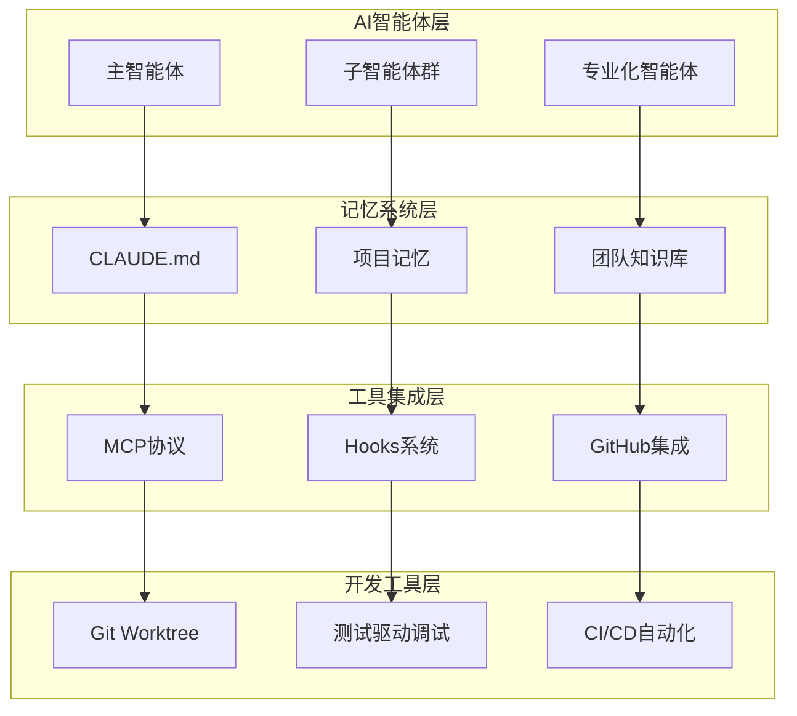
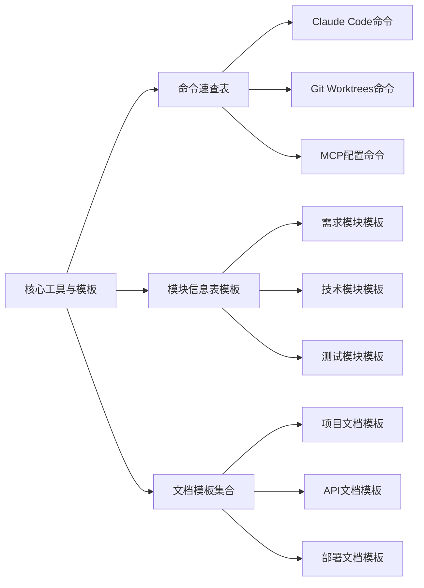

# 附录A 核心工具与模板

> "元编程思维：从'使用 AI'到'编排 AI'——通过 MCPs 和 Hooks 等高级功能，开发者将从 AI 的'使用者'转变为 AI 工作流的'设计者与编排者'，实现开发流程的深度自动化与定制。" —— 吴恩达课程精华

## 概述

基于吴恩达与 Anthropic 的最新研究成果，本附录提供了完整的 Claude Code 工具链、模板库和最佳实践。这些资源将帮助团队从传统的"使用AI"模式升级到"编排AI"的元编程思维。

## 核心工具生态系统

## 内容结构

## 工具分类

### 1. AI编码工具
- **Claude Code**：智能代码生成和审查
- **GitHub Copilot**：代码补全和建议
- **Cursor**：AI增强的代码编辑器

### 2. 文档工具
- **GitBook**：团队知识库管理
- **Notion**：协作文档和项目管理
- **Confluence**：企业级文档平台

### 3. 协作工具
- **Slack/Teams**：实时沟通
- **Jira/Linear**：项目管理
- **Figma**：设计协作

### 4. 开发工具
- **Git Worktrees**：并行开发管理
- **Docker**：环境一致性保障
- **GitHub Actions**：CI/CD自动化

## 模板使用指南

### 快速开始

1. **选择合适的模板**
   - 根据项目类型选择对应模板
   - 参考模板说明进行定制

2. **填写必要信息**
   - 按照模板提示填写各项内容
   - 确保信息的完整性和准确性

3. **团队评审确认**
   - 组织团队对模板内容进行评审
   - 根据反馈进行调整和完善

### 定制化建议

- **企业标准**：根据企业规范调整模板格式
- **项目特色**：结合项目特点增加专用字段
- **工具集成**：确保模板与现有工具链兼容

## 质量标准

### 文档质量检查清单

- [ ] 内容完整性：所有必填项都已填写
- [ ] 格式规范性：符合团队文档标准
- [ ] 逻辑一致性：内容逻辑清晰合理
- [ ] 可读性：语言简洁明了
- [ ] 可维护性：便于后续更新维护

### 模板更新机制

1. **定期评估**：每季度评估模板使用效果
2. **反馈收集**：收集团队使用反馈
3. **版本管理**：维护模板版本历史
4. **最佳实践**：持续优化模板内容

## 使用统计

| 模板类型 | 使用频率 | 满意度 | 改进建议 |
|----------|----------|--------|----------|
| 需求文档模板 | 95% | 4.5/5 | 增加用户故事模板 |
| API文档模板 | 88% | 4.3/5 | 优化示例代码格式 |
| 测试用例模板 | 82% | 4.1/5 | 增加自动化测试指导 |
| 部署文档模板 | 76% | 4.0/5 | 增加回滚操作说明 |

## 获取支持

如果在使用过程中遇到问题，可以通过以下方式获取支持：

- **文档反馈**：在对应文档页面提交反馈
- **技术支持**：联系团队技术负责人
- **社区讨论**：参与团队内部讨论群
- **培训资源**：参考相关培训材料

---

**详细内容：**
- [命令速查表](command-reference.md)
- [模块信息表模板](module-template.md)
- [文档模板集合](doc-templates.md)

**相关资源：**
- [企业开发规范 Prompt 集合](prompt-collection.md)
- [协作评估工具与指标体系](assessment-tools.md)