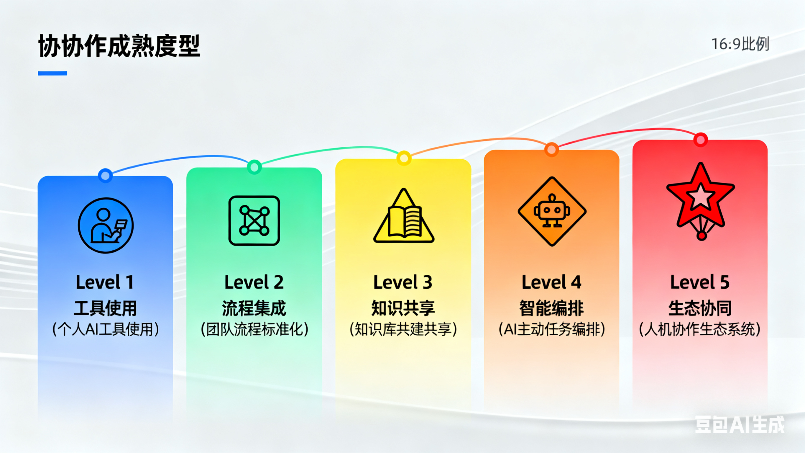
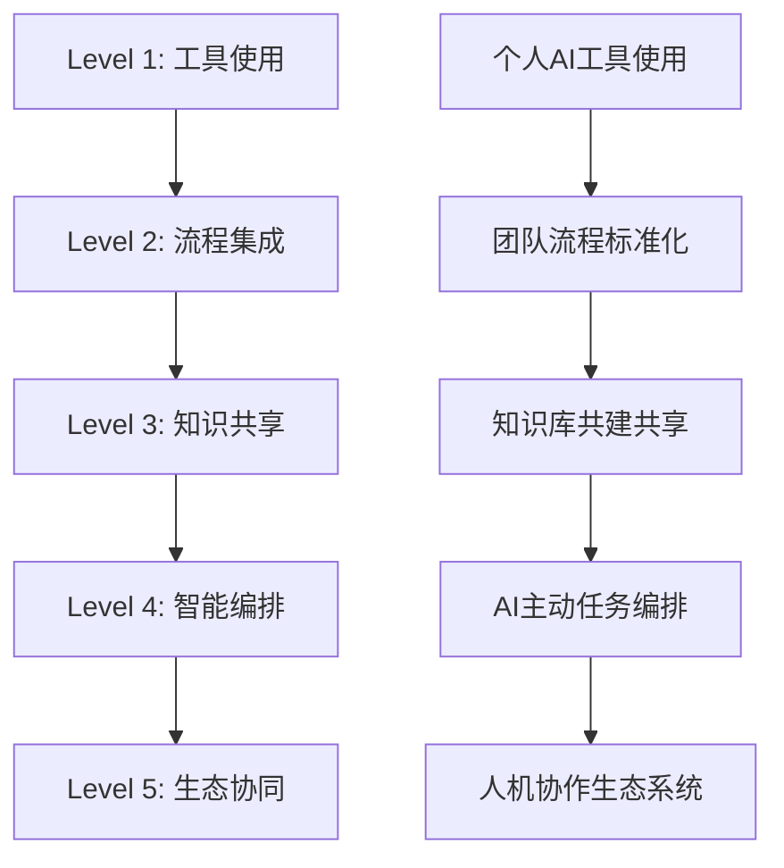

# 五级协作成熟度模型调研

## 协作成熟度模型概述

### 五级协作成熟度模型

## 成熟度等级详细说明

[图片提示词：设计一个五级成熟度对比图，每级包含特征、关键指标、DDAD应用、挑战和解决方案，使用不同颜色区分各个级别]

| 级别 | 特征 | 关键指标 | DDAD应用 | 挑战 | 解决方案 |
|------|------|----------|----------|------|----------|
| **L1 工具使用** | 个人AI工具尝试 | 工具使用率>50% | 基础文档模板 | 工具选择困难 | 提供工具选型指南 |
| **L2 流程集成** | 团队流程标准化 | 流程覆盖率>70% | 标准化工作流 | 流程变革阻力 | 分阶段实施策略 |
| **L3 知识共享** | 知识库共建共享 | 知识复用率>60% | 结构化知识库 | 知识沉淀质量差 | 建立知识审核机制 |
| **L4 智能编排** | AI主动任务编排 | 自动化率>40% | AI驱动开发 | 人机协作不协调 | 优化人机分工模式 |
| **L5 生态协同** | 人机协作生态 | 协作效率提升3x | 全面DDAD实施 | 系统集成复杂度高 | 构建统一协作平台 |

## 调研表格

### 团队协作现状调研表

| 调研维度 | 调研问题 | 当前状态 | 目标状态 | 差距分析 | 改进措施 |
|----------|----------|----------|----------|----------|----------|
| **工具使用** | 团队成员AI工具使用率 | ___% | >50% | ___ | 工具培训、示范项目 |
| **流程标准化** | 关键流程标准化程度 | ___% | >70% | ___ | 流程梳理、制度建设 |
| **知识共享** | 知识库使用率和复用率 | ___% | >60% | ___ | 知识激励机制、质量管控 |
| **智能编排** | 任务自动化覆盖率 | ___% | >40% | ___ | AI能力建设、场景挖掘 |
| **生态协同** | 跨团队协作效率提升 | ___x | >3x | ___ | 平台整合、文化建设 |

### 成熟度评估标准

[图片提示词：创建一个成熟度评估标准矩阵图，展示五个维度（技术应用、人员能力、流程成熟、组织文化）在不同成熟度级别的表现特征]

| 评估维度 | L1级标准 | L2级标准 | L3级标准 | L4级标准 | L5级标准 |
|----------|----------|----------|----------|----------|----------|
| **技术应用** | 基础工具使用 | 流程集成工具 | 知识管理系统 | AI编排平台 | 生态系统平台 |
| **人员能力** | 工具操作技能 | 流程执行能力 | 知识管理能力 | AI协作能力 | 生态创新能力 |
| **流程成熟** | 个人工作规范 | 团队标准化流程 | 知识沉淀流程 | 智能化工作流 | 自适应生态流程 |
| **组织文化** | 工具接受度 | 流程认同感 | 知识共享文化 | 人机协作文化 | 生态协同文化 |

## 实施建议

### 分阶段实施路径

[图片提示词：设计一个时间轴图，展示从L1到L5的四个实施阶段，每个阶段包含时间周期、主要任务和预期成果]

1. **L1-L2阶段（1-3个月）**：工具导入和流程标准化
2. **L2-L3阶段（3-6个月）**：知识库建设和共享机制
3. **L3-L4阶段（6-9个月）**：AI能力建设和智能编排
4. **L4-L5阶段（9-12个月）**：生态系统构建和全面协同

### 关键成功因素

[图片提示词：创建一个关键成功因素图，用雷达图或星形图展示五个关键因素（领导支持、人员培训、技术支撑、文化塑造、持续改进）的重要性和关联性]

1. **领导支持**：确保组织层面对协作模式的认可
2. **人员培训**：持续提升团队协作技能
3. **技术支撑**：选择合适的协作工具和平台
4. **文化塑造**：培养开放共享的协作文化
5. **持续改进**：定期评估和优化协作模式

## 团队协作现状调研问卷

### 第一部分：基本信息

[图片提示词：设计一个问卷封面图，展示调研问卷的主题"团队协作现状调研"，包含五个成熟度级别的图标和简洁现代的设计风格]

**1. 您的职位：**
- ☐ 技术人员
- ☐ 产品经理
- ☐ 项目经理
- ☐ 团队负责人
- ☐ 其他：________

**2. 您的团队规模：**
- ☐ 1-5人
- ☐ 6-10人
- ☐ 11-20人
- ☐ 20人以上

**3. 您使用AI工具的经验：**
- ☐ 从未使用
- ☐ 1-3个月
- ☐ 3-6个月
- ☐ 6个月以上

### 第二部分：工具使用情况

[图片提示词：创建一个AI工具使用统计图，展示不同类型AI工具的使用比例和频率分布，使用饼图和条形图组合的方式]

**4. 您目前使用的AI工具有哪些？（多选）**
- ☐ ChatGPT
- ☐ Claude
- ☐ GitHub Copilot
- ☐ 其他AI编程助手
- ☐ AI文档工具
- ☐ 其他：________

**5. 您使用AI工具的频率：**
- ☐ 每天
- ☐ 每周2-3次
- ☐ 每周1次
- ☐ 偶尔使用

**6. 您使用AI工具主要用于哪些工作？（多选）**
- ☐ 代码编写
- ☐ 文档撰写
- ☐ 问题解决
- ☐ 学习研究
- ☐ 项目管理
- ☐ 其他：________

### 第三部分：流程集成

[图片提示词：设计一个团队协作工具满意度评估图，展示不同类型协作工具的使用情况和满意度评分，使用热力图或矩阵图形式]

**7. 您的团队是否有标准化的工作流程？**
- ☐ 有完整的标准化流程
- ☐ 有部分标准化流程
- ☐ 正在制定中
- ☐ 没有标准化流程

**8. 团队协作工具使用情况：**

| 工具类型 | 使用情况 | 满意度(1-5分) |
|----------|----------|---------------|
| 项目管理工具 | ☐使用 ☐未使用 | ___ |
| 文档协作工具 | ☐使用 ☐未使用 | ___ |
| 代码协作工具 | ☐使用 ☐未使用 | ___ |
| 沟通工具 | ☐使用 ☐未使用 | ___ |

**9. 流程执行的一致性如何？**
- ☐ 90%以上流程标准化执行
- ☐ 70-90%流程标准化执行
- ☐ 50-70%流程标准化执行
- ☐ 50%以下流程标准化执行

### 第四部分：知识共享

[图片提示词：创建一个知识管理成熟度图，展示知识库建设、共享频率和复用率三个维度的关系，使用金字塔或阶梯形图表]

**10. 团队是否有知识库或文档管理系统？**
- ☐ 有完善的知识库
- ☐ 有基础的知识库
- ☐ 正在建设中
- ☐ 没有知识库

**11. 知识共享的频率：**
- ☐ 每周都有知识分享
- ☐ 每月有知识分享
- ☐ 偶尔有知识分享
- ☐ 很少有知识分享

**12. 知识复用率评估：**
- ☐ 80%以上问题能找到现有解决方案
- ☐ 60-80%问题能找到现有解决方案
- ☐ 40-60%问题能找到现有解决方案
- ☐ 40%以下问题能找到现有解决方案

### 第五部分：智能编排

[图片提示词：设计一个智能编排能力图，展示自动化工具、AI辅助决策和任务分配监控的关系，使用流程图或架构图形式]

**13. 团队是否有自动化工具或AI辅助决策？**
- ☐ 有完善的自动化体系
- ☐ 有部分自动化工具
- ☐ 正在探索中
- ☐ 没有自动化工具

**14. 任务分配和监控方式：**
- ☐ AI智能分配+人工审核
- ☐ 人工分配+AI辅助监控
- ☐ 完全人工管理
- ☐ 其他：________

**15. 自动化覆盖率：**
- ☐ 60%以上工作已自动化
- ☐ 40-60%工作已自动化
- ☐ 20-40%工作已自动化
- ☐ 20%以下工作已自动化

### 第六部分：生态协同

[图片提示词：创建一个生态系统协同网络图，展示跨团队协作的频率、效率提升和系统整合程度的关系，使用网络图或生态系统示意图]

**16. 跨团队协作的频率：**
- ☐ 非常频繁（每周多次）
- ☐ 比较频繁（每周1-2次）
- ☐ 偶尔协作（每月1-2次）
- ☐ 很少协作（每季度1-2次）

**17. 协作效率提升情况：**
- ☐ 协作效率提升3倍以上
- ☐ 协作效率提升2-3倍
- ☐ 协作效率提升1-2倍
- ☐ 协作效率提升不明显

**18. 生态系统整合程度：**
- ☐ 已建立完整的协作生态系统
- ☐ 各系统已基本整合
- ☐ 系统间存在一定整合
- ☐ 各系统独立运行

### 第七部分：开放性问题

[图片提示词：设计一个开放性问题反馈图，展示四个核心问题的关联性，使用思维导图或流程图形式，强调用户反馈的收集和分析流程]

**19. 您认为团队协作中最大的挑战是什么？**
___________________________________________________________

**20. 您希望在哪些方面提升团队协作效率？**
___________________________________________________________

**21. 您对AI在团队协作中的期望是什么？**
___________________________________________________________

**22. 其他建议或意见：**
___________________________________________________________

---

## 问卷评分标准

[图片提示词：创建一个评分标准可视化图，展示五个维度的评分标准和总分计算方法，使用仪表盘或进度条形式，直观展示成熟度等级]

### 成熟度等级评分

| 维度 | L1级(0-20分) | L2级(21-40分) | L3级(41-60分) | L4级(61-80分) | L5级(81-100分) |
|------|-------------|-------------|-------------|-------------|-------------|
| 工具使用 | 基础工具使用 | 多工具整合 | 工具协同 | 智能工具链 | 工具生态系统 |
| 流程集成 | 个人规范 | 团队标准 | 流程优化 | 智能流程 | 自适应流程 |
| 知识共享 | 文档管理 | 知识库建设 | 知识沉淀 | 智能推荐 | 知识创新 |
| 智能编排 | 基础自动化 | 流程自动化 | AI辅助 | 智能决策 | 自主协调 |
| 生态协同 | 单点协作 | 团队协作 | 跨团队协作 | 生态整合 | 创新生态 |

### 评分计算方法

1. **工具使用维度**：问题4-6（20分）
2. **流程集成维度**：问题7-9（20分）
3. **知识共享维度**：问题10-12（20分）
4. **智能编排维度**：问题13-15（20分）
5. **生态协同维度**：问题16-18（20分）

[图片提示词：设计一个成熟度等级阶梯图，展示从L1到L5的五个等级，每个等级对应分数范围和核心特征，使用渐进色彩和图标]

**总分100分，对应五个成熟度等级：**
- L1级：0-20分
- L2级：21-40分
- L3级：41-60分
- L4级：61-80分
- L5级：81-100分