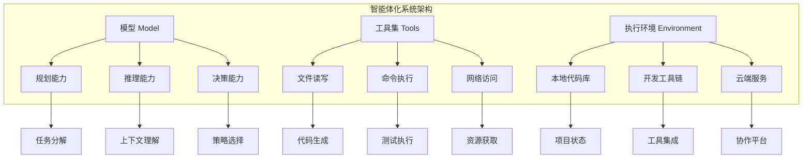
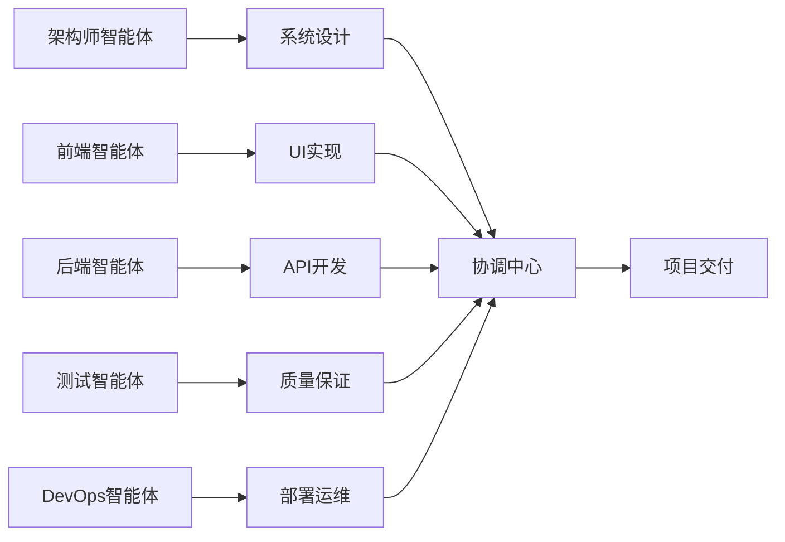

# 智能体化系统：重新定义AI协作

## 什么是智能体化系统

智能体化系统 (Agentic System) 是一个由模型、工具集和执行环境协同工作的系统，它超越了被动的输入-输出模式，能够主动地规划、获取信息并采取行动来实现既定目标。



## 核心能力对比

### 传统AI工具 vs 智能体系统

| 维度 | 传统AI工具 | 智能体系统 |
|------|------------|------------|
| **交互模式** | 问答式 | 任务委托式 |
| **工作方式** | 被动响应 | 主动规划执行 |
| **上下文管理** | 单次对话 | 持久化记忆 |
| **任务复杂度** | 简单代码片段 | 完整项目功能 |
| **错误处理** | 需要人工干预 | 自主调试修复 |
| **学习能力** | 静态知识 | 动态适应 |

### 实际应用示例

**传统模式：**
```
用户：如何实现用户认证？
AI：这里是一个JWT认证的代码示例...
用户：如何集成到我的项目中？
AI：你需要修改这些文件...
用户：测试失败了怎么办？
AI：检查这些配置...
```

**智能体模式：**
```
用户：请为我的项目实现完整的用户认证系统，包括注册、登录、权限管理，使用JWT，确保安全性，并编写完整的测试用例。

AI智能体：
1. 分析项目结构和现有代码
2. 设计认证系统架构
3. 实现后端API接口
4. 创建前端认证组件
5. 编写单元测试和集成测试
6. 配置安全中间件
7. 生成API文档
8. 验证整个系统功能
```

## 智能体的核心行为模式

### 1. 规划 (Planning)

智能体在接收任务后，首先进行深度思考和规划：

```markdown
## 任务分析
- 理解需求的核心目标
- 识别技术约束和依赖
- 评估实现复杂度
- 制定分步执行计划

## 风险评估
- 潜在的技术难点
- 可能的兼容性问题
- 性能和安全考虑
- 回滚和恢复策略
```

### 2. 感知 (Perception)

智能体通过多种方式感知项目环境：

```bash
# 代码库结构分析
@project-root/
├── src/
├── tests/
├── docs/
└── config/

# 依赖关系理解
package.json → 前端技术栈
requirements.txt → 后端依赖
docker-compose.yml → 部署架构

# 现有代码模式识别
- 编码风格和约定
- 架构模式和设计原则
- 测试策略和覆盖率
```

### 3. 行动 (Action)

智能体执行具体的开发任务：

```python
# 智能体行动序列示例
class AgenticDevelopment:
    def implement_feature(self, requirement):
        # 1. 创建功能分支
        self.git_operations.create_branch(f"feature/{requirement.name}")
        
        # 2. 生成代码
        code = self.code_generator.generate(requirement)
        
        # 3. 编写测试
        tests = self.test_generator.create_tests(code)
        
        # 4. 运行验证
        results = self.test_runner.execute(tests)
        
        # 5. 迭代优化
        if not results.all_passed:
            code = self.code_optimizer.fix_issues(code, results)
            
        # 6. 提交变更
        self.git_operations.commit_changes(code, tests)
        
        return ImplementationResult(code, tests, results)
```

## 团队协作中的智能体编排

### 多智能体协作模式

在团队环境中，我们可以部署多个专门化的智能体：



### 智能体间的通信协议

```json
{
  "message_type": "task_delegation",
  "from": "architect_agent",
  "to": "frontend_agent",
  "task": {
    "id": "ui_implementation_001",
    "description": "实现用户登录界面",
    "requirements": {
      "framework": "React",
      "styling": "Tailwind CSS",
      "validation": "Formik + Yup"
    },
    "dependencies": ["backend_auth_api"],
    "deadline": "2024-01-15T18:00:00Z"
  },
  "context": {
    "project_memory": "@CLAUDE.md",
    "design_specs": "@designs/login.figma",
    "api_docs": "@docs/auth-api.md"
  }
}
```

## 实现智能体化开发的关键要素

### 1. 持久化记忆系统

```markdown
# CLAUDE.md - 项目智能体记忆
## 项目概述
- 技术栈：React + Node.js + PostgreSQL
- 架构模式：微服务 + RESTful API
- 部署环境：Docker + Kubernetes

## 开发规范
- 代码风格：ESLint + Prettier
- 测试策略：Jest + Cypress
- Git工作流：Feature Branch + PR Review

## 业务逻辑
- 用户角色：管理员、编辑者、查看者
- 权限模型：RBAC (Role-Based Access Control)
- 数据流：前端 → API网关 → 微服务 → 数据库
```

### 2. 上下文工程

```bash
# 结构化上下文构建
@project/src/auth/          # 认证模块代码
@project/docs/auth-spec.md  # 认证规范文档
@project/tests/auth.test.js # 认证测试用例

# 任务描述模板
Context: 当前认证模块存在性能瓶颈
Goal: 重构为异步模式，支持500并发请求
Example: process_data(items) 应返回 Future 对象
Constraints: 仅使用 requirements.txt 中的库，兼容 Python 3.9+
Methodology: 先写失败的基准测试，再实现异步改造，最后确保所有测试通过
```

### 3. 工具链集成

```yaml
# 智能体工具配置
tools:
  code_analysis:
    - ast_parser
    - dependency_analyzer
    - complexity_calculator
  
  development:
    - file_operations
    - git_commands
    - package_managers
  
  testing:
    - unit_test_runner
    - integration_tester
    - performance_profiler
  
  deployment:
    - docker_builder
    - kubernetes_deployer
    - monitoring_setup
```

## 从使用者到编排者的转变

### 传统开发者角色
- 编写代码实现功能
- 调试和修复问题
- 维护和优化系统

### 智能体时代的开发者角色
- **任务架构师**：设计和分解复杂任务
- **上下文工程师**：构建高质量的信息架构
- **协作编排者**：设计人机协作流程
- **质量把控者**：确保输出符合标准

### 核心技能转变

| 传统技能 | 智能体时代技能 |
|----------|----------------|
| 编程语言精通 | 任务描述精准度 |
| 算法和数据结构 | 上下文工程能力 |
| 框架和工具使用 | AI工作流设计 |
| 调试和优化 | 智能体行为调优 |

---

**本节小结：** 智能体化系统代表了AI协作的新范式。通过理解其规划、感知、行动的核心机制，开发者可以从简单的工具使用者转变为智能协作的编排者，实现真正的人机协同开发。

**下一节：** [上下文工程：对话的本质是信息架构](context-engineering.md)