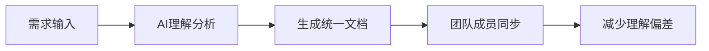

# 写作背景与行业变革

## AI编码工具普及现状与趋势

### 发展历程回顾

AI编码工具的发展可以分为三个主要阶段：

**第一阶段（2020-2021）：萌芽期**
- GitHub Copilot 的发布标志着AI编码辅助的开始
- 主要功能集中在代码补全和简单的函数生成
- 开发者接受度较低，主要用于实验性项目

**第二阶段（2022-2023）：快速发展期**
- 多家厂商推出竞品：Amazon CodeWhisperer、Google Bard等
- 功能扩展到代码解释、重构、测试生成
- 企业开始试点应用，但缺乏系统性的团队协作方案

**第三阶段（2024-2025）：成熟应用期**
- Claude Code、Cursor等新一代工具出现
- 从单纯的代码生成转向全流程的开发协作
- 团队协作功能成为核心竞争力

### 当前普及现状

根据2025年初的全球开发者调研数据：

| 指标 | 数据 | 趋势 |
|------|------|------|
| 日活跃用户 | 超过500万 | ↗️ 月增长15% |
| 企业采用率 | 68% | ↗️ 同比增长45% |
| 代码生成准确率 | 85%+ | ↗️ 持续优化 |
| 团队协作满意度 | 72% | ↗️ 工具链完善 |

### 技术发展趋势

**1. 从辅助到协作**
- 早期：简单的代码补全
- 现在：全流程的开发伙伴
- 未来：深度集成的团队成员

**2. 从个人到团队**
- 个人效率提升 → 团队协作优化
- 单点工具 → 完整工具链
- 孤立使用 → 生态集成

**3. 从通用到专业**
- 通用代码生成 → 领域专业化
- 标准模板 → 企业定制
- 基础功能 → 高级策略

## 传统团队开发中的协作效率瓶颈

### 沟通成本高昂

**问题表现：**
- 需求理解不一致，返工率高达30%
- 技术方案讨论冗长，决策周期长
- 跨团队协作信息传递失真

**根本原因：**
- 缺乏统一的信息载体
- 隐性知识难以传递
- 异步沟通效率低下

### 知识孤岛严重

**典型场景：**
```
开发者A：熟悉前端技术栈，但对后端API设计不了解
开发者B：精通数据库优化，但前端交互逻辑陌生
开发者C：架构设计经验丰富，但具体实现细节模糊
```

**影响：**
- 技能互补性差，团队整体效能受限
- 关键人员依赖严重，风险集中
- 新人上手周期长，培养成本高

### 并行开发冲突频发

**常见冲突类型：**
1. **代码冲突**：多人修改同一文件
2. **接口冲突**：API设计变更影响多个模块
3. **依赖冲突**：第三方库版本不兼容
4. **环境冲突**：开发环境配置差异

**解决成本：**
- 平均每次冲突解决时间：2-4小时
- 严重冲突可能导致整个迭代延期
- 团队士气和信任度下降

## 智能体编码与团队协作的重构价值

### 信息透明化

**AI作为信息中介：**
- 自动生成项目文档和进度报告
- 实时同步各成员的工作状态
- 智能识别潜在的协作风险

**价值体现：**


### 能力互补增强

**AI辅助技能扩展：**
- 前端开发者可以快速理解后端逻辑
- 后端工程师能够优化前端交互
- 初级开发者获得高级架构指导

**实际效果：**
- 团队技能覆盖面提升40%
- 跨领域协作效率提升60%
- 新人培养周期缩短50%

### 并行开发优化

**AI驱动的冲突预防：**
1. **智能任务分解**：自动识别可并行的开发任务
2. **依赖关系分析**：提前发现潜在冲突点
3. **实时冲突检测**：开发过程中的早期预警
4. **自动合并建议**：基于上下文的冲突解决方案

**成效数据：**
- 代码冲突率降低70%
- 集成测试通过率提升85%
- 发布周期缩短30%

### 质量保障提升

**多层次质量检查：**
```
第一层：AI实时代码审查
第二层：自动化测试生成
第三层：人工深度审查
第四层：生产环境监控
```

**质量指标改善：**
- Bug密度降低45%
- 代码覆盖率提升至90%+
- 生产事故减少60%

## 变革带来的新机遇

### 开发模式创新

**从瀑布到敏捷，再到智能协作：**
- 需求变更响应更快
- 迭代周期更短
- 质量控制更严

### 团队结构优化

**扁平化组织结构：**
- 减少中间管理层级
- 提升决策效率
- 增强团队自主性

### 商业价值提升

**直接价值：**
- 开发效率提升30-50%
- 产品上市时间缩短40%
- 维护成本降低35%

**间接价值：**
- 团队满意度提升
- 人才吸引力增强
- 技术债务减少

---

**本节小结：** AI编码工具的普及正在重塑软件开发的协作模式。传统团队开发中的沟通成本、知识孤岛、并行冲突等问题，在智能体编码的加持下得到了有效解决。这不仅是技术工具的升级，更是开发理念和组织模式的深刻变革。

**下一节：** [文档驱动AI开发（DDAD）理念导入](ddad.md)