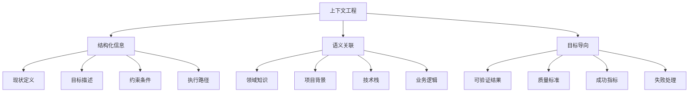

# 上下文工程：对话的本质是信息架构

> "与 AI 的每一次交互，都是一次微型的信息架构设计。成功的关键在于如何精准、高效地构建上下文，这决定了其输出质量的上限。" —— 吴恩达课程精华

## 上下文工程的核心理念

上下文工程不是简单的"问答技巧"，而是一门关于**信息架构设计**的学科。每一次与AI的对话，本质上都是在构建一个临时的、目标导向的知识体系。

### 信息架构的层次结构



## 结构化 Prompt：定义与 AI 的"交互契约"

### 专业级 Prompt 模板

一个专业级的 Prompt 应该像一份清晰的需求文档，它定义了你与 AI 之间的"交互契约"：

```markdown
## 上下文工程模板

### 1. 现状定义 (Context)
**当前状态：** The current implementation in @module/service.py has a performance bottleneck under concurrent loads.

**问题描述：** Response time degrades from 200ms to 5000ms when handling more than 50 concurrent requests.

**影响范围：** This affects the user authentication flow and causes timeout errors in production.

### 2. 目标描述 (Goal)
**期望结果：** Refactor this module to use an asynchronous pattern with a connection pool to handle up to 500 concurrent requests.

**性能指标：** Maintain response time under 300ms for 500 concurrent requests.

**质量要求：** Zero downtime deployment and backward compatibility.

### 3. 示例说明 (Example)
**输入示例：**
```python
# 当前同步调用
result = process_data(items)
```

**期望输出：**
```python
# 期望的异步调用
future = await process_data_async(items)
result = await future
```

### 4. 约束条件 (Constraints)
**技术约束：**
- Only use libraries present in requirements.txt
- The solution must be compatible with Python 3.9+
- Maintain the existing public API signature to avoid breaking changes

**业务约束：**
- No data loss during migration
- Rollback plan must be available
- Performance improvement must be measurable

### 5. 执行路径 (Methodology)
**实施步骤：**
1. First, write a failing benchmark test that reproduces the bottleneck
2. Then, implement the async changes incrementally
3. Finally, ensure all existing unit tests and the new benchmark pass
4. Provide migration guide and rollback instructions

**验证方法：**
- Load testing with 500 concurrent requests
- Integration testing with existing systems
- Performance monitoring and alerting setup
```

### 实际应用案例

**❌ 低质量 Prompt：**
```
帮我优化这个代码，让它跑得快一点。
```

**✅ 高质量 Prompt：**
```markdown
## 性能优化任务

### 现状分析
@backend/search_tools.py 中的 `search_documents()` 函数在处理大量文档时性能不佳：
- 当前实现：顺序处理，单线程
- 性能表现：1000个文档需要30秒
- 瓶颈分析：I/O密集型操作，CPU利用率低

### 优化目标
将处理时间从30秒优化到5秒以内，支持并发处理：
- 目标性能：1000个文档 < 5秒
- 并发策略：异步I/O + 线程池
- 资源限制：内存使用 < 2GB

### 技术约束
- 保持现有API接口不变
- 兼容 Python 3.8+
- 使用项目现有依赖：asyncio, concurrent.futures
- 错误处理：单个文档失败不影响整体处理

### 实施方案
1. 编写性能基准测试，记录当前指标
2. 重构为异步实现，使用 asyncio.gather()
3. 添加线程池处理CPU密集型操作
4. 实现错误处理和重试机制
5. 验证性能提升并确保功能正确性

ultrathink
```

## 策略性思考与规划

### 思考模式的层次

Claude Code 支持不同层次的思考模式，每种模式分配不同的计算资源：

```python
# 思考模式层次
THINKING_MODES = {
    "think": {
        "resource_allocation": "standard",
        "use_case": "常规问题分析",
        "example": "代码重构建议"
    },
    "think hard": {
        "resource_allocation": "enhanced", 
        "use_case": "复杂逻辑设计",
        "example": "架构模式选择"
    },
    "think harder": {
        "resource_allocation": "intensive",
        "use_case": "深度技术分析", 
        "example": "性能优化方案"
    },
    "ultrathink": {
        "resource_allocation": "maximum",
        "use_case": "极复杂问题解决",
        "example": "系统重构设计"
    }
}
```

### 计划模式 (Plan Mode)

通过 `Shift + Tab` 切换到计划模式，强制 AI 在动手前提交详细的行动计划：

```markdown
## 计划模式示例

### 任务：重构电商系统的订单处理模块

### AI 生成的执行计划：

#### 阶段一：现状分析 (预计2小时)
1. **代码审查**
   - 分析 @orders/processor.py 的当前实现
   - 识别性能瓶颈和代码异味
   - 评估测试覆盖率和质量

2. **依赖分析**
   - 梳理模块间的依赖关系
   - 识别潜在的循环依赖
   - 评估重构的影响范围

#### 阶段二：架构设计 (预计3小时)
1. **设计模式选择**
   - 评估 Strategy vs Command vs Observer 模式
   - 设计状态机处理订单状态转换
   - 定义清晰的接口和抽象

2. **数据流重构**
   - 设计异步处理管道
   - 实现事件驱动架构
   - 添加错误处理和补偿机制

#### 阶段三：实施执行 (预计8小时)
1. **测试先行**
   - 编写失败的集成测试
   - 创建性能基准测试
   - 设置监控和告警

2. **渐进式重构**
   - 保持向后兼容性
   - 分步骤迁移功能
   - 每步都有回滚方案

#### 阶段四：验证部署 (预计2小时)
1. **质量验证**
   - 运行完整测试套件
   - 性能基准对比
   - 代码质量检查

2. **部署策略**
   - 蓝绿部署方案
   - 监控指标设置
   - 回滚预案准备

### 风险评估：
- **高风险**：订单状态不一致可能导致财务损失
- **中风险**：性能回退影响用户体验
- **低风险**：代码可读性暂时下降

### 成功指标：
- 订单处理延迟 < 100ms (当前 500ms)
- 系统可用性 > 99.9%
- 代码复杂度降低 30%

**请确认此计划是否符合预期，然后我开始执行。**
```

## 对话上下文管理

### 上下文窗口的战略性管理

长对话会消耗宝贵的上下文窗口，需要像管理内存一样管理对话历史：

```bash
# 上下文管理命令
/clear          # 完全清空，开始全新会话
/compact        # 智能压缩，保留关键信息
/compact Focus on code samples and API usage  # 定向压缩
```

### 上下文压缩策略

```markdown
## 压缩前的对话历史 (15,000 tokens)
用户：请帮我实现用户认证系统...
AI：我来分析你的需求，首先需要了解...
用户：我使用的是 React + Node.js...
AI：基于你的技术栈，我建议使用 JWT...
[大量详细的实现讨论]

## 压缩后的精华摘要 (2,000 tokens)
### 项目背景
- 技术栈：React + Node.js + MongoDB
- 需求：JWT认证 + RBAC权限管理
- 约束：RESTful API，支持移动端

### 已完成工作
- ✅ 后端认证API实现 (@auth/routes.js)
- ✅ JWT中间件配置 (@middleware/auth.js)
- ✅ 用户模型定义 (@models/User.js)

### 当前任务
- 🔄 前端登录组件开发
- ⏳ 权限路由守卫实现
- ⏳ 单元测试编写

### 技术决策
- 密码加密：bcrypt
- Token存储：httpOnly cookies
- 权限模型：基于角色的访问控制

### 下一步行动
专注于前端认证组件的实现，确保与后端API的正确集成。
```

## 高级上下文工程技巧

### 1. 分层上下文构建

```markdown
## 企业级上下文架构

### 全局层 (Global Context)
- 公司技术标准和规范
- 安全和合规要求
- 架构原则和设计模式

### 项目层 (Project Context)  
- 项目目标和里程碑
- 技术栈和依赖管理
- 团队协作规范

### 模块层 (Module Context)
- 具体功能需求
- 接口设计和数据模型
- 测试策略和质量标准

### 任务层 (Task Context)
- 当前具体任务
- 输入输出规范
- 验收标准
```

### 2. 动态上下文适配

```python
# 上下文适配策略
class ContextAdapter:
    def adapt_context(self, task_type, complexity_level):
        base_context = self.load_project_context()
        
        if task_type == "architecture_design":
            return base_context + self.load_architecture_patterns()
        elif task_type == "performance_optimization":
            return base_context + self.load_performance_metrics()
        elif task_type == "security_review":
            return base_context + self.load_security_guidelines()
            
        return base_context
```

### 3. 上下文质量评估

```markdown
## 上下文质量检查清单

### 完整性 (Completeness)
- [ ] 问题描述清晰具体
- [ ] 目标和期望结果明确
- [ ] 约束条件完整列出
- [ ] 成功标准可衡量

### 准确性 (Accuracy)
- [ ] 技术信息准确无误
- [ ] 业务逻辑描述正确
- [ ] 示例代码可运行
- [ ] 引用文档最新有效

### 相关性 (Relevance)
- [ ] 信息与任务直接相关
- [ ] 避免无关细节干扰
- [ ] 重点信息突出显示
- [ ] 层次结构清晰

### 可操作性 (Actionability)
- [ ] 任务可分解执行
- [ ] 验证方法明确
- [ ] 错误处理考虑周全
- [ ] 回滚方案可行
```

## 实战案例：复杂系统重构

### 场景：电商平台订单系统重构

```markdown
## 复杂系统重构的上下文工程

### 系统现状分析
**当前架构：** 单体应用，所有订单逻辑集中在 @orders/monolith.py (2000+ 行)

**性能问题：**
- 订单处理延迟：平均 2.5 秒
- 并发瓶颈：超过 100 并发请求时系统不稳定
- 内存泄漏：长时间运行后内存使用持续增长

**业务影响：**
- 用户体验差：结账流程缓慢
- 运营成本高：需要频繁重启服务
- 扩展困难：新功能开发周期长

### 重构目标设定
**性能目标：**
- 订单处理延迟 < 500ms (提升 80%)
- 支持 1000+ 并发请求
- 内存使用稳定，无泄漏

**架构目标：**
- 微服务化：订单、支付、库存、通知独立服务
- 事件驱动：异步处理，提高响应速度
- 可观测性：完整的监控和日志系统

**业务目标：**
- 零停机部署
- 向后兼容现有API
- 支持A/B测试和灰度发布

### 技术约束和依赖
**技术栈限制：**
- 后端：Python 3.9+, FastAPI, PostgreSQL
- 消息队列：Redis + Celery
- 容器化：Docker + Kubernetes
- 监控：Prometheus + Grafana

**业务约束：**
- 不能影响现有订单数据
- 必须保持事务一致性
- 支付流程不能中断

### 分阶段实施计划
**阶段1：基础设施准备 (1周)**
1. 设置微服务基础框架
2. 配置消息队列和数据库
3. 建立CI/CD管道
4. 实现基础监控

**阶段2：核心服务拆分 (2周)**
1. 订单服务：处理订单CRUD操作
2. 支付服务：集成支付网关
3. 库存服务：管理商品库存
4. 通知服务：发送邮件和短信

**阶段3：事件驱动集成 (1周)**
1. 定义领域事件
2. 实现事件发布订阅
3. 处理分布式事务
4. 错误处理和补偿

**阶段4：性能优化和部署 (1周)**
1. 负载测试和性能调优
2. 蓝绿部署实施
3. 监控告警配置
4. 文档和培训

### 风险评估和应对
**高风险：数据一致性**
- 风险：分布式事务可能导致数据不一致
- 应对：实现Saga模式，确保最终一致性
- 监控：实时检测数据不一致情况

**中风险：性能回退**
- 风险：微服务间通信开销可能影响性能
- 应对：使用连接池，实现智能缓存
- 监控：设置性能基线和告警

**低风险：开发复杂度**
- 风险：微服务增加开发和调试复杂度
- 应对：完善开发工具和文档
- 监控：开发效率指标跟踪

### 成功指标定义
**技术指标：**
- 响应时间：P95 < 500ms
- 吞吐量：> 1000 TPS
- 可用性：> 99.9%
- 错误率：< 0.1%

**业务指标：**
- 订单转化率提升 > 5%
- 客服投诉减少 > 30%
- 开发效率提升 > 40%

请基于以上完整的上下文信息，制定详细的技术实施方案。使用 ultrathink 进行深度分析，确保方案的可行性和完整性。
```

---

**本节小结：** 上下文工程是AI协作成功的关键。通过结构化的信息架构设计，我们可以显著提升AI的理解能力和输出质量。掌握这门技艺，是从AI使用者转变为AI编排者的重要一步。

**下一节：** [持久化记忆：构建项目的"第二大脑"](persistent-memory.md)