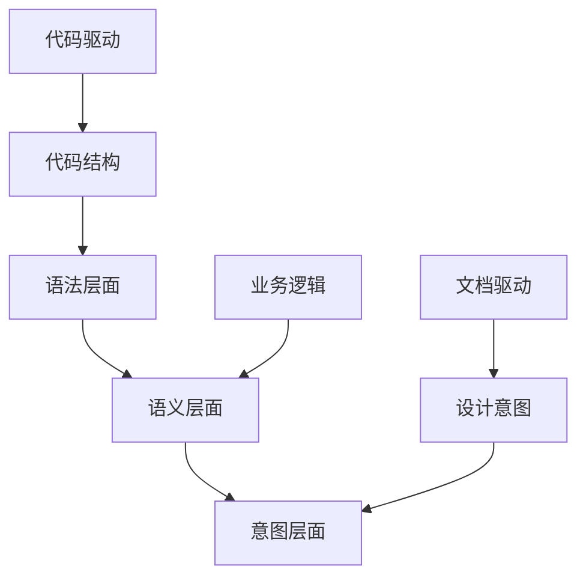
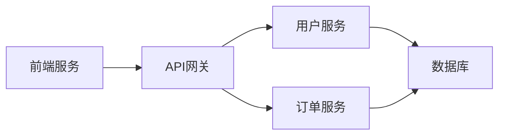

# 文档AI驱动开发（DADD）理念导入

## 为什么"文档先行"比"代码驱动"更适配AI协作

### 传统"代码驱动"模式的局限性

在传统的开发模式中，开发者往往遵循"代码即文档"的理念：

```python
# 传统模式：代码先行，文档后补
def process_user_data(data):
    # 处理用户数据的复杂逻辑
    result = complex_processing(data)
    return result

# 文档往往滞后或缺失
```

**主要问题：**
1. **上下文缺失**：AI无法理解代码背后的业务逻辑
2. **意图不明**：代码实现与原始需求脱节
3. **协作困难**：团队成员难以快速理解代码意图
4. **维护成本高**：后期修改需要大量的逆向工程

### AI协作中的文档价值

**AI理解的三个层次：**



**文档驱动的优势：**
- **完整上下文**：AI能够理解完整的业务背景
- **明确意图**：每个功能的设计目的清晰可见
- **协作友好**：团队成员和AI都能快速上手
- **可追溯性**：决策过程有据可查

### 实际对比案例

**代码驱动模式：**
```javascript
// 开发者直接编写代码
function calculatePrice(items, user) {
    let total = 0;
    for (let item of items) {
        total += item.price * item.quantity;
        if (user.vip) {
            total *= 0.9;
        }
    }
    return total;
}
```

**文档驱动模式：**
```markdown
## 价格计算模块

### 业务需求
- 计算购物车总价
- VIP用户享受9折优惠
- 支持批量商品计算

### 输入参数
- items: 商品列表 [{price: number, quantity: number}]
- user: 用户信息 {vip: boolean}

### 输出结果
- 返回计算后的总价格

### 业务规则
1. 基础价格 = 商品单价 × 数量
2. VIP折扣 = 基础价格 × 0.9
3. 普通用户无折扣

### 实现代码
```javascript
function calculatePrice(items, user) {
    // 基于上述文档生成的代码
    // AI能够理解完整的业务上下文
}
```

## DADD 的关键原则

### 1. 完整性原则

**文档应涵盖的维度：**

| 维度 | 内容 | 示例 |
|------|------|------|
| 业务背景 | 为什么需要这个功能 | 用户反馈购物车计算错误 |
| 功能描述 | 具体要实现什么 | 准确计算商品总价 |
| 技术方案 | 如何实现 | 使用策略模式处理不同用户类型 |
| 验收标准 | 怎样算完成 | 通过所有测试用例 |
| 风险评估 | 可能的问题 | 并发计算可能导致数据不一致 |

**完整性检查清单：**
```markdown
- [ ] 业务需求描述清晰
- [ ] 技术方案可行性分析
- [ ] 接口定义完整
- [ ] 测试用例覆盖
- [ ] 风险点识别
- [ ] 上线计划明确
```

### 2. 可读性原则

**人机共读的文档设计：**

**对人友好：**
- 使用自然语言描述业务逻辑
- 提供直观的图表和示例
- 结构化的信息组织

**对AI友好：**
- 标准化的格式和模板
- 明确的标签和分类
- 结构化的数据表示

**示例对比：**

❌ **不友好的文档：**
```
这个功能很复杂，需要处理各种情况，具体实现看代码。
```

✅ **友好的文档：**
```markdown
## 用户权限验证模块

### 功能概述
验证用户是否有权限访问特定资源

### 验证流程
1. 检查用户登录状态
2. 获取用户角色信息
3. 匹配资源访问权限
4. 返回验证结果

### 权限矩阵
| 角色 | 读取 | 写入 | 删除 |
|------|------|------|------|
| 管理员 | ✅ | ✅ | ✅ |
| 编辑者 | ✅ | ✅ | ❌ |
| 查看者 | ✅ | ❌ | ❌ |
```

### 3. 可追溯性原则

**决策记录模板：**
```markdown
## 决策记录 #001

### 背景
描述需要做决策的背景和问题

### 考虑的选项
1. 选项A：优缺点分析
2. 选项B：优缺点分析
3. 选项C：优缺点分析

### 决策结果
选择了选项B，理由是...

### 影响分析
- 对性能的影响：...
- 对维护性的影响：...
- 对团队的影响：...

### 后续行动
- [ ] 更新相关文档
- [ ] 通知相关团队
- [ ] 制定实施计划
```

**版本控制集成：**
```bash
# 文档变更与代码变更同步
git commit -m "feat: 添加用户权限验证模块

- 新增权限验证文档
- 实现基础验证逻辑
- 添加单元测试

Refs: DOC-001, TASK-123"
```

## DADD 在敏捷、DevOps 及 AI 时代的升级

### 敏捷开发中的DADD

**传统敏捷 vs DADD增强敏捷：**

| 方面 | 传统敏捷 | DADD增强敏捷 |
|------|----------|--------------|
| 需求管理 | 用户故事 | 用户故事 + 详细文档 |
| 迭代规划 | 口头沟通为主 | 文档化的规划过程 |
| 回顾总结 | 经验分享 | 结构化的知识沉淀 |
| 知识传递 | 依赖个人 | 文档化的知识库 |

**实践案例：**
```markdown
## Sprint 规划文档

### Sprint 目标
完成用户管理模块的核心功能

### 用户故事
1. 作为管理员，我希望能够创建新用户
   - 验收标准：[详细列表]
   - 技术方案：[具体实现]
   - 风险评估：[潜在问题]

### 技术债务处理
- 重构用户认证模块
- 优化数据库查询性能

### 定义完成标准
- [ ] 所有功能测试通过
- [ ] 代码审查完成
- [ ] 文档更新完毕
```

### DevOps流程中的DADD

**文档驱动的CI/CD：**

```yaml
# .github/workflows/doc-driven-ci.yml
name: 文档驱动的持续集成

on:
  push:
    paths:
      - 'docs/**'
      - 'src/**'

jobs:
  doc-validation:
    runs-on: ubuntu-latest
    steps:
      - name: 验证文档完整性
        run: |
          # 检查是否有对应的文档
          # 验证文档格式规范
          # 确保文档与代码同步
          
  code-generation:
    needs: doc-validation
    runs-on: ubuntu-latest
    steps:
      - name: 基于文档生成代码框架
        run: |
          # AI根据文档生成代码模板
          # 自动生成测试用例
          # 更新API文档
```

**基础设施即代码的文档化：**
```markdown
## 部署架构文档

### 环境配置
- 生产环境：AWS EKS
- 测试环境：Docker Compose
- 开发环境：本地Kubernetes

### 服务依赖关系


### 监控指标
- 响应时间 < 200ms
- 可用性 > 99.9%
- 错误率 < 0.1%
```

### AI时代的DADD进化

**智能文档生成：**
```python
# AI辅助文档生成示例
def generate_api_doc(code_file):
    """
    基于代码自动生成API文档
    """
    # AI分析代码结构
    # 提取接口信息
    # 生成标准化文档
    pass
```

**文档质量智能评估：**
```markdown
## 文档质量评分

### 完整性评分：85/100
- ✅ 功能描述完整
- ✅ 接口定义清晰
- ❌ 缺少错误处理说明
- ❌ 缺少性能指标

### 可读性评分：92/100
- ✅ 结构清晰
- ✅ 示例丰富
- ✅ 语言简洁

### 改进建议
1. 补充异常处理文档
2. 添加性能基准测试
3. 增加故障排查指南
```

**智能协作增强：**
- **自动同步**：文档变更自动通知相关团队成员
- **智能提醒**：基于项目进度智能提醒文档更新
- **知识图谱**：构建项目知识的关联网络

## 实施DADD的渐进式路径

### 第一阶段：基础建设（1-2周）

**目标：** 建立文档驱动的基础设施

**行动清单：**
- [ ] 选择文档工具（GitBook、Notion、Confluence等）
- [ ] 制定文档模板和规范
- [ ] 建立文档审查流程
- [ ] 培训团队成员

### 第二阶段：试点应用（2-4周）

**目标：** 在小范围内验证DADD效果

**选择标准：**
- 选择1-2个新功能作为试点
- 团队规模控制在3-5人
- 项目复杂度适中

**关键指标：**
- 文档完成率 > 90%
- 代码与文档一致性 > 95%
- 团队满意度 > 80%

### 第三阶段：全面推广（4-8周）

**目标：** 在整个团队推广DADD实践

**推广策略：**
- 分享试点成功案例
- 提供工具和模板支持
- 建立激励机制
- 持续优化流程

---

**本节小结：** 文档驱动开发（DADD）是AI时代团队协作的核心理念。通过完整性、可读性、可追溯性三大原则，DADD不仅提升了AI的理解能力，也增强了团队协作的效率。在敏捷、DevOps和AI的融合发展中，DADD正在成为现代软件开发的重要方法论。

**下一节：** [目标读者与阅读收益](audience.md)