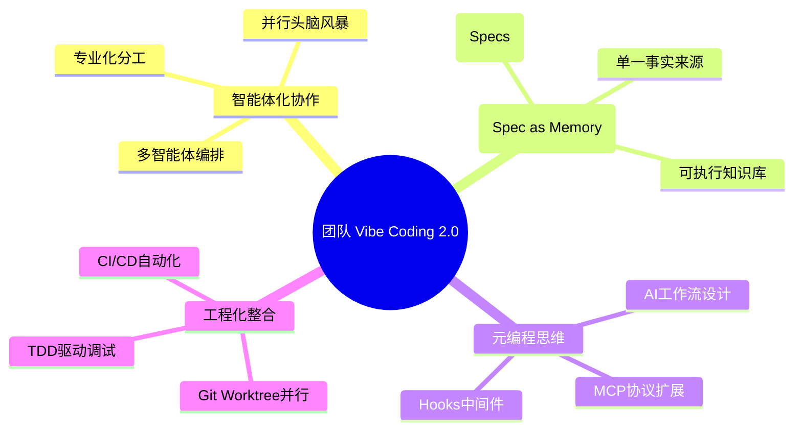
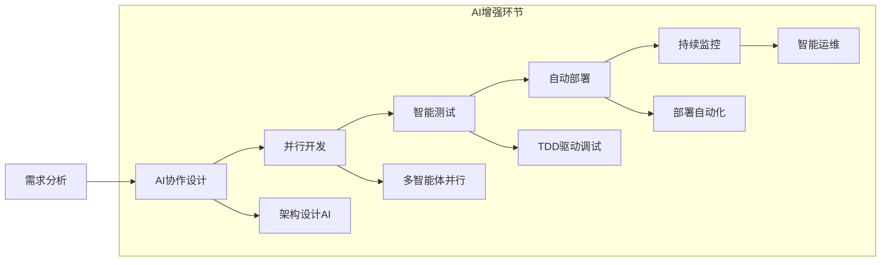

# 第2章 核心概念解析

> "规范即记忆：构建项目的可执行知识库——通过结构化的规范（Specs），我们为AI构建了一个可执行、可版本化的项目知识库，这成为团队共享的“单一事实来源”."

## 章节概述

基于吴恩达与 Anthropic 的最新研究成果，本章将深入解析团队 Vibe Coding 的核心概念。我们将从智能体协作的角度重新定义团队开发，探讨持久化记忆系统、子智能体编排，以及从"使用AI"到"编排AI"的元编程思维转变。

## 核心概念框架升级



## 五大核心洞察

### 1. 范式转变：从"指令式工具"到"智能体伙伴"

**传统模式的局限：**
```
开发者 → 具体指令 → AI工具 → 代码片段 → 手动集成
```

**智能体协作模式：**
```
开发者 → 任务委托 → AI智能体 → 自主规划执行 → 完整解决方案
```

**关键差异对比：**

| 维度 | 指令式工具 | 智能体伙伴 |
|------|------------|------------|
| **交互方式** | 被动响应指令 | 主动理解意图 |
| **任务处理** | 单步骤执行 | 端到端解决 |
| **错误处理** | 需要人工干预 | 自主调试修复 |
| **学习能力** | 静态知识库 | 动态适应项目 |
| **协作深度** | 工具辅助 | 伙伴协作 |

### 2. 上下文工程：对话的本质是信息架构

每次与AI的交互都是一次微型的信息架构设计：

```markdown
## 信息架构设计原则

### 结构化信息层次
1. **全局上下文** - 项目背景和技术栈
2. **任务上下文** - 具体需求和约束条件  
3. **执行上下文** - 实施路径和验证方法
4. **质量上下文** - 成功标准和风险控制

### 上下文质量指标
- **完整性**: 信息覆盖度 > 90%
- **准确性**: 技术描述准确率 > 95%
- **相关性**: 无关信息比例 < 10%
- **可操作性**: 任务可执行性 > 85%
```

### 3. 规范即记忆：构建项目的可执行知识库

结构化的规范（Spec）实现了AI的项目级记忆，成为项目的“第二大脑”：

```markdown
# 项目规范 (Project Spec) - 示例

## 项目DNA
- **技术基因**: React 18 + TypeScript + Node.js
- **架构模式**: 微服务 + 事件驱动
- **质量标准**: 测试覆盖率 > 80%, 性能 < 200ms

## 团队协作规范
- **代码风格**: ESLint + Prettier + Husky
- **分支策略**: GitFlow + PR Review
- **发布流程**: 蓝绿部署 + 自动回滚

## 业务领域知识
- **用户角色**: 管理员、编辑者、查看者
- **权限模型**: RBAC + 资源级控制
- **数据流向**: 前端 → API网关 → 微服务 → 数据库

## 历史决策记录
### ADR-001: 选择 TypeScript 而非 JavaScript
**背景**: 项目复杂度增加，需要类型安全
**决策**: 全面采用 TypeScript
**影响**: 开发效率提升 30%，Bug 减少 40%
```

### 4. 工程化整合：将 AI 注入开发生命周期

真正的价值在于将AI无缝融入成熟的工程实践：



### 5. 元编程思维：从"使用 AI"到"编排 AI"

通过 MCPs 和 Hooks 等高级功能，开发者从AI的"使用者"转变为AI工作流的"设计者与编排者"：

```python
# AI工作流编排示例
class AIWorkflowOrchestrator:
    def __init__(self):
        self.agents = {
            'architect': ArchitectAgent(),
            'frontend': FrontendAgent(), 
            'backend': BackendAgent(),
            'tester': TestingAgent(),
            'devops': DevOpsAgent()
        }
        
    def orchestrate_feature_development(self, requirement):
        # 1. 架构设计
        design = self.agents['architect'].design_system(requirement)
        
        # 2. 并行开发
        frontend_task = self.agents['frontend'].implement_ui(design.ui_spec)
        backend_task = self.agents['backend'].implement_api(design.api_spec)
        
        # 3. 集成测试
        integration = self.agents['tester'].create_integration_tests(
            frontend_task.result, backend_task.result
        )
        
        # 4. 部署准备
        deployment = self.agents['devops'].prepare_deployment(
            frontend_task.result, backend_task.result, integration.result
        )
        
        return FeatureDelivery(design, frontend_task, backend_task, integration, deployment)
```

## 主要内容导览

### 1. 什么是"团队 Vibe Coding"

深入探讨团队 Vibe Coding 的核心定义、方法论框架以及适配场景，帮助读者建立清晰的概念认知。

**核心要素：**
- **Vibe（氛围）**：基于心理安全的协作环境
- **Coding（编码）**：AI增强的开发实践
- **Team（团队）**：多元化的协作主体

### 2. 场景适配与风险等级矩阵

通过系统化的风险评估框架，指导团队在不同场景下选择合适的AI参与策略。

**风险维度：**
- 业务影响程度
- 技术复杂度
- 合规要求
- 时间压力

### 3. 团队效能关键因素

基于Google Project Aristotle的研究成果，结合AI协作的特点，分析影响团队效能的关键因素。

**效能模型：**
```
心理安全 × 工具效率 × 流程优化 = 团队效能
```

## 学习目标

完成本章学习后，您将能够：

1. **准确定义**团队 Vibe Coding 的核心概念
2. **评估判断**不同项目场景的风险等级
3. **识别分析**团队协作中的效能瓶颈
4. **制定策略**适合自己团队的协作方案

## 实践工具

本章提供以下实用工具：

- **风险评估矩阵**：项目风险快速评估表
- **团队效能诊断**：协作状态自检清单  
- **场景选择指南**：AI参与策略决策树

---

**章节结构：**
- [什么是"团队 Vibe Coding"](chapter2/definition.md)
- [场景适配与风险等级矩阵](chapter2/risk-matrix.md)
- [团队效能关键因素](chapter2/team-effectiveness.md)

**下一章预告：** 第3章将进入实践层面，详细介绍AI工具选择、开发环境搭建以及工具链集成的具体方法。