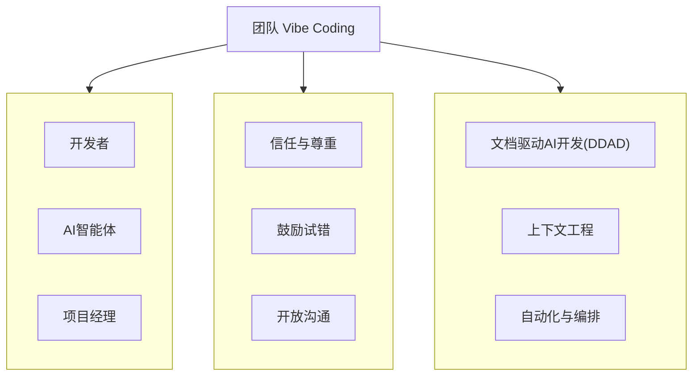

# 什么是“团队 Vibe Coding”

“团队 Vibe Coding” 并非一种具体的编程语言或框架，而是一套**以心理安全为基石、以文档驱动为核心、以人机协作为形态的软件开发新范式**。它旨在解决AI时代团队开发中的核心挑战：如何将强大的AI能力从提升“个人效率”转化为驱动“团队效能”。

其核心理念可以拆解为三个基本要素：**Team (团队)**, **Vibe (氛围)**, 和 **Coding (编码)**。

## 核心三要素

### 1. Team：多元化的协作主体

在 Vibe Coding 模式下，“团队”的边界被重新定义。它不再仅仅是人类开发者的集合，而是一个包含**人类专家**与**AI智能体**的多元化协作系统。

- **人类专家**：负责定义业务目标、进行创造性思考、做出最终决策，并对系统的整体质量负责。
- **AI智能体**：作为团队的“第二大脑”和高效的“执行中枢”，负责处理重复性、结构化的任务，如代码生成、文档撰写、测试执行、信息检索等。

这种人机组合的团队结构，旨在将人类的创造力和AI的执行力完美结合，实现 `1 + 1 > 2` 的协同效应。

### 2. Vibe：心理安全的协作氛围

“Vibe”（氛围）是这套方法论的灵魂。我们强调，高效的协作始于一个充满信任、鼓励试错和开放沟通的环境。没有良好的“Vibe”，任何先进的工具和流程都难以发挥其最大价值。

| 心理安全要素 | 在AI协作中的具体体现 |
| :--- | :--- |
| **信任与尊重** | 团队成员相信AI是可靠的伙伴，同时也信任同事能正确地使用和监督AI。 |
| **鼓励试错** | 鼓励团队成员探索与AI协作的新方法，即使初期会犯错或效率不高，也能从中学习和改进。 |
| **开放沟通** | 团队能够公开讨论AI带来的问题（如“AI幻觉”），并共同制定解决方案，而不是掩盖问题。 |

一个积极的团队Vibe能够显著降低成员对AI的抵触情绪，激发探索欲，从而加速团队对新工作模式的适应。

### 3. Coding：AI增强的开发实践

“Coding”在这里是广义的，它涵盖了从需求分析到部署维护的整个软件开发生命周期。Vibe Coding 的核心实践是通过一系列工程化方法，将AI能力深度整合到开发流程中。

- **文档驱动AI开发 (DDAD)**：这是实现人机高效沟通的基石。通过“文档先行”，为AI提供稳定、高质量的上下文，确保AI的输出与团队目标保持一致。
- **上下文工程 (Context Engineering)**：系统性地管理和维护项目的所有相关信息（需求、设计、代码、决策等），构建可供AI随时查询的“项目知识库”。
- **自动化与编排**：将AI从一个被动的“问答机器人”转变为可以被编排、被自动触发的“工作流引擎”，实现开发任务的高度自动化。

## Vibe Coding 与传统开发的区别

| 维度 | 传统开发模式 | 团队 Vibe Coding 模式 |
| :--- | :--- | :--- |
| **核心驱动力** | 代码 (Code-Driven) | 文档 (Documentation-Driven) |
| **知识载体** | 个人大脑、零散文档 | 统一的、版本化的项目知识库 |
| **协作方式** | 人与人之间的点对点沟通 | 以AI为信息中枢的网状协作 |
| **AI角色** | 个人辅助工具 (Copilot) | 深度集成的团队成员 (Teammate) |
| **关注点** | 个人编码效率 | 团队整体协作效能 |

---

**本节小结：** “团队 Vibe Coding” 是一个三位一体的开发新范式。它通过重塑**团队**的构成、营造安全的协作**氛围**、并采用AI增强的**编码**实践，旨在系统性地提升软件开发团队在AI时代的整体效-能和创造力。

**下一节：** [场景适配与风险等级矩阵](risk-matrix.md)