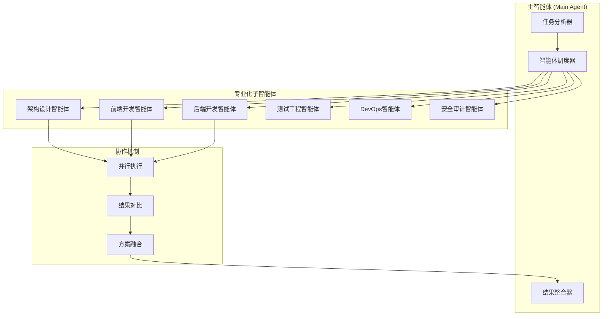
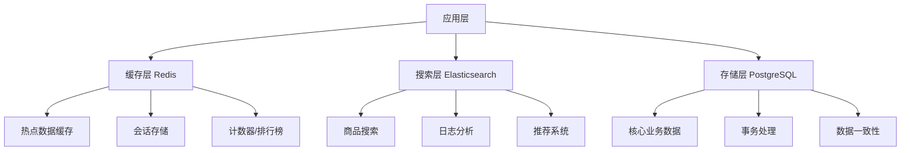

# 子智能体协作：并行头脑风暴的威力

> "对于开放性的架构设计，避免直接给出方案。利用子智能体能力让其进行方案探索：使用两个并行子智能体来头脑风暴可能的方案，一个基于JWT，另一个基于session cookies。比较它们在安全性、可扩展性和无状态性方面的权衡。" —— 吴恩达课程实践

## 子智能体系统概述

子智能体 (Subagents) 是专为特定任务配置的AI助手，拥有独立的上下文窗口、系统提示和工具集。Claude Code 可以根据任务描述自动委托给合适的子智能体，或者由用户明确调用。

### 子智能体架构



## 子智能体定义和配置

### 创建自定义子智能体

你可以通过在特定目录下创建 Markdown 文件来定义自己的子智能体：

```bash
# 项目级子智能体
.claude/agents/

# 用户级子智能体  
~/.claude/agents/
```

### 架构设计智能体示例

```markdown
# .claude/agents/architect.md

## 角色定义
你是一个资深的软件架构师，专注于系统设计和技术选型。

## 核心能力
- 分析业务需求，设计系统架构
- 评估技术方案的优缺点
- 制定技术决策和实施路径
- 识别潜在的技术风险

## 工作原则
1. **业务驱动**: 架构设计必须服务于业务目标
2. **简单优先**: 选择最简单可行的解决方案
3. **可扩展性**: 考虑未来3-5年的发展需求
4. **风险控制**: 识别并规避技术风险

## 输出格式
### 架构方案
- **概述**: 方案的核心思想
- **技术栈**: 推荐的技术选型
- **架构图**: 系统组件和交互关系
- **优势**: 方案的主要优点
- **风险**: 潜在的技术风险
- **实施路径**: 分阶段实施计划

## 专业领域
- 微服务架构
- 分布式系统
- 高并发系统设计
- 云原生架构
- 数据架构设计
```

### 前端开发智能体示例

```markdown
# .claude/agents/frontend.md

## 角色定义
你是一个专业的前端开发工程师，精通现代前端技术栈。

## 技术专长
- React/Vue/Angular 框架开发
- TypeScript/JavaScript 编程
- CSS/SCSS 样式设计
- 前端工程化和构建工具
- 性能优化和用户体验

## 开发规范
- 组件化开发，单一职责原则
- TypeScript 类型安全
- 响应式设计，移动端适配
- 无障碍访问 (a11y) 支持
- 性能优化，首屏加载 < 3s

## 代码风格
```typescript
// 组件定义示例
interface UserProfileProps {
  user: User;
  onUpdate: (user: User) => void;
}

const UserProfile: React.FC<UserProfileProps> = ({ user, onUpdate }) => {
  // 组件逻辑
};
```

## 测试策略
- 单元测试：Jest + React Testing Library
- 集成测试：Cypress E2E
- 视觉回归测试：Chromatic
- 性能测试：Lighthouse CI
```

## 并行头脑风暴实战

### 场景一：认证系统架构选择

**任务描述：**
```markdown
重构认证模块。使用两个并行子智能体来头脑风暴可能的方案，一个基于JWT，另一个基于session cookies。比较它们在安全性、可扩展性和无状态性方面的权衡。不要实现任何代码。
```

**JWT方案智能体输出：**
```markdown
## JWT认证方案

### 架构概述
基于JSON Web Token的无状态认证系统，token包含用户信息和权限数据。

### 技术实现
- **Token生成**: 用户登录后生成JWT，包含用户ID、角色、过期时间
- **Token存储**: 客户端存储在localStorage或httpOnly cookie
- **Token验证**: 每次请求携带token，服务端验证签名和有效期
- **Token刷新**: 使用refresh token机制延长会话

### 优势分析
1. **无状态性**: 服务端不需要存储会话信息，易于水平扩展
2. **跨域支持**: 天然支持跨域请求，适合微服务架构
3. **移动端友好**: 适合移动应用和单页应用
4. **性能优异**: 减少数据库查询，提高响应速度

### 安全考虑
- **Token泄露风险**: 需要HTTPS传输，防止中间人攻击
- **XSS攻击**: 如果存储在localStorage，容易受到XSS攻击
- **Token撤销**: 无法立即撤销已发放的token
- **密钥管理**: 需要安全的密钥轮换机制

### 可扩展性
- **水平扩展**: 完全无状态，支持负载均衡
- **微服务**: 各服务可独立验证token
- **CDN友好**: 可以利用CDN缓存静态资源

### 实施复杂度
- **开发成本**: 中等，需要处理token生命周期
- **运维成本**: 较低，无需会话存储
- **调试难度**: 中等，token内容需要解码查看
```

**Session Cookie方案智能体输出：**
```markdown
## Session Cookie认证方案

### 架构概述
基于服务端会话存储的传统认证方式，客户端只保存session ID。

### 技术实现
- **会话创建**: 用户登录后在服务端创建会话，生成session ID
- **会话存储**: Redis/数据库存储会话数据
- **Cookie设置**: 将session ID设置为httpOnly cookie
- **会话验证**: 每次请求根据session ID查询会话数据

### 优势分析
1. **安全性高**: 敏感信息存储在服务端，客户端只有session ID
2. **即时撤销**: 可以立即删除服务端会话，强制用户下线
3. **精细控制**: 可以记录详细的会话信息和用户行为
4. **成熟稳定**: 传统方案，技术成熟，风险较低

### 安全考虑
- **CSRF攻击**: 需要CSRF token防护
- **Session劫持**: 需要HTTPS和安全的cookie设置
- **会话固定**: 登录后需要重新生成session ID
- **存储安全**: 会话存储需要加密和访问控制

### 可扩展性
- **状态依赖**: 需要共享会话存储，增加架构复杂度
- **负载均衡**: 需要sticky session或共享存储
- **缓存策略**: 需要合理的会话缓存和过期策略

### 实施复杂度
- **开发成本**: 较低，框架通常内置支持
- **运维成本**: 中等，需要维护会话存储
- **调试难度**: 较低，会话信息直观可见
```

**方案对比分析：**
```markdown
## JWT vs Session Cookie 综合对比

| 维度 | JWT方案 | Session Cookie方案 | 推荐场景 |
|------|---------|-------------------|----------|
| **安全性** | 中等 (token泄露风险) | 高 (服务端控制) | 高安全要求选Session |
| **可扩展性** | 优秀 (无状态) | 中等 (需要共享存储) | 大规模系统选JWT |
| **无状态性** | 完全无状态 | 有状态 | 微服务架构选JWT |
| **即时撤销** | 困难 | 容易 | 需要强制下线选Session |
| **跨域支持** | 天然支持 | 需要配置 | 跨域应用选JWT |
| **移动端** | 友好 | 一般 | 移动应用选JWT |
| **开发复杂度** | 中等 | 较低 | 快速开发选Session |
| **运维成本** | 较低 | 中等 | 资源有限选JWT |

## 混合方案建议
考虑到两种方案各有优劣，建议采用混合策略：

### 短期Token + 长期Session
1. **访问Token**: 短期JWT (15分钟)，用于API访问
2. **刷新Token**: 长期session (7天)，存储在httpOnly cookie
3. **自动刷新**: 访问token过期时，使用刷新token获取新的访问token
4. **安全退出**: 删除服务端刷新token记录

### 优势结合
- 继承JWT的无状态和性能优势
- 保持Session的安全性和可控性
- 支持即时撤销和强制下线
- 兼容移动端和Web端
```

### 场景二：数据库架构选择

**任务描述：**
```markdown
为电商平台设计数据存储方案。使用三个并行子智能体分别探索：
1. 关系型数据库方案 (PostgreSQL)
2. 文档数据库方案 (MongoDB) 
3. 混合存储方案 (PostgreSQL + Redis + Elasticsearch)

重点分析数据一致性、查询性能、扩展性和运维复杂度。
```

**关系型数据库智能体输出：**
```markdown
## PostgreSQL关系型数据库方案

### 架构设计
```sql
-- 用户表
CREATE TABLE users (
    id SERIAL PRIMARY KEY,
    email VARCHAR(255) UNIQUE NOT NULL,
    password_hash VARCHAR(255) NOT NULL,
    created_at TIMESTAMP DEFAULT NOW()
);

-- 商品表
CREATE TABLE products (
    id SERIAL PRIMARY KEY,
    name VARCHAR(255) NOT NULL,
    description TEXT,
    price DECIMAL(10,2) NOT NULL,
    stock_quantity INTEGER NOT NULL,
    category_id INTEGER REFERENCES categories(id)
);

-- 订单表
CREATE TABLE orders (
    id SERIAL PRIMARY KEY,
    user_id INTEGER REFERENCES users(id),
    total_amount DECIMAL(10,2) NOT NULL,
    status VARCHAR(50) NOT NULL,
    created_at TIMESTAMP DEFAULT NOW()
);
```

### 优势分析
1. **ACID保证**: 强一致性，事务支持完整
2. **复杂查询**: SQL支持复杂的关联查询和聚合
3. **数据完整性**: 外键约束保证数据一致性
4. **成熟生态**: 工具链完善，人才储备充足
5. **标准化**: SQL标准，迁移成本低

### 性能优化
- **索引策略**: B-tree索引，复合索引优化查询
- **分区表**: 按时间或地区分区，提高查询效率
- **读写分离**: 主从复制，读操作分散到从库
- **连接池**: 使用PgBouncer等连接池管理

### 扩展性方案
- **垂直扩展**: 升级硬件配置
- **水平扩展**: 分库分表，使用Citus等扩展
- **缓存层**: Redis缓存热点数据
- **CDN**: 静态资源使用CDN加速

### 运维考虑
- **备份恢复**: 定期全量备份 + WAL日志
- **监控告警**: 使用pg_stat_statements监控慢查询
- **版本升级**: 蓝绿部署，最小化停机时间
```

**文档数据库智能体输出：**
```markdown
## MongoDB文档数据库方案

### 数据模型设计
```javascript
// 用户文档
{
  _id: ObjectId("..."),
  email: "user@example.com",
  profile: {
    name: "张三",
    avatar: "https://...",
    preferences: {
      language: "zh-CN",
      currency: "CNY"
    }
  },
  addresses: [
    {
      type: "home",
      street: "...",
      city: "北京",
      zipCode: "100000"
    }
  ],
  createdAt: ISODate("...")
}

// 商品文档
{
  _id: ObjectId("..."),
  name: "iPhone 15",
  description: "...",
  price: 7999,
  inventory: {
    stock: 100,
    reserved: 5,
    available: 95
  },
  attributes: {
    color: ["黑色", "白色", "蓝色"],
    storage: ["128GB", "256GB", "512GB"]
  },
  reviews: [
    {
      userId: ObjectId("..."),
      rating: 5,
      comment: "很好用",
      createdAt: ISODate("...")
    }
  ]
}
```

### 优势分析
1. **灵活模式**: 无需预定义schema，适应业务变化
2. **嵌套数据**: 天然支持复杂的嵌套结构
3. **水平扩展**: 内置分片支持，易于扩展
4. **JSON原生**: 与前端JavaScript无缝集成
5. **高性能**: 内存映射文件，读写性能优异

### 查询优化
```javascript
// 复合索引
db.products.createIndex({ 
  "category": 1, 
  "price": 1, 
  "createdAt": -1 
})

// 聚合管道
db.orders.aggregate([
  { $match: { status: "completed" } },
  { $group: { 
    _id: "$userId", 
    totalSpent: { $sum: "$totalAmount" } 
  }},
  { $sort: { totalSpent: -1 } },
  { $limit: 10 }
])
```

### 扩展性方案
- **副本集**: 数据冗余和读扩展
- **分片集群**: 自动数据分布和负载均衡
- **区域感知**: 数据就近存储，降低延迟
- **自动故障转移**: 高可用性保证

### 一致性考虑
- **最终一致性**: 默认异步复制
- **读关注**: 可配置读一致性级别
- **写关注**: 可配置写确认级别
- **事务支持**: 4.0+版本支持多文档事务
```

**混合存储智能体输出：**
```markdown
## PostgreSQL + Redis + Elasticsearch 混合方案

### 架构分层


### 数据分层策略
1. **PostgreSQL**: 核心业务数据
   - 用户信息、订单数据、支付记录
   - 强一致性要求的事务数据
   - 复杂关联查询的数据

2. **Redis**: 高频访问数据
   - 用户会话、购物车数据
   - 商品库存计数器
   - 热门商品排行榜
   - 分布式锁和限流

3. **Elasticsearch**: 搜索和分析
   - 商品全文搜索
   - 用户行为分析
   - 实时监控日志
   - 推荐算法数据

### 数据同步机制
```python
# 数据同步策略
class DataSyncManager:
    def sync_product_data(self, product_id):
        # 1. 更新PostgreSQL主数据
        product = self.pg_db.update_product(product_id, data)
        
        # 2. 同步到Redis缓存
        self.redis.setex(f"product:{product_id}", 3600, 
                        json.dumps(product))
        
        # 3. 同步到Elasticsearch搜索
        self.es.index(index="products", id=product_id, 
                     body=self.format_for_search(product))
        
        # 4. 发布变更事件
        self.event_bus.publish("product.updated", {
            "product_id": product_id,
            "timestamp": datetime.now()
        })
```

### 优势分析
1. **性能最优**: 各组件发挥最大优势
2. **灵活扩展**: 可独立扩展各个组件
3. **功能完整**: 覆盖所有业务场景
4. **技术成熟**: 每个组件都有成熟的解决方案

### 复杂度管理
- **数据一致性**: 使用事件驱动保证最终一致性
- **运维成本**: 需要维护多套系统
- **开发复杂度**: 需要处理多种数据源
- **故障处理**: 需要考虑组件间的依赖关系
```

**最终方案推荐：**
```markdown
## 综合评估和推荐

### 方案对比矩阵
| 评估维度 | PostgreSQL | MongoDB | 混合方案 | 权重 |
|----------|------------|---------|----------|------|
| 数据一致性 | 9/10 | 6/10 | 8/10 | 25% |
| 查询性能 | 7/10 | 8/10 | 9/10 | 20% |
| 扩展性 | 6/10 | 9/10 | 9/10 | 20% |
| 运维复杂度 | 8/10 | 7/10 | 4/10 | 15% |
| 开发效率 | 7/10 | 8/10 | 6/10 | 10% |
| 技术风险 | 9/10 | 7/10 | 6/10 | 10% |

### 分阶段实施建议
**阶段1**: 使用PostgreSQL快速启动
- 满足MVP需求，快速上线
- 建立完整的数据模型
- 积累业务数据和用户反馈

**阶段2**: 引入Redis缓存层
- 优化热点数据访问性能
- 实现会话管理和限流
- 降低数据库压力

**阶段3**: 集成Elasticsearch搜索
- 提供强大的搜索功能
- 支持复杂的数据分析
- 构建推荐系统基础

**阶段4**: 考虑MongoDB补充
- 处理非结构化数据
- 支持快速迭代的业务
- 作为特定场景的补充方案
```

## 子智能体协作的最佳实践

### 1. 任务分解策略

```markdown
## 有效的任务分解原则

### 按专业领域分解
- 前端UI/UX设计
- 后端API开发  
- 数据库设计
- 安全和性能
- 测试和质量保证

### 按技术栈分解
- React前端智能体
- Node.js后端智能体
- PostgreSQL数据库智能体
- AWS云服务智能体

### 按业务模块分解
- 用户管理智能体
- 商品管理智能体
- 订单处理智能体
- 支付集成智能体
```

### 2. 协作模式设计

```python
# 智能体协作模式
class AgentCollaborationPattern:
    
    def parallel_brainstorming(self, problem, agent_count=3):
        """并行头脑风暴模式"""
        agents = self.create_specialized_agents(agent_count)
        solutions = []
        
        for agent in agents:
            solution = agent.solve(problem)
            solutions.append(solution)
            
        return self.synthesize_solutions(solutions)
    
    def sequential_refinement(self, initial_solution):
        """顺序优化模式"""
        current_solution = initial_solution
        
        for agent in self.refinement_agents:
            current_solution = agent.refine(current_solution)
            
        return current_solution
    
    def peer_review_pattern(self, solution):
        """同行评审模式"""
        reviews = []
        
        for reviewer in self.reviewer_agents:
            review = reviewer.review(solution)
            reviews.append(review)
            
        return self.consolidate_feedback(reviews)
```

### 3. 质量控制机制

```markdown
## 子智能体输出质量控制

### 输出标准化
- 统一的输出格式模板
- 必需的信息完整性检查
- 一致的评估维度和指标

### 交叉验证
- 多个智能体独立分析同一问题
- 结果对比和差异分析
- 专家智能体最终裁决

### 迭代优化
- 基于反馈持续改进
- 智能体能力专业化
- 协作模式动态调整
```

---

**本节小结：** 子智能体协作通过专业化分工和并行处理，能够在极短时间内获得多个高质量的备选方案。这种"并行头脑风暴"模式极大地提升了决策质量和开发效率，是团队 Vibe Coding 的核心优势之一。

**下一节：** [持久化记忆：CLAUDE.md系统详解](persistent-memory.md)