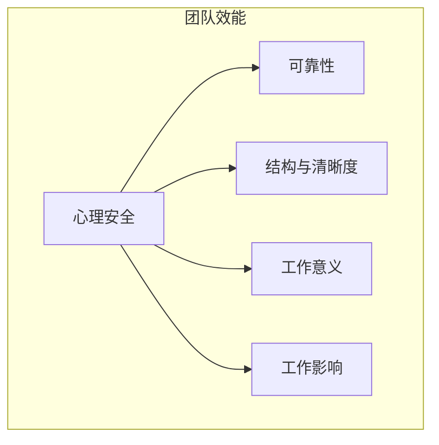

# 团队效能关键因素

引入AI工具后，团队的开发效率理应得到提升。但现实中，许多团队的整体效能却不升反降，甚至陷入混乱。根本原因在于，技术工具的引入冲击了团队原有的协作模式和心理状态。

借鉴谷歌著名的“亚里士多德计划”的研究成果，我们发现，决定一个团队是否卓越的关键因素并非成员的个人能力总和，而是团队的协作“氛围”（Vibe）。在AI时代，这些因素被赋予了新的内涵。

## 效能基石：心理安全 (Psychological Safety)

**定义**：团队成员相信，即使在团队中犯错或提出不同意见，自己也不会受到惩罚或羞辱。这是所有高效团队的绝对基石。

**在AI协作中的重要性**：
- **鼓励探索**：AI协作是新领域，必然伴随试错。只有在心理安全的环境下，成员才敢于尝试新的Prompt、新的工作流，从而发现最佳实践。
- **暴露问题**：当AI生成了有问题的代码或提供了错误信息（即“AI幻觉”）时，成员敢于公开指出问题，而不是因为害怕被指责“连AI都用不好”而掩盖它。
- **知识共享**：成员愿意分享自己与AI协作的成功技巧和失败教训，从而加速整个团队的学习曲线。

**如何构建**：
- **领导带头**：管理者首先承认自己也在学习如何与AI协作，并主动分享自己的失败案例。
- **建立“无指责”复盘文化**：复盘时，关注“问题出在哪里”，而不是“谁的错”。
- **拥抱“AI幻觉”**：将AI犯错视为一个正常的、可预期的事件，并建立流程来识别和纠正它。

## 效能支柱：四大关键因素

在心理安全的基础上，另外四个因素共同支撑起团队的效能。

### 1. 可靠性 (Dependability)

**定义**：团队成员能够相互信赖，按时、高质量地完成各自负责的工作。

**AI时代的新内涵**：
- **对人的可靠性**：成员相信同事能够正确地运用AI，并对AI的输出进行有效审查。
- **对AI的可靠性**：通过“上下文工程”，确保提供给AI的信息是准确和完整的，从而让AI的输出更可靠。
- **对流程的可靠性**：团队建立了清晰的AI协作流程（如风险评估、DADD），使得整个开发过程稳定且可预测。

### 2. 结构与清晰度 (Structure & Clarity)

**定义**：团队的目标、每个成员的角色和职责、以及完成工作的计划都是清晰明确的。

**AI如何增强**：
- **目标清晰化**：AI可以辅助将模糊的业务需求转化为结构化的功能列表、用户故事和技术指标。
- **角色清晰化**：在DADD模式下，每个模块的文档都清晰定义了负责人、输入、输出和验收标准，减少了职责不清的问题。
- **计划清晰化**：AI可以基于需求文档自动生成初步的任务拆解和排期建议，让整个项目计划更加透明。

### 3. 工作意义 (Meaning)

**定义**：团队成员感受到自己所做的工作对个人而言是重要的、有价值的。

**AI时代的挑战与机遇**：
- **挑战**：如果AI被用于取代开发者有创造性的核心工作，只留下“增删改查”的枯燥任务，会严重削弱成员的工作意义。
- **机遇**：将AI用于处理重复、繁琐的事务（如编写八股文式的代码、生成测试数据、格式化文档），可以将开发者解放出来，专注于更具创造性和挑战性的核心业务逻辑，从而**提升**工作意义。

### 4. 工作影响 (Impact)

**定义**：团队成员相信自己的工作正在为组织带来积极的改变，能够产生实际的影响。

**AI如何增强**：
- **加速价值交付**：AI显著缩短了从想法到产品的实现周期。团队能够更快地看到自己的工作成果被用户使用，这种即时反馈极大地提升了影响力感知。
- **量化工作影响**：AI可以辅助进行数据分析和可视化，将团队的工作成果（如性能提升、用户满意度变化）以直观的数据报告呈现出来，让团队更清晰地看到自己的贡献。

---

**本节小结：** 技术是杠杆，而文化是基石。在“团队Vibe Coding”范式中，**心理安全**是撬动AI潜能的支点。在此基础上，通过增强团队的**可靠性**、**结构清晰度**、**工作意义**和**工作影响**，才能将AI工具带来的“个体提效”真正转化为“团队增效”，实现可持续的、健康的卓越工程文化。

**下一章：** [第3章 AI工具与开发环境搭建](part2/chapter3.md)