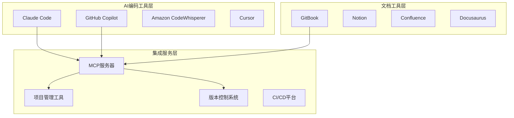

# 第3章 AI工具与开发环境搭建

> "工欲善其事，必先利其器。在AI协作时代，选择合适的工具组合是成功的第一步。"

## 章节概述

本章将深入探讨AI时代的开发工具生态，从主流AI编码工具的对比分析，到文档工具体系的设计，再到MCP服务器的集成配置。我们将为您提供一套完整的工具选择和环境搭建指南。

## 工具生态全景图

## 主要内容

### 1. 主流AI编码工具对比

全面分析当前市场上的主流AI编码工具，从功能特性、团队协作能力、安全合规等多个维度进行深度对比。

**对比维度：**
- 代码生成质量
- 团队协作功能
- 安全合规能力
- 成本效益分析
- 生态集成度

### 2. 文档工具体系与树状结构设计

构建支持AI协作的文档工具体系，设计合理的信息架构，确保文档的可维护性和可扩展性。

**设计原则：**
- 层次化信息组织
- 多维度交叉索引
- 版本控制集成
- 协作友好界面

### 3. MCP服务器与项目管理集成

深入介绍MCP（Model Context Protocol）服务器的配置和使用，实现AI工具与项目管理系统的深度集成。

**集成场景：**
- Figma设计稿同步
- Jira任务管理
- GitLab代码仓库
- Playwright测试自动化

## 环境搭建路线图

### 阶段一：基础工具选择（第1周）
- [ ] AI编码工具评估与选择
- [ ] 文档平台搭建
- [ ] 基础集成配置

### 阶段二：高级功能配置（第2周）
- [ ] MCP服务器部署
- [ ] 项目管理工具集成
- [ ] 自动化流程配置

### 阶段三：团队推广应用（第3-4周）
- [ ] 团队培训
- [ ] 使用规范制定
- [ ] 效果评估优化

## 实用资源

本章提供以下实用资源：

- **工具对比表**：详细的功能特性对比
- **配置模板**：开箱即用的配置文件
- **最佳实践**：经过验证的使用经验
- **故障排查**：常见问题解决方案

---

**详细内容：**
- [主流AI编码工具对比](chapter3/tools-comparison.md)
- [文档工具体系与树状结构设计](chapter3/doc-system.md)
- [MCP服务器与项目管理集成](chapter3/mcp-integration.md)

**下一章预告：** 第4章将专注于Claude Code的核心操作，包括上下文控制、文档驱动的AI交互流程以及实时协作机制。