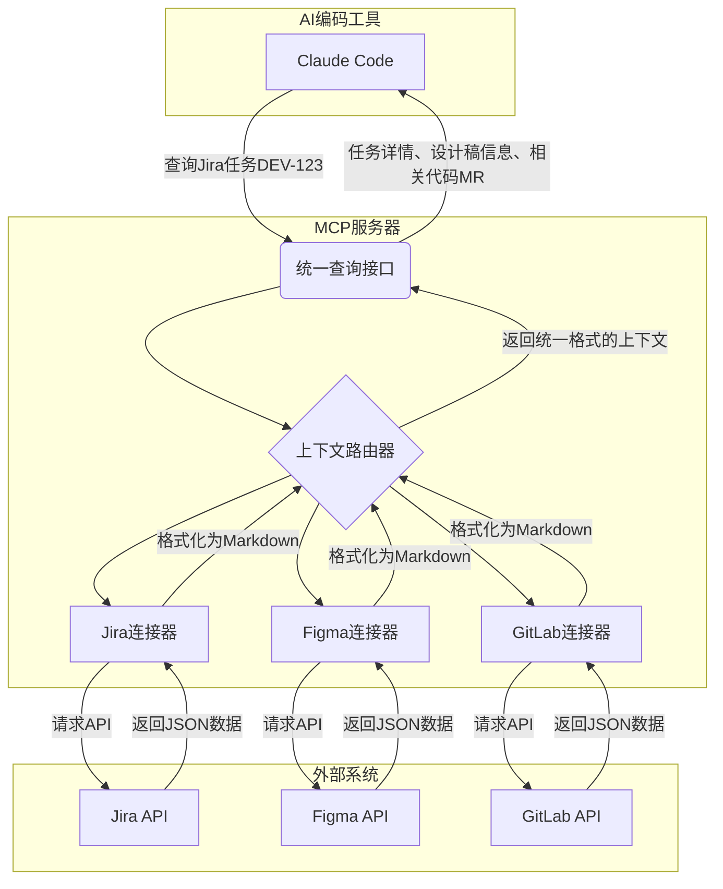

# MCP服务器与项目管理集成

到目前为止，我们已经讨论了如何通过文档为AI提供高质量的“静态上下文”。然而，在真实的开发流程中，大量关键信息是“动态”的，它们实时地产生于项目管理、设计和代码托管等外部系统中。

为了让AI能够理解这些动态信息，我们需要一个“超级连接器”。这就是 **MCP（Model Context Protocol，模型上下文协议）服务器** 的作用。

## 什么是MCP服务器？

MCP服务器是一个中间件服务，它扮演着 **“上下文路由器”** 的角色。它的核心功能是：

1.  **连接外部API**：它预置了与Jira, Figma, GitLab, Slack等常用开发工具的API连接器。
2.  **翻译与格式化**：它将从这些外部API获取的原始数据（通常是复杂的JSON），翻译和格式化成AI模型易于理解的、统一的纯文本或Markdown格式。
3.  **提供统一接口**：它为AI编码工具（如Claude Code）提供一个统一的查询端点。AI工具无需关心背后复杂的数据源，只需向MCP服务器发出简单的查询请求。



## 为什么需要MCP服务器？

如果没有MCP服务器，AI与外部系统的交互将是混乱且低效的：

- **AI的困境**：AI模型本身不具备直接调用外部API的能力，也无法理解各种各样的数据格式。
- **开发者的负担**：开发者需要手动从Jira复制任务描述，从Figma截图，再粘贴到AI的对话框中。这个过程繁琐、易出错，且信息是割裂的。

MCP服务器通过**自动化上下文获取**，解决了这个核心痛痛点，使得AI能够像经验丰富的开发者一样，自主地“查看”任务、“阅读”设计稿和“分析”代码历史。

## 核心集成场景示例

### 场景一：从Jira任务开始新功能开发

**传统流程**：开发者打开Jira，阅读任务描述，然后切换到IDE开始构思。
**MCP增强流程**：
1.  在AI对话框中输入：`开始开发任务 DEV-123`。
2.  AI通过MCP服务器查询Jira，自动获取`DEV-123`的全部信息，并以Markdown格式呈现：
    ```markdown
    ## Jira任务：DEV-123 - 实现用户登录功能

    **报告人**: 张三
    **状态**: 待开发

    **需求描述**:
    用户需要通过邮箱和密码登录系统...

    **验收标准**:
    - [ ] 用户输入正确的邮箱密码后，跳转到首页。
    - [ ] 用户输入错误的密码，提示“密码错误”。
    - [ ] ...

    **关联设计稿**:
    [Figma: design-link-for-login-page]
    ```
3.  AI进一步通过MCP获取Figma设计稿信息，甚至可以获取设计稿的图层、颜色、字体等详细参数。
4.  基于这些完整的上下文，AI可以直接生成项目文件结构、代码框架和测试用例。

### 场景二：AI协作代码审查（Code Review）

**传统流程**：审查者打开一个MR/PR，逐行阅读代码，需要频繁切换到Jira或设计稿以理解背景。
**MCP增强流程**：
1.  当一个MR被创建时，CI/CD流水线自动触发一个脚本。
2.  该脚本命令AI通过MCP服务器对这个MR进行初步审查。
3.  AI自动完成以下工作：
    - 获取关联的Jira任务，理解业务需求。
    - 检查代码变更是否符合需求和验收标准。
    - 对比关联的Figma设计稿，检查UI实现是否像素级匹配。
    - 分析代码是否遵循团队在`docs/03-processes-and-conventions/`中定义的编码规范。
4.  AI将审查报告自动评论到MR页面，指出潜在问题、提出修改建议，极大地减轻了人类审查者的负担。

## 如何搭建和配置

MCP服务器通常是一个开源项目或商业产品。搭建过程一般包括：

1.  **部署服务**：可以将其作为Docker容器部署在本地或云服务器上。
2.  **配置连接器**：在配置文件中，填入Jira、Figma、GitLab等系统的API地址和访问令牌（Token）。
3.  **配置AI工具**：在AI编码工具的设置中，指定MCP服务器的地址。

具体的部署和配置方法，请参考您所选择的MCP服务器的官方文档。

---

**本节小结：** MCP服务器是打通AI与软件开发全流程的“最后一公里”。它将AI的上下文理解能力从静态的文档和代码库，扩展到了动态的、实时的外部系统，使其成为一个真正“耳聪目明”的团队伙伴。通过集成MCP，团队可以实现更高层次的自动化和更流畅的人机协作。

**下一章：** [第4章 Claude Code核心操作](part2/chapter4.md)