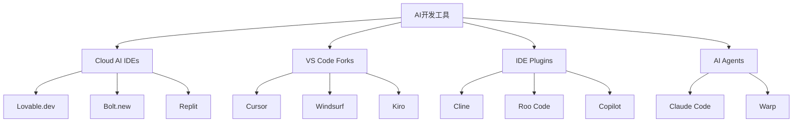
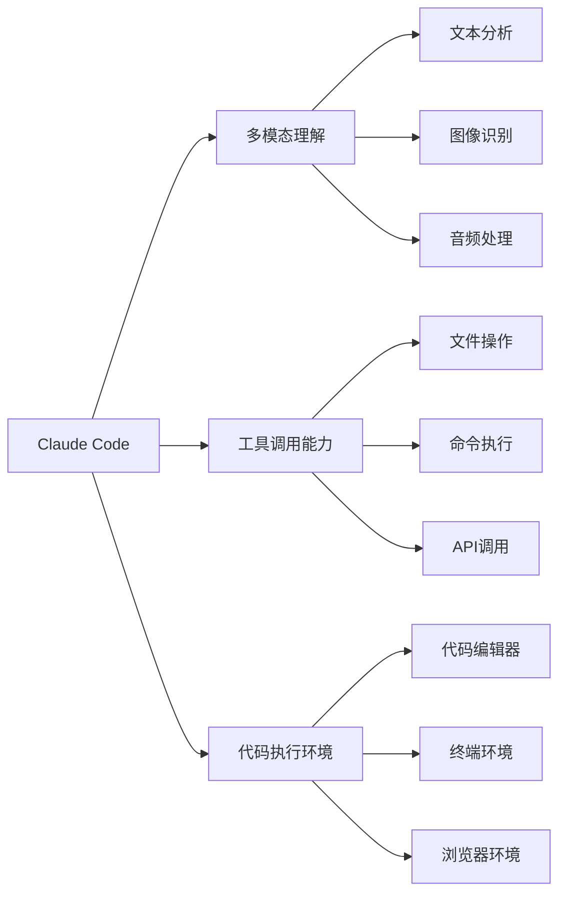
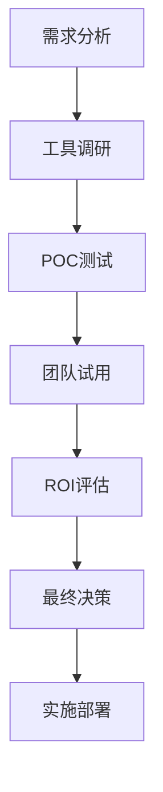

# 现代AI开发工具全景指南

> 基于10xdevelopers.dev深度分析，为中文开发者量身定制的AI工具选型指南

## 🎯 工具分类矩阵

根据10xdevelopers.dev的深度分析，现代AI开发工具可分为三大类别：



## 🌐 Cloud AI IDEs完整评测

### 1. Lovable.dev - 全栈应用工厂

**核心优势：**
- ⚡ **即时MVP**：从想法到可用应用只需几分钟
- 🎨 **内置设计系统**：专业的UI组件库
- 🔗 **前后端集成**：自动处理数据库、API、认证
- 📱 **响应式设计**：跨设备兼容

**技术栈：**
```javascript
// Lovable.dev 默认技术栈
{
  "frontend": "React + TypeScript + Tailwind CSS",
  "backend": "Node.js + Express",
  "database": "Supabase (PostgreSQL)",
  "auth": "Supabase Auth",
  "deployment": "Vercel"
}
```

**最佳使用场景：**
- ✅ MVP快速验证
- ✅ 内部工具开发
- ✅ 原型制作
- ❌ 复杂企业级应用
- ❌ 高性能要求系统

**实战案例：**
```bash
# 使用Lovable.dev创建项目
# 1. 访问 https://lovable.dev
# 2. 输入项目描述："创建一个项目管理工具，支持任务分配和进度跟踪"
# 3. AI自动生成完整应用
# 4. 一键部署到Vercel
```

### 2. Bolt.new - 创意快速实现

**核心特色：**
- 🚀 **零配置启动**：无需环境配置
- 🔄 **实时预览**：代码修改即时可见
- 🤖 **AI辅助编程**：智能代码补全和生成
- 📦 **包管理集成**：自动处理依赖

**与传统开发对比：**
| 维度 | 传统开发 | Bolt.new |
|------|----------|----------|
| 环境配置 | 30-60分钟 | 0分钟 |
| 项目初始化 | 15-30分钟 | 1分钟 |
| UI组件开发 | 2-4小时 | 10-30分钟 |
| 部署配置 | 1-2小时 | 一键部署 |

### 3. 其他Cloud IDEs对比

| 工具 | 优势 | 局限 | 适用场景 |
|------|------|------|----------|
| **Replit** | 协作功能强 | 性能限制 | 教育、原型 |
| **Google AI Studio** | Google模型集成 | 功能单一 | AI模型实验 |
| **Base44** | 企业级功能 | 学习成本高 | 企业应用 |

## 💻 VS Code Forks深度对比

### 1. Cursor - AI原生开发环境

**革命性特性：**
```markdown
## Tab智能预测
- 基于项目上下文的代码补全
- 支持多文件代码生成
- 智能导入建议

## Cmd+K 快速编辑
- 自然语言指令修改代码
- 跨文件重构操作
- 智能bug修复

## .cursorrules配置
- 项目级AI行为定制
- 团队编码规范集成
- 个性化工作流
```

**.cursorrules最佳实践：**
```markdown
# Web前端项目
你是一个资深的React/TypeScript开发专家。请遵循以下规则：
- 使用函数组件和Hooks
- 优先使用TypeScript严格模式
- 遵循ESLint和Prettier配置
- 使用语义化HTML5标签
- 实现响应式设计
- 添加适当的错误边界
- 编写可复用的组件

# 后端API项目
你是一个经验丰富的Node.js/Express开发专家。请遵循：
- 使用TypeScript严格类型检查
- 实现完整的错误处理
- 添加输入验证和清理
- 使用适当的HTTP状态码
- 实现日志记录
- 遵循RESTful API设计原则
- 添加API文档注释
```

### 2. Windsurf - 集成开发新体验

**核心功能：**
- 🌊 **流畅的AI集成**：无缝的AI辅助编程
- 🔄 **实时协作**：多开发者实时协作
- 📊 **智能调试**：AI辅助问题诊断
- 🎯 **上下文感知**：深度理解项目结构

### 3. VS Code生态系统插件

#### Cline - 全功能AI助手
**安装配置：**
```bash
code --install-extension saoudrizwan.claude-dev
```

**高级配置：**
```json
{
  "cline.autoRun": true,
  "cline.mcpServers": {
    "context7": {
      "command": "node",
      "args": ["path/to/context7-server.js"]
    },
    "serena": {
      "command": "node",
      "args": ["path/to/serena-server.js"]
    }
  },
  "cline.modelSettings": {
    "model": "claude-3-5-sonnet-20241022",
    "temperature": 0.1,
    "maxTokens": 4000
  }
}
```

#### Roo Code - 本地AI助手
**特色功能：**
- 🔒 **完全本地化**：数据隐私保护
- 🎛️ **模型可定制**：支持多种开源模型
- 💾 **离线工作**：无需网络连接
- 🚀 **高性能**：本地GPU加速

## 🤖 AI Agents框架对比

### 1. Claude Code - 企业级AI代理

**核心架构：**


**企业级特性：**
- 🛡️ **安全合规**：企业级安全标准
- 👥 **团队协作**：多用户共享环境
- 📊 **使用分析**：详细的操作日志
- 🔧 **高度可定制**：企业规则引擎

### 2. 其他AI Agents

| 框架 | 特点 | 适用场景 | 学习成本 |
|------|------|----------|----------|
| **Warp** | 终端AI助手 | 命令行操作 | 低 |
| **Aider** | 代码编辑专家 | 大型代码库 | 中 |
| **Continue** | VS Code集成 | 现有工作流 | 低 |
| **GitHub Copilot** | 代码补全 | 日常编码 | 极低 |

## 🔧 团队工具选型策略

### 按团队规模选择

#### 小团队 (2-5人)
```yaml
推荐组合:
  - 主要工具: Cursor + Claude Code
  - 备选方案: VS Code + Cline
  - 原型工具: Bolt.new
  - 部署方案: Vercel + Supabase

预算考虑: $50-200/月
学习成本: 1-2周
```

#### 中型团队 (6-20人)
```yaml
推荐组合:
  - 主要工具: Windsurf + Claude Code Enterprise
  - 原型工具: Lovable.dev Teams
  - 代码审查: GitHub Copilot for Business
  - 文档工具: Notion + AI

预算考虑: $500-2000/月
学习成本: 2-4周
```

#### 大型企业 (20+人)
```yaml
推荐组合:
  - 主要工具: 定制IDE + Claude Code Enterprise
  - 原型工具: Lovable.dev Enterprise
  - 安全方案: 私有化部署
  - 集成方案: 企业级SSO

预算考虑: $2000+/月
学习成本: 1-2个月
```

### 按项目类型选择

#### 前端项目
```javascript
const frontendTools = {
  'react': {
    ide: 'Cursor',
    plugins: ['ESLint', 'Prettier', 'Tailwind CSS IntelliSense'],
    aiHelper: 'GitHub Copilot',
    buildTool: 'Vite'
  },
  'vue': {
    ide: 'VS Code + Volar',
    plugins: ['Vue Language Features', 'TypeScript Vue Plugin'],
    aiHelper: 'Cline',
    buildTool: 'Vue CLI'
  }
};
```

#### 全栈项目
```javascript
const fullstackTools = {
  'rapid_mvp': {
    frontend: 'Lovable.dev',
    backend: 'Bolt.new',
    database: 'Supabase',
    deployment: 'Vercel'
  },
  'enterprise': {
    frontend: 'Cursor + React',
    backend: 'Claude Code + Node.js',
    database: 'PostgreSQL',
    deployment: 'AWS/GCP'
  }
};
```

## 📊 工具效果评估

### 生产力提升指标

基于10xdevelopers.dev的实践数据：

| 工具组合 | 开发效率提升 | 代码质量 | 学习成本 | 团队适应度 |
|----------|-------------|----------|----------|------------|
| **Cursor + Claude Code** | +45% | +12% | 2周 | ⭐⭐⭐⭐⭐ |
| **VS Code + Cline** | +35% | +8% | 1周 | ⭐⭐⭐⭐ |
| **Lovable.dev** | +120% (MVP) | +5% | 3天 | ⭐⭐⭐ |
| **Windsurf** | +40% | +10% | 2周 | ⭐⭐⭐⭐ |

### 投资回报率 (ROI) 分析

```yaml
小团队示例:
  投入成本:
    - Cursor Pro: $20/月 × 3人 = $60/月
    - Claude Code: $30/月 × 3人 = $90/月
    总计: $150/月 = $1800/年

  收益计算:
    - 效率提升45% = 节省0.45人月
    - 按月薪$8000计算 = $3600/月
    - 年收益: $3600 × 12 = $43200

  ROI: ($43200 - $1800) / $1800 = 2300%
```

## 🚀 迁移指南

### 从传统开发迁移

#### 第一阶段：工具引入 (1-2周)
```bash
# 1. 安装基础工具
brew install --cask cursor
npm install -g @anthropic-ai/claude-code

# 2. 配置IDE
code --install-extension saoudrizwan.claude-dev

# 3. 创建.cursorrules
echo "你是一个AI编程助手..." > .cursorrules
```

#### 第二阶段：流程适应 (2-4周)
```markdown
## 迁移检查清单
- [ ] 团队成员完成工具培训
- [ ] 建立AI协作规范
- [ ] 创建项目模板
- [ ] 设置代码审查流程
- [ ] 配置CI/CD集成
```

#### 第三阶段：深度集成 (4-8周)
```yaml
高级集成:
  - MCP服务器配置
  - 自定义工具开发
  - 企业规则引擎
  - 性能监控系统
```

## ✅ 选择决策框架

### 评估维度
```markdown
1. **团队适配度** (30%)
   - 技术栈匹配度
   - 学习成本
   - 团队规模

2. **功能完整性** (25%)
   - AI能力强度
   - 工具生态丰富度
   - 集成便利性

3. **成本效益** (20%)
   - 许可费用
   - 迁移成本
   - ROI预期

4. **安全合规** (15%)
   - 数据安全
   - 企业合规
   - 隐私保护

5. **未来发展** (10%)
   - 技术路线图
   - 社区活跃度
   - 厂商稳定性
```

### 决策流程


---

**🎯 总结：** 选择合适的AI开发工具需要综合考虑团队需求、项目特点、成本预算和未来发展。建议从试点项目开始，逐步推广到整个团队，确保平稳过渡和效果最大化。