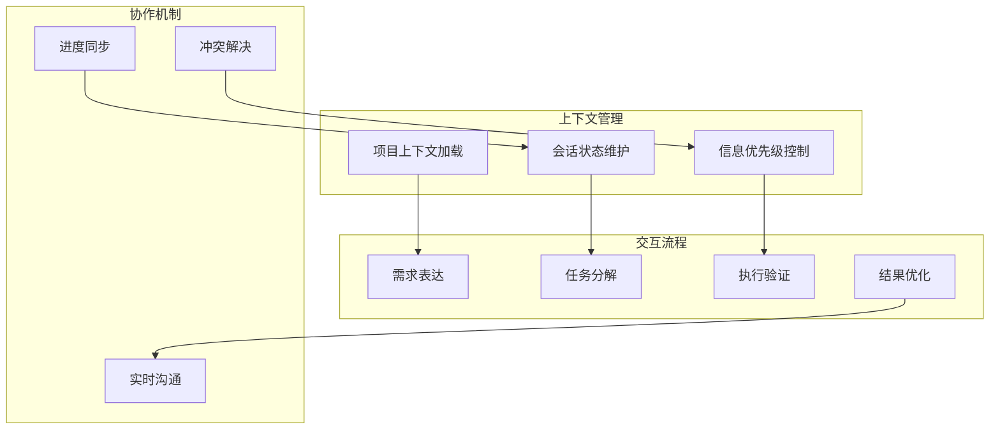

# 第4章 Claude Code核心操作

> "掌握Claude Code的核心操作技巧，是实现高效AI协作的基础。从上下文控制到文档驱动的交互流程，每一个细节都关乎协作的成败。"

## 章节概述

本章将深入介绍Claude Code的核心操作方法，包括上下文控制与信息管理、文档驱动的AI交互流程，以及实时协作与沟通机制。通过系统化的学习，帮助读者掌握与AI高效协作的关键技能。

## 核心操作框架



## 主要内容

### 1. 上下文控制与信息管理

掌握如何有效管理AI的上下文信息，确保AI能够准确理解项目背景和当前任务。

**核心技能：**
- 项目信息的结构化组织
- 会话历史的有效利用
- 关键信息的优先级管理
- 上下文窗口的优化使用

### 2. 文档驱动的AI交互流程

建立以文档为核心的AI交互模式，提高沟通效率和结果质量。

**流程要素：**
- 需求文档的标准化表达
- 任务分解的系统化方法
- 执行过程的可视化跟踪
- 结果验证的自动化机制

### 3. 实时协作与沟通机制

构建高效的团队协作机制，确保AI参与的项目能够顺利推进。

**协作要点：**
- 多人协作的冲突避免
- 进度同步的实时机制
- 问题解决的快速响应
- 知识共享的有效方式

## 实践指南

### 上下文管理最佳实践

**1. 项目上下文模板**
```markdown
# 项目上下文信息

## 基本信息
- 项目名称：[项目名称]
- 技术栈：[主要技术栈]
- 开发阶段：[当前阶段]
- 团队规模：[团队人数和角色]

## 当前任务
- 任务描述：[具体任务内容]
- 优先级：[高/中/低]
- 截止时间：[时间要求]
- 相关文件：[相关代码文件列表]

## 约束条件
- 技术约束：[技术限制]
- 业务约束：[业务规则]
- 时间约束：[时间限制]
```

**2. 信息优先级管理**
```
高优先级：
- 当前任务的核心需求
- 关键的技术约束
- 重要的业务规则

中优先级：
- 相关的历史决策
- 参考的最佳实践
- 可选的优化建议

低优先级：
- 背景信息
- 扩展阅读
- 未来规划
```

### 交互流程标准化

**1. 需求表达模板**
```
## 任务描述
[清晰描述要完成的任务]

## 期望结果
[具体说明期望的输出]

## 技术要求
[列出技术规范和约束]

## 验收标准
[定义完成的标准]
```

**2. 任务分解方法**
```
1. 理解需求 → 确认任务目标
2. 分析复杂度 → 评估工作量
3. 识别依赖 → 确定执行顺序
4. 制定计划 → 分配时间资源
```

## 工具与技巧

### Claude Code 高级功能

**1. 多文件操作**
- 批量文件读取和分析
- 跨文件的代码重构
- 项目结构的整体优化

**2. 代码生成与优化**
- 基于规范的代码生成
- 性能优化建议
- 安全漏洞检测

**3. 文档自动化**
- API文档自动生成
- 代码注释补充
- 技术文档更新

### 协作工具集成

**1. 版本控制集成**
```bash
# Git工作流优化
git worktree add ../feature-branch feature/new-feature
cd ../feature-branch
# 在独立工作树中进行AI辅助开发
```

**2. 项目管理集成**
- Jira任务同步
- Trello看板更新
- Slack通知集成

## 常见问题与解决方案

### 问题1：上下文信息过载
**现象：** AI回复变得冗长或偏离主题
**解决方案：**
- 精简上下文信息
- 使用信息优先级管理
- 定期清理会话历史

### 问题2：任务理解偏差
**现象：** AI执行的结果与期望不符
**解决方案：**
- 使用结构化的需求表达
- 提供具体的示例
- 增加验收标准描述

### 问题3：协作冲突
**现象：** 多人同时使用AI时出现冲突
**解决方案：**
- 建立协作规范
- 使用分支管理策略
- 实施代码审查机制

## 性能优化建议

### 提升AI响应质量
1. **精确的问题描述**：避免模糊和歧义
2. **充分的上下文信息**：提供必要的背景
3. **清晰的期望设定**：明确输出要求
4. **及时的反馈调整**：根据结果优化提示

### 提高协作效率
1. **标准化工作流程**：建立统一的操作规范
2. **自动化重复任务**：减少手动操作
3. **知识库建设**：积累可复用的经验
4. **持续改进机制**：定期优化协作方式

---

**详细内容：**
- [上下文控制与信息管理](chapter4/context-control.md)
- [文档驱动的AI交互流程](chapter4/doc-driven-flow.md)
- [实时协作与沟通机制](chapter4/collaboration.md)

**下一章预告：** 第5章将进入团队协作的核心流程，详细介绍需求拆解与任务分配的方法和实践。