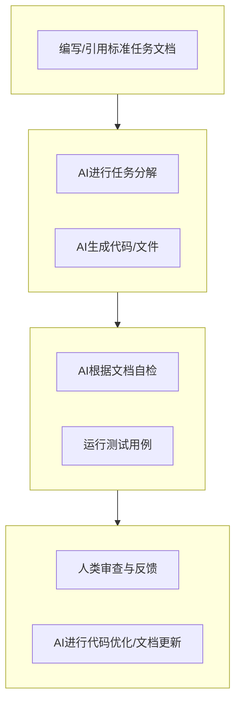

# 文档驱动的AI交互流程

掌握了上下文管理的基础后，我们需要一个标准化的流程来确保每一次与AI的复杂交互都是高效且可预测的。文档驱动的AI交互流程（DADD Flow）正是为此而生。它将一份结构化的文档作为人与AI之间沟通的“契约”，围绕这份“契约”进行任务的分解、执行和验证。

这个流程的核心思想是：**不说“废话”，只看文档**。我们用一份精心准备的文档来代替零散、模糊的自然语言指令。

## DADD交互流程的四个阶段

一个完整的DADD交互流程包含四个主要阶段：**准备 (Prepare)**、**执行 (Execute)**、**验证 (Verify)** 和 **完善 (Polish)**。



### 阶段一：准备 (Prepare) - 编写标准任务文档

这是整个流程的起点。在开始任何编码之前，我们需要创建一份标准化的任务文档。这份文档就是我们提供给AI的最核心的“即时上下文”。

**标准任务文档模板 (`task-doc-template.md`)**
```markdown
### 1. 任务目标 (Goal)
一句话清晰描述本次任务要达成的核心目标。
> **示例**: 创建一个响应式的用户注册表单组件。

### 2. 背景与上下文 (Context)
提供必要的背景信息，或引用相关的全局上下文文档。
> **示例**: 此表单将用于我们的新用户引导流程。设计规范请参考 `@/docs/02-architecture-and-design/ui-style-guide.md`。

### 3. 功能需求 (Functional Requirements)
使用列表详细说明需要实现的功能点。
> **示例**:
> - 包含字段：用户名、邮箱、密码、确认密码。
> - 所有字段均为必填项。
> - 邮箱需要进行格式验证。
> - 密码与确认密码必须一致。

### 4. 技术约束 (Technical Constraints)
明确技术栈、库版本、目录结构等技术要求。
> **示例**:
> - **框架**: React (v18+) with TypeScript
> - **状态管理**: Zustand
> - **UI组件**: 必须使用 `@/src/components/ui/` 目录下的 `Input` 和 `Button` 组件。
> - **文件位置**: 在 `@/src/features/auth/components/` 目录下创建 `RegistrationForm.tsx`。

### 5. 验收标准 (Acceptance Criteria)
定义怎样才算“完成”，最好是可测试、可验证的。
> **示例**:
> - [ ] 所有字段输入有效数据后，点击“注册”按钮，`onSubmit` 回调函数被正确调用。
> - [ ] 任何一个字段为空时，点击“注册”按钮，按钮应处于禁用状态。
> - [ ] 输入不合法的邮箱格式，字段下方应显示错误提示。
```

### 阶段二：执行 (Execute) - AI任务分解与生成

准备好文档后，我们将其“喂”给AI，并引导它进行任务分解和代码生成。

**Prompt示例：**
> 这是本次的开发任务文档，请仔细阅读。
>
> (粘贴或引用上面的任务文档)
>
> **第一步**：请根据这份文档，为我提供一个清晰的实现步骤计划。
> **第二步**：待我确认计划后，请开始生成代码。

AI会首先给出一个计划，例如：
1.  创建 `RegistrationForm.tsx` 文件。
2.  引入依赖的React Hooks和UI组件。
3.  定义表单状态。
4.  实现表单的JSX结构。
5.  编写验证逻辑。
6.  处理提交事件。

在你确认计划后，AI将开始生成具体的代码。

### 阶段三：验证 (Verify) - AI自检与测试

代码生成后，我们要求AI根据最初的“契约”（任务文档）进行自我检查。

**Prompt示例：**
> 代码已收到。现在，请你扮演一个测试工程师的角色，严格对照任务文档中的 **“功能需求”** 和 **“验收标准”**，逐条检查你生成的代码是否完全满足要求。如果不满足，请直接指出并提供修正后的代码。

这个阶段可以极大地减少低级错误，确保AI的交付物与需求对齐。如果项目中配置了自动化测试，此时也可以运行测试用例，并将失败的日志反馈给AI进行修复。

### 阶段四：完善 (Polish) - 人类审查与最终优化

AI完成了自检和修复后，就轮到人类开发者进行最终的审查和优化。

**人类审查的重点：**
- **代码优雅性**：AI生成的代码可能功能正确但不够优雅，人类可以进行重构。
- **边界情况**：AI可能没有考虑到一些极限或边界条件。
- **业务洞察**：代码是否体现了更深层次的业务理解。

审查后，可以将修改意见反馈给AI，让它进行最终的代码优化，或者让它根据最终代码更新相关的API文档或注释。

---

**本节小结：** 文档驱动的AI交互流程（DADD Flow）为复杂的人机协作提供了一个清晰、可靠的“章法”。通过遵循 **准备 -> 执行 -> 验证 -> 完善** 的四阶段流程，并以标准化的任务文档作为核心“契约”，我们可以将AI的强大生成能力，约束在满足我们精确需求的轨道上，从而稳定地输出高质量的开发成果。

**下一节：** [实时协作与沟通机制](collaboration.md)