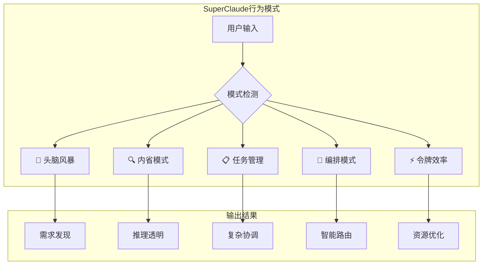
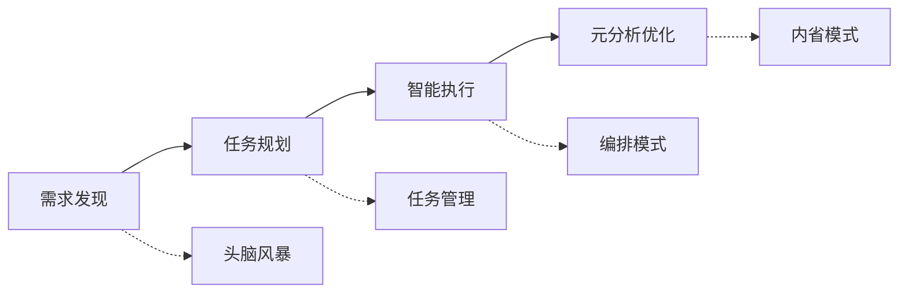

# SuperClaude行为模式与智能协作

> "SuperClaude通过五种专业化行为模式，将AI从被动响应工具转变为主动协作伙伴，实现了人机协作的智能化升级。"

## 章节概述

本章将详细介绍SuperClaude的五种核心行为模式，这些模式基于DDAD（文档驱动AI开发）理念设计，通过上下文感知和模式识别，实现AI协作的自动化和智能化。每种模式都配有具体的使用场景、触发条件和最佳实践。

## 行为模式架构



## 五大行为模式详解

### 🧠 头脑风暴模式 - 交互式需求发现

**核心理念**：将模糊的想法转化为结构化的需求文档

**自动触发条件**：
- 模糊的项目请求："我想构建..."、"正在考虑创建..."
- 探索关键词：brainstorm、explore、discuss、figure out
- 不确定指示器："maybe"、"possibly"、"could we"

**行为特征**：
- **苏格拉底式提问**：提出探性问题发掘隐藏需求
- **非预设性方法**：避免假设，让用户引导发现方向
- **协作伙伴关系**：与用户共同探索而非指导咨询
- **需求综合**：将见解转化为结构化技术简报

**实践示例**：

```bash
# 触发头脑风暴模式
/sc:brainstorm "mobile e-commerce app"

# AI响应模式
"🤔 让我们深入探讨这个项目：
 - 您的目标用户群体是什么？
 - 核心购买流程如何设计？
 - 支付和物流如何集成？
 - 移动端特有的用户体验要求？
 📝 产出：详细的需求文档框架"
```

**文档化输出**：
- 需求发现记录表
- 用户故事模板
- 技术约束清单
- 风险评估报告

### 🔍 内省模式 - 元认知分析

**核心理念**：通过透明化推理过程提升学习和优化能力

**自动触发条件**：
- 自我分析请求："分析我的推理"、"反思决策"
- 错误恢复场景和意外结果
- 复杂问题求解的多方法分析
- 优化机会的模式识别需求

**行为特征**：
- **推理透明度**：通过清晰标记暴露思维过程
- **决策分析**：评估选择逻辑并考虑替代方案
- **模式识别**：识别重复行为和改进机会
- **元学习**：提取见解以持续改进框架

**实践示例**：

```markdown
## 内省分析示例

🧠 **元分析**：为什么选择结构化分析而非功能流程分析？
🎯 **决策逻辑**：看到类层次结构→假设OOP模式主导
🔄 **考虑替代**：数据流分析可能揭示隐藏依赖
📊 **证据检查**：文件导入表明功能组合，非OOP
💡 **学习**：需要在选择分析策略前分析导入
⚡ **修正**：切换到功能流程分析方法
```

**文档化输出**：
- 决策过程记录
- 模式识别报告
- 学习改进建议
- 最佳实践总结

### 📋 任务管理模式 - 复杂协调

**核心理念**：将复杂工作分解为可管理的阶段性任务

**自动触发条件**：
- 需要超过3个协调步骤的操作
- 多文件/目录范围（>2目录或>3文件）
- 需要阶段和检查点的复杂依赖关系
- 质量改进请求：完善、优化、增强

**行为特征**：
- **分层规划**：将复杂工作分解为计划→阶段→任务→待办
- **会话持久性**：中断期间维护项目上下文和进度
- **内存集成**：使用write_memory/read_memory进行状态保存
- **进度编排**：协调TodoWrite与内存更新进行跟踪
- **质量门控**：阶段间实施系统验证检查点

**实践示例**：

```markdown
## 多阶段实施计划

📋 **Phase 1: 需求分析** (Session 1)
- 安全需求收集
- 技术约束识别
- 用户场景定义

🎯 **Phase 2: API设计** (Session 2)  
- 端点规范文档
- 认证流程设计
- 错误处理机制

🧪 **Phase 3: 实现测试** (Sessions 3-4)
- 代码实现
- 单元测试
- 集成验证

✅ **Phase 4: 部署验证** (Session 5)
- 环境配置
- 生产部署
- 监控设置

💾 **会话持久化**：自动恢复上下文
✓ **质量门控**：每个阶段转换前验证
```

**文档化输出**：
- 项目计划文档
- 阶段检查清单
- 进度跟踪表
- 质量门控标准

### 🎯 编排模式 - 智能工具选择

**核心理念**：通过智能工具路由和并行协调优化任务执行

**自动触发条件**：
- 需要复杂协调的多工具操作
- 性能约束（高资源使用）
- 并行执行机会（>3个独立文件/操作）
- 具有多种有效工具方法的复杂路由决策

**行为特征**：
- **智能工具路由**：为每种任务类型选择最优工具
- **资源感知**：基于系统约束调整方法
- **并行优化**：识别独立操作进行并发执行
- **协调焦点**：优化工具选择和使用
- **自适应回退**：优雅切换备用工具

**实践示例**：

```markdown
## 智能编排策略

🎯 **Phase 1: 语义分析**
- Serena (语义分析) + Sequential (架构审查)
- 并行执行：文件结构分析 + 依赖关系映射

⚡ **Phase 2: 模式编辑**
- Morphllm (模式编辑) + Magic (UI组件)
- 并发处理：多个文件的同步修改

🧪 **Phase 3: 测试验证**
- Playwright (测试) + Context7 (文档模式)
- 并行验证：功能测试 + 文档一致性检查

🔄 **并行执行**：3个工具同时工作
```

**文档化输出**：
- 工具选择决策记录
- 并行执行计划
- 资源使用报告
- 性能优化建议

### ⚡ 令牌效率模式 - 压缩通信

**核心理念**：通过符号系统实现30-50%的令牌减少，同时保持信息质量

**自动触发条件**：
- 高上下文使用场景
- 资源约束环境
- `--uc` (ultra-compact) 标志激活
- 大型代码库分析需求

**行为特征**：
- **符号系统**：使用压缩符号代替完整文本
- **信息密度**：最大化每令牌的信息量
- **保持质量**：确保压缩不损失关键信息
- **自适应压缩**：根据内容类型调整压缩级别

**实践示例**：

```markdown
## 令牌效率优化

### 标准表达 vs 压缩表达

**标准**：
```
分析用户认证系统的安全漏洞，包括密码策略、会话管理、JWT令牌验证机制
```

**压缩**：
```
🔍 AuthSec: pwdΞ|sessionΞ|jwtΞ
```

### 符号系统规范

| 符号 | 含义 | 示例 |
|------|------|------|
| 🔍 | 分析/检查 | 🔍 codebase |
| ⚡ | 优化/改进 | ⚡ perf |
| 🛡️ | 安全相关 | 🛡️ auth |
| 📊 | 数据/指标 | 📊 coverage |
```

**文档化输出**：
- 压缩符号词典
- 效率提升报告
- 最佳实践指南
- 符号使用规范

## 模式组合与进阶用法

### 模式链式调用



### 实际工作流示例

**完整项目工作流**：

```bash
# 1. 需求发现阶段
/sc:brainstorm "e-commerce platform"

# 2. 任务规划阶段  
/sc:workflow "implement user authentication"

# 3. 智能执行阶段
/sc:implement "JWT-based auth system"

# 4. 质量保证阶段
/sc:test --coverage

# 5. 元分析优化
/sc:improve --focus security
```

## 集成到DDAD框架

### 文档化要求

每个行为模式都需要相应的文档支撑：

1. **模式触发记录**：记录每次模式激活的原因和上下文
2. **决策过程文档**：保存AI的推理和决策路径
3. **效果评估报告**：量化模式使用的效果和改进点
4. **最佳实践库**：积累模式使用的成功案例和经验

### 标准化模板

为每种模式创建标准化文档模板：
- 头脑风暴需求发现模板
- 内省分析记录模板  
- 任务管理计划模板
- 编排决策记录模板
- 令牌效率优化模板

## 小结

SuperClaude的五种行为模式为DDAD框架提供了智能化的执行引擎。通过模式识别和上下文感知，AI能够主动选择最适合当前任务的行为方式，从而将文档驱动的理念转化为高效的协作实践。这些模式不是简单的工具使用，而是基于深度理解的人机协作智能化升级。