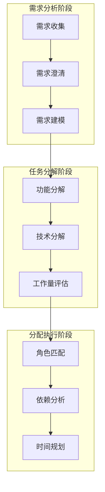
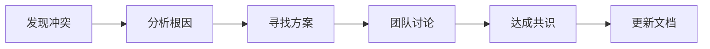
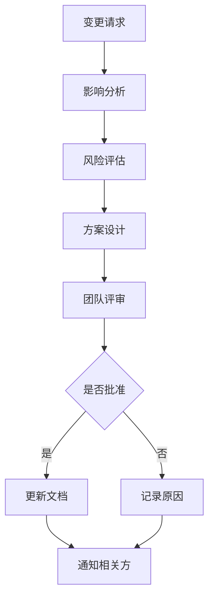

# 第5章 需求拆解与任务分配

> "优秀的需求拆解是成功协作的基石。在AI协作的团队开发中，如何将复杂需求分解为可执行的任务，直接决定了项目的成败。"

## 章节概述

本章将深入探讨AI协作的需求分析方法，介绍如何在团队协作中建立心理安全环境，以及需求文档的标准化实践。通过系统化的方法论，帮助团队实现高效的需求管理和任务分配。

## 需求拆解方法论



## 主要内容

### 1. AI协作的需求分析方法

利用AI的强大分析能力，提升需求分析的效率和质量。

**核心方法：**
- 自然语言需求的结构化转换
- 需求完整性的智能检查
- 潜在风险的自动识别
- 类似项目经验的智能推荐

### 2. 需求阶段的心理安全建设

在需求分析过程中建立心理安全环境，确保团队成员能够自由表达想法和担忧。

**关键要素：**
- 开放式沟通文化
- 错误容忍机制
- 多元化观点鼓励
- 持续学习氛围

### 3. 需求文档标准化

建立统一的需求文档规范，提高团队协作效率。

**标准化内容：**
- 需求文档模板
- 评审流程规范
- 变更管理机制
- 追溯性要求

## AI协作需求分析实践

### 需求收集与整理

**1. 智能需求提取**
```python
# AI协作需求提取示例
def extract_requirements(raw_input):
    """
    从自然语言描述中提取结构化需求
    """
    prompt = f"""
    请从以下描述中提取结构化需求：
    
    原始描述：{raw_input}
    
    请按以下格式输出：
    1. 功能需求：
    2. 非功能需求：
    3. 约束条件：
    4. 验收标准：
    """
    
    return ai_client.generate(prompt)
```

**2. 需求完整性检查**
```markdown
## 需求完整性检查清单

### 功能性需求
- [ ] 核心功能描述清晰
- [ ] 用户角色定义明确
- [ ] 业务流程完整
- [ ] 异常处理考虑周全

### 非功能性需求
- [ ] 性能指标明确
- [ ] 安全要求详细
- [ ] 可用性标准清晰
- [ ] 兼容性要求完整

### 约束条件
- [ ] 技术约束明确
- [ ] 资源约束清晰
- [ ] 时间约束合理
- [ ] 合规要求完整
```

### 任务分解策略

**1. 功能导向分解**
```
用户管理系统
├── 用户注册
│   ├── 注册表单设计
│   ├── 数据验证逻辑
│   ├── 邮箱验证功能
│   └── 注册成功页面
├── 用户登录
│   ├── 登录界面
│   ├── 身份验证
│   ├── 会话管理
│   └── 密码重置
└── 用户资料管理
    ├── 资料展示页面
    ├── 资料编辑功能
    ├── 头像上传
    └── 隐私设置
```

**2. 技术导向分解**
```
前端任务
├── UI组件开发
├── 状态管理
├── API集成
└── 测试用例

后端任务
├── 数据库设计
├── API接口开发
├── 业务逻辑实现
└── 单元测试

DevOps任务
├── 环境配置
├── CI/CD流水线
├── 监控告警
└── 部署脚本
```

### 工作量评估方法

**1. 三点估算法**
```
工作量 = (乐观估计 + 4×最可能估计 + 悲观估计) / 6

示例：
- 乐观估计：2天
- 最可能估计：3天
- 悲观估计：5天
- 最终估计：(2 + 4×3 + 5) / 6 = 3.17天
```

**2. AI协作估算**
```python
def estimate_task_effort(task_description, similar_tasks_history):
    """
    基于历史数据和AI分析进行工作量估算
    """
    prompt = f"""
    基于以下信息估算任务工作量：
    
    任务描述：{task_description}
    
    类似任务历史数据：
    {similar_tasks_history}
    
    请提供：
    1. 工作量估算（人天）
    2. 风险因素分析
    3. 建议的缓冲时间
    """
    
    return ai_client.analyze(prompt)
```

## 心理安全建设实践

### 建立安全的沟通环境

**1. 沟通原则**
- **无批判倾听**：先理解，再评判
- **建设性反馈**：关注问题，不攻击个人
- **错误学习**：将错误视为学习机会
- **多元包容**：尊重不同观点和背景

**2. 会议规范**
```markdown
## 需求评审会议规范

### 会前准备
- [ ] 提前分发需求文档
- [ ] 参会人员确认理解
- [ ] 准备相关背景资料

### 会议进行
- [ ] 营造开放氛围
- [ ] 鼓励提问和质疑
- [ ] 记录所有意见和建议
- [ ] 避免过早下结论

### 会后跟进
- [ ] 整理会议纪要
- [ ] 明确后续行动项
- [ ] 跟踪问题解决进度
```

### 冲突解决机制

**1. 需求冲突处理流程**


**2. 决策框架**
```
决策优先级：
1. 用户价值 > 技术偏好
2. 业务目标 > 个人喜好
3. 长期利益 > 短期便利
4. 团队共识 > 个人意见
```

## 需求文档标准化

### 文档模板体系

**1. 需求规格说明书模板**
```markdown
# [项目名称] 需求规格说明书

## 1. 项目概述
### 1.1 项目背景
### 1.2 项目目标
### 1.3 项目范围

## 2. 功能需求
### 2.1 用户角色定义
### 2.2 功能模块描述
### 2.3 业务流程图

## 3. 非功能需求
### 3.1 性能要求
### 3.2 安全要求
### 3.3 可用性要求

## 4. 约束条件
### 4.1 技术约束
### 4.2 资源约束
### 4.3 时间约束

## 5. 验收标准
### 5.1 功能验收标准
### 5.2 性能验收标准
### 5.3 质量验收标准
```

**2. 用户故事模板**
```markdown
## 用户故事：[功能名称]

**作为** [用户角色]
**我希望** [功能描述]
**以便** [价值说明]

### 验收标准
- [ ] 标准1
- [ ] 标准2
- [ ] 标准3

### 技术要求
- 性能要求：[具体指标]
- 安全要求：[安全标准]
- 兼容性：[支持范围]

### 设计约束
- UI/UX要求：[设计规范]
- 技术栈：[技术选择]
- 集成要求：[系统集成]
```

### 变更管理流程

**1. 需求变更流程**


**2. 变更记录模板**
```markdown
## 需求变更记录

### 变更信息
- 变更编号：[CR-001]
- 提出人：[姓名]
- 提出时间：[日期]
- 变更类型：[新增/修改/删除]

### 变更内容
- 原需求：[原始需求描述]
- 新需求：[变更后需求描述]
- 变更原因：[变更理由]

### 影响分析
- 功能影响：[影响的功能模块]
- 工作量影响：[增加/减少的工作量]
- 时间影响：[对项目进度的影响]
- 成本影响：[对项目成本的影响]

### 决策结果
- 决策：[批准/拒绝/延期]
- 决策人：[决策者]
- 决策时间：[决策日期]
- 决策理由：[决策依据]
```

## 实践案例

### 案例：电商平台需求分析

**1. 原始需求**
```
"我们需要一个电商平台，用户可以浏览商品、下单购买，商家可以管理商品和订单。"
```

**2. AI协作需求分解**
```markdown
## 功能需求分解

### 用户端功能
1. 用户管理
   - 用户注册/登录
   - 个人资料管理
   - 收货地址管理

2. 商品浏览
   - 商品列表展示
   - 商品详情查看
   - 商品搜索功能
   - 商品分类筛选

3. 购物流程
   - 购物车管理
   - 订单创建
   - 支付处理
   - 订单跟踪

### 商家端功能
1. 商家管理
   - 商家注册/认证
   - 店铺信息管理
   - 商家权限控制

2. 商品管理
   - 商品信息录入
   - 商品库存管理
   - 商品上下架
   - 价格管理

3. 订单管理
   - 订单处理
   - 发货管理
   - 退换货处理
   - 财务对账
```

**3. 任务分配矩阵**
```
| 功能模块 | 前端开发 | 后端开发 | 测试 | 设计 | 优先级 |
|----------|----------|----------|------|------|--------|
| 用户注册登录 | 张三 | 李四 | 王五 | 赵六 | 高 |
| 商品浏览 | 张三 | 李四 | 王五 | 赵六 | 高 |
| 购物车 | 张三 | 李四 | 王五 | - | 中 |
| 支付系统 | - | 李四 | 王五 | - | 高 |
| 商家管理 | 张三 | 李四 | 王五 | 赵六 | 中 |
```

## 工具与技术

### 需求管理工具

**1. 文档工具**
- Confluence：企业级文档管理
- Notion：灵活的协作文档
- GitBook：技术文档专用

**2. 项目管理工具**
- Jira：专业的需求和任务管理
- Trello：轻量级看板管理
- Azure DevOps：微软全栈解决方案

**3. 协作工具**
- Miro：在线白板协作
- Figma：设计协作平台
- Slack：团队沟通工具

### AI协作工具

**1. 需求分析AI工具**
```python
# 需求分析助手
class RequirementAnalyzer:
    def __init__(self, ai_client):
        self.ai_client = ai_client
    
    def analyze_requirement(self, requirement_text):
        """分析需求文本，提取关键信息"""
        return self.ai_client.analyze(
            f"分析以下需求，提取功能点、非功能需求和约束条件：\n{requirement_text}"
        )
    
    def suggest_tasks(self, functional_requirements):
        """基于功能需求建议任务分解"""
        return self.ai_client.generate(
            f"将以下功能需求分解为具体的开发任务：\n{functional_requirements}"
        )
    
    def estimate_effort(self, tasks, historical_data):
        """估算任务工作量"""
        return self.ai_client.estimate(
            f"基于历史数据估算以下任务的工作量：\n任务：{tasks}\n历史数据：{historical_data}"
        )
```

## 成功指标与评估

### 需求质量指标

**1. 完整性指标**
- 需求覆盖率：≥95%
- 验收标准完整度：≥90%
- 约束条件明确度：≥85%

**2. 清晰度指标**
- 需求理解一致性：≥90%
- 歧义问题数量：≤5个/项目
- 需求变更频率：≤10%

**3. 可追溯性指标**
- 需求-任务映射完整度：≥95%
- 变更记录完整度：≥100%
- 决策依据可追溯性：≥90%

### 团队协作指标

**1. 参与度指标**
- 团队成员参与率：≥90%
- 意见贡献均衡度：≥80%
- 会议出席率：≥95%

**2. 效率指标**
- 需求澄清时间：≤2天
- 任务分解完成时间：≤1天
- 工作量估算准确度：±20%

---

**详细内容：**
- [AI协作的需求分析方法](chapter5/requirement-analysis.md)
- [需求阶段的心理安全建设](chapter5/psychological-safety.md)
- [需求文档标准化](chapter5/doc-standards.md)

**下一章预告：** 第6章将深入探讨多会话并行开发的实践方法，包括Git Worktrees管理、跨会话文档同步机制等核心技术。