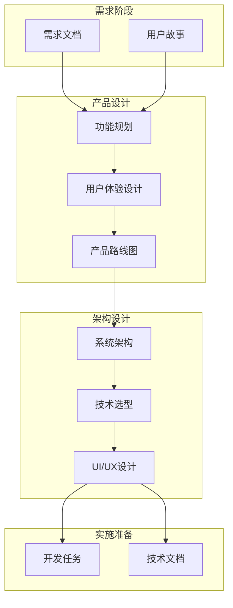

# 第6章 产品与架构设计

> "好的设计是成功的一半。AI 不仅能帮助我们更快地设计,更能帮助我们设计得更好。"

## 章节概述

在 DDAD 方法论中,产品与架构设计阶段是将需求转化为可执行方案的关键环节。本章介绍如何利用 AI 辅助进行产品设计与系统架构设计,让设计过程更加高效、全面和可追溯。

## 设计阶段的核心价值

在传统开发流程中,产品设计和架构设计往往由少数资深人员主导,新手很难参与其中。DDAD 方法论通过引入 AI 辅助,使设计阶段更加:

1. **民主化**: 团队成员都可以与 AI 协作进行设计探索
2. **迭代化**: 快速生成多个设计方案进行对比评估
3. **文档化**: 设计决策和演进过程自动形成文档
4. **验证化**: AI 可以帮助发现设计中的潜在问题

## 设计流程架构



## 主要内容

### 1. AI驱动的产品设计与管理

使用 AI 辅助产品功能规划、用户体验设计和产品路线图制定。

**核心能力:**
- AI 辅助的竞品分析和市场调研
- 基于用户需求的功能优先级排序
- 交互设计和用户流程优化
- 产品迭代规划和版本管理

### 2. AI辅助的系统架构与UI/UX设计

利用 AI 进行系统架构设计、技术选型和界面设计。

**设计要素:**
- 系统架构方案设计与评估
- 技术栈选型和组件设计
- 数据库schema设计
- UI/UX界面原型设计
- 设计决策文档化

## AI 设计辅助工具链

### 产品设计工具

**1. 需求分析工具**
```bash
# 使用 Claude 进行需求分析
/analyze-requirements @requirements.md --output product-spec.md
```

**2. 用户故事生成**
```yaml
# user-stories.yml
epic: "用户认证系统"
ai_generation:
  context: "电商平台需要安全的用户认证"
  user_types: ["买家", "卖家", "管理员"]
  features: ["注册", "登录", "密码找回", "两步验证"]
```

### 架构设计工具

**1. 系统架构图生成**
```python
# architecture_generator.py
from claude_code import ArchitectureDesigner

designer = ArchitectureDesigner()

# 基于需求生成系统架构
architecture = designer.generate_architecture(
    requirements="requirements.md",
    constraints={
        "scalability": "high",
        "budget": "medium",
        "team_size": 6
    }
)

# 生成架构文档和图表
architecture.export_mermaid("docs/architecture.md")
architecture.export_c4_model("docs/c4-model/")
```

**2. 技术选型决策**
```python
class TechStackSelector:
    def __init__(self, ai_client):
        self.ai_client = ai_client

    def select_tech_stack(self, requirements, constraints):
        """AI辅助技术选型"""
        prompt = f"""
        基于以下需求和约束,推荐合适的技术栈:

        需求: {requirements}
        约束: {constraints}

        请提供:
        1. 前端框架推荐及理由
        2. 后端框架推荐及理由
        3. 数据库选型及理由
        4. 第三方服务建议
        5. 部署方案建议
        """

        return self.ai_client.analyze(prompt)
```

## 设计文档标准化

### 产品设计文档 (PRD)

```markdown
# 产品需求文档 - 用户认证系统

## 产品概述
[AI生成的产品概述]

## 目标用户
- 主要用户: 电商平台买家
- 次要用户: 卖家和管理员

## 核心功能
### 1. 用户注册
- 邮箱注册
- 手机号注册
- 第三方登录 (微信、支付宝)

### 2. 用户登录
- 账号密码登录
- 短信验证码登录
- 两步验证

### 3. 密码管理
- 密码找回
- 密码修改
- 安全设置

## 用户流程
[Mermaid流程图]

## UI/UX设计
[设计稿链接和说明]

## 技术要求
[技术约束和性能要求]
```

### 架构设计文档 (ADD)

```markdown
# 架构设计文档 - 用户认证系统

## 系统架构
[C4 Model 或分层架构图]

## 技术选型
### 前端
- 框架: React 18
- 状态管理: Redux Toolkit
- UI组件库: Ant Design

### 后端
- 框架: Node.js + Express
- 认证: JWT + Redis
- 数据库: PostgreSQL + Redis

## 接口设计
### RESTful API
```
POST /api/auth/register
POST /api/auth/login
POST /api/auth/logout
POST /api/auth/refresh-token
```

## 数据库设计
[Schema设计和ER图]

## 安全设计
- 密码加密: bcrypt
- Token管理: JWT + Refresh Token
- API限流: Redis
- HTTPS: Let's Encrypt

## 部署架构
[部署拓扑图]
```

## 实践案例

### 案例:电商平台产品设计

**背景:**
- 新建电商平台,需要从零开始设计产品和架构
- 团队规模: 8人 (3前端 + 3后端 + 1PM + 1设计师)
- 时间限制: 6周完成MVP

**产品设计过程:**

1. **需求分析** (Week 1)
   - 使用 AI 分析竞品功能
   - 生成用户故事地图
   - 确定 MVP 范围

2. **功能设计** (Week 2)
   - AI 辅助生成产品功能列表
   - 优先级排序
   - 绘制用户流程图

3. **原型设计** (Week 2-3)
   - AI 生成UI布局建议
   - 交互设计评审
   - 设计稿确认

**架构设计过程:**

1. **系统架构设计** (Week 2)
   - AI 推荐技术栈
   - 设计微服务架构
   - 确定技术方案

2. **详细设计** (Week 3)
   - 数据库schema设计
   - API接口设计
   - 安全方案设计

3. **技术准备** (Week 3-4)
   - 技术预研和POC
   - 开发环境搭建
   - CI/CD流程设置

**成果:**
- 完整的 PRD 文档 (50页)
- 架构设计文档 (30页)
- UI/UX 设计稿 (100+页面)
- 技术选型报告
- 开发任务拆分 (200+任务)

## 最佳实践

### 1. 设计即文档
- 所有设计决策都要文档化
- 使用 Mermaid 等工具让设计可视化
- 将设计文档纳入版本控制

### 2. AI 辅助但不替代
- AI 提供建议和方案
- 人类做最终决策
- 设计需要团队评审

### 3. 迭代优化
- 设计不是一次性完成
- 根据反馈持续优化
- 保持设计文档更新

---

**详细内容:**
- [AI驱动的产品设计与管理](chapter6/product-design.md)
- [AI辅助的系统架构与UI/UX设计](chapter6/architecture-design.md)

**下一章预告:** 第7章将探讨多会话并行开发,包括 Git Worktrees 多会话管理、跨会话文档同步机制等内容。
