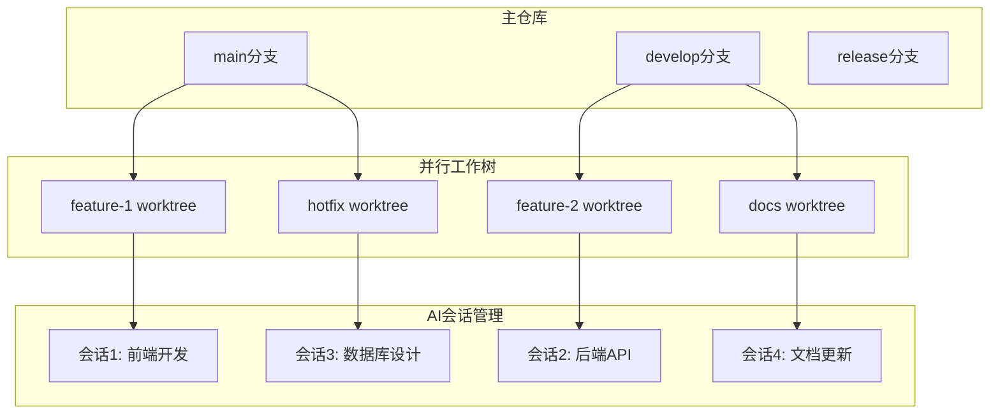
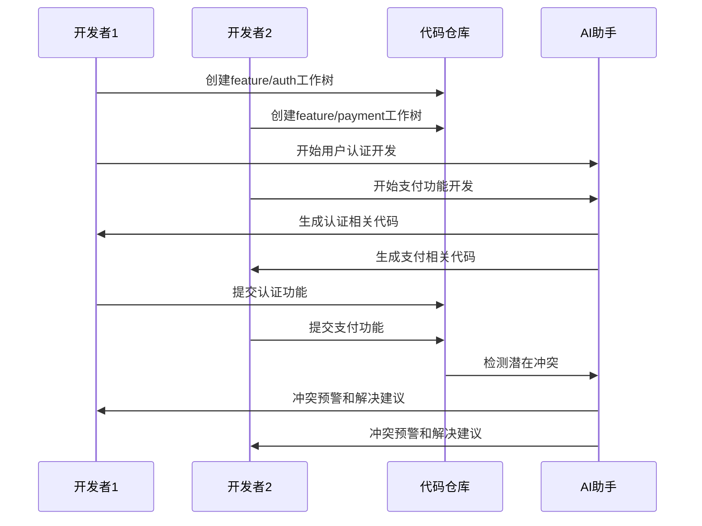

# 第6章 多会话并行开发

> "真正的团队协作不是简单的任务分工，而是在保持独立性的同时实现高效协同。Git Worktrees + AI多会话并行开发，让团队协作进入新的境界。"

## 章节概述

本章将深入探讨多会话并行开发的核心技术和实践方法。通过Git Worktrees多会话管理、跨会话文档同步机制，以及AI驱动的协作诊断，帮助团队实现真正的并行高效开发。

## 并行开发架构



## 主要内容

### 1. Git Worktrees 多会话管理

掌握Git Worktrees的高级用法，实现多个功能分支的并行开发。

**核心技能：**
- Worktrees的创建和管理
- 分支策略的设计
- 冲突预防和解决
- 工作流程的优化

### 2. 跨会话文档同步机制

建立高效的文档同步机制，确保团队成员之间的信息一致性。

**同步要素：**
- 实时文档更新
- 版本控制集成
- 冲突检测和解决
- 自动化同步流程

### 3. AI驱动的协作诊断

利用AI技术诊断协作过程中的问题，提供优化建议。

**诊断维度：**
- 代码冲突预测
- 工作负载均衡
- 进度同步状态
- 质量风险评估

## Git Worktrees 实践指南

### 基础操作

**1. 创建工作树**
```bash
# 创建新的功能分支工作树
git worktree add ../project-feature-auth feature/user-auth

# 创建基于现有分支的工作树
git worktree add ../project-hotfix hotfix/critical-bug

# 创建新分支的工作树
git worktree add -b feature/new-api ../project-api develop
```

**2. 工作树管理**
```bash
# 查看所有工作树
git worktree list

# 删除工作树
git worktree remove ../project-feature-auth

# 修剪无效的工作树引用
git worktree prune
```

**3. 高级配置**
```bash
# 配置工作树默认位置
git config worktree.guessRemote true

# 设置工作树钩子
git config core.hooksPath .githooks
```

### 团队协作策略

**1. 分支命名规范**
```
功能分支：feature/[功能名称]
修复分支：hotfix/[问题描述]
发布分支：release/[版本号]
文档分支：docs/[文档类型]

示例：
- feature/user-authentication
- hotfix/payment-gateway-error
- release/v2.1.0
- docs/api-documentation
```

**2. 工作树目录结构**
```
project-root/
├── main/                 # 主工作树
├── feature-auth/         # 用户认证功能
├── feature-payment/      # 支付功能
├── hotfix-security/      # 安全修复
├── docs-update/          # 文档更新
└── release-v2.0/         # 发布准备
```

**3. 并行开发工作流**


## 跨会话文档同步

### 文档同步架构

**1. 同步机制设计**
```python
class DocumentSyncManager:
    def __init__(self, project_root):
        self.project_root = project_root
        self.sync_config = self.load_sync_config()
        self.watchers = {}
    
    def setup_sync(self, worktree_path, session_id):
        """为工作树设置文档同步"""
        watcher = FileSystemWatcher(worktree_path)
        watcher.on_change = lambda path: self.sync_document(path, session_id)
        self.watchers[session_id] = watcher
        return watcher
    
    def sync_document(self, file_path, source_session):
        """同步文档到其他会话"""
        if self.is_shared_document(file_path):
            for session_id, watcher in self.watchers.items():
                if session_id != source_session:
                    self.update_document(file_path, session_id)
    
    def is_shared_document(self, file_path):
        """判断是否为共享文档"""
        shared_patterns = [
            "README.md",
            "CLAUDE.md",
            "docs/**/*.md",
            "*.json",
            "package.json"
        ]
        return any(fnmatch.fnmatch(file_path, pattern) 
                  for pattern in shared_patterns)
```

**2. 实时同步配置**
```yaml
# .sync-config.yml
sync_rules:
  shared_files:
    - "README.md"
    - "CLAUDE.md"
    - "docs/**/*.md"
    - "package.json"
    - "*.config.js"
  
  sync_frequency: "real-time"  # real-time, 5min, 15min
  
  conflict_resolution: "manual"  # auto, manual, latest-wins
  
  notification:
    enabled: true
    channels: ["slack", "email"]
    
  backup:
    enabled: true
    retention_days: 30
```

### 冲突检测与解决

**1. 智能冲突检测**
```python
class ConflictDetector:
    def __init__(self, ai_client):
        self.ai_client = ai_client
    
    def detect_conflicts(self, file_changes):
        """检测文件变更中的潜在冲突"""
        conflicts = []
        
        for file_path, changes in file_changes.items():
            if len(changes) > 1:  # 多人同时修改
                conflict_analysis = self.analyze_conflict(file_path, changes)
                if conflict_analysis.has_conflict:
                    conflicts.append(conflict_analysis)
        
        return conflicts
    
    def analyze_conflict(self, file_path, changes):
        """分析具体的冲突情况"""
        prompt = f"""
        分析以下文件的并发修改是否存在冲突：
        
        文件：{file_path}
        修改记录：
        {json.dumps(changes, indent=2)}
        
        请分析：
        1. 是否存在真实冲突
        2. 冲突的严重程度
        3. 建议的解决方案
        """
        
        return self.ai_client.analyze(prompt)
```

**2. 自动化冲突解决**
```python
class ConflictResolver:
    def __init__(self, ai_client):
        self.ai_client = ai_client
    
    def resolve_conflict(self, conflict_info):
        """自动解决冲突"""
        if conflict_info.can_auto_resolve:
            return self.auto_merge(conflict_info)
        else:
            return self.suggest_manual_resolution(conflict_info)
    
    def auto_merge(self, conflict_info):
        """自动合并非冲突性修改"""
        merge_strategy = self.determine_merge_strategy(conflict_info)
        
        if merge_strategy == "three_way_merge":
            return self.three_way_merge(conflict_info)
        elif merge_strategy == "semantic_merge":
            return self.semantic_merge(conflict_info)
        
    def semantic_merge(self, conflict_info):
        """基于语义的智能合并"""
        prompt = f"""
        请帮助合并以下代码冲突，保持功能完整性：
        
        基础版本：
        {conflict_info.base_content}
        
        版本A修改：
        {conflict_info.version_a}
        
        版本B修改：
        {conflict_info.version_b}
        
        请提供合并后的代码，确保：
        1. 保留所有功能
        2. 代码风格一致
        3. 没有语法错误
        """
        
        return self.ai_client.generate(prompt)
```

## AI驱动的协作诊断

### 协作状态监控

**1. 实时状态收集**
```python
class CollaborationMonitor:
    def __init__(self):
        self.metrics_collector = MetricsCollector()
        self.ai_analyzer = AIAnalyzer()
    
    def collect_collaboration_metrics(self):
        """收集协作指标"""
        return {
            'commit_frequency': self.get_commit_frequency(),
            'branch_divergence': self.get_branch_divergence(),
            'file_conflict_rate': self.get_conflict_rate(),
            'code_review_time': self.get_review_time(),
            'communication_frequency': self.get_communication_metrics()
        }
    
    def get_commit_frequency(self):
        """获取提交频率"""
        return {
            'daily_commits': self.count_daily_commits(),
            'commit_size_distribution': self.analyze_commit_sizes(),
            'active_contributors': self.count_active_contributors()
        }
    
    def get_branch_divergence(self):
        """分析分支分歧程度"""
        branches = self.get_active_branches()
        divergence_data = {}
        
        for branch in branches:
            divergence_data[branch] = {
                'commits_ahead': self.count_commits_ahead(branch),
                'commits_behind': self.count_commits_behind(branch),
                'file_changes': self.count_file_changes(branch)
            }
        
        return divergence_data
```

**2. 智能诊断分析**
```python
class CollaborationDiagnostics:
    def __init__(self, ai_client):
        self.ai_client = ai_client
    
    def diagnose_collaboration_health(self, metrics):
        """诊断协作健康状况"""
        diagnosis_prompt = f"""
        基于以下协作指标，诊断团队协作状况：
        
        指标数据：
        {json.dumps(metrics, indent=2)}
        
        请分析：
        1. 协作效率评估
        2. 潜在问题识别
        3. 改进建议
        4. 风险预警
        """
        
        return self.ai_client.analyze(diagnosis_prompt)
    
    def predict_conflicts(self, current_state):
        """预测潜在冲突"""
        prediction_prompt = f"""
        基于当前开发状态，预测可能的冲突：
        
        当前状态：
        {json.dumps(current_state, indent=2)}
        
        请预测：
        1. 可能的冲突点
        2. 冲突发生概率
        3. 预防措施建议
        """
        
        return self.ai_client.predict(prediction_prompt)
```

### 性能优化建议

**1. 工作负载均衡**
```python
class WorkloadBalancer:
    def __init__(self, ai_client):
        self.ai_client = ai_client
    
    def analyze_workload_distribution(self, team_metrics):
        """分析工作负载分布"""
        analysis = self.ai_client.analyze(f"""
        分析团队工作负载分布：
        
        团队指标：
        {json.dumps(team_metrics, indent=2)}
        
        请提供：
        1. 负载均衡评估
        2. 瓶颈识别
        3. 重新分配建议
        """)
        
        return analysis
    
    def suggest_task_reallocation(self, current_allocation, team_capacity):
        """建议任务重新分配"""
        suggestion = self.ai_client.generate(f"""
        基于团队能力和当前分配，建议任务重新分配：
        
        当前分配：{current_allocation}
        团队能力：{team_capacity}
        
        请提供具体的重新分配方案。
        """)
        
        return suggestion
```

**2. 流程优化建议**
```python
class ProcessOptimizer:
    def __init__(self, ai_client):
        self.ai_client = ai_client
    
    def optimize_workflow(self, workflow_data):
        """优化工作流程"""
        optimization = self.ai_client.optimize(f"""
        优化以下工作流程：
        
        当前流程：
        {json.dumps(workflow_data, indent=2)}
        
        请提供：
        1. 流程瓶颈分析
        2. 优化建议
        3. 预期效果评估
        """)
        
        return optimization
```

## 实践案例

### 案例：电商平台并行开发

**1. 项目背景**
- 团队规模：6人（3前端 + 2后端 + 1全栈）
- 开发周期：4周
- 主要功能：用户系统、商品管理、订单处理、支付集成

**2. 工作树配置**
```bash
# 主项目目录
cd ecommerce-platform

# 创建各功能模块的工作树
git worktree add ../ecommerce-user-auth feature/user-auth
git worktree add ../ecommerce-product feature/product-management
git worktree add ../ecommerce-order feature/order-processing
git worktree add ../ecommerce-payment feature/payment-integration
git worktree add ../ecommerce-admin feature/admin-panel
git worktree add ../ecommerce-docs docs/update
```

**3. AI会话分配**
```yaml
# ai-session-config.yml
sessions:
  session-1:
    name: "用户认证开发"
    worktree: "../ecommerce-user-auth"
    developer: "张三"
    focus: "前端用户界面 + 后端认证API"
    
  session-2:
    name: "商品管理系统"
    worktree: "../ecommerce-product"
    developer: "李四"
    focus: "商品CRUD + 图片上传"
    
  session-3:
    name: "订单处理流程"
    worktree: "../ecommerce-order"
    developer: "王五"
    focus: "订单状态管理 + 库存扣减"
    
  session-4:
    name: "支付集成"
    worktree: "../ecommerce-payment"
    developer: "赵六"
    focus: "第三方支付 + 回调处理"
```

**4. 协作效果**
```
协作指标对比：

传统开发模式：
- 代码冲突频率：15次/周
- 集成测试时间：2天
- 功能交付延期：30%
- 团队沟通成本：40%工作时间

并行开发模式：
- 代码冲突频率：3次/周 (-80%)
- 集成测试时间：0.5天 (-75%)
- 功能交付延期：5% (-83%)
- 团队沟通成本：15%工作时间 (-63%)
```

## 工具与技术

### 开发工具集成

**1. IDE配置**
```json
// .vscode/settings.json
{
  "git.defaultCloneDirectory": "../",
  "git.enableSmartCommit": true,
  "git.autofetch": true,
  "git.pruneOnFetch": true,
  
  "files.watcherExclude": {
    "**/node_modules/**": true,
    "**/.git/objects/**": true,
    "**/.git/subtree-cache/**": true
  },
  
  "search.exclude": {
    "**/node_modules": true,
    "**/bower_components": true,
    "**/.git": true
  }
}
```

**2. 自动化脚本**
```bash
#!/bin/bash
# setup-parallel-dev.sh

PROJECT_NAME=$1
FEATURES=("auth" "product" "order" "payment")

echo "Setting up parallel development for $PROJECT_NAME"

# 创建工作树
for feature in "${FEATURES[@]}"; do
    echo "Creating worktree for feature: $feature"
    git worktree add "../$PROJECT_NAME-$feature" "feature/$feature"
    
    # 复制配置文件
    cp .env.example "../$PROJECT_NAME-$feature/.env"
    cp package.json "../$PROJECT_NAME-$feature/"
    
    # 安装依赖
    cd "../$PROJECT_NAME-$feature"
    npm install
    cd - > /dev/null
done

echo "Parallel development setup complete!"
```

### 监控和诊断工具

**1. 协作仪表板**
```python
# collaboration_dashboard.py
import streamlit as st
import plotly.express as px
import pandas as pd

class CollaborationDashboard:
    def __init__(self):
        self.monitor = CollaborationMonitor()
    
    def render_dashboard(self):
        st.title("团队协作监控仪表板")
        
        # 实时指标
        metrics = self.monitor.collect_collaboration_metrics()
        
        col1, col2, col3, col4 = st.columns(4)
        
        with col1:
            st.metric("日提交次数", metrics['daily_commits'], "↑ 12%")
        
        with col2:
            st.metric("代码冲突率", f"{metrics['conflict_rate']:.1%}", "↓ 5%")
        
        with col3:
            st.metric("代码审查时间", f"{metrics['review_time']:.1f}h", "↓ 0.5h")
        
        with col4:
            st.metric("活跃贡献者", metrics['active_contributors'], "→ 0")
        
        # 分支分歧图表
        self.render_branch_divergence_chart(metrics['branch_divergence'])
        
        # 工作负载分布
        self.render_workload_distribution(metrics['workload'])
    
    def render_branch_divergence_chart(self, divergence_data):
        st.subheader("分支分歧状况")
        
        df = pd.DataFrame(divergence_data).T
        fig = px.bar(df, x=df.index, y=['commits_ahead', 'commits_behind'],
                     title="分支提交差异")
        st.plotly_chart(fig)
```

## 最佳实践总结

### 成功要素

**1. 合理的分支策略**
- 功能分支独立性强
- 主分支保持稳定
- 定期同步和集成

**2. 有效的沟通机制**
- 实时状态同步
- 定期进度汇报
- 问题快速响应

**3. 智能化工具支持**
- AI协作冲突预测
- 自动化测试集成
- 持续监控和优化

### 常见陷阱

**1. 过度并行化**
- 问题：分支过多，管理复杂
- 解决：合理控制并行度，一般不超过团队人数

**2. 同步不及时**
- 问题：分支分歧过大，集成困难
- 解决：建立定期同步机制

**3. 工具配置不当**
- 问题：工具冲突，效率降低
- 解决：统一工具配置，提供标准模板

---

**详细内容：**
- [Git Worktrees 多会话管理](chapter6/git-worktrees.md)
- [跨会话文档同步机制](chapter6/doc-sync.md)
- [AI驱动的协作诊断](chapter6/ai-diagnosis.md)

**下一章预告：** 第7章将探讨代码审查与质量管控，包括AI增强的代码审查流程、文档驱动的自动测试体系等内容。