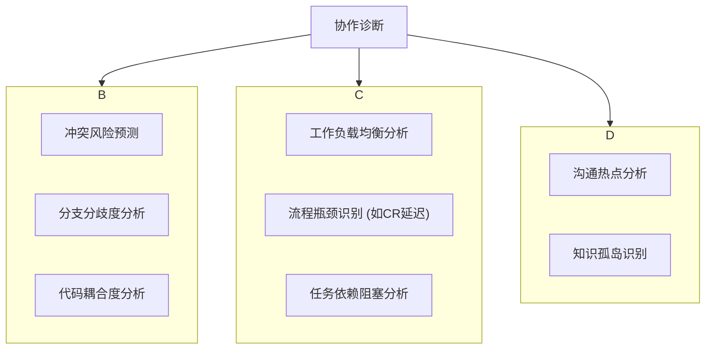

# AI驱动的协作诊断

当团队进入高速的并行开发状态后，新的问题会浮现：我们协作得好吗？瓶颈在哪里？谁的负载过高？谁需要帮助？单凭感觉很难回答这些问题。我们需要一个客观的“协作健康仪表盘”。

AI驱动的协作诊断，就是利用AI分析Git历史、项目管理数据和沟通记录，为团队提供数据驱动的、无偏见的协作健康评估和优化建议。

## 为什么要进行协作诊断？

- **从“被动救火”到“主动预防”**：传统模式下，只有当严重的合并冲突或集成问题爆发时，团队才会意识到协作出了问题。AI诊断可以提前预测风险，防患于未然。
- **发现“隐形瓶颈”**：很多流程上的瓶颈（如Code Review响应过慢）是零散发生的，不易察 chiffres。AI可以通过数据分析，发现这些模式化的“隐形瓶颈”。
- **保障团队福祉**：通过分析工作负载，可以及时发现可能导致成员过劳（burnout）的迹象，实现更健康、可持续的开发节奏。
- **提供客观依据**：当讨论流程改进时，用AI分析出的数据说话，比凭个人感觉更有说服力，也更能达成共识。

## 协作诊断框架

AI协作诊断主要从三个层面进行：**代码（Code）**、**流程（Process）** 和 **沟通（Communication）**。

### 1. 代码诊断：分析代码库的健康状况

AI可以直接分析Git仓库的提交历史和分支结构。

**可诊断的问题：**
- **冲突风险**：哪些文件正在被多个并行的worktree高频修改？它们未来合并时产生冲突的概率有多大？
- **分支分歧**：某个功能分支是否与主干（`develop`）偏离太远（比如落后上百个提交）？这预示着未来痛苦的“集成地狱”。

**AI分析Prompt示例：**
> 你是一位Git数据分析专家。这是我们项目过去一周的`git log --stat`数据。
>
> (粘贴log数据)
>
> 请分析并回答：
> 1.  **冲突热点**：找出被修改次数最多、涉及分支最多的前3个文件。
> 2.  **分歧风险**：计算每个feature分支相对于`develop`分支的“落后提交数”和“领先提交数”，并标记出分歧最大的分支。
> 3.  **提供预警**：基于以上分析，给出最需要关注的合并风险预警。

### 2. 流程诊断：识别工作流中的瓶颈

通过集成Jira、GitLab等项目管理工具的API，AI可以分析任务的生命周期。

**可诊断的问题：**
- **工作负载**：某个开发者是否承担了过多的高复杂度任务？是否存在成员工作不饱和的情况？
- **流程阻塞**：代码从“开发完成”到“完成审查”平均需要多长时间？是否存在某个环节（如测试、部署）成为整个流程的瓶颈？

**AI分析Prompt示例：**
> 你是一位敏捷流程优化顾问。这是我们团队上一个Sprint的所有Jira任务卡片的状态变更历史数据。
>
> (粘贴JSON或CSV格式的数据)
>
> 请分析并回答：
> 1.  **工作负载分布**：计算每个成员名下任务的总故事点数和任务数量，并以图表形式展示。
> 2.  **流程效率**：计算任务在“待开发”、“开发中”、“待审查”、“测试中”、“已完成”等每个状态的平均停留时间。
> 3.  **瓶颈诊断**：找出平均停留时间最长的状态，并分析可能的原因，提出优化建议。

### 3. 沟通诊断（高级）

在保护隐私的前提下，可以对公开的沟通渠道（如Slack的公共频道、GitHub的评论）进行元数据分析。

**可诊断的问题：**
- **知识孤岛**：关于某个特定模块（如“支付模块”）的讨论是否总是集中在固定的1-2个人之间？这可能意味着其他人对该模块缺乏了解，形成了知识孤岛和单点故障风险。

## 如何实施？

1.  **数据收集**：编写脚本，定期从Git、Jira等平台拉取数据。
2.  **建立仪表盘**：将AI的分析结果通过Streamlit、Retool或内部工具，可视化为一个团队共享的“协作健康仪表盘”。
3.  **融入迭代回顾会**：将仪表盘的数据作为每周迭代回顾会的重要输入，引导团队基于数据进行讨论和改进。

---

**本节小结：** AI驱动的协作诊断是“团队Vibe Coding”从优秀走向卓越的关键一步。它像一个智能的“团队医生”，通过分析代码、流程和沟通中的数据，帮助我们发现潜在的问题、识别瓶颈、平衡负载。这使得团队的自我优化不再依赖于模糊的感觉，而是建立在客观、量化的数据之上，从而驱动一个更健康、更高效、更具韧性的开发体系。

**下一章：** [第7章 代码审查与质量管控](part3/chapter7.md)