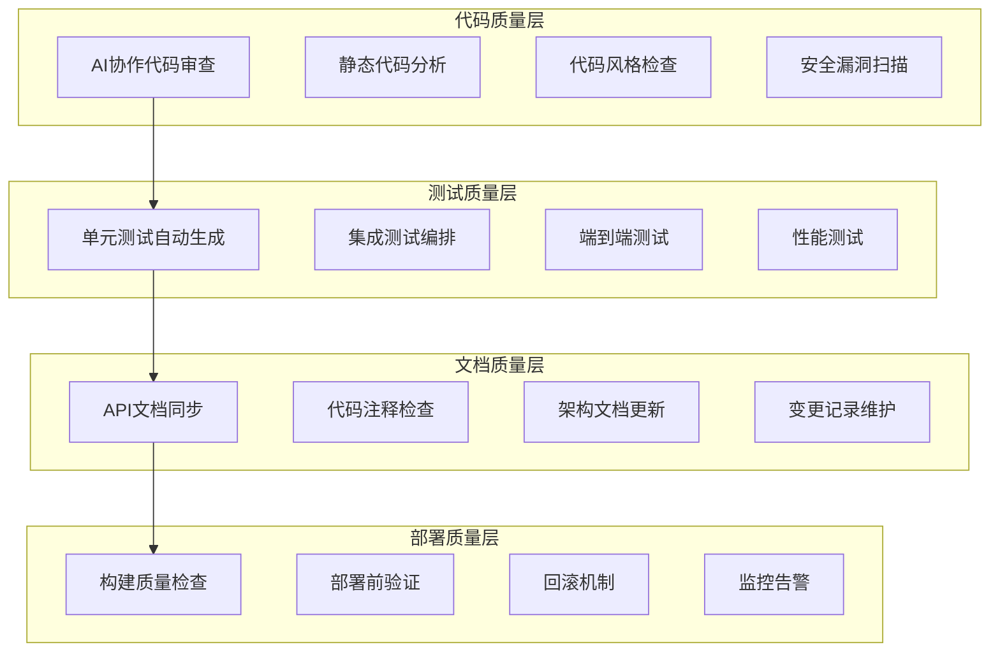

# 第7章 代码审查与质量管控

> "在AI协作开发的时代，代码审查不再仅仅是发现Bug，而是确保AI与人类智慧完美融合的关键环节。质量管控体系需要重新设计，以适应AI协作的新特点。"

## 章节概述

本章将深入探讨AI增强的代码审查流程、文档驱动的自动测试体系，以及从大厂实践中总结的最佳经验。通过建立完善的质量管控机制，确保AI协作开发的代码质量和系统稳定性。

## 质量管控体系架构



## 主要内容

### 1. AI增强的代码审查流程

利用AI技术提升代码审查的效率和质量，建立人机协作的审查机制。

**核心要素：**
- AI协作的代码分析和建议
- 智能化的审查流程编排
- 多维度的质量评估体系
- 持续学习的审查模型

### 2. 文档驱动的自动测试体系

基于文档驱动开发理念，构建自动化的测试生成和执行体系。

**体系组成：**
- 需求文档到测试用例的自动转换
- API文档驱动的接口测试
- 用户故事驱动的端到端测试
- 性能需求驱动的压力测试

### 3. 大厂经验借鉴

总结和借鉴业界领先公司的质量管控实践，结合AI协作特点进行优化。

**经验来源：**
- Google的代码审查文化
- Microsoft的DevOps实践
- Netflix的混沌工程
- Amazon的自动化测试

## AI增强的代码审查流程

### 智能代码分析

**1. 多层次分析框架**
```python
class AICodeReviewSystem:
    def __init__(self, ai_models):
        self.syntax_analyzer = ai_models['syntax']
        self.logic_analyzer = ai_models['logic']
        self.security_analyzer = ai_models['security']
        self.performance_analyzer = ai_models['performance']
        self.maintainability_analyzer = ai_models['maintainability']
    
    def comprehensive_review(self, code_changes):
        """综合代码审查"""
        review_results = {}
        
        # 语法和风格检查
        review_results['syntax'] = self.syntax_analyzer.analyze(code_changes)
        
        # 逻辑和算法分析
        review_results['logic'] = self.logic_analyzer.analyze(code_changes)
        
        # 安全漏洞检测
        review_results['security'] = self.security_analyzer.scan(code_changes)
        
        # 性能影响评估
        review_results['performance'] = self.performance_analyzer.evaluate(code_changes)
        
        # 可维护性评估
        review_results['maintainability'] = self.maintainability_analyzer.assess(code_changes)
        
        # 综合评分和建议
        overall_assessment = self.generate_overall_assessment(review_results)
        
        return {
            'detailed_results': review_results,
            'overall_score': overall_assessment.score,
            'priority_issues': overall_assessment.priority_issues,
            'improvement_suggestions': overall_assessment.suggestions,
            'approval_recommendation': overall_assessment.approval_status
        }
    
    def generate_review_comments(self, analysis_results):
        """生成审查评论"""
        comments = []
        
        for category, results in analysis_results['detailed_results'].items():
            for issue in results.issues:
                comment = {
                    'line_number': issue.line_number,
                    'severity': issue.severity,
                    'category': category,
                    'message': issue.description,
                    'suggestion': issue.fix_suggestion,
                    'confidence': issue.confidence_score
                }
                comments.append(comment)
        
        return sorted(comments, key=lambda x: (x['severity'], x['line_number']))
```

**2. 智能审查流程**
```yaml
# ai_review_workflow.yml
review_stages:
  pre_review:
    - name: "代码格式检查"
      tool: "prettier_eslint"
      auto_fix: true
    
    - name: "基础语法检查"
      tool: "ai_syntax_checker"
      blocking: true
    
    - name: "依赖安全扫描"
      tool: "security_scanner"
      blocking: true
  
  ai_analysis:
    - name: "逻辑复杂度分析"
      model: "code_complexity_analyzer"
      threshold: 7
    
    - name: "性能影响评估"
      model: "performance_analyzer"
      baseline_comparison: true
    
    - name: "安全风险评估"
      model: "security_risk_analyzer"
      severity_threshold: "medium"
  
  human_review:
    - name: "业务逻辑审查"
      required_reviewers: 1
      domain_expert_required: true
    
    - name: "架构影响评估"
      required_reviewers: 1
      architect_approval: true
  
  post_review:
    - name: "测试覆盖率检查"
      minimum_coverage: 80
    
    - name: "文档更新验证"
      auto_check: true
```

### 协作审查机制

**1. 人机协作模式**
```python
class CollaborativeReviewOrchestrator:
    def __init__(self):
        self.ai_reviewer = AIReviewer()
        self.human_reviewers = HumanReviewerPool()
        self.review_coordinator = ReviewCoordinator()
    
    def orchestrate_review(self, pull_request):
        """编排协作审查流程"""
        # 第一阶段：AI预审查
        ai_review = self.ai_reviewer.pre_review(pull_request)
        
        if ai_review.has_blocking_issues:
            return self.request_fixes(pull_request, ai_review.blocking_issues)
        
        # 第二阶段：智能分配人工审查者
        assigned_reviewers = self.assign_human_reviewers(
            pull_request, ai_review.complexity_assessment
        )
        
        # 第三阶段：并行人工审查
        human_reviews = self.coordinate_human_reviews(
            pull_request, assigned_reviewers, ai_review.focus_areas
        )
        
        # 第四阶段：综合决策
        final_decision = self.make_final_decision(ai_review, human_reviews)
        
        return final_decision
    
    def assign_human_reviewers(self, pull_request, complexity_assessment):
        """智能分配人工审查者"""
        assignment_criteria = {
            'domain_expertise': self.extract_domain_requirements(pull_request),
            'complexity_level': complexity_assessment.level,
            'security_sensitivity': complexity_assessment.security_risk,
            'performance_impact': complexity_assessment.performance_impact
        }
        
        return self.human_reviewers.assign_optimal_reviewers(assignment_criteria)
```

**2. 审查质量反馈循环**
```python
class ReviewQualityTracker:
    def __init__(self):
        self.quality_metrics = QualityMetricsCollector()
        self.feedback_analyzer = FeedbackAnalyzer()
    
    def track_review_effectiveness(self, review_session):
        """跟踪审查效果"""
        metrics = {
            'issues_found_by_ai': len(review_session.ai_issues),
            'issues_found_by_humans': len(review_session.human_issues),
            'false_positives': len(review_session.false_positives),
            'missed_issues': len(review_session.post_merge_issues),
            'review_time': review_session.total_time,
            'reviewer_satisfaction': review_session.satisfaction_scores
        }
        
        # 分析审查质量趋势
        quality_trend = self.analyze_quality_trend(metrics)
        
        # 识别改进机会
        improvement_opportunities = self.identify_improvements(metrics)
        
        # 更新AI模型
        self.update_ai_models(review_session.feedback)
        
        return {
            'quality_metrics': metrics,
            'trend_analysis': quality_trend,
            'improvement_suggestions': improvement_opportunities
        }
```

## 文档驱动的自动测试体系

### 测试用例自动生成

**1. 需求文档到测试用例**
```python
class RequirementBasedTestGenerator:
    def __init__(self, ai_client):
        self.ai_client = ai_client
        self.test_template_engine = TestTemplateEngine()
    
    def generate_tests_from_requirements(self, requirement_doc):
        """从需求文档生成测试用例"""
        # 解析需求文档
        parsed_requirements = self.parse_requirements(requirement_doc)
        
        # 提取测试场景
        test_scenarios = self.extract_test_scenarios(parsed_requirements)
        
        # 生成测试用例
        test_cases = []
        for scenario in test_scenarios:
            test_case = self.generate_test_case(scenario)
            test_cases.append(test_case)
        
        return test_cases
    
    def generate_test_case(self, scenario):
        """生成单个测试用例"""
        prompt = f"""
        基于以下测试场景生成详细的测试用例：
        
        场景描述：{scenario.description}
        前置条件：{scenario.preconditions}
        输入数据：{scenario.input_data}
        预期结果：{scenario.expected_result}
        
        请生成包含以下内容的测试用例：
        1. 测试步骤
        2. 测试数据
        3. 断言条件
        4. 边界条件测试
        5. 异常情况处理
        """
        
        generated_test = self.ai_client.generate(prompt)
        
        return self.test_template_engine.format_test_case(
            scenario, generated_test
        )
```

**2. API文档驱动的接口测试**
```python
class APIDocumentDrivenTesting:
    def __init__(self):
        self.openapi_parser = OpenAPIParser()
        self.test_generator = APITestGenerator()
    
    def generate_api_tests(self, openapi_spec):
        """从OpenAPI规范生成API测试"""
        parsed_spec = self.openapi_parser.parse(openapi_spec)
        
        test_suites = {}
        
        for path, methods in parsed_spec.paths.items():
            for method, operation in methods.items():
                test_suite = self.generate_operation_tests(
                    path, method, operation
                )
                test_suites[f"{method.upper()} {path}"] = test_suite
        
        return test_suites
    
    def generate_operation_tests(self, path, method, operation):
        """为单个API操作生成测试"""
        tests = []
        
        # 正常情况测试
        normal_test = self.generate_normal_case_test(path, method, operation)
        tests.append(normal_test)
        
        # 边界条件测试
        boundary_tests = self.generate_boundary_tests(path, method, operation)
        tests.extend(boundary_tests)
        
        # 错误情况测试
        error_tests = self.generate_error_case_tests(path, method, operation)
        tests.extend(error_tests)
        
        # 安全测试
        security_tests = self.generate_security_tests(path, method, operation)
        tests.extend(security_tests)
        
        return tests
```

### 自动化测试执行

**1. 测试编排引擎**
```python
class TestOrchestrationEngine:
    def __init__(self):
        self.test_scheduler = TestScheduler()
        self.environment_manager = EnvironmentManager()
        self.result_analyzer = TestResultAnalyzer()
    
    def execute_test_pipeline(self, test_configuration):
        """执行测试流水线"""
        pipeline_results = {}
        
        # 准备测试环境
        test_env = self.environment_manager.prepare_environment(
            test_configuration.environment_spec
        )
        
        try:
            # 单元测试阶段
            unit_test_results = self.execute_unit_tests(
                test_configuration.unit_tests, test_env
            )
            pipeline_results['unit_tests'] = unit_test_results
            
            if not unit_test_results.passed:
                return self.handle_test_failure('unit_tests', unit_test_results)
            
            # 集成测试阶段
            integration_results = self.execute_integration_tests(
                test_configuration.integration_tests, test_env
            )
            pipeline_results['integration_tests'] = integration_results
            
            if not integration_results.passed:
                return self.handle_test_failure('integration_tests', integration_results)
            
            # 端到端测试阶段
            e2e_results = self.execute_e2e_tests(
                test_configuration.e2e_tests, test_env
            )
            pipeline_results['e2e_tests'] = e2e_results
            
            # 性能测试阶段
            performance_results = self.execute_performance_tests(
                test_configuration.performance_tests, test_env
            )
            pipeline_results['performance_tests'] = performance_results
            
        finally:
            # 清理测试环境
            self.environment_manager.cleanup_environment(test_env)
        
        # 分析测试结果
        overall_analysis = self.result_analyzer.analyze_pipeline_results(
            pipeline_results
        )
        
        return {
            'pipeline_results': pipeline_results,
            'overall_analysis': overall_analysis,
            'quality_gates_passed': overall_analysis.quality_gates_status
        }
```

**2. 智能测试优化**
```python
class IntelligentTestOptimizer:
    def __init__(self, ai_client):
        self.ai_client = ai_client
        self.test_history_analyzer = TestHistoryAnalyzer()
    
    def optimize_test_execution(self, test_suite, code_changes):
        """优化测试执行策略"""
        # 分析代码变更影响
        impact_analysis = self.analyze_change_impact(code_changes)
        
        # 识别相关测试
        relevant_tests = self.identify_relevant_tests(
            test_suite, impact_analysis
        )
        
        # 优化测试顺序
        optimized_order = self.optimize_test_order(
            relevant_tests, impact_analysis
        )
        
        # 并行化策略
        parallelization_plan = self.create_parallelization_plan(
            optimized_order
        )
        
        return {
            'relevant_tests': relevant_tests,
            'execution_order': optimized_order,
            'parallelization_plan': parallelization_plan,
            'estimated_execution_time': self.estimate_execution_time(
                parallelization_plan
            )
        }
    
    def analyze_test_effectiveness(self, test_results, bug_reports):
        """分析测试有效性"""
        effectiveness_metrics = {
            'bug_detection_rate': self.calculate_bug_detection_rate(
                test_results, bug_reports
            ),
            'false_positive_rate': self.calculate_false_positive_rate(
                test_results
            ),
            'test_coverage_quality': self.assess_coverage_quality(
                test_results
            ),
            'execution_efficiency': self.measure_execution_efficiency(
                test_results
            )
        }
        
        improvement_suggestions = self.ai_client.analyze(f"""
        基于以下测试效果指标，提供测试改进建议：
        
        效果指标：
        {json.dumps(effectiveness_metrics, indent=2)}
        
        请分析：
        1. 测试覆盖的薄弱环节
        2. 测试用例优化建议
        3. 测试策略改进方向
        """)
        
        return {
            'effectiveness_metrics': effectiveness_metrics,
            'improvement_suggestions': improvement_suggestions
        }
```

## 大厂经验借鉴

### Google代码审查文化

**1. 代码审查原则**
```markdown
# Google代码审查原则在AI协作中的应用

## 核心原则
1. **代码健康优于个人偏好**
   - AI生成的代码也要符合团队标准
   - 重点关注代码的长期可维护性
   - 避免因为是AI生成就降低标准

2. **审查者负有指导责任**
   - 帮助AI使用者理解最佳实践
   - 提供建设性的改进建议
   - 分享相关的技术知识

3. **快速响应**
   - AI协作可以加快初步审查速度
   - 人工审查应该在24小时内完成
   - 紧急修复可以优先处理

## 实施策略
### AI增强的审查流程
- 使用AI进行初步代码分析
- 人工审查专注于业务逻辑和架构
- 建立AI审查结果的可信度评估

### 知识传递机制
- 记录AI使用的最佳实践
- 分享成功的AI协作案例
- 建立AI协作的学习资源库
```

**2. 审查效率优化**
```python
class GoogleStyleReviewOptimizer:
    def __init__(self):
        self.review_guidelines = self.load_google_guidelines()
        self.ai_assistant = AIReviewAssistant()
    
    def optimize_review_process(self, code_change):
        """优化审查流程"""
        # AI预审查
        ai_pre_review = self.ai_assistant.pre_review(
            code_change, self.review_guidelines
        )
        
        # 识别需要人工关注的重点
        human_focus_areas = self.identify_human_focus_areas(
            code_change, ai_pre_review
        )
        
        # 生成审查指导
        review_guidance = self.generate_review_guidance(
            human_focus_areas, ai_pre_review
        )
        
        return {
            'ai_pre_review': ai_pre_review,
            'human_focus_areas': human_focus_areas,
            'review_guidance': review_guidance,
            'estimated_review_time': self.estimate_review_time(
                code_change, human_focus_areas
            )
        }
```

### Microsoft DevOps实践

**1. 持续集成优化**
```yaml
# microsoft_style_ci.yml
name: AI-Enhanced CI Pipeline

on:
  pull_request:
    branches: [main, develop]

jobs:
  ai_code_analysis:
    runs-on: ubuntu-latest
    steps:
      - uses: actions/checkout@v3
      
      - name: AI Code Quality Check
        uses: ai-code-analyzer@v1
        with:
          analysis_depth: comprehensive
          security_scan: true
          performance_check: true
      
      - name: Generate Review Comments
        uses: ai-review-commenter@v1
        with:
          auto_comment: true
          confidence_threshold: 0.8

  automated_testing:
    needs: ai_code_analysis
    runs-on: ubuntu-latest
    strategy:
      matrix:
        test_type: [unit, integration, e2e]
    
    steps:
      - name: Generate Test Cases
        uses: ai-test-generator@v1
        with:
          test_type: ${{ matrix.test_type }}
          coverage_target: 80
      
      - name: Execute Tests
        run: |
          npm run test:${{ matrix.test_type }}
          npm run coverage:report

  quality_gates:
    needs: [ai_code_analysis, automated_testing]
    runs-on: ubuntu-latest
    steps:
      - name: Quality Gate Check
        uses: quality-gate-checker@v1
        with:
          coverage_threshold: 80
          security_score_min: 8
          performance_regression: false
```

**2. 部署质量保障**
```python
class MicrosoftStyleDeploymentQuality:
    def __init__(self):
        self.quality_gates = QualityGateManager()
        self.deployment_analyzer = DeploymentAnalyzer()
    
    def ensure_deployment_quality(self, deployment_package):
        """确保部署质量"""
        quality_checks = {
            'code_quality': self.check_code_quality(deployment_package),
            'test_coverage': self.check_test_coverage(deployment_package),
            'security_scan': self.check_security(deployment_package),
            'performance_baseline': self.check_performance(deployment_package),
            'documentation_completeness': self.check_documentation(deployment_package)
        }
        
        # 质量门禁检查
        gate_results = self.quality_gates.evaluate(quality_checks)
        
        if not gate_results.all_passed:
            return self.block_deployment(gate_results.failed_gates)
        
        # 部署风险评估
        risk_assessment = self.deployment_analyzer.assess_risk(
            deployment_package, quality_checks
        )
        
        return {
            'quality_checks': quality_checks,
            'gate_results': gate_results,
            'risk_assessment': risk_assessment,
            'deployment_recommendation': self.get_deployment_recommendation(
                gate_results, risk_assessment
            )
        }
```

### Netflix混沌工程

**1. AI协作的混沌测试**
```python
class AIChaosEngineering:
    def __init__(self, ai_client):
        self.ai_client = ai_client
        self.chaos_orchestrator = ChaosOrchestrator()
    
    def design_chaos_experiments(self, system_architecture):
        """设计混沌实验"""
        # AI分析系统架构
        architecture_analysis = self.ai_client.analyze(f"""
        分析以下系统架构，识别潜在的故障点和脆弱性：
        
        架构描述：
        {json.dumps(system_architecture, indent=2)}
        
        请提供：
        1. 关键故障点识别
        2. 故障影响范围分析
        3. 混沌实验建议
        """)
        
        # 生成实验计划
        experiment_plans = self.generate_experiment_plans(
            architecture_analysis.failure_points
        )
        
        return {
            'architecture_analysis': architecture_analysis,
            'experiment_plans': experiment_plans,
            'risk_mitigation': self.design_risk_mitigation(experiment_plans)
        }
    
    def execute_intelligent_chaos(self, experiment_plan):
        """执行智能混沌测试"""
        # 预测实验影响
        impact_prediction = self.ai_client.predict(f"""
        预测以下混沌实验的可能影响：
        
        实验计划：{experiment_plan}
        
        请预测：
        1. 系统响应行为
        2. 潜在的级联故障
        3. 恢复时间估算
        """)
        
        # 执行实验
        experiment_results = self.chaos_orchestrator.execute(
            experiment_plan, impact_prediction.safety_constraints
        )
        
        # 分析结果
        result_analysis = self.analyze_chaos_results(
            experiment_results, impact_prediction
        )
        
        return {
            'impact_prediction': impact_prediction,
            'experiment_results': experiment_results,
            'result_analysis': result_analysis,
            'improvement_recommendations': result_analysis.recommendations
        }
```

## 质量指标与监控

### 综合质量评估

**1. 多维度质量模型**
```python
class ComprehensiveQualityModel:
    def __init__(self):
        self.quality_dimensions = {
            'functional_correctness': {
                'weight': 0.25,
                'metrics': ['bug_density', 'test_pass_rate', 'user_reported_issues']
            },
            'reliability': {
                'weight': 0.2,
                'metrics': ['uptime', 'mtbf', 'error_rate']
            },
            'performance_efficiency': {
                'weight': 0.15,
                'metrics': ['response_time', 'throughput', 'resource_utilization']
            },
            'usability': {
                'weight': 0.15,
                'metrics': ['user_satisfaction', 'task_completion_rate', 'learning_curve']
            },
            'security': {
                'weight': 0.15,
                'metrics': ['vulnerability_count', 'security_test_coverage', 'compliance_score']
            },
            'maintainability': {
                'weight': 0.1,
                'metrics': ['code_complexity', 'documentation_quality', 'test_coverage']
            }
        }
    
    def calculate_quality_score(self, project_metrics):
        """计算综合质量分数"""
        total_score = 0
        dimension_scores = {}
        
        for dimension, config in self.quality_dimensions.items():
            dimension_score = self.calculate_dimension_score(
                project_metrics.get(dimension, {}),
                config['metrics']
            )
            weighted_score = dimension_score * config['weight']
            total_score += weighted_score
            
            dimension_scores[dimension] = {
                'raw_score': dimension_score,
                'weighted_score': weighted_score,
                'trend': self.calculate_trend(dimension, project_metrics)
            }
        
        return {
            'overall_score': total_score,
            'grade': self.determine_quality_grade(total_score),
            'dimension_scores': dimension_scores,
            'improvement_priorities': self.identify_improvement_priorities(dimension_scores)
        }
```

**2. 实时质量监控**
```python
class RealTimeQualityMonitor:
    def __init__(self):
        self.metric_collectors = self.initialize_collectors()
        self.alert_manager = AlertManager()
        self.dashboard_generator = DashboardGenerator()
    
    def monitor_quality_continuously(self):
        """持续监控质量指标"""
        while True:
            # 收集实时指标
            current_metrics = self.collect_current_metrics()
            
            # 检测异常
            anomalies = self.detect_anomalies(current_metrics)
            
            if anomalies:
                # 发送告警
                self.alert_manager.send_alerts(anomalies)
                
                # 触发自动修复
                self.trigger_auto_remediation(anomalies)
            
            # 更新仪表板
            self.dashboard_generator.update_dashboard(current_metrics)
            
            # 等待下一个监控周期
            time.sleep(self.monitoring_interval)
    
    def generate_quality_report(self, time_period):
        """生成质量报告"""
        metrics_data = self.collect_historical_metrics(time_period)
        
        report = {
            'executive_summary': self.generate_executive_summary(metrics_data),
            'detailed_analysis': self.analyze_quality_trends(metrics_data),
            'improvement_recommendations': self.generate_recommendations(metrics_data),
            'action_items': self.identify_action_items(metrics_data)
        }
        
        return report
```

## 实施指南

### 分阶段实施

**1. 基础阶段（第1-4周）**
```markdown
## 基础质量体系建设

### 工具配置
- [ ] 静态代码分析工具集成
- [ ] AI代码审查工具配置
- [ ] 自动化测试框架搭建
- [ ] 质量监控仪表板部署

### 流程建立
- [ ] 代码审查流程标准化
- [ ] 测试策略制定
- [ ] 质量门禁设置
- [ ] 应急响应机制

### 团队培训
- [ ] AI协作审查培训
- [ ] 质量标准宣贯
- [ ] 工具使用培训
- [ ] 最佳实践分享
```

**2. 优化阶段（第5-8周）**
```markdown
## 质量体系优化

### 智能化升级
- [ ] AI模型训练和优化
- [ ] 自动化测试用例生成
- [ ] 智能质量预测
- [ ] 个性化质量建议

### 流程优化
- [ ] 审查效率提升
- [ ] 测试执行优化
- [ ] 质量反馈循环
- [ ] 持续改进机制

### 文化建设
- [ ] 质量文化推广
- [ ] 最佳实践总结
- [ ] 经验分享机制
- [ ] 激励体系建立
```

---

**详细内容：**
- [AI增强的代码审查流程](chapter7/ai-code-review.md)
- [文档驱动的自动测试体系](chapter7/doc-driven-testing.md)
- [大厂经验借鉴](chapter7/best-practices.md)

**下一章预告：** 第8章将通过RAG聊天机器人开发案例，完整展示团队Vibe Coding在低风险项目中的实际应用。