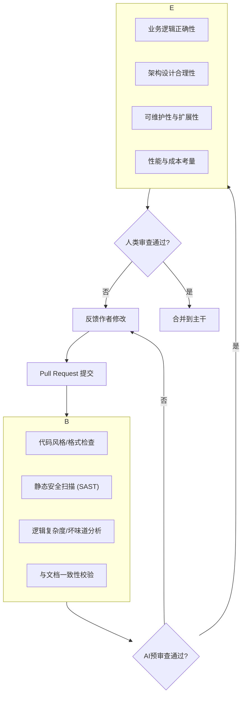

# AI增强的代码审查流程

代码审查（Code Review, CR）是保障软件质量的核心环节，但它也常常是团队效率的瓶颈。传统的CR高度依赖资深开发者的经验，耗时、易产生主观争论，且容易遗漏深层次问题。

AI增强的代码审查流程，旨在将人类的智慧与AI的不知疲倦、客观中立的分析能力相结合，打造一个“分层、自动化、智能化”的新一代CR范式。

## 分层审查模型：人机各司其职

这个新范式的核心思想是“分层”，让AI和人类审查者各自专注于最擅长的领域，避免用人去做机器能做的事。

### 第一层：AI自动化预审查（守门员）

当开发者提交一个Pull Request (PR)时，CI/CD流水线会自动触发AI进行第一轮审查。AI在这一层的角色是“守门员”，负责拦截所有机器能够发现的、客观的、确定性的问题。

**AI审查清单：**
1.  **代码规范**：是否符合团队统一的ESLint、Prettier等规范？（AI可自动修复）
2.  **安全漏洞**：是否存在已知的安全漏洞，如SQL注入、XSS等？
3.  **代码“坏味道”**：是否存在过长函数、过高圈复杂度、重复代码等问题？
4.  **文档一致性**：代码中的函数签名、API端点是否与`docs/`目录下的设计文档一致？
5.  **测试覆盖率**：新增代码的单元测试覆盖率是否达到了团队设定的阈值（如80%）？

只有当AI的预审查100%通过后，这个PR才会被分配给人类审查者。这极大地节省了人类审查者的时间，让他们不必再为“代码格式”、“变量命名”这类低价值问题浪费口舌。

### 第二层：人类深度审查（架构师与业务专家）

通过了AI的“海选”后，PR进入了人类审查阶段。此时，人类审查者可以完全信任代码在规范性、基础安全性等方面是合格的，从而将全部精力聚焦于机器难以判断的、更宏观、更主观的层面。

**人类审查清单：**
1.  **业务逻辑是否正确？** 代码是否完整且正确地实现了需求文档（PRD）中描述的业务逻辑？
2.  **架构是否合理？** 代码的设计是否符合项目的整体架构？是否引入了不必要的技术债务？是否具有良好的扩展性？
3.  **可读性与可维护性**：代码是否易于理解？命名是否清晰地反映了业务意图？其他开发者在未来是否能轻松地维护这段代码？
4.  **性能与成本**：这段代码是否可能在高并发下产生性能瓶颈？是否会引入昂贵的云服务调用？

## AI作为审查助手的最佳实践

在第二层审查中，人类审查者依然可以主动利用AI作为自己的“副驾驶”。

**实践一：让AI总结变更**
当面对一个巨大的PR时，审查者可以先让AI进行总结。

**Prompt示例：**
> 这是一个关于“订单系统重构”的PR，涉及30个文件变更。请为我总结这个PR的核心变更内容：
> 1.  主要的逻辑修改是什么？
> 2.  引入了哪些新的依赖或组件？
> 3.  可能对系统其他部分产生影响的修改有哪些？

**实践二：针对性提问**
审查者可以针对自己怀疑的地方，让AI进行深度分析。

**Prompt示例：**
> 我正在审查 `@/services/paymentService.ts` 这个文件。我担心第58行的 `processPayment` 函数存在并发安全问题。请你分析这段代码，在并发调用场景下是否存在资源竞争或状态不一致的风险？并提供一个使用“分布式锁”的重构建议。

---

**本节小结：** AI增强的代码审查流程，通过明确的“人机分层”，实现了效率与深度的统一。AI作为不知疲倦的“守门员”，保证了代码质量的下限；人类专家则作为“架构师”，聚焦于业务与设计，决定了代码质量的上限。这种协作模式，将代码审查从一个令人头疼的瓶颈，转变为一个高效、深入、持续提升团队代码健康度的核心流程。

**下一节：** [文档驱动的自动测试体系](doc-driven-testing.md)