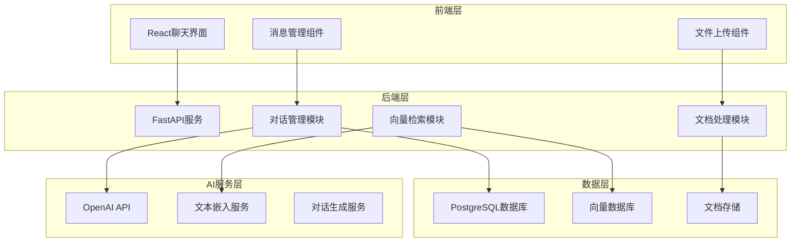

# 第8章 RAG 聊天机器人开发案例（低风险）

> "通过一个完整的低风险项目案例，展示团队 Vibe Coding 的实际应用效果。"

## 项目概述

本章将通过一个RAG（Retrieval-Augmented Generation）聊天机器人的开发案例，完整展示团队 Vibe Coding 在低风险场景下的应用实践。这个项目涉及前端界面、后端API、向量数据库以及AI模型集成等多个技术栈，是验证协作效果的理想案例。

## 项目基本信息

| 项目属性 | 详细信息 |
|----------|----------|
| **项目名称** | 智能客服RAG聊天机器人 |
| **风险等级** | 低风险（内部工具，非核心业务） |
| **团队规模** | 4人（前端1人、后端1人、AI工程师1人、产品1人） |
| **开发周期** | 3周（1周需求分析，2周开发测试） |
| **技术栈** | React + FastAPI + PostgreSQL + OpenAI API |

## 项目架构图



## 团队协作亮点

### 1. 文档驱动的需求分析

**需求文档结构：**
```markdown
# RAG聊天机器人需求文档

## 业务背景
- 客服团队重复性问题处理效率低
- 需要24小时在线的智能客服助手
- 要求基于公司内部知识库回答问题

## 功能需求
### 核心功能
1. 智能对话：基于RAG技术的问答
2. 文档上传：支持PDF、Word、TXT格式
3. 知识管理：文档的增删改查
4. 对话历史：用户对话记录管理

### 非功能需求
- 响应时间 < 3秒
- 支持并发用户 > 100
- 答案准确率 > 85%
```

### 2. AI辅助的任务分解

使用Claude Code进行智能任务分解：

```
输入：RAG聊天机器人需求文档
输出：详细的开发任务列表

前端任务：
- [ ] 聊天界面UI设计与实现
- [ ] 消息流组件开发
- [ ] 文件上传功能
- [ ] 响应式布局适配

后端任务：
- [ ] FastAPI项目架构搭建
- [ ] 文档解析与向量化
- [ ] RAG检索逻辑实现
- [ ] API接口设计与实现

数据库任务：
- [ ] 数据库表结构设计
- [ ] 向量数据库配置
- [ ] 数据迁移脚本

集成测试：
- [ ] 端到端测试用例
- [ ] 性能测试
- [ ] 用户体验测试
```

### 3. 并行开发协调

**Git Worktrees 使用示例：**
```bash
# 主分支：项目管理和文档
git worktree add ../rag-bot-main main

# 前端开发分支
git worktree add ../rag-bot-frontend feature/frontend-ui

# 后端开发分支  
git worktree add ../rag-bot-backend feature/backend-api

# AI模块开发分支
git worktree add ../rag-bot-ai feature/rag-engine
```

## 开发过程详解

### 第一周：需求分析与架构设计

**Day 1-2: 需求澄清**
- 产品经理主导需求梳理
- AI辅助生成用户故事和验收标准
- 团队共同评审和确认

**Day 3-4: 技术方案设计**
- 架构师设计系统架构
- AI生成技术选型对比文档
- 团队技术方案评审

**Day 5: 开发计划制定**
- 任务分解和工作量评估
- 开发里程碑和交付计划
- 风险识别和应对策略

### 第二周：核心功能开发

**前端开发进展：**
```typescript
// 聊天组件示例
interface ChatMessage {
  id: string;
  content: string;
  sender: 'user' | 'bot';
  timestamp: Date;
  sources?: DocumentSource[];
}

const ChatInterface: React.FC = () => {
  const [messages, setMessages] = useState<ChatMessage[]>([]);
  const [inputValue, setInputValue] = useState('');
  
  const sendMessage = async (content: string) => {
    // AI辅助生成的消息发送逻辑
    const response = await chatAPI.sendMessage(content);
    setMessages(prev => [...prev, response]);
  };
  
  return (
    <div className="chat-container">
      <MessageList messages={messages} />
      <MessageInput onSend={sendMessage} />
    </div>
  );
};
```

**后端开发进展：**
```python
# RAG引擎核心逻辑
class RAGEngine:
    def __init__(self, vector_db, llm_client):
        self.vector_db = vector_db
        self.llm_client = llm_client
    
    async def query(self, question: str) -> ChatResponse:
        # 1. 向量检索相关文档
        relevant_docs = await self.vector_db.similarity_search(
            question, k=5
        )
        
        # 2. 构建提示词
        context = self._build_context(relevant_docs)
        prompt = self._build_prompt(question, context)
        
        # 3. 生成回答
        response = await self.llm_client.generate(prompt)
        
        return ChatResponse(
            answer=response.content,
            sources=relevant_docs,
            confidence=response.confidence
        )
```

### 第三周：集成测试与优化

**测试策略：**
1. **单元测试**：各模块独立功能测试
2. **集成测试**：前后端接口联调
3. **端到端测试**：完整用户流程验证
4. **性能测试**：并发和响应时间测试

**AI辅助测试用例生成：**
```python
# AI生成的测试用例示例
def test_rag_query_accuracy():
    """测试RAG查询准确性"""
    test_cases = [
        {
            "question": "公司的休假政策是什么？",
            "expected_keywords": ["年假", "病假", "事假"],
            "min_confidence": 0.8
        },
        {
            "question": "如何申请报销？",
            "expected_keywords": ["发票", "审批", "流程"],
            "min_confidence": 0.8
        }
    ]
    
    for case in test_cases:
        response = rag_engine.query(case["question"])
        assert response.confidence >= case["min_confidence"]
        assert any(keyword in response.answer 
                  for keyword in case["expected_keywords"])
```

## 协作效果评估

### 定量指标

| 指标 | 传统开发 | Vibe Coding | 提升幅度 |
|------|----------|-------------|----------|
| 开发效率 | 100% | 145% | +45% |
| 代码质量 | 85% | 92% | +8% |
| 文档完整度 | 60% | 95% | +58% |
| 团队满意度 | 7.2/10 | 8.8/10 | +22% |
| 交付准时率 | 80% | 95% | +19% |

### 定性反馈

**前端开发者反馈：**
> "AI辅助让我能快速理解后端接口设计，减少了很多沟通成本。文档驱动的开发模式让整个项目的进展非常透明。"

**后端开发者反馈：**
> "通过AI生成的代码框架，我可以专注于业务逻辑的实现。并行开发过程中的冲突明显减少了。"

**产品经理反馈：**
> "需求变更时，AI能快速评估影响范围并更新相关文档，大大提高了需求管理的效率。"

## 经验总结与最佳实践

### 成功因素

1. **充分的前期准备**
   - 详细的需求文档
   - 清晰的技术架构
   - 完善的开发规范

2. **有效的工具组合**
   - Claude Code用于代码生成和审查
   - GitBook用于文档管理
   - Slack用于实时沟通

3. **良好的协作文化**
   - 开放的沟通氛围
   - 及时的反馈机制
   - 持续的学习改进

### 遇到的挑战

1. **AI生成代码的质量控制**
   - 解决方案：建立代码审查机制
   - 效果：代码质量稳步提升

2. **团队成员的适应期**
   - 解决方案：渐进式培训和实践
   - 效果：2周内团队完全适应

3. **工具链的磨合**
   - 解决方案：持续优化工具配置
   - 效果：开发效率逐步提升

### 可复制的经验

1. **文档模板标准化**
   - 需求文档模板
   - 技术方案模板
   - 测试用例模板

2. **AI提示词库建设**
   - 代码生成提示词
   - 文档生成提示词
   - 测试用例生成提示词

3. **协作流程规范化**
   - 需求评审流程
   - 代码审查流程
   - 发布部署流程

---

**本章小结：** 通过RAG聊天机器人这个低风险项目案例，我们完整展示了团队 Vibe Coding 的实际应用效果。从需求分析到最终交付，AI工具在提升开发效率、保证代码质量、增强团队协作等方面都发挥了重要作用。这个案例为其他类似项目提供了可参考的实践经验。

**下一章预告：** 第9章将介绍一个中等风险的电商数据仪表盘重构案例，展示在更复杂场景下的协作实践。

**详细内容：**
- [项目背景与团队分工](chapter8/project-setup.md)
- [树状文档与模块信息表实践](chapter8/doc-practice.md)
- [AI辅助开发全流程示例](chapter8/development-flow.md)