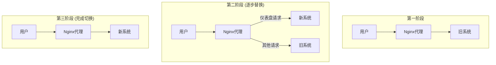

# 新旧系统并行与无缝切换

新旧系统的切换，是重构项目中最惊心动魄的“临门一脚”。传统的“停机发布”或“大爆炸式”切换方案，对于一个被高层关注、承载核心业务数据的仪表盘来说，是不可接受的。任何长时间的停机或功能异常，都可能导致业务决策的延迟和团队信誉的受损。

因此，我们采用了业界推崇的、更安全、更平滑的“扼杀者无花果模式”（Strangler Fig Pattern）进行切换。

## 核心理念：“扼杀者模式”

这个模式的名字来源于一种热带植物——无花果树。它会缠绕着另一棵大树生长，最终取而代之。

在软件重构中，这意味着：
1.  **新旧共存**：让新系统和旧系统并行运行一段时间。
2.  **流量代理**：在系统入口处设置一个反向代理（如Nginx），作为“交通警察”。
3.  **逐步替换**：由代理将流向旧系统的请求，逐步地、一个一个地“拦截”并转发给新系统。
4.  **最终扼杀**：当所有流量都切换到新系统后，旧系统就可以安全地“枯萎”并被移除。

### 第一步：AI协作配置流量代理

我们使用Nginx作为反向代理。后端工程师张伟让AI来帮助他生成初始的、复杂的路由配置。

**张伟的Prompt:**
> 你是一位Nginx配置专家。请为我编写一份Nginx配置文件，实现以下需求：
>
> 1.  默认将所有请求代理到旧的PHP系统（地址：`http://localhost:8080`）。
> 2.  但是，将所有路径以 `/api/v1/` 开头的请求，代理到我们新的FastAPI后端（地址：`http://localhost:8000`）。
> 3.  同时，将所有对根路径 `/` 的访问（即仪表盘首页），也代理到新的Vue.js前端（地址：`http://localhost:5173/claude-code-in-teams/`）。
> 4.  需要正确处理WebSocket连接和HTTP头信息的转发。

AI生成的Nginx配置，不仅正确设置了`proxy_pass`，还包含了`proxy_set_header`等最佳实践，为平滑切换提供了技术基础。

### 第二步：“影子模式”与AI数据比对

在将任何真实流量切到新系统之前，我们先进入“影子模式”（Shadow Mode）。即Nginx会将生产请求**同时**发给新旧两个系统，但只将旧系统的响应返回给用户。

这个阶段的目的是在真实流量的压力下，验证新系统的性能和稳定性。更重要的是，**验证新旧系统对同一个请求的响应是否一致**。

**数据工程师赵四的实践：**
他编写了一个脚本，将新旧两个系统的API响应日志都收集起来。然后，他利用AI进行“响应比对”。

**赵四的Prompt:**
> 你是数据比对专家。这里有两条JSON数据，分别来自我们的新旧系统对同一个API请求的响应。
>
> **旧系统响应:**
> (粘贴旧系统的JSON)
>
> **新系统响应:**
> (粘贴新系统的JSON)
>
> 请帮我比对它们，并回答：
> 1.  数据结构是否一致？
> 2.  核心指标（如`total_gmv`, `user_count`）的值是否一致？如果存在差异，差异率是多少？
> 3.  找出所有值不一致的字段。

通过AI的批量比对，团队快速发现了一个问题：新系统对“用户ID”进行了类型转换，导致与旧系统数据不一致。这个问题在上线前得到了修复，避免了一场潜在的数据灾难。

### 第三步：灰度发布与AI日志监控

在影子模式稳定运行一周后，团队开始真正的“灰度发布”。

1.  **内部用户优先**：利用Nginx的`geo`和`map`模块，团队配置了只将IP地址为公司内部网络的请求，转发到新系统。这让团队自己成为了新系统的第一批用户。
2.  **AI实时日志监控**：在此期间，AI被赋予了一个新角色——“7x24小时的监控工程师”。它被接入了新系统的实时错误日志流（如Sentry）。

**AI监控的Prompt（内置于监控系统）：**
> [系统警报] 以下是一条来自生产环境的错误日志。
>
> (粘贴错误日志的stack trace)
>
> 请立即分析：
> 1.  **问题摘要**：用一句话概括这是什么错误。
> 2.  **严重等级**：评估此错误的严重性（高、中、低）。
> 3.  **可能原因**：推测导致此错误的可能原因。
> 4.  **行动建议**：建议开发人员应该如何修复。
> 5.  **是否需要立即回滚？**

当一次灰度发布中，新系统因为一个罕见的日期格式问题抛出异常时，AI在几秒钟内就分析出问题，并通过Slack发出了“中等严重性，无需立即回滚，建议修正日期处理逻辑”的警报，让值班的张伟可以从容地进行热修复。

### 第四步：全量上线与旧系统下线

在灰度发布范围从内部用户逐步扩大到1%、10%、50%，并最终达到100%后，新系统稳定运行了两周。至此，切换过程已宣告成功。

旧的PHP系统终于可以被光荣地关闭，相关的服务器资源也被释放。整个重构项目画上了圆满的句号。

---

**本节小结：** 无缝切换是技术、流程和勇气的结合。AI在其中扮演了“配置专家”、“质量校验官”和“智能监控员”的关键角色。它通过生成复杂的代理配置、精准比对新旧系统的数据差异、实时分析和预警生产环境的错误，极大地降低了上线过程的风险和不确定性。这使得“为飞行中的飞机更换引擎”这一高难度操作，变得如同一场精心编排、有条不紊的演出。

**下一章预告：** [第10章 AI交易风险引擎重构案例（高风险）](part4/chapter10.md)