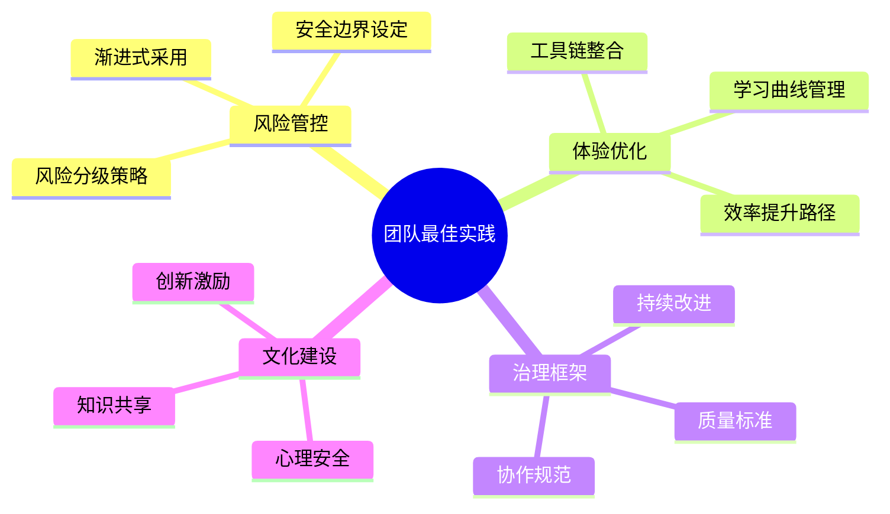
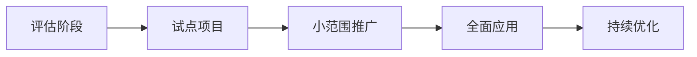

# 第11章 团队协作最佳实践

> "最佳实践不是一成不变的规则，而是在实践中不断演进的智慧结晶。在AI协作时代，我们需要重新审视和定义什么是真正有效的团队实践。"

## 章节概述

本章将系统总结AI协作团队的最佳实践，包括风险分级使用策略、开发者体验优化，以及AI协作治理框架。通过这些经过验证的实践方法，帮助团队建立可持续的AI协作模式。

## 最佳实践框架



## 主要内容

### 1. 风险分级使用策略

建立系统化的风险评估和管控机制，确保AI协作的安全性和可控性。

**核心要素：**
- 项目风险评估模型
- 分级使用策略制定
- 安全边界和控制措施
- 应急响应和回滚机制

### 2. 开发者体验优化

从开发者的角度优化AI协作体验，提升工作效率和满意度。

**优化维度：**
- 工具使用便利性
- 学习成本控制
- 工作流程顺畅度
- 反馈机制完善性

### 3. AI协作治理框架

建立完善的治理体系，确保AI协作的规范性和可持续性。

**治理要素：**
- 协作规范和标准
- 质量控制机制
- 绩效评估体系
- 持续改进流程

## 风险分级使用策略

### 多维度风险评估

基于业务影响、技术复杂度、合规要求、团队准备度和时间压力五个维度，构建科学的项目风险评估模型。

**风险等级定义：**
- **低风险**：内部工具、文档生成、代码重构
- **中低风险**：非核心功能开发、测试用例生成
- **中等风险**：用户数据处理、支付功能、权限系统
- **中高风险**：金融交易、医疗数据、安全认证
- **高风险**：核心交易引擎、安全加密、监管报告

### 分级使用策略

**策略框架：**
- **全面使用**：低风险项目可使用所有AI功能
- **有限使用**：中等风险项目限制核心业务逻辑生成
- **谨慎使用**：高风险项目仅限辅助功能
- **极限使用**：关键系统仅限文档和注释

### 渐进式采用路径



**实施步骤：**
1. **评估阶段**：团队能力评估、工具选型、风险评估
2. **试点项目**：选择低风险项目积累经验
3. **小范围推广**：扩展到中等风险项目，完善流程
4. **全面应用**：覆盖所有适用项目类型

## 开发者体验优化

### 开发者体验成熟度模型

建立五级成熟度评估体系，帮助团队系统性提升开发体验：

**成熟度等级：**
- **Level 1**：基础工具化（手动配置，工具割裂）
- **Level 2**：标准化流程（统一环境，基础自动化）  
- **Level 3**：优化协作（AI辅助，智能审查）
- **Level 4**：增强体验（个性化配置，智能工作流）
- **Level 5**：变革创新（自主决策AI，自优化系统）

### 工具链整合

**统一开发工具包：**
- **核心组件**：Claude Code、Git Worktrees、文档同步工具
- **自动化脚本**：环境初始化、代码同步、健康检查
- **监控系统**：开发效率、协作质量、AI使用情况

**开发工作流自动化：**
```bash
# 每日工作流程
start_work()    # 环境准备、代码同步、监控启动
commit_work()   # AI审查、测试运行、代码提交
end_work()      # 工作总结、文档同步、环境清理
```

### 学习曲线管理

**1. 分层培训体系**
```yaml
# training_program.yml
training_levels:
  beginner:
    name: "AI协作入门"
    duration: "1周"
    objectives:
      - "理解AI协作基本概念"
      - "掌握基础工具使用"
      - "完成简单任务实践"
    modules:
      - "AI协作理念介绍"
      - "Claude Code基础操作"
      - "文档驱动开发入门"
      - "实践项目：个人博客开发"
    
  intermediate:
    name: "团队协作进阶"
    duration: "2周"
    objectives:
      - "掌握团队协作技巧"
      - "理解风险控制机制"
      - "能够独立完成中等复杂度项目"
    modules:
      - "多会话并行开发"
      - "代码审查最佳实践"
      - "冲突解决技巧"
      - "实践项目：电商系统模块"
    
  advanced:
    name: "高级应用与治理"
    duration: "3周"
    objectives:
      - "设计AI协作架构"
      - "建立治理体系"
      - "指导团队实施"
    modules:
      - "AI协作架构设计"
      - "治理框架建设"
      - "性能优化技巧"
      - "实践项目：企业级系统重构"
```

**2. 个性化学习路径**
```python
class LearningPathRecommender:
    def __init__(self):
        self.skill_assessor = SkillAssessor()
        self.path_generator = PathGenerator()
    
    def recommend_learning_path(self, developer_profile):
        """推荐个性化学习路径"""
        # 评估当前技能水平
        current_skills = self.skill_assessor.assess(developer_profile)
        
        # 识别技能差距
        skill_gaps = self.identify_skill_gaps(current_skills, developer_profile.target_role)
        
        # 生成学习路径
        learning_path = self.path_generator.generate(skill_gaps, developer_profile.preferences)
        
        return {
            'current_level': current_skills.overall_level,
            'target_level': developer_profile.target_role,
            'skill_gaps': skill_gaps,
            'recommended_path': learning_path,
            'estimated_duration': learning_path.total_duration
        }
    
    def track_progress(self, developer_id, completed_modules):
        """跟踪学习进度"""
        progress = self.calculate_progress(developer_id, completed_modules)
        next_steps = self.suggest_next_steps(progress)
        
        return {
            'completion_rate': progress.completion_rate,
            'skill_improvement': progress.skill_improvement,
            'next_recommended_modules': next_steps,
            'estimated_completion_date': progress.estimated_completion
        }
```

### 效率提升路径

**1. 效率指标体系**
```python
class EfficiencyMetrics:
    def __init__(self):
        self.metrics_definitions = {
            'development_velocity': {
                'description': '开发速度',
                'unit': 'story_points_per_sprint',
                'target': 'increase_by_30%'
            },
            'code_quality': {
                'description': '代码质量',
                'unit': 'defect_density',
                'target': 'decrease_by_50%'
            },
            'time_to_market': {
                'description': '上市时间',
                'unit': 'days_from_idea_to_production',
                'target': 'decrease_by_40%'
            },
            'developer_satisfaction': {
                'description': '开发者满意度',
                'unit': 'satisfaction_score_1_to_10',
                'target': 'increase_to_8_plus'
            }
        }
    
    def measure_efficiency(self, team_data, time_period):
        """测量团队效率"""
        measurements = {}
        
        for metric_name, definition in self.metrics_definitions.items():
            current_value = self.calculate_metric(metric_name, team_data, time_period)
            baseline_value = self.get_baseline(metric_name, team_data)
            improvement = self.calculate_improvement(current_value, baseline_value)
            
            measurements[metric_name] = {
                'current_value': current_value,
                'baseline_value': baseline_value,
                'improvement': improvement,
                'target_met': self.check_target_achievement(metric_name, improvement)
            }
        
        return measurements
```

**2. 持续改进机制**
```python
class ContinuousImprovement:
    def __init__(self):
        self.improvement_cycle = ['measure', 'analyze', 'improve', 'control']
    
    def run_improvement_cycle(self, team_metrics):
        """运行持续改进循环"""
        results = {}
        
        # 测量阶段
        current_state = self.measure_current_state(team_metrics)
        results['measurement'] = current_state
        
        # 分析阶段
        bottlenecks = self.analyze_bottlenecks(current_state)
        improvement_opportunities = self.identify_opportunities(bottlenecks)
        results['analysis'] = {
            'bottlenecks': bottlenecks,
            'opportunities': improvement_opportunities
        }
        
        # 改进阶段
        improvement_plan = self.create_improvement_plan(improvement_opportunities)
        results['improvement_plan'] = improvement_plan
        
        # 控制阶段
        monitoring_plan = self.create_monitoring_plan(improvement_plan)
        results['monitoring_plan'] = monitoring_plan
        
        return results
```

## AI协作治理框架

### 协作规范和标准

**1. 协作行为准则**
```markdown
# AI协作行为准则

## 基本原则
1. **透明性原则**：所有AI协作的工作都应该透明可追溯
2. **责任性原则**：开发者对AI生成的代码承担最终责任
3. **质量优先原则**：AI提升效率不能以牺牲质量为代价
4. **持续学习原则**：团队应该持续学习和改进AI协作技能

## 具体规范
### 代码生成规范
- AI生成的代码必须经过人工审查
- 关键业务逻辑不能完全依赖AI生成
- 所有AI生成的代码都要添加相应注释说明

### 文档管理规范
- 重要文档的AI生成部分需要标注
- 文档更新要保持版本控制
- 跨团队共享的文档需要统一格式

### 沟通协作规范
- AI协作的决策需要团队确认
- 重要变更要通过正式流程审批
- 定期分享AI协作经验和最佳实践
```

**2. 质量控制标准**
```yaml
# quality_standards.yml
code_quality:
  ai_generated_code:
    review_requirements:
      - "人工审查覆盖率 >= 100%"
      - "单元测试覆盖率 >= 80%"
      - "静态代码分析通过"
    
    documentation_requirements:
      - "AI生成标注"
      - "业务逻辑说明"
      - "潜在风险提示"
    
    testing_requirements:
      - "功能测试通过"
      - "性能测试达标"
      - "安全测试通过"

documentation_quality:
  ai_assisted_docs:
    accuracy_requirements:
      - "技术准确性 >= 95%"
      - "信息完整性 >= 90%"
      - "格式一致性 >= 100%"
    
    maintenance_requirements:
      - "定期更新机制"
      - "版本控制管理"
      - "变更追踪记录"

collaboration_quality:
  team_coordination:
    communication_standards:
      - "重要决策记录"
      - "进度同步及时"
      - "问题响应快速"
    
    knowledge_sharing:
      - "经验分享定期"
      - "最佳实践总结"
      - "培训材料更新"
```

### 绩效评估体系

**1. 多维度评估模型**
```python
class PerformanceEvaluationSystem:
    def __init__(self):
        self.evaluation_dimensions = {
            'technical_proficiency': {
                'weight': 0.3,
                'metrics': [
                    'ai_tool_mastery',
                    'code_quality_improvement',
                    'problem_solving_efficiency'
                ]
            },
            'collaboration_effectiveness': {
                'weight': 0.25,
                'metrics': [
                    'team_communication_quality',
                    'knowledge_sharing_contribution',
                    'conflict_resolution_ability'
                ]
            },
            'innovation_contribution': {
                'weight': 0.2,
                'metrics': [
                    'process_improvement_suggestions',
                    'creative_problem_solving',
                    'new_technique_adoption'
                ]
            },
            'delivery_quality': {
                'weight': 0.15,
                'metrics': [
                    'on_time_delivery_rate',
                    'defect_rate',
                    'customer_satisfaction'
                ]
            },
            'learning_growth': {
                'weight': 0.1,
                'metrics': [
                    'skill_development_progress',
                    'certification_achievements',
                    'mentoring_contributions'
                ]
            }
        }
    
    def evaluate_performance(self, employee_data, evaluation_period):
        """评估员工绩效"""
        overall_score = 0
        dimension_scores = {}
        
        for dimension, config in self.evaluation_dimensions.items():
            dimension_score = self.calculate_dimension_score(
                employee_data, dimension, config['metrics']
            )
            weighted_score = dimension_score * config['weight']
            overall_score += weighted_score
            
            dimension_scores[dimension] = {
                'raw_score': dimension_score,
                'weighted_score': weighted_score,
                'improvement_areas': self.identify_improvement_areas(
                    employee_data, dimension, config['metrics']
                )
            }
        
        return {
            'overall_score': overall_score,
            'performance_level': self.determine_performance_level(overall_score),
            'dimension_scores': dimension_scores,
            'development_recommendations': self.generate_development_plan(dimension_scores)
        }
```

**2. 团队绩效仪表板**
```python
class TeamPerformanceDashboard:
    def __init__(self):
        self.dashboard_components = [
            'team_velocity_trends',
            'quality_metrics',
            'collaboration_health',
            'ai_adoption_progress',
            'individual_growth_tracking'
        ]
    
    def generate_dashboard(self, team_data, time_range):
        """生成团队绩效仪表板"""
        dashboard_data = {}
        
        # 团队速度趋势
        dashboard_data['velocity_trends'] = self.analyze_velocity_trends(
            team_data, time_range
        )
        
        # 质量指标
        dashboard_data['quality_metrics'] = self.calculate_quality_metrics(
            team_data, time_range
        )
        
        # 协作健康度
        dashboard_data['collaboration_health'] = self.assess_collaboration_health(
            team_data, time_range
        )
        
        # AI采用进度
        dashboard_data['ai_adoption'] = self.track_ai_adoption_progress(
            team_data, time_range
        )
        
        # 个人成长跟踪
        dashboard_data['individual_growth'] = self.track_individual_growth(
            team_data, time_range
        )
        
        return dashboard_data
```

## 实施指南

### 分阶段实施计划

**1. 准备阶段（第1-2周）**
```markdown
## 准备阶段任务清单

### 团队评估
- [ ] 团队技能水平评估
- [ ] 工具使用经验调研
- [ ] 协作模式现状分析
- [ ] 改进需求识别

### 基础设施准备
- [ ] 开发环境标准化
- [ ] 工具链集成配置
- [ ] 文档模板准备
- [ ] 监控系统搭建

### 规范制定
- [ ] 协作行为准则制定
- [ ] 质量标准定义
- [ ] 风险控制策略
- [ ] 应急响应预案
```

**2. 试点阶段（第3-6周）**
```markdown
## 试点阶段任务清单

### 项目选择
- [ ] 低风险试点项目确定
- [ ] 试点团队成员选择
- [ ] 成功标准定义
- [ ] 风险控制措施

### 实施执行
- [ ] 工具培训完成
- [ ] 协作流程试运行
- [ ] 问题收集和解决
- [ ] 经验总结和分享

### 效果评估
- [ ] 效率提升测量
- [ ] 质量改进评估
- [ ] 团队满意度调研
- [ ] 改进建议收集
```

**3. 推广阶段（第7-12周）**
```markdown
## 推广阶段任务清单

### 规模扩展
- [ ] 更多项目纳入
- [ ] 团队培训扩展
- [ ] 工具配置优化
- [ ] 流程标准化

### 持续优化
- [ ] 反馈机制建立
- [ ] 最佳实践总结
- [ ] 工具链升级
- [ ] 治理体系完善

### 文化建设
- [ ] 成功案例宣传
- [ ] 激励机制建立
- [ ] 知识分享平台
- [ ] 持续学习文化
```

### 成功因素

**1. 领导层支持**
- 高层管理者的明确支持
- 充足的资源投入
- 长期战略承诺

**2. 团队参与**
- 全员参与的改进过程
- 开放的沟通文化
- 持续的学习意愿

**3. 技术保障**
- 稳定可靠的工具链
- 完善的基础设施
- 有效的监控机制

**4. 过程管理**
- 清晰的实施计划
- 定期的进度检查
- 及时的问题解决

---

**详细内容：**
- [风险分级使用策略](chapter11/risk-strategies.md)
- [开发者体验优化](chapter11/developer-experience.md)
- [AI协作治理框架](chapter11/governance.md)

**下一章预告：** 第12章将探讨常见问题与解决方案，包括并行开发冲突处理、AI幻觉管控、心理安全障碍修复等实用内容。