# 第11章 团队使用最佳实践

> "最佳实践不是一成不变的规则，而是在实践中不断演进的智慧结晶。在AI协作时代，我们需要重新审视和定义什么是真正有效的团队实践。"

## 章节概述

本章将系统总结团队 Vibe Coding 的最佳实践，包括风险分级使用策略、开发者体验优化，以及AI协作治理框架。通过这些经过验证的实践方法，帮助团队建立可持续的AI协作模式。

## 最佳实践框架

```mermaid
mindmap
  root((团队最佳实践))
    风险管控
      风险分级策略
      安全边界设定
      渐进式采用
    体验优化
      工具链整合
      学习曲线管理
      效率提升路径
    治理框架
      协作规范
      质量标准
      持续改进
    文化建设
      心理安全
      知识共享
      创新激励
```



## 主要内容

### 1. 风险分级使用策略

建立系统化的风险评估和管控机制，确保AI协作的安全性和可控性。

**核心要素：**
- 项目风险评估模型
- 分级使用策略制定
- 安全边界和控制措施
- 应急响应和回滚机制

### 2. 开发者体验优化

从开发者的角度优化AI协作体验，提升工作效率和满意度。

**优化维度：**
- 工具使用便利性
- 学习成本控制
- 工作流程顺畅度
- 反馈机制完善性

### 3. AI协作治理框架

建立完善的治理体系，确保AI协作的规范性和可持续性。

**治理要素：**
- 协作规范和标准
- 质量控制机制
- 绩效评估体系
- 持续改进流程

## 风险分级使用策略

### 风险评估模型

**1. 多维度风险评估**
```python
class RiskAssessmentModel:
    def __init__(self):
        self.risk_dimensions = {
            'business_impact': {
                'weight': 0.3,
                'factors': ['revenue_impact', 'user_impact', 'reputation_risk']
            },
            'technical_complexity': {
                'weight': 0.25,
                'factors': ['system_complexity', 'integration_points', 'data_sensitivity']
            },
            'compliance_requirements': {
                'weight': 0.2,
                'factors': ['regulatory_compliance', 'security_requirements', 'audit_needs']
            },
            'team_readiness': {
                'weight': 0.15,
                'factors': ['ai_experience', 'tool_familiarity', 'process_maturity']
            },
            'time_pressure': {
                'weight': 0.1,
                'factors': ['deadline_pressure', 'resource_constraints', 'change_frequency']
            }
        }
    
    def assess_project_risk(self, project_data):
        """评估项目风险等级"""
        total_score = 0
        detailed_scores = {}
        
        for dimension, config in self.risk_dimensions.items():
            dimension_score = self.calculate_dimension_score(
                project_data.get(dimension, {}), 
                config['factors']
            )
            weighted_score = dimension_score * config['weight']
            total_score += weighted_score
            detailed_scores[dimension] = {
                'raw_score': dimension_score,
                'weighted_score': weighted_score
            }
        
        risk_level = self.determine_risk_level(total_score)
        
        return {
            'overall_risk_score': total_score,
            'risk_level': risk_level,
            'dimension_scores': detailed_scores,
            'recommendations': self.get_risk_recommendations(risk_level)
        }
    
    def determine_risk_level(self, score):
        """确定风险等级"""
        if score >= 8.0:
            return 'HIGH'
        elif score >= 6.0:
            return 'MEDIUM_HIGH'
        elif score >= 4.0:
            return 'MEDIUM'
        elif score >= 2.0:
            return 'LOW_MEDIUM'
        else:
            return 'LOW'
```

**2. 风险等级定义**
```yaml
# risk_levels.yml
risk_levels:
  LOW:
    description: "低风险项目"
    ai_usage_level: "全面使用"
    restrictions: []
    approval_required: false
    monitoring_level: "基础监控"
    examples:
      - "内部工具开发"
      - "文档生成"
      - "代码重构"
    
  LOW_MEDIUM:
    description: "中低风险项目"
    ai_usage_level: "广泛使用"
    restrictions:
      - "关键业务逻辑需人工审查"
    approval_required: false
    monitoring_level: "常规监控"
    examples:
      - "非核心功能开发"
      - "测试用例生成"
      - "API文档更新"
    
  MEDIUM:
    description: "中等风险项目"
    ai_usage_level: "有限使用"
    restrictions:
      - "核心代码需双重审查"
      - "数据处理需人工验证"
    approval_required: true
    monitoring_level: "增强监控"
    examples:
      - "用户数据处理"
      - "支付相关功能"
      - "权限控制系统"
    
  MEDIUM_HIGH:
    description: "中高风险项目"
    ai_usage_level: "谨慎使用"
    restrictions:
      - "仅限辅助功能"
      - "所有输出需人工验证"
      - "禁止自动部署"
    approval_required: true
    monitoring_level: "严格监控"
    examples:
      - "金融交易系统"
      - "医疗数据处理"
      - "安全认证模块"
    
  HIGH:
    description: "高风险项目"
    ai_usage_level: "极限使用"
    restrictions:
      - "仅限文档和注释"
      - "禁止代码生成"
      - "需要合规审查"
    approval_required: true
    monitoring_level: "全面监控"
    examples:
      - "核心交易引擎"
      - "安全加密模块"
      - "监管报告系统"
```

### 分级使用策略

**1. 策略实施框架**
```python
class AIUsageStrategy:
    def __init__(self, risk_level):
        self.risk_level = risk_level
        self.strategy_config = self.load_strategy_config(risk_level)
    
    def get_allowed_ai_functions(self):
        """获取允许的AI功能"""
        base_functions = [
            'code_explanation',
            'documentation_generation',
            'code_formatting'
        ]
        
        if self.risk_level in ['LOW', 'LOW_MEDIUM']:
            base_functions.extend([
                'code_generation',
                'refactoring_suggestions',
                'test_case_generation',
                'bug_fix_suggestions'
            ])
        
        if self.risk_level == 'LOW':
            base_functions.extend([
                'automated_deployment',
                'performance_optimization',
                'architecture_suggestions'
            ])
        
        return base_functions
    
    def get_review_requirements(self):
        """获取审查要求"""
        requirements = {
            'LOW': {
                'code_review': 'standard',
                'ai_output_review': 'optional',
                'security_review': 'automated'
            },
            'MEDIUM': {
                'code_review': 'enhanced',
                'ai_output_review': 'required',
                'security_review': 'manual'
            },
            'HIGH': {
                'code_review': 'strict',
                'ai_output_review': 'mandatory',
                'security_review': 'comprehensive'
            }
        }
        
        return requirements.get(self.risk_level, requirements['MEDIUM'])
```

**2. 渐进式采用路径**

```mermaid
graph LR
    A[评估阶段] --> B[试点项目]
    B --> C[小范围推广]
    C --> D[全面应用]
    D --> E[持续优化]
    
    subgraph "评估阶段"
        A1[团队能力评估]
        A2[工具选型]
        A3[风险评估]
    end
    
    subgraph "试点项目"
        B1[低风险项目]
        B2[经验积累]
        B3[问题识别]
    end
    
    subgraph "小范围推广"
        C1[中等风险项目]
        C2[流程优化]
        C3[培训推广]
    end
```


## 开发者体验优化

### 工具链整合

**1. 统一开发环境**
```json
{
  "name": "team-vibe-coding-toolkit",
  "version": "1.0.0",
  "description": "团队Vibe Coding工具链",
  "dependencies": {
    "claude-code-extension": "^2.0.0",
    "git-worktree-manager": "^1.5.0",
    "document-sync-tool": "^1.2.0",
    "collaboration-monitor": "^1.0.0"
  },
  "scripts": {
    "setup": "node scripts/setup-environment.js",
    "sync-docs": "document-sync-tool sync",
    "monitor": "collaboration-monitor start",
    "health-check": "node scripts/health-check.js"
  },
  "config": {
    "ai_model": "claude-3-sonnet",
    "sync_frequency": "real-time",
    "monitoring_level": "standard"
  }
}
```

**2. 开发者工作流优化**
```bash
#!/bin/bash
# developer-workflow.sh

# 每日工作开始流程
start_work() {
    echo "🚀 开始今日工作..."
    
    # 同步最新代码
    git fetch --all
    
    # 检查工作树状态
    git worktree list
    
    # 启动协作监控
    npm run monitor &
    
    # 同步文档
    npm run sync-docs
    
    echo "✅ 工作环境准备完成"
}

# 提交代码流程
commit_work() {
    echo "📝 提交代码..."
    
    # AI协作代码审查
    claude-code review --auto
    
    # 运行测试
    npm test
    
    # 提交代码
    git add .
    git commit -m "$1"
    
    # 推送到远程
    git push origin HEAD
    
    echo "✅ 代码提交完成"
}

# 结束工作流程
end_work() {
    echo "🏁 结束今日工作..."
    
    # 生成工作总结
    claude-code summarize-work --today
    
    # 同步文档
    npm run sync-docs
    
    # 停止监控
    pkill -f collaboration-monitor
    
    echo "✅ 工作总结完成"
}
```

### 学习曲线管理

**1. 分层培训体系**
```yaml
# training_program.yml
training_levels:
  beginner:
    name: "AI协作入门"
    duration: "1周"
    objectives:
      - "理解AI协作基本概念"
      - "掌握基础工具使用"
      - "完成简单任务实践"
    modules:
      - "AI协作理念介绍"
      - "Claude Code基础操作"
      - "文档驱动开发入门"
      - "实践项目：个人博客开发"
    
  intermediate:
    name: "团队协作进阶"
    duration: "2周"
    objectives:
      - "掌握团队协作技巧"
      - "理解风险控制机制"
      - "能够独立完成中等复杂度项目"
    modules:
      - "多会话并行开发"
      - "代码审查最佳实践"
      - "冲突解决技巧"
      - "实践项目：电商系统模块"
    
  advanced:
    name: "高级应用与治理"
    duration: "3周"
    objectives:
      - "设计AI协作架构"
      - "建立治理体系"
      - "指导团队实施"
    modules:
      - "AI协作架构设计"
      - "治理框架建设"
      - "性能优化技巧"
      - "实践项目：企业级系统重构"
```

**2. 个性化学习路径**
```python
class LearningPathRecommender:
    def __init__(self):
        self.skill_assessor = SkillAssessor()
        self.path_generator = PathGenerator()
    
    def recommend_learning_path(self, developer_profile):
        """推荐个性化学习路径"""
        # 评估当前技能水平
        current_skills = self.skill_assessor.assess(developer_profile)
        
        # 识别技能差距
        skill_gaps = self.identify_skill_gaps(current_skills, developer_profile.target_role)
        
        # 生成学习路径
        learning_path = self.path_generator.generate(skill_gaps, developer_profile.preferences)
        
        return {
            'current_level': current_skills.overall_level,
            'target_level': developer_profile.target_role,
            'skill_gaps': skill_gaps,
            'recommended_path': learning_path,
            'estimated_duration': learning_path.total_duration
        }
    
    def track_progress(self, developer_id, completed_modules):
        """跟踪学习进度"""
        progress = self.calculate_progress(developer_id, completed_modules)
        next_steps = self.suggest_next_steps(progress)
        
        return {
            'completion_rate': progress.completion_rate,
            'skill_improvement': progress.skill_improvement,
            'next_recommended_modules': next_steps,
            'estimated_completion_date': progress.estimated_completion
        }
```

### 效率提升路径

**1. 效率指标体系**
```python
class EfficiencyMetrics:
    def __init__(self):
        self.metrics_definitions = {
            'development_velocity': {
                'description': '开发速度',
                'unit': 'story_points_per_sprint',
                'target': 'increase_by_30%'
            },
            'code_quality': {
                'description': '代码质量',
                'unit': 'defect_density',
                'target': 'decrease_by_50%'
            },
            'time_to_market': {
                'description': '上市时间',
                'unit': 'days_from_idea_to_production',
                'target': 'decrease_by_40%'
            },
            'developer_satisfaction': {
                'description': '开发者满意度',
                'unit': 'satisfaction_score_1_to_10',
                'target': 'increase_to_8_plus'
            }
        }
    
    def measure_efficiency(self, team_data, time_period):
        """测量团队效率"""
        measurements = {}
        
        for metric_name, definition in self.metrics_definitions.items():
            current_value = self.calculate_metric(metric_name, team_data, time_period)
            baseline_value = self.get_baseline(metric_name, team_data)
            improvement = self.calculate_improvement(current_value, baseline_value)
            
            measurements[metric_name] = {
                'current_value': current_value,
                'baseline_value': baseline_value,
                'improvement': improvement,
                'target_met': self.check_target_achievement(metric_name, improvement)
            }
        
        return measurements
```

**2. 持续改进机制**
```python
class ContinuousImprovement:
    def __init__(self):
        self.improvement_cycle = ['measure', 'analyze', 'improve', 'control']
    
    def run_improvement_cycle(self, team_metrics):
        """运行持续改进循环"""
        results = {}
        
        # 测量阶段
        current_state = self.measure_current_state(team_metrics)
        results['measurement'] = current_state
        
        # 分析阶段
        bottlenecks = self.analyze_bottlenecks(current_state)
        improvement_opportunities = self.identify_opportunities(bottlenecks)
        results['analysis'] = {
            'bottlenecks': bottlenecks,
            'opportunities': improvement_opportunities
        }
        
        # 改进阶段
        improvement_plan = self.create_improvement_plan(improvement_opportunities)
        results['improvement_plan'] = improvement_plan
        
        # 控制阶段
        monitoring_plan = self.create_monitoring_plan(improvement_plan)
        results['monitoring_plan'] = monitoring_plan
        
        return results
```

## AI协作治理框架

### 协作规范和标准

**1. 协作行为准则**
```markdown
# AI协作行为准则

## 基本原则
1. **透明性原则**：所有AI协作的工作都应该透明可追溯
2. **责任性原则**：开发者对AI生成的代码承担最终责任
3. **质量优先原则**：AI提升效率不能以牺牲质量为代价
4. **持续学习原则**：团队应该持续学习和改进AI协作技能

## 具体规范
### 代码生成规范
- AI生成的代码必须经过人工审查
- 关键业务逻辑不能完全依赖AI生成
- 所有AI生成的代码都要添加相应注释说明

### 文档管理规范
- 重要文档的AI生成部分需要标注
- 文档更新要保持版本控制
- 跨团队共享的文档需要统一格式

### 沟通协作规范
- AI协作的决策需要团队确认
- 重要变更要通过正式流程审批
- 定期分享AI协作经验和最佳实践
```

**2. 质量控制标准**
```yaml
# quality_standards.yml
code_quality:
  ai_generated_code:
    review_requirements:
      - "人工审查覆盖率 >= 100%"
      - "单元测试覆盖率 >= 80%"
      - "静态代码分析通过"
    
    documentation_requirements:
      - "AI生成标注"
      - "业务逻辑说明"
      - "潜在风险提示"
    
    testing_requirements:
      - "功能测试通过"
      - "性能测试达标"
      - "安全测试通过"

documentation_quality:
  ai_assisted_docs:
    accuracy_requirements:
      - "技术准确性 >= 95%"
      - "信息完整性 >= 90%"
      - "格式一致性 >= 100%"
    
    maintenance_requirements:
      - "定期更新机制"
      - "版本控制管理"
      - "变更追踪记录"

collaboration_quality:
  team_coordination:
    communication_standards:
      - "重要决策记录"
      - "进度同步及时"
      - "问题响应快速"
    
    knowledge_sharing:
      - "经验分享定期"
      - "最佳实践总结"
      - "培训材料更新"
```

### 绩效评估体系

**1. 多维度评估模型**
```python
class PerformanceEvaluationSystem:
    def __init__(self):
        self.evaluation_dimensions = {
            'technical_proficiency': {
                'weight': 0.3,
                'metrics': [
                    'ai_tool_mastery',
                    'code_quality_improvement',
                    'problem_solving_efficiency'
                ]
            },
            'collaboration_effectiveness': {
                'weight': 0.25,
                'metrics': [
                    'team_communication_quality',
                    'knowledge_sharing_contribution',
                    'conflict_resolution_ability'
                ]
            },
            'innovation_contribution': {
                'weight': 0.2,
                'metrics': [
                    'process_improvement_suggestions',
                    'creative_problem_solving',
                    'new_technique_adoption'
                ]
            },
            'delivery_quality': {
                'weight': 0.15,
                'metrics': [
                    'on_time_delivery_rate',
                    'defect_rate',
                    'customer_satisfaction'
                ]
            },
            'learning_growth': {
                'weight': 0.1,
                'metrics': [
                    'skill_development_progress',
                    'certification_achievements',
                    'mentoring_contributions'
                ]
            }
        }
    
    def evaluate_performance(self, employee_data, evaluation_period):
        """评估员工绩效"""
        overall_score = 0
        dimension_scores = {}
        
        for dimension, config in self.evaluation_dimensions.items():
            dimension_score = self.calculate_dimension_score(
                employee_data, dimension, config['metrics']
            )
            weighted_score = dimension_score * config['weight']
            overall_score += weighted_score
            
            dimension_scores[dimension] = {
                'raw_score': dimension_score,
                'weighted_score': weighted_score,
                'improvement_areas': self.identify_improvement_areas(
                    employee_data, dimension, config['metrics']
                )
            }
        
        return {
            'overall_score': overall_score,
            'performance_level': self.determine_performance_level(overall_score),
            'dimension_scores': dimension_scores,
            'development_recommendations': self.generate_development_plan(dimension_scores)
        }
```

**2. 团队绩效仪表板**
```python
class TeamPerformanceDashboard:
    def __init__(self):
        self.dashboard_components = [
            'team_velocity_trends',
            'quality_metrics',
            'collaboration_health',
            'ai_adoption_progress',
            'individual_growth_tracking'
        ]
    
    def generate_dashboard(self, team_data, time_range):
        """生成团队绩效仪表板"""
        dashboard_data = {}
        
        # 团队速度趋势
        dashboard_data['velocity_trends'] = self.analyze_velocity_trends(
            team_data, time_range
        )
        
        # 质量指标
        dashboard_data['quality_metrics'] = self.calculate_quality_metrics(
            team_data, time_range
        )
        
        # 协作健康度
        dashboard_data['collaboration_health'] = self.assess_collaboration_health(
            team_data, time_range
        )
        
        # AI采用进度
        dashboard_data['ai_adoption'] = self.track_ai_adoption_progress(
            team_data, time_range
        )
        
        # 个人成长跟踪
        dashboard_data['individual_growth'] = self.track_individual_growth(
            team_data, time_range
        )
        
        return dashboard_data
```

## 实施指南

### 分阶段实施计划

**1. 准备阶段（第1-2周）**
```markdown
## 准备阶段任务清单

### 团队评估
- [ ] 团队技能水平评估
- [ ] 工具使用经验调研
- [ ] 协作模式现状分析
- [ ] 改进需求识别

### 基础设施准备
- [ ] 开发环境标准化
- [ ] 工具链集成配置
- [ ] 文档模板准备
- [ ] 监控系统搭建

### 规范制定
- [ ] 协作行为准则制定
- [ ] 质量标准定义
- [ ] 风险控制策略
- [ ] 应急响应预案
```

**2. 试点阶段（第3-6周）**
```markdown
## 试点阶段任务清单

### 项目选择
- [ ] 低风险试点项目确定
- [ ] 试点团队成员选择
- [ ] 成功标准定义
- [ ] 风险控制措施

### 实施执行
- [ ] 工具培训完成
- [ ] 协作流程试运行
- [ ] 问题收集和解决
- [ ] 经验总结和分享

### 效果评估
- [ ] 效率提升测量
- [ ] 质量改进评估
- [ ] 团队满意度调研
- [ ] 改进建议收集
```

**3. 推广阶段（第7-12周）**
```markdown
## 推广阶段任务清单

### 规模扩展
- [ ] 更多项目纳入
- [ ] 团队培训扩展
- [ ] 工具配置优化
- [ ] 流程标准化

### 持续优化
- [ ] 反馈机制建立
- [ ] 最佳实践总结
- [ ] 工具链升级
- [ ] 治理体系完善

### 文化建设
- [ ] 成功案例宣传
- [ ] 激励机制建立
- [ ] 知识分享平台
- [ ] 持续学习文化
```

### 成功因素

**1. 领导层支持**
- 高层管理者的明确支持
- 充足的资源投入
- 长期战略承诺

**2. 团队参与**
- 全员参与的改进过程
- 开放的沟通文化
- 持续的学习意愿

**3. 技术保障**
- 稳定可靠的工具链
- 完善的基础设施
- 有效的监控机制

**4. 过程管理**
- 清晰的实施计划
- 定期的进度检查
- 及时的问题解决

---

**详细内容：**
- [风险分级使用策略](chapter11/risk-strategies.md)
- [开发者体验优化](chapter11/developer-experience.md)
- [AI协作治理框架](chapter11/governance.md)

**下一章预告：** 第12章将探讨常见问题与解决方案，包括并行开发冲突处理、AI幻觉管控、心理安全障碍修复等实用内容。