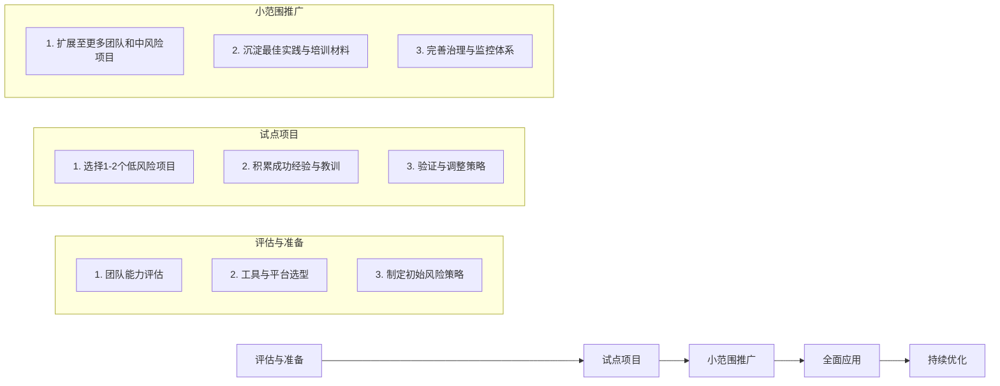

# 第十三章 风险分级与安全策略

在拥抱AI带来的巨大潜力的同时，我们必须清醒地认识到其伴随的风险。风险分级与安全策略是“团队Vibe Coding”模式中最重要的“安全阀”。通过科学的风险评估和差异化的管控策略，我们可以在最大化AI协作效率的同时，确保项目安全、合规、可控。

## 风险评估模型

我们不主张“一刀切”式的AI使用政策，而是建议对每个项目或重要功能进行多维度风险评估，以确定其风险等级。

### 多维度风险评估框架
评估主要围绕以下五个核心维度展开，每个维度根据实际情况打分（如1-5分），然后加权计算出总风险分值。

| 维度 | 权重 | 评估考量因素 |
| :--- | :--- | :--- |
| **业务影响** | 30% | - **收入影响**：功能失败是否会直接导致公司收入损失？<br/>- **用户影响**：影响的用户规模有多大？是否是核心用户？<br/>- **品牌声誉**：出现问题是否会严重损害品牌形象？ |
| **技术复杂度** | 25% | - **系统关联性**：是否与多个核心系统紧密耦合？<br/>- **数据敏感度**：是否处理个人身份信息（PII）、支付、医疗等敏感数据？<br/>- **算法关键性**：是否包含复杂且不容有失的核心业务算法？ |
| **合规与法律** | 20% | - **监管要求**：是否涉及金融、医疗等强监管行业？<br/>- **数据主权**：是否需要满足GDPR、CCPA等数据隐私法规？<br/>- **代码所有权**：使用的AI模型和数据是否存在知识产权风险？ |
| **团队就绪度** | 15% | - **AI经验**：团队成员是否具备丰富的AI协作经验和风险意识？<br/>- **领域知识**：团队是否对业务领域有足够深入的理解？<br/>- **流程成熟度**：团队是否遵循成熟的开发和审查流程？ |
| **变更与压力** | 10% | - **交付压力**：项目是否面临极度紧张的交付时间？<br/>- **需求稳定性**：需求是否频繁变更，容易导致混乱？ |

根据加权总分，我们将项目风险划分为四个等级：**低风险、中风险、高风险、禁区**。

## 风险等级与管控策略

不同的风险等级对应截然不同的AI使用策略和管控要求。

### 低风险 (Low Risk)

- **特征**：内部工具、非核心业务、无敏感数据、影响范围小。
- **AI使用策略**：**全面使用**。鼓励团队最大化利用AI进行代码生成、架构设计、测试、部署等所有环节的提效。
- **管控要求**：
    - **审查**：遵循团队标准的代码审查流程即可。
    - **监控**：基础的质量和性能监控。
    - **审批**：无需额外审批。

```yaml
# 低风险项目AI使用策略示例
level: "LOW_RISK"
ai_usage_scope: "full_access" # 全面使用
allowed_operations:
  - "code_generation"
  - "architecture_design"
  - "test_automation"
  - "auto_deployment"
review_policy: "standard_peer_review"
```

### 中风险 (Medium Risk)

- **特征**：核心业务的辅助功能、涉及普通用户数据、有一定用户规模。
- **AI使用策略**：**有限使用**。AI可用于生成非核心逻辑、工具函数、测试用例等，但核心业务逻辑必须由人来主导设计和编写。
- **管控要求**：
    - **审查**：要求更严格的代码审查，核心部分可能需要双人审查。AI生成的代码必须经过人工验证。
    - **监控**：增强对质量、安全和用户反馈的监控。
    - **限制**：禁止AI自动将代码部署到生产环境。

```yaml
# 中风险项目AI使用策略示例
level: "MEDIUM_RISK"
ai_usage_scope: "limited_use" # 有限使用
allowed_operations:
  - "non_core_logic_generation"
  - "test_case_generation"
  - "documentation_assistance"
restrictions:
  - "core_business_logic_must_be_human_authored"
  - "no_auto_deployment_to_production"
review_policy: "strict_review_with_ai_output_validation"
```

### 高风险 (High Risk)

- **特征**：核心业务的关键功能、处理高度敏感数据、大规模用户影响、有严格的合规要求。
- **AI使用策略**：**谨慎使用**。AI的角色从“驾驶员”转变为“领航员”，主要用于辅助性工作，严禁直接生成生产代码。
- **管控要求**：
    - **审查**：极其严格的多级审查流程，可能需要架构师、安全工程师和产品负责人共同参与。
    - **监控**：实施实时、全面的监控和警报。
    - **限制**：AI禁止直接访问生产数据或生产环境。所有AI的输出（包括文档和建议）都需要经过人工的批判性验证。

```yaml
# 高风险项目AI使用策略示例
level: "HIGH_RISK"
ai_usage_scope: "cautious_assistance" # 谨慎使用
allowed_operations:
  - "code_commenting"
  - "performance_analysis"
  - "security_vulnerability_suggestion"
restrictions:
  - "no_code_generation_for_production"
  - "no_access_to_production_data"
  - "all_outputs_require_manual_validation"
review_policy: "comprehensive_expert_review"
```

### 禁区 (Forbidden Zone)

- **特征**：国家关键基础设施、核心金融交易系统、生命支持相关的医疗系统等。
- **AI使用策略**：**禁止使用**。在这些领域，任何由AI引入的不确定性都是不可接受的。仅允许在完全隔离的沙箱环境中进行研究性探索。

## 渐进式采用路径

对于整个组织而言，引入“团队Vibe Coding”模式也应该遵循一个渐进、可控的路径，而非“大爆炸式”的全面铺开。



---

**本节小结：**

风险分级策略是“团队Vibe Coding”模式的“安全网”和“护栏”。它通过科学的评估模型、清晰的等级定义和程序化的策略实施，确保AI的强大能力被引导到正确的方向。这套机制让我们在享受AI带来的效率革命的同时，能将潜在风险牢牢控制在可接受的范围之内，从而实现既快又稳的创新。