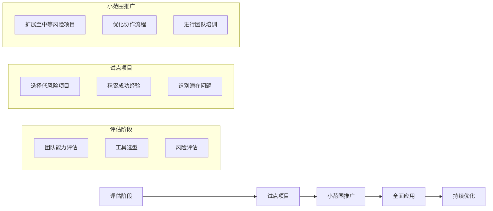

# 风险分级使用策略

建立系统化的风险评估和管控机制，是确保AI协作安全性和可控性的基石。团队不能对所有项目都采用“一刀切”的AI使用策略，而应根据项目的具体风险，进行精细化的管理。

## 核心理念：风险评估驱动策略选择

我们的核心理念是：**没有绝对安全的项目，只有被有效管理的风险**。通过一个多维度的风险评估模型，我们可以为每个项目“画像”，并匹配最合适的AI协作策略。

### 1. 多维度风险评估模型

我们设计了一个包含五个维度的加权风险评估模型，以量化项目的风险等级。

```python
class RiskAssessmentModel:
    def __init__(self):
        self.risk_dimensions = {
            'business_impact': {
                'weight': 0.3,
                'factors': ['revenue_impact', 'user_impact', 'reputation_risk']
            },
            'technical_complexity': {
                'weight': 0.25,
                'factors': ['system_complexity', 'integration_points', 'data_sensitivity']
            },
            'compliance_requirements': {
                'weight': 0.2,
                'factors': ['regulatory_compliance', 'security_requirements', 'audit_needs']
            },
            'team_readiness': {
                'weight': 0.15,
                'factors': ['ai_experience', 'tool_familiarity', 'process_maturity']
            },
            'time_pressure': {
                'weight': 0.1,
                'factors': ['deadline_pressure', 'resource_constraints', 'change_frequency']
            }
        }
    
    def assess_project_risk(self, project_data):
        """评估项目风险等级"""
        total_score = 0
        detailed_scores = {}
        
        for dimension, config in self.risk_dimensions.items():
            dimension_score = self.calculate_dimension_score(
                project_data.get(dimension, {}), 
                config['factors']
            )
            weighted_score = dimension_score * config['weight']
            total_score += weighted_score
            detailed_scores[dimension] = {
                'raw_score': dimension_score,
                'weighted_score': weighted_score
            }
        
        risk_level = self.determine_risk_level(total_score)
        
        return {
            'overall_risk_score': total_score,
            'risk_level': risk_level,
            'dimension_scores': detailed_scores,
            'recommendations': self.get_risk_recommendations(risk_level)
        }
    
    def determine_risk_level(self, score):
        """确定风险等级"""
        if score >= 8.0:
            return 'HIGH'
        elif score >= 6.0:
            return 'MEDIUM_HIGH'
        elif score >= 4.0:
            return 'MEDIUM'
        elif score >= 2.0:
            return 'LOW_MEDIUM'
        else:
            return 'LOW'
```

### 2. 风险等级定义与AI使用权限

根据评估得分，我们将项目划分为五个等级，并为每个等级预设了清晰的AI使用权限和限制。

```yaml
# risk_levels.yml
risk_levels:
  LOW:
    description: "低风险项目"
    ai_usage_level: "全面使用"
    restrictions: []
    approval_required: false
    monitoring_level: "基础监控"
    examples:
      - "内部工具开发"
      - "文档生成"
      - "代码重构"
    
  LOW_MEDIUM:
    description: "中低风险项目"
    ai_usage_level: "广泛使用"
    restrictions:
      - "关键业务逻辑需人工审查"
    approval_required: false
    monitoring_level: "常规监控"
    examples:
      - "非核心功能开发"
      - "测试用例生成"
      - "API文档更新"
    
  MEDIUM:
    description: "中等风险项目"
    ai_usage_level: "有限使用"
    restrictions:
      - "核心代码需双重审查"
      - "数据处理需人工验证"
    approval_required: true
    monitoring_level: "增强监控"
    examples:
      - "用户数据处理"
      - "支付相关功能"
      - "权限控制系统"
    
  MEDIUM_HIGH:
    description: "中高风险项目"
    ai_usage_level: "谨慎使用"
    restrictions:
      - "仅限辅助功能"
      - "所有输出需人工验证"
      - "禁止自动部署"
    approval_required: true
    monitoring_level: "严格监控"
    examples:
      - "金融交易系统"
      - "医疗数据处理"
      - "安全认证模块"
    
  HIGH:
    description: "高风险项目"
    ai_usage_level: "极限使用"
    restrictions:
      - "仅限文档和注释"
      - "禁止代码生成"
      - "需要合规审查"
    approval_required: true
    monitoring_level: "全面监控"
    examples:
      - "核心交易引擎"
      - "安全加密模块"
      - "监管报告系统"
```

### 3. 策略实施框架

为了将上述定义落地，我们通过代码来程序化地管理不同风险等级下的AI功能和审查要求。

```python
class AIUsageStrategy:
    def __init__(self, risk_level):
        self.risk_level = risk_level
        self.strategy_config = self.load_strategy_config(risk_level)
    
    def get_allowed_ai_functions(self):
        """获取允许的AI功能"""
        base_functions = [
            'code_explanation',
            'documentation_generation',
            'code_formatting'
        ]
        
        if self.risk_level in ['LOW', 'LOW_MEDIUM']:
            base_functions.extend([
                'code_generation',
                'refactoring_suggestions',
                'test_case_generation',
                'bug_fix_suggestions'
            ])
        
        if self.risk_level == 'LOW':
            base_functions.extend([
                'automated_deployment',
                'performance_optimization',
                'architecture_suggestions'
            ])
        
        return base_functions
    
    def get_review_requirements(self):
        """获取审查要求"""
        requirements = {
            'LOW': {
                'code_review': 'standard',
                'ai_output_review': 'optional',
                'security_review': 'automated'
            },
            'MEDIUM': {
                'code_review': 'enhanced',
                'ai_output_review': 'required',
                'security_review': 'manual'
            },
            'HIGH': {
                'code_review': 'strict',
                'ai_output_review': 'mandatory',
                'security_review': 'comprehensive'
            }
        }
        
        return requirements.get(self.risk_level, requirements['MEDIUM'])
```

### 4. 渐进式采用路径

对于整个组织而言，引入“团队Vibe Coding”模式也应该遵循一个渐进、可控的路径，而非“大爆炸式”的全面铺开。



---

**本节小结：** 风险分级策略是“团队Vibe Coding”模式的“安全阀”。它通过科学的评估模型、清晰的等级定义和程序化的策略实施，确保AI的强大能力被引导到正确的方向，在享受效率提升的同时，将潜在风险控制在可接受的范围之内。