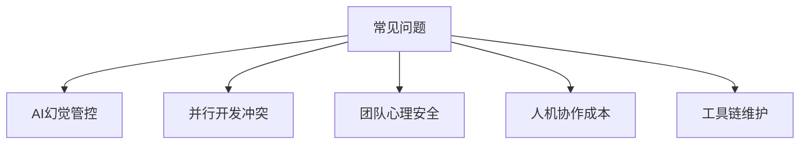

# 第13章 常见问题与解决方案 (FAQ)

> "理论是灰色的，生命之树常青。一个理论的真正价值，在于它能否解决现实世界中那些棘手的、不完美的问题。"

## 章节概述

欢迎来到本书的最后一章。在这里，我们不再探讨宏大的理论或理想的流程，而是直面那些在真实团队协作中几乎必然会遇到的“疑难杂症”。本章是一本实用主义的“避坑指南”和“问题解决手册”，旨在为您和您的团队在采纳“团队Vibe Coding”模式的旅程中，提供具体、可操作的解决方案。

## 核心问题导航

我们将聚焦于五大类最常见、也最具挑战性的问题：

1.  **AI的不可靠性**：当AI产生“幻觉”，提供错误或无用的信息时，我们该怎么办？
2.  **协作的复杂性**：当并行开发导致频繁的合并冲突时，我们该如何高效解决？
3.  **团队的适应性**：当团队成员对新模式产生抵触或恐惧时，我们该如何建设心理安全？
4.  **成本与效率的平衡**：当引入AI和新流程的初期导致效率不升反降时，我们该如何管理“人机在环”的隐性成本？
5.  **工具链的维护**：当复杂的工具链本身成为一种负担时，我们该如何简化和维护？

本章将为上述每一个问题提供一个专门的、深入的解决方案。

---

**详细内容：**
- [如何有效管控AI的“幻觉”？](chapter13/ai-hallucination.md)
- [如何处理并行开发中的合并冲突？](chapter13/merge-conflicts.md)
- [如何修复团队的心理安全障碍？](chapter13/psychological-safety.md)
- [如何管理“人机在环”的协作成本？](chapter13/collaboration-cost.md)
- [如何应对工具链的复杂性挑战？](chapter13/toolchain-complexity.md)

**全书结语：** [后记：Vibe永续，代码长青](../appendix/epilogue.md)