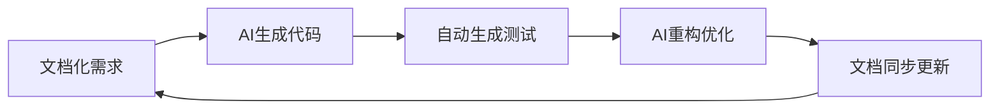

# 团队 Vibe Coding 开发指南

> AI时代下的团队协作开发实践指南
> 
> "从代码补全到智能体伙伴：AI编程的范式革命"

## 历史背景：AI编程工具的演进之路

### 🕰️ 编年史：从工具到伙伴的范式转变

**史前时代 (2021年前)**
- **传统IDE时代**：Eclipse、Visual Studio、IntelliJ IDEA建立了集成开发环境的基础
- **代码补全雏形**：Microsoft IntelliSense (2001) 开创了基于静态分析的上下文感知代码建议
- **早期AI探索**：Kite、TabNine等工具开始探索AI驱动的代码补全

**🔥 革命起点：GitHub Copilot (2021年6月)**
- 基于OpenAI Codex模型（GPT-3衍生版）
- 首个成功集成到IDE的重大AI工具
- 实现了实时代码补全和自然语言到代码的转换
- **核心突破**：首次成功将代码上下文共享给LLM，提供了真正的智能建议

**⚡ 智能体时代：Claude Code (2024年)**
- Claude 3.5 Sonnet展现出卓越的推理能力
- 在内部agentic编码评估中达到64%成功率
- 专注于复杂问题解决和代码理解
- **范式升级**：从被动补全到自主编程的智能体伙伴

**🚀 当前格局 (2025年)**
- **GitHub Copilot**：多模型支持（GPT-4.1、Claude Sonnet 3.7、Gemini 2.5 Pro），代理模式，全工作流集成
- **Claude Code**：终端操作，72.5% SWE-bench评分，多任务连续性，人在回路安全控制

### 🎯 三次重大范式跃迁

| 阶段 | 特征 | 代表工具 | 开发者角色 |
|------|------|----------|------------|
| **工具辅助** | 被动代码建议 | 传统IDE | 代码编写者 |
| **AI伙伴** | 主动代码生成 | GitHub Copilot | 代码审查者 |
| **智能体协作** | 自主任务执行 | Claude Code | 系统编排者 |

## 关于本书

在这个AI编程工具从"代码补全"向"智能体伙伴"演进的历史节点上，传统的团队开发协作模式正面临前所未有的变革。本书站在技术史的角度，深入探讨了如何在AI辅助开发的新时代下，构建高效、安全、可持续的团队协作机制。

### 📖 为什么现在需要这本书？

**历史必然性**：我们正处在大规模AI协作的临界点。从Copilot的实时补全到Claude Code的自主执行，AI不再是简单的工具，而是需要被"编排"的智能体伙伴。

**时代紧迫性**：当AI能够独立完成80%的编码工作时，人类开发者的核心价值何在？团队如何重新定义协作边界？

**实践需求性**：市场上充斥着个人AI编程技巧，但系统性的团队协作方法论却凤毛麟角。

## 核心理念：面向智能体时代的协作哲学

### 🧠 文档驱动开发（DADD）- 本书的核心理念

**什么是DADD？**

DADD（Document AI-Driven Development，文档AI驱动开发）是本书提出的革命性概念，专门为AI协作开发环境设计。它回答了这样一个核心问题：**当AI成为开发团队的一员时，我们如何确保它能准确理解人类意图并高效协作？**

**DADD的历史渊源：**
文档驱动开发的理念并非全新，它借鉴了：
- **文档优先开发（Documentation-First Development）**：强调文档作为开发的基础
- **契约式设计（Design by Contract）**：将文档视为可执行的协作协议
- **RFC/ADR实践**：通过结构化文档记录技术决策
- **领域驱动设计（DDD）**：通过统一语言促进团队协作

但DADD的独特之处在于：**文档不仅要让人理解，更要让AI能够执行**

**为什么需要DADD？**

想象一下这样的场景：
- 你告诉AI"帮我优化用户登录功能"，但AI不知道你们的用户体系架构
- 你说"按照项目规范写代码"，但AI不清楚你们的编码标准
- 你要求"实现支付功能"，但AI不了解你们的业务规则

**DADD的核心解决方案：**
```markdown
🔑 文档即接口：文档成为人类与AI的"协作协议"
🔑 知识即代码：项目知识被结构化存储，可被AI理解和执行  
🔑 历史即经验：过往的决策和方案成为AI的学习素材
🔑 规范即约束：通过文档定义AI的行为边界和质量标准
```

**DADD的5步工作流（借鉴docdd.ai的先进理念）：**


1. **文档化（Document）**：将需求、架构、规范转化为AI可理解的结构化文档
2. **生成（Generate）**：AI基于文档生成符合规范的代码实现
3. **测试（Test）**：自动生成测试用例验证代码质量
4. **重构（Refactor）**：AI根据反馈持续优化代码结构
5. **更新（Update）**：同步更新文档，保持代码与文档的一致性

**DADD vs 传统文档的区别：**

| 传统文档 | DADD文档 |
|----------|----------|
| 给人阅读 | 给人和AI共同阅读 |
| 静态记录 | 动态知识库 |
| 事后补充 | 事前驱动 |
| 信息孤岛 | 协作枢纽 |

**一个具体的DADD例子：**

```markdown
# 用户认证模块规范（DADD风格文档）

## AI理解要点
- 技术栈：JWT + Redis + Spring Security
- 安全要求：密码需bcrypt加密，JWT有效期2小时
- 性能要求：登录响应时间 < 200ms
- 错误处理：统一返回{code, message, data}格式

## 业务规则
- 用户名：3-20位，字母数字下划线
- 密码：8-20位，必须包含大小写和数字
- 邮箱验证：注册后24小时内有效

## 历史决策
### 2024-01-15：选择JWT而非Session
原因：支持分布式部署，减少Redis依赖
影响：需要处理JWT续签逻辑
```

**DADD带来的变革：**
1. **AI理解力提升**：通过结构化文档，AI能准确理解项目约束
2. **协作效率倍增**：减少反复沟通，AI一次性获得完整上下文
3. **知识传承永续**：新加入的AI或开发者能快速理解项目全貌
4. **质量一致性**：确保AI生成的代码符合项目标准
5. **持续优化**：通过文档-代码同步更新，形成正向循环

**借鉴docdd.ai的先进经验：**
- **机器可执行文档**：文档不仅是参考，更是AI的执行指令
- **向量化工档**：支持基于相似度的智能文档检索
- **函数级规范**：明确的输入输出定义和依赖关系
- **持续一致性**：确保文档、代码、测试三者始终保持同步

### 🤝 团队 Vibe Coding - 构建"人机混合"协作文化

**Vibe Coding的历史渊源：**
从极限编程(XP)的"结对编程"到DevOps的"协作文化"，再到AI时代的"智能体协作"——Vibe Coding延续了"以人为本"的开发理念，但将协作对象从"人-人"扩展到"人-AI-人"的复杂网络。

**为什么Vibe在AI时代更重要？**
当AI成为团队的一员时，我们需要：
- 建立与"非人类"智能体的有效沟通方式
- 在保持人类创造力的同时发挥AI的效率优势
- 构建包容"机器同事"的团队文化

### ⚖️ 风险分级管理 - 聪明的AI使用策略

**从"一刀切"到"量体裁衣"：**
不同的开发任务对AI的依赖程度应该不同。我们将AI参与风险分为四个等级：
- **低风险**：内部工具、原型开发、文档生成
- **中低风险**：非核心功能、测试用例、代码重构
- **中高风险**：核心功能、性能优化、安全相关
- **高风险**：支付系统、核心算法、用户隐私

**历史启示：**
借鉴金融行业的风险管理理念，我们为AI协作建立了"风险评估-分级控制-持续监控"的完整体系。

## DADD vs 传统方法：为什么选择文档AI驱动开发？

### 📊 DADD与经典开发模式对比

| 开发模式 | 核心思想 | 适用场景 | AI协作效果 |
|----------|----------|----------|------------|
| **瀑布模型** | 阶段式、文档密集型 | 需求稳定的项目 | AI难以理解厚重文档 |
| **敏捷开发** | 轻量文档、快速迭代 | 需求变化频繁的项目 | AI缺乏足够的上下文信息 |
| **DevOps** | 自动化、持续交付 | 需要快速部署的项目 | AI难以掌握完整的交付流程 |
| **DADD** | 结构化文档驱动AI协作 | AI增强的开发团队 | 最大化AI协作效率 |

### 🎯 DADD的独特优势

**1. 解决AI的"上下文缺失"问题**
传统开发中，AI就像新来的实习生，对项目历史、团队规范、业务背景一无所知。DADD通过结构化文档为AI提供了完整的"项目记忆"。

**2. 实现"可编排AI"的愿景**
通过文档标准化，我们可以像调用API一样"调用"AI，让它按照预定的规范和质量标准工作。

**3. 建立"人机协作"的新范式**
DADD不是让AI取代开发者，而是让AI成为真正的"智能体同事"，与人类形成互补优势。

### 💡 DADD实践入门：从一个小例子开始

假设你要让AI帮你开发一个用户注册功能：

**传统方式：**
```
你：帮我写个用户注册功能
AI：[生成通用代码，可能不符合你的项目规范]
```

**DADD方式：**
```markdown
# 先创建DADD文档
## 项目背景
- 框架：Spring Boot + MyBatis
- 数据库：MySQL 8.0
- 安全要求：密码bcrypt加密

## 业务规则  
- 用户名：3-20位，字母数字下划线
- 邮箱：需要验证格式
- 密码：8-20位，必须包含大小写和数字

## 技术约束
- 使用已有的BaseController作为基类
- 统一返回Result<T>格式
- 使用@Slf4j注解记录日志
```

然后告诉AI："基于上述规范，实现用户注册功能"

**结果差异：**
- 传统方式：需要多次沟通、修改、调整
- DADD方式：AI一次性生成符合所有要求的代码

## 读者常见疑问解答

### 🔍 DADD与DDD的关系：互补而非竞争

很多读者会问：**DADD与经典的DDD（领域驱动设计）有什么区别？**

**一句话理解：**
- **DDD**解决"业务复杂性"问题 → 让开发者更好地理解业务
- **DADD**解决"AI协作复杂性"问题 → 让AI更好地理解开发意图

**具体对比：**

| 对比维度 | DDD（领域驱动设计） | DADD（文档AI驱动开发） |
| **诞生背景** | 2003年，应对复杂业务系统 | 2024年，应对AI协作需求 |
| **核心目标** | 管理业务复杂性 | 优化AI协作效率 |
| **关注重点** | 业务建模和统一语言 | 文档结构化和AI理解 |
| **适用场景** | 复杂业务逻辑系统 | AI增强的开发团队 |
| **文档作用** | 知识传递和团队沟通 | AI的"思考上下文"和协作协议 |

**DADD文档的技术特征（融合现代AI文档理念）：**

```markdown
# 函数级AI规范示例

## 函数：createUser
**目的**：创建新用户账户
**输入**：UserDTO对象
**输出**：Result<User>统一返回格式
**依赖**：UserRepository, PasswordEncoder, EmailService

## AI执行约束
- 必须验证邮箱格式
- 密码必须bcrypt加密
- 用户名唯一性检查
- 事务管理：失败时回滚

## 质量标准
- 响应时间：<200ms
- 测试覆盖率：>90%
- 错误处理：统一异常处理
```

**完美结合：**
```
DDD建立业务模型 → DADD让AI理解这些模型 → 实现"人机协作"的业务开发
```

**实际案例：**
假设开发电商订单系统：
1. **DDD阶段**：定义订单聚合、库存限界上下文、支付统一语言
2. **DADD阶段**：将这些领域知识文档化，让AI理解订单状态机、库存扣减规则
3. **协作阶段**：AI基于领域知识生成符合业务规则的代码，人类专注于架构优化

### 🤔 "DADD会不会增加文档工作量？"

**短期看**：确实需要投入时间建立文档体系

**长期看**：大幅减少与AI的反复沟通，显著提升协作效率

### 🤔 "没有AI编程经验能使用DADD吗？"

**完全可以！** DADD就是为AI协作新手设计的，它提供了：
- 清晰的文档模板和结构
- 逐步上手的实践指南
- 从低风险任务开始的渐进式路径

### 🤔 "DADD适用于所有项目吗？"

**适用性分析**：
- ✅ **高适用**：团队协作项目、长期维护项目、AI辅助开发项目
- ⚠️ **中等适用**：个人小项目、原型验证项目（可简化使用）
- ❌ **不适用**：纯探索性项目、无AI参与的项目

## 适用读者：谁需要了解这场协作革命？

### 👨‍💻 软件开发者和架构师
**历史使命**：从"代码工人"向"系统编排者"转型。当AI能够处理大部分编码工作时，开发者的核心价值转向架构设计、需求分析和AI协作管理。

### 📊 产品经理和项目经理
**角色演进**：在AI增强的团队中，产品人员需要理解AI的能力和局限，制定"人机协作"的项目计划，管理"混合智能"团队。

### 👥 技术团队负责人
**管理挑战**：如何建立AI时代的团队协作规范？如何平衡效率提升与风险控制？如何培养团队的"AI协作文化"？

### 🏢 企业CTO和技术决策者
**战略思考**：AI编程工具的普及将如何影响企业的人才结构、开发流程和技术栈选择？如何制定可持续的AI协作策略？

## 阅读收益：从历史中学习，向未来前行

通过阅读本书，您将系统性地掌握：

### 📚 历史视野
- **AI编程工具的发展脉络**：从IntelliSense到Claude Code的技术演进逻辑
- **协作模式的变迁轨迹**：从个人编程到结对编程，再到AI增强的团队协作
- **范式革命的深层逻辑**：为什么"智能体协作"是编程领域的必然趋势

### 🎯 核心方法论
- **文档驱动开发（DADD）**：构建AI可理解的"项目知识图谱"
- **团队 Vibe Coding**：建立心理安全的"人机混合"协作文化
- **风险分级管理**：基于场景特征的AI参与策略框架

### 🛠️ 实践技能
- **工具选择与集成**：主流AI编码工具的团队化应用方案
- **流程设计与优化**：从需求分析到代码审查的AI增强工作流
- **问题诊断与解决**：常见协作障碍的识别与应对策略

### 💡 前瞻性洞察
- **角色转型方向**：AI时代开发者的核心竞争力重塑
- **团队结构演进**："混合智能"团队的组织与管理
- **技术发展趋势**：下一代AI编程工具的可能形态

## 开始阅读：踏上协作革命之旅

**历史回顾** → **理论基础** → **实践指南** → **案例研究** → **未来展望**

本书按照从历史到未来的逻辑脉络展开，建议您按顺序阅读以获得最佳理解效果：

1. **第一部分**：回顾AI编程工具的发展历程，理解协作革命的必然性
2. **第二部分**：掌握核心理论和方法论，建立系统认知框架  
3. **第三部分**：学习具体的实践技能和操作流程
4. **第四部分**：通过真实案例深化理解，获得实战经验
5. **第五部分**：展望未来趋势，为持续发展做好准备

点击左侧目录开始您的学习之旅，或者直接从[第一章 前言](part1/chapter1.md)开始了解AI编程工具的历史演进。

---

## 与时俱进：与AI协作革命同行

**🔄 版本迭代** 
本书将持续跟踪AI编程工具的最新发展，定期更新内容和案例，确保与时代同步。

**💬 社区反馈**
欢迎读者分享您的AI协作实践经验，共同完善这本面向未来的指南。

**🎯 使命愿景**
我们希望帮助更多的技术团队成功驾驭AI协作革命，在智能体时代找到属于人类开发者的独特价值。

---

*"历史不会重复，但会押韵。" —— 马克·吐温*

*在AI编程工具从"代码补全"向"智能体伙伴"演进的历史节点上，让我们共同书写团队协作的新篇章。*