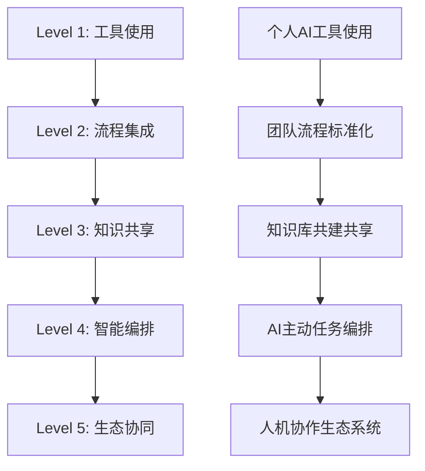

# 文档驱动AI开发(DDAD)：团队Vibe Coding协作革命

> AI时代下的团队协作开发实践指南
> 
> "从代码补全到智能体(Agent)伙伴：DDAD引领的协作范式革命"

## 📚 完整目录导航

### 📖 主要章节

#### [第1章：AI协作开发概述](./chapter1/README.md)
- [AI编程工具演进历程](./chapter1/ai-evolution.md)
- [目标读者与适用场景](./chapter1/audience.md)
- [行业背景与发展趋势](./chapter1/background.md)
- [DDAD方法论简介](./chapter1/ddad.md)
- [技术发展趋势分析](./chapter1/trends.md)

#### [第2章：DDAD理论基础](./chapter2/README.md)
- [核心概念与定义](./chapter2/definition.md)
- [DDAD核心理念详解](./chapter2/ddad-core.md)
- [风险分级管理矩阵](./chapter2/risk-matrix.md)
- [团队效能评估模型](./chapter2/team-effectiveness.md)

#### [第3章：Claude Code工具准备与基础操作](./chapter3/README.md)

**🚀 快速入门与基础**
- [Claude Code快速入门指南](./chapter3/claude-code-quickstart.md)
- [常用工作流程详解](./chapter3/common-workflows.md)
- [核心技能与功能](./chapter3/skills-and-features.md)

**🤖 智能代理与子系统**
- [子代理系统应用](./chapter3/sub-agents.md)
- [SuperClaude设置指南](./chapter3/superclaude-setup.md)
- [SuperClaude模式详解](./chapter3/superclaude-modes.md)
- [CodeBuddy专注模式](./chapter3/codebuddy-focus.md)

**🔌 集成与扩展**
- [MCP协议集成应用](./chapter3/mcp-integration.md)
- [插件系统详解](./chapter3/plugins-system.md)
- [插件市场指南](./chapter3/plugin-marketplace.md)
- [插件开发参考](./chapter3/plugins-reference.md)
- [GitHub Actions集成](./chapter3/github-actions.md)
- [GitLab CI/CD集成](./chapter3/gitlab-cicd.md)

**⚡ 高级功能与工具**
- [钩子系统指南](./chapter3/hooks-guide.md)
- [检查点功能应用](./chapter3/checkpointing.md)
- [输出样式定制](./chapter3/output-styles.md)
- [斜杠命令参考](./chapter3/slash-commands.md)
- [CLI命令参考](./chapter3/cli-reference.md)

**📚 文档与协作**
- [文档驱动开发流程](./chapter3/doc-driven-flow.md)
- [文档系统设计](./chapter3/doc-system.md)
- [团队协作机制设计](./chapter3/collaboration.md)
- [上下文控制策略](./chapter3/context-control.md)

**🛠️ 工具对比与选择**
- [现代AI工具指南](./chapter3/modern-ai-tools-guide.md)
- [AI工具对比分析](./chapter3/tools-comparison.md)

#### [第4章：多智能体协作模式](./chapter4/README.md)
- [文档标准化规范](./chapter4/doc-standards.md)
- [心理安全环境建设](./chapter4/psychological-safety.md)
- [需求分析方法论](./chapter4/requirement-analysis.md)

#### [第5章：实战案例 - 智能客服系统开发](./chapter5/README.md)
- [完整案例实施指南](./chapter5/case-study-implementation.md)

#### [第6章：最佳实践与未来展望](./chapter6/README.md)
- [最佳实践总结](./chapter6/best-practices-summary.md)
- [传统章节内容](./chapter6/chapter8.md)
- [项目实施指南](./chapter6/chapter9.md)
- [交付与部署](./chapter6/chapter10.md)
- [项目实施详细流程](./chapter6/chapter9/)
  - [CI/CD流程设计](./chapter6/chapter9/cicd.md)
  - [文档实践指南](./chapter6/chapter9/doc-practice.md)
- [交付部署详细指南](./chapter6/chapter10/)
  - [项目交付流程](./chapter6/chapter10/delivery.md)
  - [代码重构策略](./chapter6/chapter10/refactoring.md)
  - [逆向文档生成](./chapter6/chapter10/reverse-doc.md)
  - [系统切换方案](./chapter6/chapter10/switch-over.md)

#### [第7章：工具模板与资源库](./chapter7/README.md)
- [评估工具集合](./chapter7/assessment-tools.md)
- [Claude Markdown模板](./chapter7/claude-md-templates.md)
- [命令参考手册](./chapter7/command-reference.md)
- [常用命令集合](./chapter7/commands.md)
- [文档模板库](./chapter7/doc-templates.md)
- [结语与展望](./chapter7/epilogue.md)
- [现代化环境配置](./chapter7/modern-setup.md)
- [工作模式说明](./chapter7/modes.md)
- [模块开发模板](./chapter7/module-template.md)
- [提示词收集库](./chapter7/prompt-collection.md)
- [AI提示词模板库](./chapter7/prompt-templates.md)
- [参考资料汇总](./chapter7/references.md)
- [综合资源库](./chapter7/resource-library.md)
- [SuperClaude快速参考](./chapter7/superclaude-quickref.md)
- [术语指南](./chapter7/terminology-guide.md)
- [工具模板集合](./chapter7/tool-templates.md)
- [工具模板库](./chapter7/tools-templates.md)
- [使用指南](./chapter7/使用指南.md)

### 🛠️ 实践模板

#### [工具模板库](./chapter7/tool-templates.md)
完整的项目模板、配置文件和脚本集合

#### [AI提示词模板](./chapter7/prompt-templates.md)
涵盖开发全流程的AI提示词库

#### [资源库](./chapter7/resource-library.md)
学习资源、工具推荐和社区资源汇总

### 🧭 快速导航

📋 **[完整导航索引](./NAVIGATION.md)** - 按学习路径、主题、角色快速查找内容

---

## 🎯 核心理念：从规范驱动(Spec-Driven)到文档驱动(DDAD)

**规范驱动开发（Spec-Driven Development）** 是业界领先的开发思想，强调在编码前编写详尽、清晰、可执行的规范（Spec）。这一理念在AI时代演化为我们的核心方法论：**DDAD（Document-Driven AI Development，文档驱动AI开发）**。

### 什么是DDAD？

DDAD继承并扩展了规范驱动思想，专为AI协作时代设计。它解决了这个时代最关键的问题：

> **当AI成为开发团队的一员时，我们如何确保它能准确理解人类意图并高效协作？**

### DDAD的三大核心原则

#### 1️⃣ 规范即接口 (Spec as Interface)：人机协作的协议
```markdown
🔑 规范（Spec）是AI的执行指令，而非可有可无的文档
🔑 结构化的规范成为人类与AI之间精确的"协作契约"
🔑 所有项目需求和约束都被翻译成AI可理解的语言
```

#### 2️⃣ 知识即代码：可执行的团队记忆
```markdown
🔑 架构决策、编码规范、业务规则全部文档化
🔑 AI通过文档获得完整的\"项目记忆\"
🔑 新团队成员（包括AI）零成本融入
```

#### 3️⃣ 协作即编排：人机混合的工作流
```markdown
🔑 人类负责创意、决策、架构设计
🔑 AI负责实现、优化、重复性工作
🔑 文档确保两者无缝协作
```

### DDAD vs 传统开发：范式革命

| 传统开发 | DDAD开发 |
|----------|----------|
| 文档事后补充 | 文档事前驱动 |
| 人与人沟通 | 人-AI-人协作 |
| 代码为核心 | 文档+代码双核心 |
| 个人英雄主义 | 团队协作增强 |

## 🚀 实践框架：构建人机协作的团队文化

### Vibe Coding：由规范驱动的高效协作 (Spec-Driven Vibe Coding)

我们采纳并扩展了 **“规范驱动下的Vibe Coding” (Spec-Driven Vibe Coding)** 理念。它并非凭感觉随意编码，而是指在DDAD坚实的规范文档基础上，达成的一种 **高信任度、高流畅度的人机协作状态**。

当一份清晰、无歧义的规范（Spec）成为团队共识后，开发的重点从“如何实现”转向“为何创造”。这种状态旨在达成以下目标：

- **心理安全 (Psychological Safety)**：当文档成为清晰的协作协议后，团队成员（包括AI）能够放心地进行实验和创新，因为“对错”有据可依，失败的尝试会成为完善文档的宝贵数据，而非个人责备的来源。
- **快速工程 (Rapid Engineering)**：AI的引入将开发周期从数周缩短至数天甚至数小时。瓶颈不再是编码，而是 **决策速度**。Vibe Coding代表了在这种高速迭代中，团队凭借深度的客户共情和DDAD提供的结构化知识，快速做出高质量产品决策的能力。
- **人机协同 (Human-AI Symbiosis)**：建立一种“AI是同事，而非工具”的文化。人类专注于创造性、战略决策和复杂问题定义，而AI则作为可靠的伙伴，负责执行、测试和优化。

### 五级协作成熟度模型



| 级别 | 特征 | 关键指标 | DDAD应用 |
|------|------|----------|----------|
| **L1 工具使用** | 个人AI工具尝试 | 工具使用率>50% | 基础文档模板 |
| **L2 流程集成** | 团队流程标准化 | 流程覆盖率>70% | 标准化工作流 |
| **L3 知识共享** | 知识库共建共享 | 知识复用率>60% | 结构化知识库 |
| **L4 智能编排** | AI主动任务编排 | 自动化率>40% | AI驱动开发 |
| **L5 生态协同** | 人机协作生态 | 协作效率提升3x | 全面DDAD实施 |

## 📋 DDAD实施指南：从零到一的实践路径

### 第一步：建立DDAD基础设施

#### 1. 文档体系架构
```
docs/
├── 01-specs/           # 技术规范文档
│   ├── architecture.md  # 系统架构规范
│   ├── coding-std.md    # 编码规范
│   └── api-design.md    # API设计规范
├── 02-rules/           # 业务规则文档
│   ├── business.md      # 业务规则
│   ├── validation.md    # 验证规则
│   └── workflow.md      # 工作流程
├── 03-guides/          # 操作指南
│   ├── ai-prompts.md    # AI提示模板
│   ├── review-guide.md  # 代码审查指南
│   └── troubleshooting.md # 问题排查
└── 04-knowledge/       # 知识库
    ├── decisions.md     # 架构决策记录
    ├── faq.md          # 常见问题
    └── lessons.md       # 经验教训
```

#### 2. AI协作工作流模板（Spec示例）
```markdown
# 任务：用户认证模块重构

## AI执行规范 (Spec)
### 技术约束
- 框架：Spring Boot 3.x + Spring Security
- 认证：JWT Token + Refresh Token
- 存储：Redis Session存储
- 密码：BCrypt加密

### 业务规则
- 用户名：3-20位，字母数字下划线
- 密码：8-20位，必须包含大小写+数字
- 邮箱：需要验证格式，注册后24h有效
- 登录失败：连续5次失败锁定30分钟

### 质量标准
- 响应时间：<200ms
- 测试覆盖率：>90%
- 安全等级：OWASP Top 10防护
- 错误处理：统一异常返回格式

### 历史上下文
- 2024-03-15：从Session改为JWT架构
- 2024-05-20：添加Redis缓存层
- 2024-08-10：集成Spring Security 6.x
```

### 第二步：团队Vibe Coding文化建设

#### 心理安全建设框架
```markdown
## 团队Vibe Coding公约

### 🤝 协作原则
1. **AI是同事，不是工具**：尊重AI的\"劳动成果\"
2. **人类负责决策**：关键决策始终由人类做出
3. **错误是学习机会**：AI的错误帮助团队完善文档
4. **持续反馈循环**：每次协作都改进文档质量

### 🎯 角色分工
- **架构师**：定义系统边界和关键决策
- **资深开发者**：制定规范、审查AI产出
- **初级开发者**：学习规范、协助文档完善
- **AI助手**：执行编码、测试、重构任务

### 📊 成功指标
- 文档更新频率：每周>5次
- AI代码采纳率：>80%
- 团队满意度：>4.5/5
- 交付效率提升：>30%
```

### 第三步：风险分级管理

#### AI参与风险评估矩阵

| 任务类型 | 风险等级 | AI参与策略 | 人类审查要求 |
|----------|----------|------------|--------------|
| **内部工具开发** | 🟢 低风险 | 全权委托 | 基础审查 |
| **CRUD接口** | 🟡 中低风险 | 规范约束 | 逻辑审查 |
| **核心业务逻辑** | 🟠 中高风险 | 逐步确认 | 详细审查 |
| **支付/安全模块** | 🔴 高风险 | 禁止参与 | 人工开发 |

#### 实施检查清单
- [ ] 建立任务风险分级标准
- [ ] 制定AI参与边界政策
- [ ] 设置自动化质量门禁
- [ ] 建立人工审查工作流

## 📚 学习路径：掌握DDAD与Vibe Coding

### 新手入门路径（2周速成）

#### Week 1: 基础认知
- **Day 1-2**: 理解DDAD核心理念
- **Day 3-4**: 熟悉文档模板和结构
- **Day 5-7**: 完成第一个AI协作任务

#### Week 2: 实践提升
- **Day 8-10**: 建立团队文档体系
- **Day 11-12**: 设计协作工作流
- **Day 13-14**: 评估和优化

### 进阶专家路径（1个月精通）

#### Phase 1: 深度理解（Week 1-2）
- 掌握高级文档结构设计
- 学习复杂业务规则文档化
- 实践跨团队协作模式

#### Phase 2: 系统实施（Week 3-4）
- 建立完整的知识库体系
- 设计AI协作质量评估体系
- 优化团队Vibe Coding文化

### 持续学习资源

#### 必读章节
- [第1章: AI协作开发概述](chapter1/README.md)
- [第2章: DDAD理论基础](chapter2/README.md)
- [第3章: Team Vibe Coding方法论](chapter3/README.md)
- [第4章: 多智能体协作模式](chapter4/README.md)
- [第5章: 实战案例 - 智能客服系统开发](chapter5/README.md)
- [第6章: 最佳实践与未来展望](chapter6/README.md)
- [第7章: 工具模板与资源库](chapter7/README.md)

#### 实践模板
- [工具模板库](chapter7/tool-templates.md)
- [AI提示词模板](chapter7/prompt-templates.md)
- [资源库](chapter7/resource-library.md)

## 🎯 适用读者画像

### 👨‍💻 技术领导者
**核心需求**：建立AI时代的团队协作标准
**学习重点**：DDAD方法论、团队文化建设、风险管理

### 👥 开发团队成员  
**核心需求**：提升个人AI协作效率
**学习重点**：文档编写技巧、AI提示工程、质量控制

### 📊 项目管理角色
**核心需求**：管理AI增强的项目交付
**学习重点**：任务分解、进度跟踪、质量评估

### 🏢 企业决策层
**核心需求**：制定AI协作战略
**学习重点**：ROI评估、风险管控、人才培养

## 🌟 立即开始：您的DDAD之旅

### 快速启动检查清单
- [ ] 安装必要的AI编程工具
- [ ] 克隆本书示例项目
- [ ] 完成第一个DDAD文档
- [ ] 运行第一次AI协作任务

### 学习建议
1. **循序渐进**：从低风险任务开始，逐步扩大AI参与范围
2. **持续迭代**：根据实践经验不断完善文档体系
3. **团队协作**：与团队成员共同建立最佳实践
4. **记录分享**：将经验转化为团队知识库

---

## 🙏 思想来源

本书提出的DDAD方法论深受业界关于 **规范驱动开发 (Spec-Driven Development)** 前沿思想的启发。我们整合并扩展了这些理念，使其适应AI时代的团队协作模式。

特别感谢以下资源提供的灵感：
- [mosofsky/spec-then-code](https://github.com/mosofsky/spec-then-code)
- [Spec-Driven Vibe Coding by Vivek Haldar](https://vivekhaldar.com/articles/spec-driven-vibe-coding/)
- [Spec-Coding 规范编码](https://mcpmarket.com/zh/server/spec-coding)

DDAD正是在这些思想的基础上，针对人机协作的特殊挑战所做的进一步探索和实践。

## 📖 阅读指南

### 推荐学习路径
1. **理论基础** → [第1章: AI协作开发概述](chapter1/README.md)
2. **方法掌握** → [第2章: DDAD核心原理](chapter2/README.md)  
3. **实践技能** → [第3章: Team Vibe Coding方法论](chapter3/README.md)
4. **协作模式** → [第4章: 多智能体协作模式](chapter4/README.md)
5. **案例深化** → [第5章: 实战案例 - 智能客服系统开发](chapter5/README.md)
6. **最佳实践** → [第6章: 最佳实践与未来展望](chapter6/README.md)
7. **工具资源** → [第7章: 工具模板与资源库](chapter7/README.md)

### 快速导航
- 🚀 [立即开始实践](chapter3/README.md)
- 📋 [工具模板库](chapter7/tool-templates.md)
- 🤝 [团队协作指南](chapter3/README.md)
- ⚖️ [风险管理手册](chapter2/README.md)

## 🚀 在线阅读与部署

### 📖 在线阅读
本书已部署到GitHub Pages，可直接在线阅读：
**https://imleoo.github.io/claude-code-in-teams/**

### 🔧 本地开发
```bash
# 克隆项目
git clone https://github.com/imleoo/claude-code-in-teams.git
cd claude-code-in-teams

# 安装依赖
npm install

# 本地开发
npm run dev

# 构建生产版本
npm run build
```

### 🌐 自动部署
项目已配置GitHub Actions，实现**自动部署**：
- ✅ 推送代码到 `main` 分支自动触发部署
- ✅ 构建静态HTML并发布到GitHub Pages
- ✅ 无需手动操作，完全自动化

### 📁 项目结构
```
claude-code-in-teams/
├── .github/workflows/     # GitHub Actions配置
├── .vitepress/           # VitePress配置
├── chapter1/             # 第1章: AI协作开发概述
├── chapter2/             # 第2章: DDAD理论基础
├── chapter3/             # 第3章: Team Vibe Coding方法论
├── chapter4/             # 第4章: 多智能体协作模式
├── chapter5/             # 第5章: 实战案例 - 智能客服系统开发
├── chapter6/             # 第6章: 最佳实践与未来展望
├── chapter7/             # 第7章: 工具模板与资源库
├── hero-image.svg        # 封面图
└── index.md             # 首页
```

---

**🔄 持续更新承诺**
本书将跟随AI技术发展持续更新，确保内容始终反映最新的DDAD最佳实践。

欢迎加入我们的DDAD实践者社区，共同探索AI协作的无限可能。

> *"在AI时代，最优秀的产品不是由人或AI单独创造的，而是由两者协作完成的。"*
> 
> *"当开发从数周缩短到一天，瓶颈就从写代码转移到决策本身。DDAD正是为加速高质量决策而设计的工程框架。"*
> 
> *—— DDAD方法论宣言*