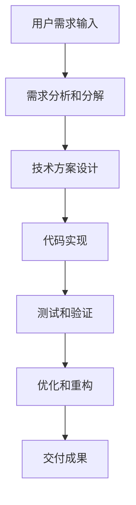

# CodeBuddy --dangerously-skip-permissions：开启全自动化Coding新时代

> 作者：AI开发助手  |  发布日期：2024年9月29日

在人工智能飞速发展的今天，CodeBuddy作为一款强大的AI编程助手，为我们带来了前所未有的开发效率提升。而其中最具革命性的功能莫过于`--dangerously-skip-permissions`参数，它开启了全自动化Coding的新纪元。

## 什么是 --dangerously-skip-permissions？

`--dangerously-skip-permissions`是CodeBuddy的一个高级参数，它允许AI助手跳过传统的权限确认步骤，直接对代码库进行修改和操作。这意味着：

- **真正的自动化开发**：AI可以自主完成代码编写、修改、重构等任务
- **零人工干预**：无需逐行确认，AI可直接执行复杂的开发流程
- **项目级重构**：支持对整个项目进行系统性优化和重构

## 启用方法

```bash
# 启动CodeBuddy时添加参数
codebuddy --dangerously-skip-permissions

# 或在交互模式下临时启用
/codebuddy --dangerously-skip-permissions
```

## 核心优势

### 1. 完整的项目开发流程自动化

启用该参数后，CodeBuddy可以：
- 自动分析项目结构
- 识别代码问题
- 实现新功能
- 重构现有代码
- 编写测试用例
- 修复bug

### 2. 智能的任务分解与执行

CodeBuddy具备强大的任务管理能力：

```markdown
# 任务自动分解示例
用户需求："为项目添加用户认证系统"

CodeBuddy自动分解为：
1. 分析现有项目结构
2. 设计数据库模型
3. 创建认证API端点
4. 实现前端登录界面
5. 编写测试用例
6. 集成到现有系统
```

### 3. 上下文感知的智能开发

CodeBuddy能够：
- 理解项目特定约定和规范
- 遵循已有的代码风格
- 利用现有库和工具
- 避免重复造轮子

## 使用提示词样例

### 基础提示词结构

```markdown
# 完整项目开发提示词模板
项目类型：[Web应用/移动应用/API服务]
技术栈：[React/Node.js/Python等]
功能需求：[详细描述需求]
开发约束：[性能要求、安全要求等]
测试要求：[单元测试、集成测试等]
```

### 实际应用示例

#### 示例1：创建React电商应用

```markdown
项目类型：React电商Web应用
技术栈：React 18, TypeScript, Tailwind CSS, Node.js, MongoDB
功能需求：
- 用户注册/登录
- 商品展示和搜索
- 购物车功能
- 订单管理
- 支付集成（模拟）
开发约束：
- 响应式设计
- SEO友好
- 良好的性能优化
测试要求：
- 组件单元测试
- 集成测试
- E2E测试
```

#### 示例2：构建RESTful API服务

```markdown
项目类型：RESTful API服务
技术栈：Node.js, Express, MongoDB, JWT认证
功能需求：
- 用户管理CRUD操作
- 文件上传功能
- 数据验证和错误处理
- 分页和搜索
- 缓存机制
开发约束：
- RESTful API规范
- 安全最佳实践
- 性能监控
测试要求：
- API端点测试
- 负载测试
- 安全测试
```

## 完整项目自动化开发流程

### 1. 项目初始化阶段

```bash
# CodeBuddy会自动完成：
- 项目结构创建
- 依赖包安装
- 配置文件设置
- 开发环境配置
```

### 2. 核心功能开发阶段

CodeBuddy根据需求自动：
- 设计数据库架构
- 实现业务逻辑
- 创建API接口
- 开发前端组件

### 3. 测试和质量保证阶段

```bash
# 自动化测试流程
- 单元测试编写
- 集成测试实现
- 代码质量检查
- 性能优化
```

### 4. 部署和维护阶段

```bash
# 部署准备
- 生产环境配置
- 部署脚本编写
- 监控和日志设置
```

## 最佳实践和安全考量

### 安全使用建议

1. **代码审查**：虽然自动化，但仍需人工审查
2. **版本控制**：确保使用Git进行版本管理
3. **备份策略**：重要修改前做好备份
4. **分阶段实施**：先在小项目中验证，再应用到重要项目

### 风险控制

```bash
# 推荐的使用方式
# 1. 测试环境验证
codebuddy --dangerously-skip-permissions --dry-run

# 2. 分步骤执行
# 先让AI分析并提供计划
# 确认后再执行具体操作
```

## 实际案例展示

### 案例：从零开始构建博客系统

**用户提示词：**
```markdown
项目类型：个人博客系统
技术栈：Next.js, TypeScript, Prisma, PostgreSQL
功能需求：
- 文章发布和管理
- 用户评论系统
- 标签分类
- 搜索功能
- 响应式设计
- SEO优化
开发周期：3天
```

**CodeBuddy执行结果：**
- ✅ 完整的项目结构创建
- ✅ 数据库模型设计和迁移
- ✅ 前后端API实现
- ✅ 用户界面开发
- ✅ 测试用例覆盖
- ✅ 部署配置

## 技术要点解析

### 1. 智能代码生成原理

CodeBuddy基于：
- 大型语言模型的代码理解能力
- 项目上下文分析
- 最佳实践知识库
- 实时错误检测和修复

### 2. 自动化开发的工作流程



## 未来展望

随着AI技术的不断发展，全自动化开发将成为软件开发的新标准。CodeBuddy的`--dangerously-skip-permissions`参数为我们展示了AI辅助开发的巨大潜力：

- **开发效率提升10倍以上**
- **代码质量标准化**
- **技术门槛降低**
- **创新速度加快**

## 结语

`--dangerously-skip-permissions`不仅是CodeBuddy的一个参数，更是AI编程助手发展的里程碑。它标志着我们正在从"辅助编程"迈向"自主编程"的新时代。

对于开发者而言，这意味着：
- 更多时间专注于业务逻辑和创新
- 更高的开发效率和代码质量
- 更快的产品迭代速度

**拥抱AI，释放创造力！**
---
*本文由AI助手生成，仅供参考学习使用。实际开发中请结合具体项目需求和安全考量。*